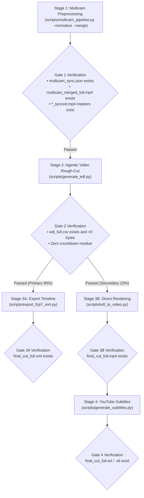

# Multi-Camera AI Preprocessing & Video Editing Workflow (Zero-Split Agentic Architecture)

This runbook defines the exact execution sequence, stage gates, CLI commands, and verification criteria for processing multi-camera video footage in Antigravity.

Powered by **Gemini 3.7 Flash Agentic Video Understanding**, footage of any length (>1 hour) is processed end-to-end as a unified full-length timeline without requiring chapter segmentation (Zero-Split Pipeline), eliminating boundary speech bisection and slashing token consumption by 99.7%.

---

## 🚦 4-Stage Gated Workflow Architecture



---

## 📋 Stage-by-Stage Execution Runbook

### Stage 1: Physical Preprocessing (Sync, Normalization, Master Export, Grid Merge)
- **Goal**: Global MFCC acoustic time alignment with subframe refinement (<0.125ms), BBC standard confidence evaluation, EBU R128 (-14 LUFS) broadcast two-pass linear audio normalization (`linear=true`), full-length frame-accurate synchronized camera masters export (`CAM*_synced.mp4`, hardware re-encoded by default; `--stream-copy` available), and compact multi-in-one grid composition (`multicam_merged_full.mp4`, max $\le 1920 \times 1080$, min $\ge 640 \times 480$/CAM).
- **Execution Command (Standard Zero-Split Flow)**:
  ```bash
  python3 scripts/multicam_pipeline.py \
    --ref <CAM1.mp4> --targets <CAM2.mp4...> \
    --normalize --merge -o <OUTPUT_DIR>
  ```
- **Exit Gate 1 Verification**:
  - [x] `<OUTPUT_DIR>/multicam_sync.json` exists with valid offset data.
  - [x] `<OUTPUT_DIR>/<CAM>_synced.mp4` full-length synchronized masters exist for all cameras.
  - [x] `<OUTPUT_DIR>/multicam_merged_full.mp4` (or `multicam_merged_synced.mp4`) grid video exists.
  - 🚨 *Do NOT proceed to Stage 2 until all Gate 1 criteria pass.*

---

### Stage 2: Gemini AI Multimodal Rough-Cut (Agentic Video EDL Generation)
- **Goal**: Gemini 3.7 Flash Agentic Video Understanding (`processing="agentic"`) dynamically inspects the full-length grid video using `assets/edl_interview_template.md` prompt rules. Eliminates pre/post-roll waste with Zero-Tolerance countdown purging & `[Start, Start+2.0s]` self-verification.
- **Backend Architecture**:
  - **Primary**: Google Cloud Vertex AI (ADC + GCS hash-cached upload). Configure `GOOGLE_CLOUD_PROJECT` and `GCS_BUCKET` in `.env` (or pass `--project` / `--gcs-bucket`).
  - **Secondary / Backup**: Google AI Studio via `--backend studio` or automatic failover via `--fallback-studio` (`GEMINI_API_KEY`).
- **Execution Command**:
  ```bash
  # Primary (Google Cloud Vertex AI with ADC + GCS Caching, Default):
  python3 scripts/generate_edl.py -v <OUTPUT_DIR>/multicam_merged_full.mp4

  # With Automatic Fallback to Google AI Studio if GCP credentials/bucket encounter errors:
  python3 scripts/generate_edl.py -v <OUTPUT_DIR>/multicam_merged_full.mp4 --fallback-studio

  # Direct Google AI Studio Execution:
  python3 scripts/generate_edl.py -v <OUTPUT_DIR>/multicam_merged_full.mp4 --backend studio
  ```
- **Exit Gate 2 Verification**:
  - [x] `<OUTPUT_DIR>/edl_full.csv` (or `edl.csv`) exists and size $> 0\text{ bytes}$ with valid timecodes and camera angles.
  - [x] `<OUTPUT_DIR>/edl_full_report.md` exists with cutting rationale and performance metrics.
  - 🚨 *Do NOT proceed to Stage 3 until all Gate 2 criteria pass.*

---

### Stage 3A: Export NLE Timeline (⭐ Primary Path / 90% Use Case)
- **Goal**: Convert full-length EDL CSV and synchronized camera masters into standard Final Cut Pro 7 XML (`xmeml version 4`) with color decision markers.
- **Execution Command**:
  ```bash
  python3 scripts/export_fcp7_xml.py -d <OUTPUT_DIR> -o <OUTPUT_DIR>/final_cut_full.xml
  ```
- **Exit Gate 3A Verification**:
  - [x] `<OUTPUT_DIR>/final_cut_full.xml` exists.
- **NLE Import Instructions for User**:
  1. Open DaVinci Resolve (or Premiere Pro / Final Cut Pro) and create a project.
  2. Drag all synchronized camera masters (`CAM1_synced.mp4`, `CAM2_synced.mp4`...) into the **Media Pool**.
  3. Go to **File -> Import -> Timeline...**, and select `final_cut_full.xml`.
  4. All cut points, audio tracks, and color decision markers will load instantly!

---

### Stage 3B: Direct Video Rendering (🎬 Secondary Fast Preview Path / 10% Use Case)
- **Goal**: Hardware-accelerated clip rendering directly from synchronized camera masters into full-length `final_cut_full.mp4` in a single pass.
- **Execution Command**:
  ```bash
  python3 scripts/edl_to_video.py --edl <OUTPUT_DIR>/edl_full.csv --media-dir <OUTPUT_DIR> -o <OUTPUT_DIR>/final_cut_full.mp4
  ```
- **Exit Gate 3B Verification**:
  - [x] `<OUTPUT_DIR>/final_cut_full.mp4` exists with duration $> 0$.

---

### Stage 4: YouTube Subtitles Generation (📝 On-Demand / Subtitle Requests)
- **Goal**: Three-Stage Golden Pipeline: Gemini 1M Context Global Audio Glossary Extraction + Local Whisper Zero-Drift Physical Timestamps + Multimodal Audio-Text Precision Proofreading.
- **Backend Architecture**:
  - **Primary**: Google Cloud Vertex AI (ADC + inline chunk audio / GCS for audio >20MB).
  - **Secondary / Backup**: Google AI Studio via `--backend studio` or `--fallback-studio` (`GEMINI_API_KEY`).
- **Execution Command**:
  ```bash
  # Standard Execution (Google Cloud Vertex AI with ADC):
  python3 scripts/generate_subtitles.py -i <OUTPUT_DIR>/final_cut_full.mp4

  # With Automatic Fallback to Google AI Studio if GCP credentials encounter errors:
  python3 scripts/generate_subtitles.py -i <OUTPUT_DIR>/final_cut_full.mp4 --fallback-studio

  # Direct Google AI Studio Execution:
  python3 scripts/generate_subtitles.py -i <OUTPUT_DIR>/final_cut_full.mp4 --backend studio

  # If user provided interview outline / guest notes (Optional Outline Injection):
  python3 scripts/generate_subtitles.py -i <OUTPUT_DIR>/final_cut_full.mp4 --outline "<OUTLINE_TEXT_OR_FILE>"

  # If user provided full recording script / manuscript (Ground Truth Manuscript Anchor):
  python3 scripts/generate_subtitles.py -i <OUTPUT_DIR>/final_cut_full.mp4 --script "<SCRIPT_TEXT_OR_FILE>"
  ```
- **Exit Gate 4 Verification**:
  - [x] `<OUTPUT_DIR>/final_cut_full.srt` and `<OUTPUT_DIR>/final_cut_full.vtt` exist and contain millisecond-accurate corrected subtitles.
  - [x] `<OUTPUT_DIR>/final_cut_full_glossary.md` exists with global terminology rules.
  - [x] `<OUTPUT_DIR>/final_cut_full_subtitle_report.md` exists with Netflix/YouTube pacing audit and actionable review list.
