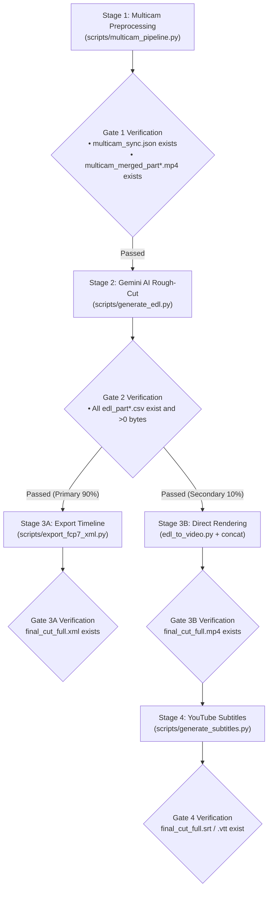

# Multi-Camera AI Preprocessing & Video Editing Workflow

This runbook defines the exact execution sequence, stage gates, CLI commands, and verification criteria for processing multi-camera video footage in Antigravity.

---

## 🚦 4-Stage Gated Workflow Architecture



---

## 📋 Stage-by-Stage Execution Runbook

### Stage 1: Physical Preprocessing (Sync, Normalization, Split, Grid)
- **Goal**: Global 8kHz FFT time alignment, EBU R128 (-14 LUFS) audio normalization, 30-40 min natural pause chapter segmentation, full-length synced camera masters export, and compact multi-in-one grid composition (max <= 1920x1080).
- **Execution Command**:
  ```bash
  python3 scripts/multicam_pipeline.py \
    --ref <CAM1.mp4> --targets <CAM2.mp4...> \
    --auto-split --split-min-dur 30 --split-max-dur 40 \
    --normalize --merge -o <OUTPUT_DIR>
  ```
  *(Note: If the user prompt explicitly specifies a different chapter duration, e.g. around 10 or 15 mins, dynamically adapt `--split-min-dur` and `--split-max-dur` accordingly without modifying the workflow file).*
- **Exit Gate 1 Verification**:
  - [x] `<OUTPUT_DIR>/multicam_sync.json` exists with valid offset data.
  - [x] `<OUTPUT_DIR>/<CAM>_synced.mp4` full-length synchronized masters exist.
  - [x] At least one `<OUTPUT_DIR>/multicam_merged_part*.mp4` grid video exists.
  - 🚨 *Do NOT proceed to Stage 2 until all Gate 1 criteria pass.*

---

### Stage 2: Gemini AI Multimodal Rough-Cut (EDL Generation)
- **Goal**: Gemini 3.7 Flash 1M Context multimodal video inspection using `assets/edl_interview_template.md` prompt rules. Eliminates pre/post-roll waste and generates speech-driven and reaction cut decisions.
- **Execution Command** (run for **EVERY** part produced in Stage 1):
  ```bash
  python3 scripts/generate_edl.py -v <OUTPUT_DIR>/multicam_merged_part1.mp4
  python3 scripts/generate_edl.py -v <OUTPUT_DIR>/multicam_merged_part2.mp4  # If Part 2 exists
  ```
- **Exit Gate 2 Verification**:
  - [x] All corresponding `<OUTPUT_DIR>/edl_part*.csv` files exist.
  - [x] Every CSV file size $> 0\text{ bytes}$ with valid timecodes and camera angles.
  - 🚨 *Do NOT proceed to Stage 3 until all Gate 2 criteria pass.*

---

### Stage 3A: Export NLE Timeline (⭐ Primary Path / 90% Use Case)
- **Goal**: Multi-part timestamp accumulation, continuous master audio track, and color marker injection into standard FCP7 XML (`xmeml version 4`).
- **Execution Command**:
  ```bash
  python3 scripts/export_fcp7_xml.py -d <OUTPUT_DIR> -o <OUTPUT_DIR>/final_cut_full.xml
  ```
- **Exit Gate 3A Verification**:
  - [x] `<OUTPUT_DIR>/final_cut_full.xml` exists.
- **NLE Import Instructions for User**:
  1. Open DaVinci Resolve (or Premiere Pro / Final Cut Pro) and create a project.
  2. Drag all synchronized camera masters (`CAM1_synced.mp4`, `CAM2_synced.mp4`...) into the **Media Pool**.
  3. Go to **File -> Import -> Timeline...**, and select `final_cut_full.xml`.
  4. All cut points, audio tracks, and color decision markers will load instantly!

---

### Stage 3B: Direct Video Rendering (🎬 Secondary Fast Preview Path / 10% Use Case)
- **Goal**: Hardware-accelerated clip rendering and lossless concat into full-length `final_cut_full.mp4`.
- **Execution Command**:
  ```bash
  python3 scripts/edl_to_video.py --edl <OUTPUT_DIR>/edl_part1.csv
  python3 scripts/edl_to_video.py --edl <OUTPUT_DIR>/edl_part2.csv  # If Part 2 exists
  python3 scripts/concat_videos.py -d <OUTPUT_DIR> -o <OUTPUT_DIR>/final_cut_full.mp4
  ```
- **Exit Gate 3B Verification**:
  - [x] `<OUTPUT_DIR>/final_cut_full.mp4` exists with duration $> 0$.

---

### Stage 4: YouTube Subtitles Generation (📝 On-Demand / Subtitle Requests)
- **Goal**: Three-Stage Golden Pipeline: Gemini 1M Context Global Audio Glossary Extraction + Local Whisper Zero-Drift Physical Timestamps + Multimodal Audio-Text Precision Proofreading.
- **Execution Command**:
  ```bash
  # Standard Execution (Auto-extracts glossary from full episode audio):
  python3 scripts/generate_subtitles.py -i <OUTPUT_DIR>/final_cut_full.mp4

  # If user provided interview outline / guest notes (Optional Outline Injection):
  python3 scripts/generate_subtitles.py -i <OUTPUT_DIR>/final_cut_full.mp4 --outline "<OUTLINE_TEXT_OR_FILE>"

  # If user provided full recording script / manuscript (Ground Truth Manuscript Anchor):
  python3 scripts/generate_subtitles.py -i <OUTPUT_DIR>/final_cut_full.mp4 --script "<SCRIPT_TEXT_OR_FILE>"
  ```
- **Exit Gate 4 Verification**:
  - [x] `<OUTPUT_DIR>/final_cut_full.srt` and `<OUTPUT_DIR>/final_cut_full.vtt` exist and contain millisecond-accurate corrected subtitles.
  - [x] `<OUTPUT_DIR>/final_cut_full_glossary.md` exists with global terminology rules.
  - [x] `<OUTPUT_DIR>/final_cut_full_subtitle_report.md` exists with Netflix/YouTube pacing audit and actionable review list.
