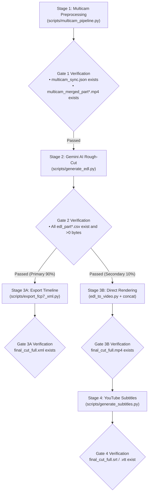

# Multi-Camera Video Editing & Production Workflow

Follow this step-by-step workflow when processing multi-camera projects:

## 🚦 Workflow Stage Gates



## Step 1: Multi-Camera Preprocessing
- **Command**:
  ```bash
  python3 scripts/multicam_pipeline.py \
    --ref <CAM1.mp4> --targets <CAM2.mp4...> \
    --auto-split --split-min-dur 30 --split-max-dur 40 \
    --normalize --merge -o <OUTPUT_DIR>
  ```
- **Exit Gate 1**: Verify `<OUTPUT_DIR>/multicam_sync.json` and `<OUTPUT_DIR>/multicam_merged_part*.mp4` exist.

## Step 2: Gemini AI Multimodal Rough-Cut
- **Command** (run for EVERY part produced in Step 1):
  ```bash
  python3 scripts/generate_edl.py -v <OUTPUT_DIR>/multicam_merged_part1.mp4
  python3 scripts/generate_edl.py -v <OUTPUT_DIR>/multicam_merged_part2.mp4  # If Part 2 exists
  ```
- **Exit Gate 2**: Verify all corresponding `<OUTPUT_DIR>/edl_part*.csv` exist and size > 0 bytes.

## Step 3A: NLE Timeline Export (Primary ⭐)
- **Command**:
  ```bash
  python3 scripts/export_fcp7_xml.py -d <OUTPUT_DIR> -o <OUTPUT_DIR>/final_cut_full.xml
  ```
- **Exit Gate 3A**: Verify `<OUTPUT_DIR>/final_cut_full.xml` exists. Provide DaVinci Resolve / Premiere Pro import guide.

## Step 3B: Direct Rendering (Secondary 🎬)
- **Command**:
  ```bash
  python3 scripts/edl_to_video.py --edl <OUTPUT_DIR>/edl_part1.csv
  python3 scripts/concat_videos.py -d <OUTPUT_DIR> -o <OUTPUT_DIR>/final_cut_full.mp4
  ```
- **Exit Gate 3B**: Verify `<OUTPUT_DIR>/final_cut_full.mp4` exists with duration > 0.

## Step 4: YouTube Subtitles (On-Demand 📝)
- **Command**:
  ```bash
  python3 scripts/generate_subtitles.py -i <OUTPUT_DIR>/final_cut_full.mp4
  ```
- **Exit Gate 4**: Verify `<OUTPUT_DIR>/final_cut_full.srt` and `.vtt` exist.
