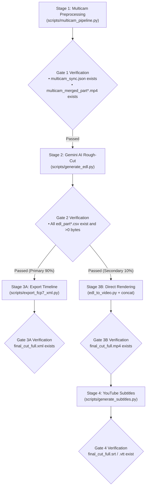

# Multi-Camera AI Preprocessing & Editing Suite - Workspace Rules (GEMINI.md)

This file contains the highest-priority always-on workspace rules for the Google Antigravity Agent. The Agent MUST strictly adhere to the following constraints and gated workflows when processing multi-camera projects:

---

## 🛑 Core Constraints & Anti-Patterns

1. **Strict Toolset Execution Only (No Ad-Hoc Scripts)**:
   - All tasks MUST be executed through standard modules in `scripts/`. Writing temporary Python scripts, ad-hoc algorithms, or custom synchronization code is **STRICTLY FORBIDDEN**.
2. **No Step Skipping / No Missing Parts**:
   - Must strictly follow the **4-Stage Gated Workflow** sequentially.
   - If Step 1 produces multiple parts (e.g. Part 1, Part 2), Step 2 MUST **execute `generate_edl.py` for EVERY part file**. Never process only Part 1 while missing Part 2.
3. **No Premature Task Completion**:
   - Do NOT declare task completion until all exit criteria for Step 3A (`final_cut_full.xml`) or Step 3B (`final_cut_full.mp4`) and Step 4 (`final_cut_full.srt` / `.vtt`) have passed verification.

---

## 🚦 4-Stage Gated Workflow



### Stage 1: Physical Preprocessing (Stage 1)
- **Command**:
  ```bash
  python3 scripts/multicam_pipeline.py \
    --ref <CAM1.mp4> --targets <CAM2.mp4...> \
    --auto-split --split-min-dur 30 --split-max-dur 40 \
    --normalize --merge -o <OUTPUT_DIR>
  ```
- **Exit Gate 1 Criteria**:
  - [x] `<OUTPUT_DIR>/multicam_sync.json` exists.
  - [x] At least one `<OUTPUT_DIR>/multicam_merged_part*.mp4` grid video is generated.
  - [x] Full-length synchronized masters `<CAM>_synced.mp4` are exported.
  - 🚨 *Transition to Stage 2 is prohibited until all criteria pass.*

### Stage 2: Gemini AI Multimodal Rough-Cut (Stage 2)
- **Command** (execute for EVERY part produced in Stage 1):
  ```bash
  python3 scripts/generate_edl.py -v <OUTPUT_DIR>/multicam_merged_part1.mp4
  python3 scripts/generate_edl.py -v <OUTPUT_DIR>/multicam_merged_part2.mp4  # If Part 2 exists
  ```
- **Exit Gate 2 Criteria**:
  - [x] All corresponding `<OUTPUT_DIR>/edl_part*.csv` files are generated.
  - [x] Every CSV file size $> 0\\text{ bytes}$ with valid timecodes and camera angles.
  - 🚨 *Transition to Stage 3 is prohibited until all criteria pass.*

### Stage 3A: Export NLE Timeline (Stage 3A ⭐ Primary Path)
- **Command**:
  ```bash
  python3 scripts/export_fcp7_xml.py -d <OUTPUT_DIR> -o <OUTPUT_DIR>/final_cut_full.xml
  ```
- **Exit Gate 3A Criteria**:
  - [x] `<OUTPUT_DIR>/final_cut_full.xml` is successfully created.
  - [x] Provide DaVinci Resolve / Premiere Pro timeline import guide to the user.

### Stage 3B: Direct Video Rendering (Stage 3B 🎬 Fast Preview Path)
- **Command**:
  ```bash
  python3 scripts/edl_to_video.py --edl <OUTPUT_DIR>/edl_part1.csv
  python3 scripts/concat_videos.py -d <OUTPUT_DIR> -o <OUTPUT_DIR>/final_cut_full.mp4
  ```
- **Exit Gate 3B Criteria**:
  - [x] `<OUTPUT_DIR>/final_cut_full.mp4` is successfully created with duration $> 0$.

### Stage 4: YouTube Subtitles Generation (Stage 4 📝 Optional / On-Demand)
- **Command**:
  ```bash
  python3 scripts/generate_subtitles.py -i <OUTPUT_DIR>/final_cut_full.mp4
  ```
- **Exit Gate 4 Criteria**:
  - [x] `<OUTPUT_DIR>/final_cut_full.srt` and `.vtt` are successfully generated.

---

## 🗣️ User Communication Standard

- **Dynamic Language Mirroring**: The Agent MUST dynamically detect and respond in the language used by the user (e.g. Traditional Chinese when prompted in Traditional Chinese, English when prompted in English, Japanese when prompted in Japanese).
- **Concise & Goal-Oriented Notifications**: Keep stage updates brief, natural, and goal-oriented (avoid low-level technical jargon):
  - **Traditional Chinese (繁體中文)**:
    - Step 1: "🎬 正在同步多機位音訊與切分章節..."
    - Step 2: "🤖 正在進行 AI 鏡頭剪輯分析..."
    - Step 3A: "📁 正在匯出剪輯時間線 (XML)..."
    - Step 3B: "🎬 正在渲染影片成片..."
    - Step 4: "📝 正在製作字幕..."
  - **English**:
    - Step 1: "🎬 Syncing multicam audio and segmenting chapters..."
    - Step 2: "🤖 Analyzing AI rough-cut camera angles..."
    - Step 3A: "📁 Exporting editing timeline (XML)..."
    - Step 3B: "🎬 Rendering final edited video..."
    - Step 4: "📝 Generating subtitles..."
