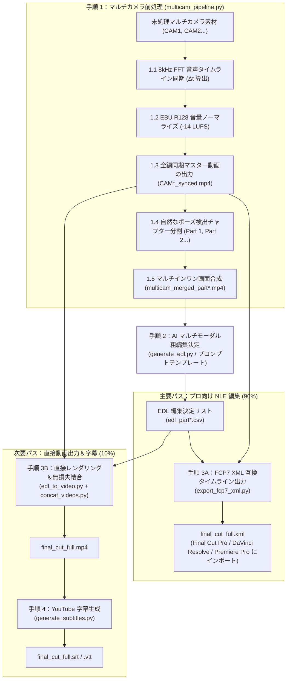

# マルチカメラ映像智慧処理＆AI編集スイート (Multicam Video Pipeline & AI Editing Suite)

[English (en)](README.md) | [繁體中文 (zh-TW)](README.zh-TW.md) | [简体中文 (zh-CN)](README.zh-CN.md) | [日本語 (ja)](README.ja.md) | [한국어 (ko)](README.ko.md)

---

> [!NOTE]
> **プラットフォーム対応と環境について**  
> - **検証環境**：本ツールキットは **Google Antigravity 2.0** および **Gemini 3.7 Flash (Thinking: Medium)** 環境で設計・実証テストされています。  
> - **クロスプラットフォーム対応**：**[Agent Plugins 1.0 仕様](https://agent-plugins.org/specification)** に準拠してパッケージ化されており、対応クライアント（**OpenAI Codex デスクトップ版**など）でも利用可能です。全プラットフォームでの検証は進行中であり、フィードバックを歓迎します。  
> - **コンテキストサイズと分割設定**：他のマルチモーダルモデルを使用する際は、**コンテキストウィンドウ（Context Window）サイズ**を確認し、Step 1 のチャプター分割パラメータ（`--split-min-dur` / `--split-max-dur`、デフォルト: 30〜40分）を適宜調整してください。

---

長文コンテキストマルチモーダルAIモデル（Gemini 3.7 Flash 1Mトークンコンテキスト）およびプロ向けNLE（DaVinci Resolve、Adobe Premiere Pro、Final Cut Pro）に最適化されたマルチカメラ（2〜6台）映像処理パイプライン＆AI粗編集ツールキットです。

---

## 📦 インストール＆導入ガイド (Installation & Setup)

Antigravity および Agent Plugins 1.0 標準仕様に準拠しており、スキルディレクトリにクローンして利用できます：

```bash
git clone https://github.com/sylphlin/multicam-video-preprocessing.git ~/.gemini/config/skills/multicam-video-preprocessing
```

### 📁 ディレクトリ構成
```text
multicam-video-preprocessing/
├── plugin.json                    # Agent Plugins 1.0 マニフェスト (Codex 等対応)
├── SKILL.md                       # Antigravity スキル定義＆分岐ルール
├── skills/
│   └── multicam-video-preprocessing/
│       └── SKILL.md               # Agent Plugins 1.0 スキル定義
├── assets/                        # プロンプト資産 (Prompt Assets)
│   ├── edl_interview_template.md  # 2台カメラインタビュー用プロンプトテンプレート
│   └── subtitle_proofread_template.md # YouTube 字幕校正テンプレート
├── scripts/                       # 実行スクリプト＆処理モジュール
│   ├── multicam_pipeline.py       # Step 1: 音声同期、EBU R128、チャプター分割、グリッド合成
│   ├── generate_edl.py            # Step 2: マルチモーダル AI 粗編集決定生成
│   ├── export_fcp7_xml.py         # Step 3A: FCP7 XML タイムライン出力 (主要)
│   ├── edl_to_video.py            # Step 3B: 直接動画レンダリング (次要)
│   ├── concat_videos.py           # Step 3B: 全編無損失ストリーム結合 (次要)
│   ├── generate_subtitles.py      # Step 4: YouTube 字幕生成 (Whisper+Gemini)
│   └── modules/                   # 內部音声・映像アルゴリズムモジュール
└── README.md
```

---

## 🌟 エンドツーエンド全ワークフロー



---

## 💬 ユースケース＆プロンプト例

Antigravity 対話画面で自然言語で指示するだけで、Agent がバックエンドモジュールを自動実行します：

### ユースケース 1：編集用 XML の出力（プロ向け編集ワークフロー）
- **適用シーン**：粗編集結果を DaVinci Resolve、Adobe Premiere Pro、Final Cut Pro に読み込み、カラーグレーディングや整音を行う場合。
- **対話プロンプト例**：
  > 「*`CAM1.mp4` と `CAM2.mp4` の2台のインタビュー素材があります。タイムライン同期と音量正規化を行い、インタビュー編集ルールを適用して DaVinci Resolve 用の XML タイムラインを出力してください。*」
- **納品成果物**：
  1. `final_cut_full.xml`（98以上のカット点とカラーマーカー付きタイムライン）
  2. `CAM1_synced.mp4`、`CAM2_synced.mp4`（音画同期および -14 LUFS 正規化済みマスター動画）
- **DaVinci Resolve インポート手順**：
  1. DaVinci Resolve で新規プロジェクトを作成。
  2. `CAM1_synced.mp4` と `CAM2_synced.mp4` を **メディアプール** にドラッグ。
  3. **ファイル $\rightarrow$ 読み込み $\rightarrow$ タイムライン...** (`Cmd + Shift + I`) を選択し、`final_cut_full.xml` を読み込みます。

---

### ユースケース 2：直接動画出力＆YouTube字幕（プレビュー＆配信ワークフロー）
- **適用シーン**：編集ソフトを開かずに、MP4 動画と YouTube 字幕を即座に作成して確認・配信したい場合。
- **対話プロンプト例**：
  > 「*この2台のマルチカメラ素材を粗編集して完全な MP4 動画を出力し、校正済みの YouTube 字幕も生成してください。*」
- **納品成果物**：
  1. `final_cut_full.mp4`（レンダリングおよび無損失結合された完成動画）
  2. `final_cut_full.srt` / `final_cut_full.vtt`（Whisper 音声同期＋Gemini 意味校正済み YouTube 標準字幕）

---

## 🔍 各ステップの処理詳細

### 手順 1：マルチカメラ同期＆グリッド前処理 (`multicam_pipeline.py`)

1. **8kHz FFT 音声タイムライン同期 (8kHz FFT Audio Time Alignment)**：
   - **なぜ 8kHz にダウンサンプリングするのか？**：人の音声特徴は 300Hz〜3.4kHz に集中しており、8kHz サンプリングで十分な音響特徴を保持できます。これによりメモリ消費を抑え、相互相関計算速度を10倍以上高速化します。
   - **FFT 相互相関アルゴリズムの仕組み**：基準カメラ（CAM1）と対象カメラ（CAM2〜CAMn）の音声を抽出し、高速フーリエ変換（FFT）を用いて時間領域から周波数領域に変換して相互相関関数（Cross-Correlation）を算出。エネルギーピーク位置から各カメラの開始時間ズレ $\Delta t$（ミリ秒精度）を特定し、自動補正・トリミングします。
2. **EBU R128 (-14 LUFS) 全編音量ノーマライズ (YouTube 公式推奨基準)**：
   - **YouTube 再生規格に完全準拠**：YouTube は標準ラウドネス基準として **-14.0 LUFS** を採用しています。音量が大きすぎる（-14 LUFS 超）場合、YouTube 側の自動圧縮によりダイナミックレンジが損なわれ、小さすぎる場合はモバイル環境で聴き取りにくくなります。
   - **2パス（Two-Pass）解析とフィルタ適用**：
     - パス 1：FFmpeg の `ebur128` フィルタで統合ラウドネス（`I`）、ラウドネス範囲（`LRA` = 11.0 LU）、トゥルーピーク（`TP` = -1.5 dBTP）を精密計測。
     - パス 2：実測パラメータを `loudnorm` フィルタに渡し、線形ゲイン調整を実行。全カメラ・全チャプターの音量を完全に均一化し、デジタル音割れ（True Peak Clipping）を防止します。
3. **全編同期マスター動画の出力 (`*_synced.mp4`)**：
   - $\Delta t$ に基づきトリミングした同期マスター動画を出力。
4. **30〜40分 自然なポーズ検出チャプター分割 (1M Context Window 対応＆モデル最適化)**：
   - **1M Token コンテキストの最適バランス**：Gemini 3.7 Flash などの 1M Token Context に対応したマルチモーダルモデルにおいて、30〜40分のグリッド動画は約 60万〜80万 Token を消費し、システムプロンプトや思考プロセス（Thinking Process）、EDL 出力用の余力を十分に確保できます。
   - **自然な呼吸・静音ポーズの検出**：固定秒数で機械的に切断するのではなく、30〜40分のウィンドウ内で音声 RMS エネルギーを解析し、会話の切れ目や息継ぎ、無音区間を検出して無損失分割します。
   - **モデル規模に応じた柔軟な調整**：コンテキストウィンドウが小さいモデル（128k や 200k など）を利用する場合は、CLI 引数 `--split-min-dur` / `--split-max-dur`（例: 5〜10分）で分割時間を柔軟に変更可能です。
5. **マルチインワン画面合成 (2〜6台)**：
   - 画面サイズ $\le 1920 \times 1080$、各カメラ $\ge 640 \times 480$ のグリッド動画を合成し、**Token 消費を 50%〜83% 削減**。

---

### 手順 2：Gemini AI マルチモーダル粗編集決定 (`generate_edl.py`)
1. **プロンプト資産の読み込み**：
   - `assets/edl_interview_template.md` を読み込み。
2. **Phase 0：前後の不要部分トリミング (Pre/Post-roll Trimming)**：
   - 収録前の準備・カウントダウン（`Global_Start_Time`）および終了後の雑談・マイク音（`Global_End_Time`）を自動検出し除外。
3. **Phase 1–4：意味構造に基づくカット判断**：
   - **話者認識と追跡**：発話者の音声に合わせてカメラを切り替え。
   - **リアクションショット挿入**：短い相槌を無視し、大きなリアクション時に 2〜3 秒切り替え。
   - **カッティングテンポ維持**：1カットの長さを $\ge 2.5\text{s}$ に維持。
4. **標準フォーマット出力**：
   - CSV 決定表（`edl_part*.csv`）および Markdown 分析レポート（`edl_part*_report.md`）を出力。

---

### 手順 3A（主要）：FCP7 XML タイムライン出力 (`export_fcp7_xml.py`)

業界標準の **Final Cut Pro 7 XML（xmeml version 4）** 互換フォーマットを出力し、**Final Cut Pro**、**DaVinci Resolve**、**Adobe Premiere Pro** などの主要 NLE 編集ソフトにそのまま読み込むことができます：
1. **複数チャプターのタイムスタンプ積算**：
   - Part 1、Part 2 のタイムスタンプを通算タイムラインに変換。
2. **1:1 タイムコード完全一致**：
   - 各カットの `start == in`、`end == out` を維持し、NLE 上でのトリミング調整（Slip/Slide）に対応。
3. **主音声トラックとルールマーカーの付与**：
   - 連続した CAM1 主音声トラックを構築し、編集根拠を示すカラーマーカーを配置。

---

### 手順 3B（次要）：直接レンダリング＆結合 (`edl_to_video.py` & `concat_videos.py`)
1. **ハードウェア加速によるチャプター出力**：
   - Apple Silicon (`h264_videotoolbox`) で各チャプター動画（`final_cut_part*.mp4`）を出力。
2. **無損失ストリーム結合**：
   - FFmpeg Concat Demuxer（`-c copy`）で全編 `final_cut_full.mp4` に結合。

---

### 手順 4：YouTube 字幕生成 (`generate_subtitles.py`)

**Whisper（音声認識とタイムスタンプ同期）** と **Gemini（文脈意味校正と専門用語修正）** を組み合わせた2段階方式を採用しています：

#### なぜ「Whisper + Gemini」を使用するのか

| 比較項目 | Whisper 単体 | Gemini 音声認識単体 | Whisper + Gemini |
| :--- | :--- | :--- | :--- |
| **タイムスタンプ精度** | ミリ秒単位の高精度 | 粒度が粗い（段落単位） | ミリ秒単位の高精度（Whisper タイムコードを継承） |
| **同音異義語・誤字修正** | 同音の誤変換が発生しやすい | 文脈理解に優れる | 同音異義語や専門用語を自動校正 |
| **字幕の表示テンポ** | 短文リズム（約 1.2–2.5秒） | 1文が長い（約 6–8秒） | YouTube に適した短文（1行 8–16文字程度） |
| **発言の忠実度** | 発言内容をそのまま記録 | 要約や意訳が発生しやすい | 発言を忠実に保ちつつ誤字のみ修正 |
| **処理コスト** | ローカル処理で高速 | 音声 Token を消費 | 音声はローカル処理、Gemini はテキスト校正のみ |

#### 処理フロー：
1. **音声抽出**：FFmpeg で完成動画から 16kHz モノラル WAV 音声を抽出。
2. **第1段階（Whisper 音声認識）**：ローカルの `faster-whisper` でミリ秒精度のタイムスタンプ付き基準 SRT を生成。
3. **第2段階（Gemini 意味校正）**：タイムスタンプと番号を固定したまま、同音誤字や英単語（`Kelly Tsai`、`YouTube`、`DaVinci Resolve`、`Buffet` など）を自動校正。
4. **出力ファイル**：
   - **`final_cut_full.srt`**：YouTube 標準 SubRip 字幕ファイル。
   - **`final_cut_full.vtt`**：WebVTT 字幕ファイル。
   - **`final_cut_full_raw_whisper.srt`**：比較用 Whisper 原本ファイル。


---

## 🌐 複数モデル＆ローカルモデル対応 (Multi-Provider & Local Models)

標準 OpenAI-Compatible アダプタ層を内蔵しており、デフォルトの **Google Gemini 3.7 Flash** に加え、**OpenAI / Codex クラウドモデル（GPT-5.6 Luna など）** や **完全オフラインローカルモデル（Gemma 4 (gemma4:e4b) など）** にシームレスに切り替えて実行できます：

### 例 A：Google Gemini クラウド環境（デフォルト）
```bash
# 粗編集 EDL 生成 (Gemini 3.7 Flash)
python3 scripts/generate_edl.py -v output/multicam_merged_part1.mp4

# YouTube 字幕生成 (Whisper + Gemini 3.7 Flash 校正)
python3 scripts/generate_subtitles.py -i output/final_cut_full.mp4
```

### 例 B：Codex / OpenAI クラウド環境（GPT-5.6 Luna 利用）
```bash
# 粗編集 EDL 生成
python3 scripts/generate_edl.py -v output/multicam_merged_part1.mp4   --base-url https://api.openai.com/v1   --model gpt-5.6-luna   --api-key $OPENAI_API_KEY

# YouTube 字幕生成 (Whisper + GPT-5.6 Luna 校正)
python3 scripts/generate_subtitles.py -i output/final_cut_full.mp4   --base-url https://api.openai.com/v1   --model gpt-5.6-luna   --api-key $OPENAI_API_KEY
```

### 例 C：完全オフラインローカルモデル環境（Ollama / vLLM で Gemma 4 (gemma4:e4b) 実行）
```bash
# 粗編集 EDL 生成 (ローカルエンドポイント接続)
python3 scripts/generate_edl.py -v output/multicam_merged_part1.mp4   --base-url http://localhost:11434/v1   --model gemma4:e4b

# YouTube 字幕生成 (Whisper + Gemma 4 (gemma4:e4b) ローカル校正)
python3 scripts/generate_subtitles.py -i output/final_cut_full.mp4   --base-url http://localhost:11434/v1   --model gemma4:e4b
```