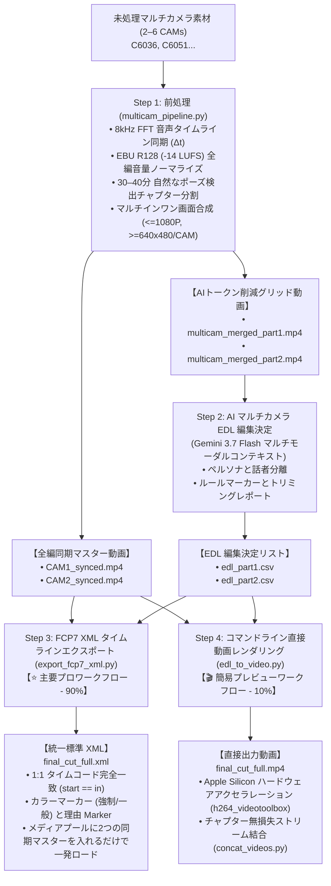

# マルチカメラ映像智慧処理＆AI編集スイート (Multicam Video Pipeline & AI Editing Suite)

[English (en)](README.md) | [繁體中文 (zh-TW)](README.zh-TW.md) | [简体中文 (zh-CN)](README.zh-CN.md) | [日本語 (ja)](README.ja.md) | [한국어 (ko)](README.ko.md)

---

> [!IMPORTANT]
> **🚀 Google Antigravity 専用スキル (Antigravity Exclusive Skill)**  
> 本ツールキットは、**Google Antigravity Agent フレームワーク（Gemini 3.7 Flash 1M マルチモーダル長文コンテキスト）** 向けにネイティブ設計された専用スキルです。現在、**他のエージェントフレームワーク（LangChain、CrewAI、AutoGen など）とは互換性がありません**。

---

大規模マルチモーダルAIモデル（Gemini 3.7 Flash 1Mトークンコンテキスト）およびプロフェッショナル向けNLE（DaVinci Resolve、Adobe Premiere Pro、Final Cut Pro）に最適化された、高効率・モジュール式マルチカメラ映像処理パイプライン＆AI編集ツールキットです。

---

## 📦 Antigravity スキル導入＆インストール

Antigravity Skill 仕様に準拠しており、Antigravity スキルディレクトリに直接クローンして使用できます：

```bash
# Antigravity Skills ディレクトリに直接クローン
git clone https://github.com/sylphlin/multicam-video-preprocessing.git ~/.gemini/config/skills/multicam-video-preprocessing
```

### 📁 Skill ディレクトリ構成
```text
multicam-video-preprocessing/
├── SKILL.md                  # Antigravity スキル定義＆分岐判断ルール
├── assets/                   # Antigravity プロンプト資産 (Prompt Assets)
│   └── edl_interview_template.md  # 2台カメラインタビュー用プロンプトテンプレート
├── scripts/                  # 実行スクリプト＆処理モジュール
│   ├── multicam_pipeline.py  # Step 1: 音声同期、EBU R128、チャプター分割、グリッド合成
│   ├── generate_edl_with_gemini.py # Step 2: Gemini 3.7 Flash EDL 編集決定生成
│   ├── export_fcp7_xml.py    # Step 3A: FCP7 XML タイムラインエクスポート (⭐ 主要)
│   ├── edl_to_video.py       # Step 3B: ハードウェアアクセラレーション直接動画出力 (🎬 次要)
│   ├── concat_videos.py      # Step 4B: 全編無損失ストリーム結合 (🎬 次要)
│   └── modules/              # 内部音声・映像アルゴリズムモジュール
└── README.md
```

---

## 🌟 エンドツーエンド全ワークフロー (Full End-to-End Workflow)



---

## 📁 簡潔な出力ディレクトリ構成 (Clean Directory Structure)

```text
output/
 ├── multicam_sync.json           # タイム同期オフセットおよびチャプターメタデータ
 ├── multicam_sync.csv            # テーブル形式データ
 │
 ├── CAM1_synced.mp4              # 全編同期マスター (CAM1、EBU R128 -14 LUFS)
 ├── CAM2_synced.mp4              # 全編同期マスター (CAM2、Δt オフセット調整済み)
 │
 ├── multicam_merged_part1.mp4    # 軽量マルチインワン (Part 1、トークンを 50–83% 削減)
 ├── multicam_merged_part2.mp4    # 軽量マルチインワン (Part 2、トークンを 50–83% 削減)
 │
 ├── edl_part1.csv                # Gemini AI 編集決定 (Part 1)
 ├── edl_part2.csv                # Gemini AI 編集決定 (Part 2)
 │
 ├── final_cut_full.xml           # ⭐【主要】NLEインポート用 FCP7 XML タイムライン
 └── final_cut_full.mp4           # 🎬【次要】直接レンダリング完成動画
```

---

## 🛠️ 必要要件

- **FFmpeg**（`h264_videotoolbox` および `loudnorm` フィルタ対応）
- **Python 3.8+**
- **NumPy** (`pip install numpy`)

---

## 🚀 ステップバイステップ CLI 実行ガイド

### Step 1：マルチカメラ前処理（同期 + 音量正規化 + チャプター分割 + 合成）

```bash
python3 scripts/multicam_pipeline.py \
  --ref CAM1.mp4 \
  --targets CAM2.mp4 \
  --auto-split \
  --split-min-dur 30 --split-max-dur 40 \
  --normalize \
  --merge \
  --output-dir ./output/
```

### Step 2：Gemini AI マルチカメラ EDL 生成
`multicam_merged_part1.mp4` / `multicam_merged_part2.mp4` を Antigravity（Gemini 3.7 Flash）に直接アップロードし、編集ルールプロンプトを適用して `edl_part1.csv` と `edl_part2.csv` を生成します。

### Step 3（主要パス）：DaVinci / Premiere 用 FCP7 XML エクスポート

```bash
python3 scripts/export_fcp7_xml.py \
  -d ./output/ \
  -o ./output/final_cut_full.xml
```

#### 🎬 DaVinci Resolve でのインポート手順：
1. DaVinci Resolve を開き、新規プロジェクトを作成します。
2. `CAM1_synced.mp4` と `CAM2_synced.mp4` を**メディアプール (Media Pool)** にドラッグ＆ドロップします。
3. **ファイル $\rightarrow$ 読み込み $\rightarrow$ タイムライン...** (`Cmd + Shift + I`) をクリックし、`final_cut_full.xml` を選択します。
4. 全編98カット以上のカット点、音声、カラーマーカーが一瞬でタイムラインに展開されます！

---

### Step 4（次要パス）：コマンドライン直接レンダリング＆結合

```bash
# 各 Part をレンダリング
python3 scripts/edl_to_video.py -e ./output/edl_part1.csv -d ./output/ -o ./output/final_cut_part1.mp4
python3 scripts/edl_to_video.py -e ./output/edl_part2.csv -d ./output/ -o ./output/final_cut_part2.mp4

# 全編を無損失ストリーム結合
python3 scripts/concat_videos.py \
  --inputs ./output/final_cut_part1.mp4 ./output/final_cut_part2.mp4 \
  --output ./output/final_cut_full.mp4
```

---

## ⚙️ CLI パラメータ詳細 (`multicam_pipeline.py`)

| パラメータ | 説明 | デフォルト値 |
| :--- | :--- | :--- |
| `--ref` | 基準カメラ動画パス (CAM1) | *必須* |
| `--targets` / `--target` | 1〜5台のターゲットカメラ動画パス（計2〜6台対応） | *必須* |
| `--auto-split` | 自然なポーズ検出によるチャプター分割（30〜40分）を有効化 | `False` |
| `--split-min-dur` | 分割セグメントの最小時間（分） | `30.0` |
| `--split-max-dur` | 分割セグメントの最大時間（分） | `40.0` |
| `--merge` / `--multi-in-one` | マルチインワン合成動画（並列/グリッド）をレンダリング | `False` |
| `--encoder` | 動画エンコーダー (`h264_videotoolbox` / `libx264`) | `h264_videotoolbox` |
| `--normalize` | EBU R128 (-14 LUFS) 全編音量ノーマライズを有効化 | `False` |
| `--lufs` | 目標ラウドネス値 (LUFS) | `-14.0` |
| `--lra` | ラウドネスレンジ (LU) | `11.0` |
| `--tp` | トゥルーピーク上限 (dBTP) | `-1.5` |
| `--ref-start` | 基準カメラの手動トリム開始時間 (`HH:MM:SS.mmm` または 秒) | `None` |
| `--ref-end` | 基準カメラの手動トリム終了時間 (`HH:MM:SS.mmm` または 秒) | `None` |
| `--output-dir` | 同期マスターおよびレポートの出力ディレクトリパス | `.` (カレントディレクトリ) |
| `--suffix` | 同期マスターのファイル名サフィックス | `_synced` |
| `--sr` | FFT同期用音声サンプリング周波数 (Hz) | `8000` |
| `--workers` | 並列処理スレッド数 | `2` |
| `--export-json` | JSON レポート出力パス | `None` |
| `--export-csv` | CSV レポート出力パス | `None` |
