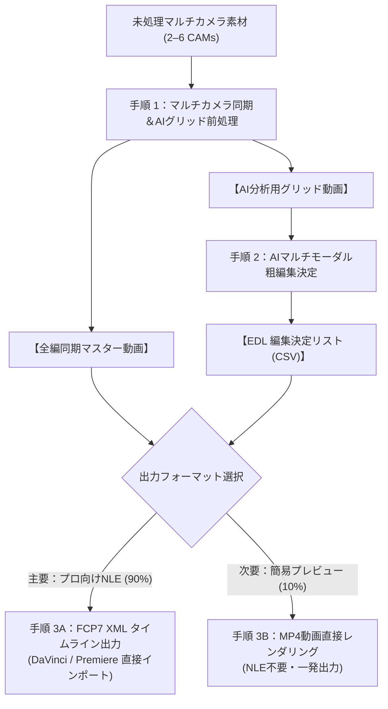

# マルチカメラ映像智慧処理＆AI編集スイート (Multicam Video Pipeline & AI Editing Suite)

[English (en)](README.md) | [繁體中文 (zh-TW)](README.zh-TW.md) | [简体中文 (zh-CN)](README.zh-CN.md) | [日本語 (ja)](README.ja.md) | [한국어 (ko)](README.ko.md)

---

> [!IMPORTANT]
> **🚀 Google Antigravity 専用スキル (Antigravity Exclusive Skill)**  
> 本ツールキットは、**Google Antigravity Agent** 向けにネイティブ設計された専用スキルです（Antigravity の 1M マルチモーダル映像認識能力およびスキル仕様に依存）。**Claude Code、OpenAI Codex、Cursor などの他の AI コーディングアシスタントやエージェントツールでは動作しません**。現時点では Antigravity のみをサポートしています。

---

大規模マルチモーダルAIモデル（Gemini 3.7 Flash 1Mトークンコンテキスト）およびプロフェッショナル向けNLE（DaVinci Resolve、Adobe Premiere Pro、Final Cut Pro）に最適化された、高効率・モジュール式マルチカメラ映像処理パイプライン＆AI編集ツールキットです。

---

## 📦 Antigravity スキル導入＆インストール

Antigravity Skill 仕様に準拠しており、Antigravity スキルディレクトリに直接クローンして使用できます：

```bash
git clone https://github.com/sylphlin/multicam-video-preprocessing.git ~/.gemini/config/skills/multicam-video-preprocessing
```

### 📁 Skill ディレクトリ構成
```text
multicam-video-preprocessing/
├── SKILL.md                       # Antigravity スキル定義＆分岐判断ルール
├── assets/                        # Antigravity プロンプト資産 (Prompt Assets)
│   └── edl_interview_template.md  # 2台カメラインタビュー用プロンプトテンプレート
├── scripts/                       # 実行スクリプト＆処理モジュール
│   ├── multicam_pipeline.py       # Step 1: 音声同期、EBU R128、チャプター分割、グリッド合成
│   ├── generate_edl_with_gemini.py# Step 2: Gemini 3.7 Flash EDL 編集決定生成
│   ├── export_fcp7_xml.py         # Step 3A: FCP7 XML タイムラインエクスポート (⭐ 主要)
│   ├── edl_to_video.py            # Step 3B: ハードウェアアクセラレーション直接動画出力 (🎬 次要)
│   ├── concat_videos.py           # Step 3B: 全編無損失ストリーム結合 (🎬 次要)
│   └── modules/                   # 内部音声・映像アルゴリズムモジュール
└── README.md
```

---

## 🌟 エンドツーエンド全ワークフロー



---

## 💬 使用シナリオ＆対話プロンプト例

Antigravity の対話画面で自然言語で要望を伝えるだけで、Agent がバックエンドモジュールを自動実行します：

### シナリオ 1：編集用 XML の出力（プロ向けワークフロー ⭐ 推奨）
- **適用シーン**：粗編集結果を DaVinci Resolve、Adobe Premiere Pro、Final Cut Pro に取り込み、詳細編集・グレーディング・MAを行う場合。
- **プロンプト例**：
  > 「*2台のインタビュー動画 `CAM1.mp4` と `CAM2.mp4` があります。時間同期と音量正規化を行い、インタビュー編集ルールを適用して DaVinci Resolve 用の XML タイムラインを出力してください。*」
- **納品成果物**：
  1. `final_cut_full.xml`（98以上のカット点とカラー理由マーカーを含むタイムライン）
  2. `CAM1_synced.mp4`, `CAM2_synced.mp4`（音画完全同期＆-14 LUFS 正規化マスター）
- **DaVinci Resolve インポート 3 ステップ**：
  1. DaVinci Resolve を開き、新規プロジェクトを作成します。
  2. `CAM1_synced.mp4` と `CAM2_synced.mp4` を **メディアプール** にドラッグ＆ドロップします。
  3. **ファイル $\rightarrow$ 読み込み $\rightarrow$ タイムライン...** (`Cmd + Shift + I`) を選択し、`final_cut_full.xml` を読み込みます！

---

### シナリオ 2：動画直接出力（簡易プレビューワークフロー 🎬）
- **適用シーン**：編集機から離れている場合や、クライアントに粗編集テンポを迅速に確認してもらう場合。
- **プロンプト例**：
  > 「*このマルチカメラ素材をAI粗編集し、結合済みのMP4プレビュー動画として直接出力してください。*」
- **納品成果物**：
  1. `final_cut_full.mp4`（全編結合済み動画）

---

## 🔍 各ステップの詳細解説

### 手順 1：マルチカメラ同期＆AIグリッド前処理 (`multicam_pipeline.py`)
1. **全編 8kHz FFT 音声タイムライン同期**：
   - 音声を8kHzモノラルで相互相関マッチングし、各カメラの物理時間差 $\Delta t$（ミリ秒精度）を瞬時に算出。
2. **EBU R128 (-14 LUFS) 放送基準音量ノーマライズ**：
   - 2パス処理で全トラックを -14.0 LUFS、11.0 LRA、-1.5 dBTP に一括正規化。
3. **30〜40 分 自然なポーズ検出チャプター分割 (Auto-Split)**：
   - 語音エネルギーの極小値と息継ぎポーズを自動検出して無損失切分。
4. **全編同期マスター出力 (`*_synced.mp4`)**：
   - NLE編集用の全編同期マスター動画を瞬時に書き出し。
5. **2〜6 台マルチインワン画面合成**：
   - 画面サイズ $\le 1080P$、単機 $\ge 640 \times 480$ でタイル合成し、AI分析の **トークン消費を 50%–83% 削減**。

---

### 手順 2：Gemini AI マルチモーダル粗編集決定 (`generate_edl_with_gemini.py`)
1. **プロンプト資産の読み込み**：
   - `assets/edl_interview_template.md` を適用。
2. **Phase 0：頭尾の無効映像トリミング**：
   - 撮影開始前の準備・テスト発声を排除（`Global_Start_Time`）；
   - 終了後の雑談・マイク取り外し等の未関機映像を完全カット（`Global_End_Time`）。
3. **Phase 1–4：声画意味認識による編集**：
   - 音声主導で発話者を追跡し、語音境界にカット点を配置。
   - 発話者への追従と 2〜3 秒の聞き手リアクションショット（笑顔・頷き）を挿入。
   - 単一カット $\ge 2.5\text{s}$ の防跳切ルールを厳守。

---

### 手順 3A（主要）：FCP7 XML タイムラインエクスポート (`export_fcp7_xml.py`)
1. **全編タイムコードの連続累加**：各チャプターをシームレスな単一シーケンスにマッピング。
2. **1:1 タイムコード完全一致 (`start == in`)**：NLE内でのリップル・スリップ編集に完全対応。
3. **マスターオーディオトラックとカラーマーカー**：CAM1主音声を連続配置し、AIの編集根拠をカラーマーカーとして注入。

---

### 手順 3B（次要）：直接レンダリング＆結合 (`edl_to_video.py` & `concat_videos.py`)
1. **ハードウェアアクセラレーション書き出し**：Apple Silicon `h264_videotoolbox` による高速レンダリング。
2. **無損失ストリーム結合**：`-c copy` による秒速マージ。
