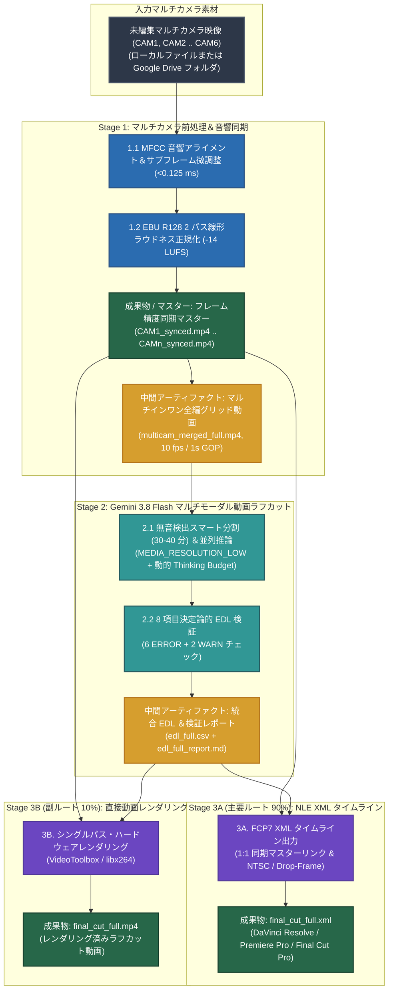

# Multi-Camera Video Pipeline & AI Editing Suite

[English (en)](README.md) | [繁體中文 (zh-TW)](README.zh-TW.md) | [简体中文 (zh-CN)](README.zh-CN.md) | [日本語 (ja)](README.ja.md) | [한국어 (ko)](README.ko.md)

---

> [!IMPORTANT]
> **Google Antigravity ネイティブプラグイン＆ワークフロースイート**  
> 本ツールキットは、**Google Antigravity**（**Vertex AI Gemini 3.8 Flash** 搭載）およびプロ向け NLE（**DaVinci Resolve**、**Adobe Premiere Pro**、**Final Cut Pro**）向けの 3 ステージ・マルチカメラ前処理＆AI ラフカットスイートです。

---

**Multi-Camera Video Pipeline & AI Editing Suite** は、2〜6 台のカメラ映像の音響同期、ラウドネス正規化、AI ラフカットタイムライン生成、およびマルチカメラプレビュー動画レンダリングを実行します。Antigravity チャット画面で自然言語で指示するだけで、マルチカメラ前処理からラフカット生成までを自動実行します。

---

## インストールと Google Cloud セットアップ (`setup.sh`)

本プロジェクトは [Agent Plugins 1.0](https://agent-plugins.org/) に準拠し、**Google Cloud Vertex AI (ADC)** と **Cloud Storage (GCS)** 上で動作します（API キー管理不要）。

```bash
# 1a. グローバル Antigravity Plugin としてクローン（推奨）
git clone https://github.com/sylphlin/multicam-video-preprocessing.git ~/.gemini/config/plugins/multicam-video-preprocessing

# 1b. 旧来の単一 Skill ディレクトリへのインストール（任意：skills/multicam-video-preprocessing をシンボリックリンク）
ln -s ~/.gemini/config/plugins/multicam-video-preprocessing/skills/multicam-video-preprocessing ~/.gemini/config/skills/multicam-video-preprocessing

# 2. 依存パッケージのインストールと ADC 認証
brew install ffmpeg
pip install numpy google-genai google-cloud-storage requests
gcloud auth application-default login

# 3. setup.sh を実行して GCS バケット、2 階層ライフサイクル（raw: 2 日、成果物: 15 日）、IAM、.env を構成
chmod +x setup.sh
./setup.sh --project YOUR_GCP_PROJECT_ID
```

### ディレクトリ構造（Agent Plugins 1.0 準拠）
- **SSOT 実体ディレクトリ**：`skills/multicam-video-preprocessing/`（`SKILL.md`、`scripts/`、`assets/` を格納）を単一の信頼できる情報源（Single Source of Truth）として構成しています。
- **2 層 `AGENTS.md` 構成**：ルートの `AGENTS.md` は開発・エンジニアリング規約（Part I & Part II）を定義し、`rules/AGENTS.md` はプラグインに同梱される AI クライアント実行時ルール（`<PLUGIN_ROOT>` からの直接 CLI 実行、読み取り専用、Fail-Fast）を定義します。

---

## 3 ステージ実行ワークフローアーキテクチャ


```mermaid
flowchart TD
    classDef inputStyle fill:#2D3748,stroke:#4A5568,stroke-width:2px,color:#fff;
    classDef stage1Style fill:#2B6CB0,stroke:#2C5282,stroke-width:2px,color:#fff;
    classDef stage2Style fill:#319795,stroke:#285E61,stroke-width:2px,color:#fff;
    classDef stage3Style fill:#6B46C1,stroke:#553C9A,stroke-width:2px,color:#fff;
    classDef artifactStyle fill:#D69E2E,stroke:#B7791F,stroke-width:2px,color:#fff;
    classDef outputStyle fill:#276749,stroke:#1C4532,stroke-width:2px,color:#fff;

    subgraph Inputs["入力マルチカメラ素材"]
        A["未編集マルチカメラ映像 (CAM1, CAM2 .. CAM6)<br/>(ローカルファイルまたは Google Drive フォルダ)"]:::inputStyle
    end

    subgraph S1["Stage 1: マルチカメラ前処理＆音響同期"]
        S1_1["1.1 MFCC 音響アライメント＆サブフレーム微調整 (<0.125 ms)"]:::stage1Style
        S1_2["1.2 EBU R128 2 パス線形ラウドネス正規化 (-14 LUFS)"]:::stage1Style
        S1_3["成果物 / マスター: フレーム精度同期マスター<br/>(CAM1_synced.mp4 .. CAMn_synced.mp4)"]:::outputStyle
        S1_4["中間アーティファクト: マルチインワン全編グリッド動画<br/>(multicam_merged_full.mp4, 10 fps / 1s GOP)"]:::artifactStyle
        S1_1 --> S1_2
        S1_2 --> S1_3
        S1_3 --> S1_4
    end

    subgraph S2["Stage 2: Gemini 3.8 Flash マルチモーダル動画ラフカット"]
        S2_1["2.1 無音検出スマート分割 (30-40 分) ＆並列推論<br/>(MEDIA_RESOLUTION_LOW + 動的 Thinking Budget)"]:::stage2Style
        S2_2["2.2 8 項目決定論的 EDL 検証<br/>(6 ERROR + 2 WARN チェック)"]:::stage2Style
        EDL["中間アーティファクト: 統合 EDL ＆検証レポート<br/>(edl_full.csv + edl_full_report.md)"]:::artifactStyle
        S2_1 --> S2_2
        S2_2 --> EDL
    end

    subgraph S3A["Stage 3A (主要ルート 90%): NLE XML タイムライン"]
        S3A_ACT["3A. FCP7 XML タイムライン出力<br/>(1:1 同期マスターリンク & NTSC / Drop-Frame)"]:::stage3Style
        XML["成果物: final_cut_full.xml<br/>(DaVinci Resolve / Premiere Pro / Final Cut Pro)"]:::outputStyle
        S3A_ACT --> XML
    end

    subgraph S3B["Stage 3B (副ルート 10%): 直接動画レンダリング"]
        S3B_ACT["3B. シングルパス・ハードウェアレンダリング<br/>(VideoToolbox / libx264)"]:::stage3Style
        MP4["成果物: final_cut_full.mp4<br/>(レンダリング済みラフカット動画)"]:::outputStyle
        S3B_ACT --> MP4
    end

    A --> S1_1
    S1_4 --> S2_1
    S1_3 --> S3A_ACT
    EDL --> S3A_ACT
    S1_3 --> S3B_ACT
    EDL --> S3B_ACT
```

---

## Antigravity の操作方法と利用シナリオ (Usage & Scenarios)

Antigravity では以下の 2 つの方法で実行できます：
1. **ショートカット指定（`/skill` + `@ファイル`）**：`/multicam-video-preprocessing` を選択し、`@` でカメラ映像や Google Drive フォルダを指定するだけで実行できます。
2. **自然言語プロンプト**：通常の会話文で要望を伝え、`@` ファイルやクラウドリンクを添付すると自動的にプラグインが呼び出されます。

### シナリオ 1：NLE 用 FCP7 XML タイムライン出力（推奨メインワークフロー）
- **ユースケース**：AI ラフカットのカメラ切り替え判定を DaVinci Resolve、Adobe Premiere Pro、または Final Cut Pro に読み込み、本編集やカラーグレーディングを行います。
- **方法 A（`/ + @` ショートカット指定）**：
  ```text
  /multicam-video-preprocessing CAM1: @CAM1.mp4, CAM2: @CAM2.mp4
  ```
- **方法 B（自然言語プロンプト）**：
  ```text
  @CAM1.mp4 と @CAM2.mp4 を同期してラウドネスを -14 LUFS に正規化し、DaVinci Resolve 用の FCP7 XML ラフカットタイムラインを出力して。
  ```
- **生成される成果物**：
  1. `final_cut_full.xml`（カメラ切り替え点と理由マーカーを含むタイムライン）。
  2. `CAM1_synced.mp4`、`CAM2_synced.mp4`（時間同期および `-14 LUFS` 正規化済みカメラマスター）。

### シナリオ 2：ラフカット動画の直接レンダリング
- **ユースケース**：NLE を開かずに、カメラ切り替え済みの MP4 プレビュー動画を直接レンダリングします。
- **方法 A（`/ + @` ショートカット指定）**：
  ```text
  /multicam-video-preprocessing CAM1: @CAM1.mp4, CAM2: @CAM2.mp4, 出力: MP4 直接レンダリング
  ```
- **方法 B（自然言語プロンプト）**：
  ```text
  @CAM1.mp4 と @CAM2.mp4 をマルチカメラ AI ラフカットして、final_cut_full.mp4 を直接レンダリングして。
  ```
- **生成される成果物**：
  1. `final_cut_full.mp4`（シングルパス・ハードウェアレンダリング済み動画）。
  2. `edl_full.csv` および `edl_full_report.md`（カメラ切り替えリストと 8 項目検証レポート）。

### シナリオ 3：Google Drive フォルダからのマルチカメラ同期＆ラフカット
- **ユースケース**：Google Drive 共有フォルダ内の全カメラ映像を MD5 キャッシュ検証付きで自動取得し、同期からタイムライン出力まで一括実行します。
- **方法 A（`/ + @` ショートカット指定）**：
  ```text
  /multicam-video-preprocessing フォルダ: https://drive.google.com/drive/folders/FOLDER_ID
  ```
- **方法 B（自然言語プロンプト）**：
  ```text
  Google Drive フォルダ https://drive.google.com/drive/folders/FOLDER_ID のマルチカメラ素材を同期・正規化して、FCP7 XML タイムラインを生成して。
  ```
- **生成される成果物**：
  1. `CAM1_synced.mp4` .. `CAMn_synced.mp4`（同期・ラウドネス正規化済みマスター）。
  2. `edl_full.csv`、`edl_full_report.md`、`final_cut_full.xml`。

---

## 3 ステージ技術概要

1. **Stage 1（マルチカメラ同期＆前処理）**：MFCC 音響アライメント＆サブフレーム微調整（`<0.125 ms`）、EBU R128（`-14 LUFS`）2 パス線形ラウドネス正規化、フレーム精度同期マスター出力（`CAM*_synced.mp4`, `20 Mbps`）、および軽量全編グリッド合成（`multicam_merged_full.mp4`, `10 fps`, `1.2 Mbps`, 1 秒短 GOP）を実行します。
2. **Stage 2（Gemini 3.8 Flash マルチモーダルラフカット＆無音検出スマート分割）**：デフォルトで **Vertex AI Gemini 3.8 Flash** 標準マルチモーダルモード（`MEDIA_RESOLUTION_LOW` + 動的 `thinking_budget` `1024–4096`）を使用します。40 分を超える動画では 30〜40 分の自然な無音箇所で `<output_dir>/_edl_chunks/` に一時分割して並列推論し、`edl_full.csv` に統合した後、`finally` ブロックでローカルと GCS の一時チャンクを自動削除し、8 項目の決定論的 EDL 検証（`6 ERROR + 2 WARN`）を実行します。
3. **Stage 3A & 3B（FCP7 XML タイムライン出力 / シングルパス動画レンダリング）**：NTSC 非整数フレームレート（`23.976`, `29.97`, `59.94`）やドロップフレームに対応した `final_cut_full.xml` の出力、または `final_cut_full.mp4` の直接レンダリングを行います。

---

## GCS 2 階層ライフサイクルポリシー (`gs://multicam-video-${PROJECT_ID}`)

| GCS パス接頭辞 (`matchesPrefix`) | 保存対象 | 保持期間 (`age`) | クリーンアップ動作 |
| :--- | :--- | :--- | :--- |
| **`raw/`** | 一時グリッド動画 (`multicam_merged_full.mp4`) ＆チャンク (`raw/edl_chunks/*`) | **2 日間 (`age: 2`)** | `raw/edl_chunks/*` は推論完了直後に `finally` で即時削除。全編動画は SHA-256 キャッシュ再利用のため 2 日間保持後に自動削除します。 |
| **`output/`**、**`deliverables/`**、**`multicam_assets/`** | XML/CSV タイムライン、レンダリング動画、検証レポート | **15 日間 (`age: 15`)** | チーム確認用に 15 日間保持した後、自動削除します。 |

---

## ライセンス (License)

本プロジェクトは [MIT License](LICENSE) の下で提供されています。
