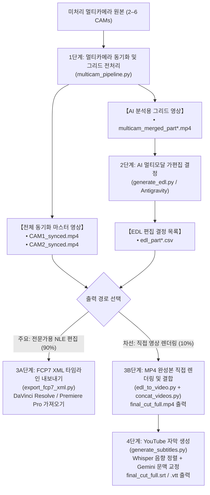

# 멀티카메라 영상 파이프라인 및 AI 편집 스위트 (Multicam Video Pipeline & AI Editing Suite)

[English (en)](README.md) | [繁體中文 (zh-TW)](README.zh-TW.md) | [简体中文 (zh-CN)](README.zh-CN.md) | [日本語 (ja)](README.ja.md) | [한국어 (ko)](README.ko.md)

---

> [!NOTE]
> **플랫폼 지원 및 환경 안내**  
> - **검증 환경**: 본 툴킷은 **Google Antigravity 2.0** 및 **Gemini 3.7 Flash (Thinking: Medium)** 환경을 기반으로 설계 및 검증되었습니다.  
> - **크로스 플랫폼 지원**: **[Agent Plugins 1.0 표준 규격](https://agent-plugins.org/specification)**에 맞춰 패키징되어 규격을 준수하는 에이전트 클라이언트(**OpenAI Codex 데스크톱** 등)에서도 설치할 수 있습니다. 타 플랫폼에 대한 전수 테스트는 진행 중이며 피드백을 환영합니다.  
> - **컨텍스트 윈도우 및 분할 설정**: 다른 멀티모달 모델을 선택할 경우 **컨텍스트 윈도우(Context Window) 크기**를 확인하고, Step 1의 챕터 분할 시간 파라미터(`--split-min-dur`, `--split-max-dur`, 기본값: 30–40분)를 적절히 조절해 주세요.

---

롱 컨텍스트 멀티모달 모델(Gemini 3.7 Flash 1M 토큰) 및 전문 NLE(DaVinci Resolve, Adobe Premiere Pro, Final Cut Pro)에 최적화된 모듈형 멀티카메라(2–6대) 영상 처리 파이프라인 및 AI 가편집 툴킷입니다.

---

## 📦 설치 및 도입 가이드 (Installation & Setup)

Antigravity 및 Agent Plugins 1.0 표준 규격을 준수하며, 스킬 디렉터리로 복제하여 사용할 수 있습니다:

```bash
git clone https://github.com/sylphlin/multicam-video-preprocessing.git ~/.gemini/config/skills/multicam-video-preprocessing
```

### 📁 디렉토리 구조
```text
multicam-video-preprocessing/
├── plugin.json                    # Agent Plugins 1.0 매니페스트 (Codex 등 지원)
├── SKILL.md                       # Antigravity 스킬 규격 및 분기 판단 규칙
├── skills/
│   └── multicam-video-preprocessing/
│       └── SKILL.md               # Agent Plugins 1.0 표준 스킬 정의
├── assets/                        # 프롬프트 에셋 (Prompt Assets)
│   ├── edl_interview_template.md  # 2대 카메라 인터뷰 프롬프트 템플릿
│   └── subtitle_proofread_template.md # YouTube 자막 교정 템플릿
├── scripts/                       # 실행 스크립트 및 처리 모듈
│   ├── multicam_pipeline.py       # Step 1: 오디오 동기화, EBU R128, 챕터 분할, 그리드 합성
│   ├── generate_edl.py            # Step 2: 멀티모달 AI 가편집 결정 생성
│   ├── export_fcp7_xml.py         # Step 3A: FCP7 XML 타임라인 내보내기 (주요)
│   ├── edl_to_video.py            # Step 3B: 직접 영상 렌더링 (차선)
│   ├── concat_videos.py           # Step 3B: 전체 무손실 스트림 결합 (차선)
│   ├── generate_subtitles.py      # Step 4: YouTube 자막 생성 (Whisper+Gemini)
│   └── modules/                   # 내부 영상/오디오 핵심 알고리즘
└── README.md
```

---

## 🌟 엔드투엔드 전체 워크플로우



---

## 💬 사용 시나리오 및 프롬프트 예시

Antigravity 대화창에서 자연어로 요청하면 에이전트가 백엔드 모듈을 자동 실행합니다:

### 시나리오 1: NLE 타임라인 XML 내보내기 (전문 편집 워크플로우)
- **적용 분야**: 가편집 결과를 DaVinci Resolve, Adobe Premiere Pro, Final Cut Pro로 가져와 색보정 및 오디오 믹싱을 진행하는 경우.
- **대화형 프롬프트 예시**:
  > "*`CAM1.mp4`와 `CAM2.mp4` 2대의 인터뷰 영상이 있습니다. 타임라인 동기화 및 음량 표준화를 수행하고 인터뷰 편집 규칙을 적용하여 DaVinci Resolve용 XML 타임라인을 생성해 줘.*"
- **최종 산출물**:
  1. `final_cut_full.xml` (98개 이상의 컷과 컬러 마커가 포함된 타임라인)
  2. `CAM1_synced.mp4`, `CAM2_synced.mp4` (동기화 및 -14 LUFS 표준화 마스터 영상)
- **DaVinci Resolve 가져오기 단계**:
  1. DaVinci Resolve를 열고 새 프로젝트를 생성합니다.
  2. `CAM1_synced.mp4` 및 `CAM2_synced.mp4`를 **미디어 풀**로 드래그합니다.
  3. **파일 $\rightarrow$ 가져오기 $\rightarrow$ 타임라인...** (`Cmd + Shift + I`)을 클릭하고 `final_cut_full.xml`을 선택합니다.

---

### 시나리오 2: 직접 영상 렌더링 및 YouTube 자막 (프리뷰 및 배포 워크플로우)
- **적용 분야**: 편집 프로그램 없이 MP4 영상과 YouTube 자막을 빠르게 제작하여 검토 또는 배포하고자 하는 경우.
- **대화형 프롬프트 예시**:
  > "*이 멀티카메라 영상 2개를 가편집하여 완전한 MP4 영상으로 렌더링하고, 교정된 YouTube 자막도 함께 생성해 줘.*"
- **최종 산출물**:
  1. `final_cut_full.mp4` (렌더링 및 무손실 결합 완성본 영상)
  2. `final_cut_full.srt` / `final_cut_full.vtt` (Whisper 음향 정렬 + Gemini 문맥 교정 YouTube 표준 자막)

---

## 🔍 각 단계별 세부 설명

### 1단계: 멀티카메라 동기화 및 그리드 전처리 (`multicam_pipeline.py`)

1. **8kHz FFT 오디오 타임라인 동기화 (8kHz FFT Audio Time Alignment)**:
   - **왜 8kHz로 다운샘플링하는가?**: 사람의 음성 주파수 특성은 300Hz–3.4kHz 대역에 집중되어 있어 8kHz 샘플링만으로도 음향 특성을 완벽히 포착할 수 있습니다. 이를 통해 메모리 소모를 줄이고 상호상관 연산 속도를 10배 이상 향상시킵니다.
   - **FFT 상호상관 알고리즘 원리**: 기준 카메라(CAM1)와 대상 카메라(CAM2–CAMn)의 오디오를 추출하고, 고속 푸리에 변환(FFT)을 통해 시간 영역 신호를 주파수 영역으로 변환하여 상호상관 함수(Cross-Correlation)를 계산합니다. 에너지 피크 위치를 탐색하여 시작 시간 편차 $\Delta t$(밀리초 정밀도)를 산출하고 녹화 시작 시차를 자동 보정 및 트리밍합니다.
2. **EBU R128 (-14 LUFS) 전체 음량 표준화 (YouTube 권장 표준 준수)**:
   - **YouTube 재생 규격 준수**: YouTube 플랫폼은 **-14.0 LUFS**를 표준 라우드니스 타깃으로 적용합니다. 음량이 기준치보다 높으면 YouTube 서버에서 강제 압축(Volume Normalization)을 적용하여 다이내믹 레인지가 훼손되며, 너무 낮으면 모바일 시청 환경에서 불편을 초래합니다.
   - **2패스(Two-Pass) 분석 및 필터 적용**:
     - 1차 패스: FFmpeg의 `ebur128` 필터로 통합 라우드니스(`I`), 라우드니스 범위(`LRA` = 11.0 LU), 트루 피크(`TP` = -1.5 dBTP)를 정밀 측정.
     - 2차 패스: 실측 파라미터를 `loudnorm` 필터에 적용하여 선형 게인을 조절. 모든 카메라와 챕터의 음량을 일관되게 맞추고 디지털 클리핑(True Peak Clipping)을 방지합니다.
3. **30–40분 자연스러운 멈춤 챕터 분할 (1M Context Window 최적화 및 모델 맞춤 조절)**:
   - **1M Token 컨텍스트 최적 밸런스**: Gemini 3.7 Flash 등 1M Token Context를 지원하는 멀티모달 모델 기준, 30–40분의 그리드 영상은 약 60만–80만 토큰을 소모하여 시스템 프롬프트, 사고 연쇄(Thinking Process), 긴 EDL 텍스트 출력을 위한 여유 공간을 안정적으로 확보합니다.
   - **자연스러운 호흡 및 무음 구간 감지**: 고정 시간 단위로 기계적으로 자르는 대신 30–40분 슬라이딩 윈도우 내에서 오디오 RMS 에너지를 분석하여 문장 종료 지점, 호흡 멈춤, 무음 지점을 감지하여 무손실 분할합니다.
   - **모델 창 크기에 따른 유연한 조절**: 컨텍스트 윈도우가 작은 모델(128k, 200k 등)을 사용하는 경우 CLI 파라미터 `--split-min-dur`, `--split-max-dur`(예: 5–10분)를 통해 분할 시간을 자유롭게 조절할 수 있습니다.
4. **전체 동기화 마스터 영상 출력 (`*_synced.mp4`)**:
   - $\Delta t$를 기준으로 정렬된 마스터 영상 출력.
5. **멀티인원 화면 합성 (2–6대)**:
   - 화면 해상도 $\le 1920 \times 1080$, 대당 $\ge 640 \times 480$ 그리드 영상을 합성하여 **토큰 소모 50%–83% 절감**.

---

### 2단계: Gemini AI 멀티모달 가편집 결정 (`generate_edl.py`)
1. **프롬프트 에셋 로드**:
   - `assets/edl_interview_template.md` 규칙 템플릿 로드.
2. **Phase 0: 전후 불필요 구간 트리밍 (Pre/Post-roll Trimming)**:
   - 촬영 전 슬레이트 및 카운트다운(`Global_Start_Time`), 종료 후 잡담 및 소음(`Global_End_Time`)을 자동 제거.
3. **Phase 1–4: 의미 구조 기반 컷 전환**:
   - **화자 인식 및 추적**: 발화자 음성에 맞춰 카메라 전환.
   - **리액션 컷 삽입**: 짧은 추임새를 거르고 큰 리액션 시 2–3초 전환.
   - **컷 템포 유지**: 최소 단일 컷 길이 $\ge 2.5\text{s}$ 유지.
4. **표준 포맷 출력**:
   - CSV 결정표(`edl_part*.csv`) 및 Markdown 분석 리포트(`edl_part*_report.md`) 출력.

---

### 3A단계 (주요): FCP7 XML 타임라인 내보내기 (`export_fcp7_xml.py`)
1. **다중 챕터 타임스탬프 누적 매핑**:
   - Part 1, Part 2의 타임스탬프를 연속 타임라인으로 변환.
2. **1:1 타임코드 완벽 일치**:
   - 각 클립의 `start == in`, `end == out`을 유지하여 NLE에서 슬립/슬라이드 트리밍 지원.
3. **연속 오디오 트랙 및 규칙 마커 삽입**:
   - 연속된 CAM1 메인 오디오 트랙을 생성하고 편집 근거 컬러 마커 배치.

---

### 3B단계 (차선): 직접 렌더링 및 결합 (`edl_to_video.py` & `concat_videos.py`)
1. **하드웨어 가속 챕터 렌더링**:
   - Apple Silicon(`h264_videotoolbox`)을 활용하여 각 챕터 영상(`final_cut_part*.mp4`) 렌더링.
2. **무손실 스트림 결합**:
   - FFmpeg Concat Demuxer(`-c copy`)로 `final_cut_full.mp4` 결합.

---

### 4단계: YouTube 자막 생성 (`generate_subtitles.py`)

**Whisper(음성 인식 및 타임코드 정렬)**와 **Gemini(문맥 교정 및 용어 수정)**를 결합한 2단계 방식을 사용합니다:

#### 왜 「Whisper + Gemini」를 사용하는가

| 비교 항목 | Whisper 단독 | Gemini 음성 ASR 단독 | Whisper + Gemini |
| :--- | :--- | :--- | :--- |
| **타임스탬프 정밀도** | 밀리초 단위 정밀 | 타임스탬프가 거침 (문단 단위) | 밀리초 단위 정밀 (Whisper 타임코드 계승) |
| **동음이의어/오탈자 교정** | 발음 유사 오탈자 발생 | 문맥 파악력 우수 | 동음이의어 및 전문 용어 자동 교정 |
| **자막 가독성 및 호흡** | 단문 호흡 (약 1.2–2.5초) | 문장이 김 (약 6–8초) | YouTube에 적합한 단문 길이 (줄당 8–16자) |
| **발언 충실도** | 발언 그대로 전사 | 요약/의역 발생 가능 | 실제 발언 보존, 오탈자만 교정 |
| **처리 비용** | 로컬 처리로 빠름 | 오디오 Token 소비 | 로컬 오디오 처리, Gemini는 텍스트만 교정 |

#### 처리 절차:
1. **오디오 추출**: FFmpeg를 통해 완성 영상에서 16kHz 모노 WAV 오디오 추출.
2. **1단계 (Whisper 음성 전사)**: 로컬 `faster-whisper`로 밀리초 정밀 타임스탬프가 포함된 기준 SRT 생성.
3. **2단계 (Gemini 문맥 교정)**: 타임스탬프와 번호를 고정한 상태에서 오탈자 및 영문 용어(`Kelly Tsai`, `YouTube`, `DaVinci Resolve`, `Buffet` 등)를 자동 교정.
4. **출력 파일**:
   - **`final_cut_full.srt`**: YouTube 표준 SubRip 자막 파일.
   - **`final_cut_full.vtt`**: WebVTT 자막 파일.
   - **`final_cut_full_raw_whisper.srt`**: 비교용 Whisper 원본 파일.
