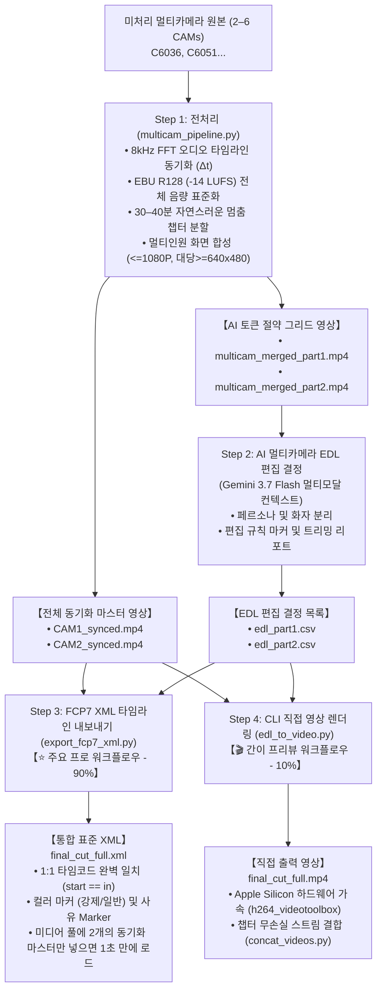

# 멀티카메라 영상 전처리 및 AI 편집 스위트 (Multicam Video Preprocessing & AI Editing Suite)

[English (en)](README.md) | [繁體中文 (zh-TW)](README.zh-TW.md) | [简体中文 (zh-CN)](README.zh-CN.md) | [日本語 (ja)](README.ja.md) | [한국어 (ko)](README.ko.md)

---

대규모 멀티모달 AI 모델(Gemini 3.7 Flash 1M 컨텍스트 윈도우) 및 전문 NLE(DaVinci Resolve, Adobe Premiere Pro, Final Cut Pro)에 최적화된 고성능 모듈형 멀티카메라 영상 전처리 및 AI 편집 툴킷입니다.

---

## 🌟 엔드투엔드 전체 워크플로우 (Full End-to-End Workflow)



---

## 📁 깔끔한 출력 디렉토리 구조 (Clean Directory Structure)

```text
output/
 ├── multicam_sync.json           # 타임 동기화 오프셋 및 챕터 메타데이터
 ├── multicam_sync.csv            # 테이블 형식 데이터
 │
 ├── CAM1_synced.mp4              # 전체 동기화 마스터 (CAM1, EBU R128 -14 LUFS)
 ├── CAM2_synced.mp4              # 전체 동기화 마스터 (CAM2, Δt 오프셋 정렬 완료)
 │
 ├── multicam_merged_part1.mp4    # 경량 멀티인원 (Part 1, 토큰 50–83% 절약)
 ├── multicam_merged_part2.mp4    # 경량 멀티인원 (Part 2, 토큰 50–83% 절약)
 │
 ├── edl_part1.csv                # Gemini AI 편집 결정 (Part 1)
 ├── edl_part2.csv                # Gemini AI 편집 결정 (Part 2)
 │
 ├── final_cut_full.xml           # ⭐【주요】NLE 임포트용 FCP7 XML 타임라인
 └── final_cut_full.mp4           # 🎬【차선】직접 렌더링 완성 영상
```

---

## 🛠️ 요구 사항

- **FFmpeg** (`h264_videotoolbox` 및 `loudnorm` 필터 지원)
- **Python 3.8+**
- **NumPy** (`pip install numpy`)

---

## 🚀 단계별 CLI 실행 가이드

### Step 1: 멀티카메라 전처리 (동기화 + 음량 표준화 + 분할 + 합성)

```bash
python3 scripts/multicam_pipeline.py \
  --ref CAM1.mp4 \
  --targets CAM2.mp4 \
  --auto-split \
  --split-min-dur 30 --split-max-dur 40 \
  --normalize \
  --merge \
  --output-dir ./output/
```

### Step 2: Gemini AI 멀티카메라 EDL 생성
`multicam_merged_part1.mp4` / `multicam_merged_part2.mp4`를 Antigravity(Gemini 3.7 Flash)에 직접 업로드하고 편집 규칙 프롬프트를 적용하여 `edl_part1.csv` 및 `edl_part2.csv`를 생성합니다.

### Step 3 (주요 경로): DaVinci / Premiere용 FCP7 XML 내보내기

```bash
python3 scripts/export_fcp7_xml.py \
  -d ./output/ \
  -o ./output/final_cut_full.xml
```

#### 🎬 DaVinci Resolve 임포트 단계:
1. DaVinci Resolve를 열고 새 프로젝트를 생성합니다.
2. `CAM1_synced.mp4` 및 `CAM2_synced.mp4`를 **미디어 풀(Media Pool)**로 드래그합니다.
3. **파일 $\\rightarrow$ 가져오기 $\\rightarrow$ 타임라인...** (`Cmd + Shift + I`)을 클릭하고 `final_cut_full.xml`을 선택합니다.
4. 98개 이상의 컷, 오디오, 컬러 마커가 타임라인에 즉시 완벽하게 로드됩니다!

---

### Step 4 (차선 경로): 명령줄 직접 렌더링 및 결합

```bash
# 각 Part 렌더링
python3 scripts/edl_to_video.py -e ./output/edl_part1.csv -d ./output/ -o ./output/final_cut_part1.mp4
python3 scripts/edl_to_video.py -e ./output/edl_part2.csv -d ./output/ -o ./output/final_cut_part2.mp4

# 전체 무손실 스트림 결합
python3 scripts/concat_videos.py \
  --inputs ./output/final_cut_part1.mp4 ./output/final_cut_part2.mp4 \
  --output ./output/final_cut_full.mp4
```

---

## ⚙️ CLI 파라미터 상세 목록 (`multicam_pipeline.py`)

| 파라미터 | 설명 | 기본값 |
| :--- | :--- | :--- |
| `--ref` | 기준 카메라 영상 경로 (CAM1) | *필수* |
| `--targets` / `--target` | 1~5개의 타깃 카메라 영상 경로 (총 2~6대 지원) | *필수* |
| `--auto-split` | 자연스러운 멈춤 감지 기반 챕터 분할(30~40분) 활성화 | `False` |
| `--split-min-dur` | 분할 세그먼트 최소 시간(분) | `30.0` |
| `--split-max-dur` | 분할 세그먼트 최대 시간(분) | `40.0` |
| `--merge` / `--multi-in-one` | 멀티인원 합성 영상(병렬/그리드) 렌더링 활성화 | `False` |
| `--encoder` | 영상 인코더 (`h264_videotoolbox` / `libx264`) | `h264_videotoolbox` |
| `--normalize` | EBU R128 (-14 LUFS) 전체 구간 음량 표준화 활성화 | `False` |
| `--lufs` | 목표 음량 값 (LUFS) | `-14.0` |
| `--lra` | 음량 범위 (LU) | `11.0` |
| `--tp` | 트루 피크 상한 (dBTP) | `-1.5` |
| `--ref-start` | 기준 카메라 수동 시작 시간 (`HH:MM:SS.mmm` 또는 초) | `None` |
| `--ref-end` | 기준 카메라 수동 종료 시간 (`HH:MM:SS.mmm` 또는 초) | `None` |
| `--output-dir` | 동기화 마스터 및 보고서 출력 디렉터리 경로 | `.` (현재 디렉터리) |
| `--suffix` | 동기화 출력 시 파일명 접미사 | `_synced` |
| `--sr` | FFT 동기화용 오디오 샘플링 레이트 (Hz) | `8000` |
| `--workers` | 병렬 처리 스레드 수 | `2` |
| `--export-json` | JSON 보고서 내보내기 경로 | `None` |
| `--export-csv` | CSV 보고서 내보내기 경로 | `None` |
