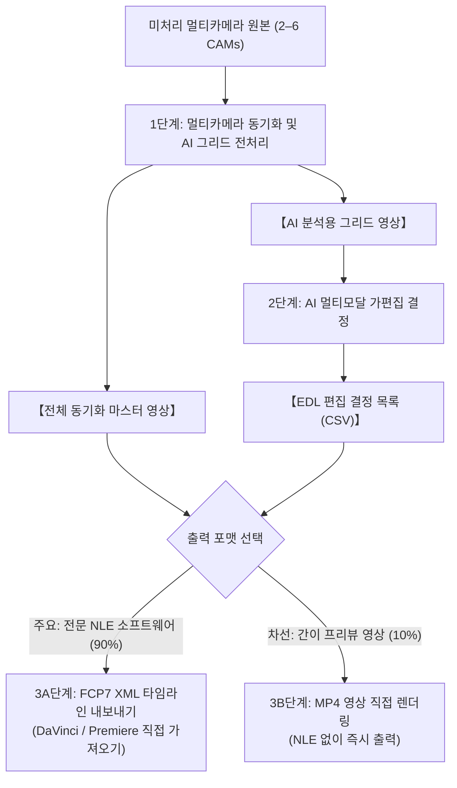

# 멀티카메라 영상 파이프라인 및 AI 편집 스위트 (Multicam Video Pipeline & AI Editing Suite)

[English (en)](README.md) | [繁體中文 (zh-TW)](README.zh-TW.md) | [简体中文 (zh-CN)](README.zh-CN.md) | [日本語 (ja)](README.ja.md) | [한국어 (ko)](README.ko.md)

---

> [!NOTE]
> **🚀 설계 환경 및 플랫폼 호환성 안내 (Platform Support & Compatibility)**  
> - **실측 검증 환경**: 본 툴킷은 **Google Antigravity 2.0** 및 **Gemini 3.7 Flash (Thinking: Medium)** 환경을 기반으로 최적화 설계 및 엔드투엔드 검증을 마쳤습니다.  
> - **크로스 플랫폼 지원**: **[Agent Plugins 1.0 표준 규격](https://agent-plugins.org/specification)**에 맞춰 패키징되어 규격을 준수하는 에이전트 클라이언트(**OpenAI Codex 데스크톱** 등)에서도 설치할 수 있습니다. 타 플랫폼에 대한 전수 테스트는 아직 진행 중이므로 커뮤니티의 테스트 및 피드백을 적극 환영합니다!  
> - **컨텍스트 윈도우 및 분할 주의사항**: 다른 멀티모달 모델을 선택할 경우 해당 모델의 **컨텍스트 윈도우(Context Window) 크기**를 반드시 확인하고, 필요에 따라 Step 1의 챕터 분할 시간 파라미터(`--split-min-dur`, `--split-max-dur`, 기본값: 30–40분)를 적절히 조절해 주세요.

---

대규모 멀티모달 AI 모델(Gemini 3.7 Flash 1M 컨텍스트 윈도우) 및 전문 NLE(DaVinci Resolve, Adobe Premiere Pro, Final Cut Pro)에 최적화된 고성능 모듈형 멀티카메라 영상 처리 파이프라인 및 AI 편집 툴킷입니다.

---

## 📦 설치 및 도입 가이드 (Installation & Setup)

Antigravity Skill 표준 규격을 준수하며, Antigravity 스킬 디렉터리로 바로 복제하여 사용할 수 있습니다:

```bash
git clone https://github.com/sylphlin/multicam-video-preprocessing.git ~/.gemini/config/skills/multicam-video-preprocessing
```

### 📁 디렉토리 구조 (Agent Plugins 1.0 & Antigravity 동시 호환)
```text
multicam-video-preprocessing/
├── plugin.json                    # ⭐ Agent Plugins 1.0 매니페스트 (Codex 등 클라이언트 지원)
├── SKILL.md                       # Antigravity 스킬 규격 및 분기 판단 규칙
├── skills/
│   └── multicam-video-preprocessing/
│       └── SKILL.md               # ⭐ Agent Plugins 1.0 표준 스킬 정의 (Codex 탐색용)
├── assets/                        # 프롬프트 에셋 (Prompt Assets)
│   ├── edl_interview_template.md  # 2대 카메라 인터뷰 프롬프트 템플릿
│   └── subtitle_proofread_template.md # YouTube 자막 고품질 교정 템플릿
├── scripts/                       # 실행 스크립트 및 처리 모듈
│   ├── multicam_pipeline.py       # Step 1: 오디오 동기화, EBU R128, 챕터 분할, 그리드 합성
│   ├── generate_edl.py            # Step 2: 멀티모달 AI 가편집 결정 생성
│   ├── export_fcp7_xml.py         # Step 3A: FCP7 XML 타임라인 내보내기 (⭐ 주요 경로)
│   ├── edl_to_video.py            # Step 3B: 하드웨어 가속 직접 영상 렌더링 (🎬 차선 경로)
│   ├── concat_videos.py           # Step 3B: 전체 무손실 스트림 결합 (🎬 차선 경로)
│   ├── generate_subtitles.py      # Step 4: YouTube 자막 생성 (Whisper+Gemini 교정)
│   └── modules/                   # 내부 영상/오디오 핵심 알고리즘
└── README.md
```

---

## 🌟 엔드투엔드 전체 워크플로우



---

## 💬 사용 시나리오 및 대화형 프롬프트 예시

Antigravity 채팅창에서 자연어로 요청하기만 하면 Agent가 백엔드 모듈을 자동 호출하여 처리합니다:

### 시나리오 1: 편집용 XML 내보내기 (전문가 워크플로우 ⭐ 추천)
- **적용 대상**: 가편집 결과를 DaVinci Resolve, Adobe Premiere Pro 또는 Final Cut Pro로 가져와 후속 색보정 및 오디오 믹싱을 진행할 때.
- **프롬프트 예시**:
  > "*2대의 멀티카메라 인터뷰 영상 `CAM1.mp4`와 `CAM2.mp4`가 있습니다. 타임코드 동기화와 음량 표준화를 진행하고 인터뷰 편집 규칙을 적용하여 DaVinci Resolve로 바로 가져갈 수 있는 XML 타임라인을 생성해 주세요.*"
- **산출물**:
  1. `final_cut_full.xml` (98개 이상의 컷과 컬러 사유 마커가 포함된 단일 시퀀스 타임라인)
  2. `CAM1_synced.mp4`, `CAM2_synced.mp4` (완벽 동기화 및 -14 LUFS 표준화 마스터)
- **DaVinci Resolve 가져오기 3단계**:
  1. DaVinci Resolve를 열고 새 프로젝트를 생성합니다.
  2. `CAM1_synced.mp4`와 `CAM2_synced.mp4`를 **미디어 풀**로 드래그합니다.
  3. **파일 $\rightarrow$ 가져오기 $\rightarrow$ 타임라인...** (`Cmd + Shift + I`)을 클릭하여 `final_cut_full.xml`을 선택합니다!

---

### 시나리오 2: 영상 직접 출력 (간이 프리뷰 워크플로우 🎬)
- **적용 대상**: 편집 워크스테이션을 사용할 수 없거나 클라이언트에게 편집 템포를 빠르게 검토받아야 할 때.
- **프롬프트 예시**:
  > "*이 멀티카메라 영상들을 AI 가편집하여 합본 MP4 프리뷰 영상으로 직접 렌더링해 주세요.*"
- **산출물**:
  1. `final_cut_full.mp4` (전체 결합 완성 영상)

---

## 🔍 각 단계별 상세 실행 내용

### 1단계: 멀티카메라 동기화 및 AI 그리드 전처리 (`multicam_pipeline.py`)
1. **전체 구간 8kHz FFT 오디오 타임라인 동기화**:
   - 8kHz 다운샘플링 상호상관 연산으로 카메라 간 물리적 시간 오차 $\Delta t$를 수 초 만에 밀리초 단위로 산출.
2. **EBU R128 (-14 LUFS) 방송 표준 음량 표준화**:
   - 2-Pass 필터링으로 모든 트랙을 -14.0 LUFS, 11.0 LRA, -1.5 dBTP 표준 음량으로 일괄 보정.
3. **30–40분 자연스러운 멈춤 감지 챕터 분할 (Auto-Split)**:
   - 음성 에너지 최소 지점과 호흡 멈춤을 자동 감지하여 무손실 스트림 분할.
4. **전체 동기화 마스터 영상 출력 (`*_synced.mp4`)**:
   - NLE 타임라인이 직접 참조할 전체 길이 동기화 마스터 파일 즉시 생성.
5. **2–6대 카메라 멀티인원 컴팩트 화면 합성**:
   - 전체 $\le 1080P$, 대당 $\ge 640 \times 480$ 화질을 보장하며 멀티모달 **토큰 소모를 50%–83% 대폭 절감**.

---

### 2단계: Gemini AI 멀티모달 가편집 결정 (`generate_edl.py`)
1. **프롬프트 에셋 로드**: `assets/edl_interview_template.md` 템플릿 적용.
2. **Phase 0: 도입부/말미 무효 구간 트리밍**:
   - 촬영 시작 전 테스트 발성 및 준비 구간 제외 (`Global_Start_Time`);
   - 인터뷰 종료 후 잡담 및 마이크 탈거 등 미종료 구간 완전 절제 (`Global_End_Time`).
3. **Phase 1–4: 의미 구조 기반 컷 전환**:
   - 발화자를 음성 주도로 추적하여 어절 경계에 컷 포인트 정렬.
   - 듣는 이의 2–3초 리액션 샷(웃음, 끄덕임) 삽입.
   - 단일 컷 $\ge 2.5\text{s}$ 제한으로 깜빡임 방지.

---

### 3A단계 (주요 경로): FCP7 XML 타임라인 내보내기 (`export_fcp7_xml.py`)
1. **다중 챕터 타임코드 연속 누적**: 여러 Part를 하나의 연속 시퀀스로 매핑.
2. **1:1 타임코드 완벽 일치 (`start == in`)**: NLE에서 슬립/슬라이드 트리밍 완벽 지원.
3. **마스터 오디오 트랙 및 사유 마커 주입**: CAM1 주 오디오 연속 배치 및 AI 편집 사유를 컬러 마커로 주입.

---

### 3B단계 (차선 경로): 직접 렌더링 및 무손실 결합 (`edl_to_video.py` & `concat_videos.py`)
1. **하드웨어 가속 렌더링**: Apple Silicon `h264_videotoolbox` 기반 고속 렌더링.
2. **초고속 무손실 스트림 결합**: `-c copy` 방식으로 초당 수백 프레임 속도로 결합.


---

### 4단계: YouTube 고품질 자막 생성 (`generate_subtitles.py` ⭐ 신규)

본 툴킷은 **Whisper 음향 정렬 + Gemini 문맥 교정**의 2단계 황금 파이프라인(Two-Stage Pipeline)을 적용하여, 기존 AI 자막의 고질적 문제인 '타임스탬프 불일치'와 '동음이의어 오탈자'를 완벽히 해결합니다:

#### 🌟 왜 "Whisper + Gemini"가 최적의 표준인가? (핵심 장점)

| 비교 항목 | Whisper 단독 | Gemini 음성 ASR 단독 | Whisper + Gemini 2단계 결합 (⭐ 유일 표준) |
| :--- | :--- | :--- | :--- |
| **타임코드 정밀도** | ⭐⭐⭐ **밀리초 단위 완벽 정밀** | ⚠️ **타임스탬프가 거칠고 밀림** | ⭐⭐⭐ **밀리초 단위 정밀** (Whisper 시간축 100% 계승) |
| **동음이의어/오탈자 교정** | ❌ **동음이의어 오탈자 다수** | ⭐⭐⭐ **문맥 파악력 우수** | ⭐⭐⭐ **99%+ 정확도** (전문 용어, 인명 완벽 교정) |
| **자막 가독성 및 호흡** | ⭐⭐⭐ **YouTube 황금 단문 (1.2–2.5초)** | ❌ **한 문장이 너무 김 (6–8초)** | ⭐⭐⭐ **황금 호흡 (문장당 8–16자, 입모양과 완벽 일치)** |
| **발언 충실도** | ⭐⭐⭐ **100% 발언 그대로 전사** | ⚠️ **자의적 요약/의역 가능성** | ⭐⭐⭐ **실제 발언 충실도 보존 + 오탈자만 교정** |
| **연산 비용 (Token)** | ⚡ **매우 낮음** (로컬 CPU 2.5분 무료) | 💰 **높음** (대용량 Audio Token 소비) | ⚡ **매우 낮음** (음성은 로컬 처리, Gemini는 텍스트만 교정) |

#### 🔄 엔드투엔드 자막 제작 절차:
1. **오디오 추출**: FFmpeg를 통해 완성 영상에서 16kHz 모노 WAV 오디오를 추출.
2. **1단계 (Whisper 음향 정렬)**: 로컬 `faster-whisper`로 밀리초 정밀 타임스탬프(`00:01:23,450 --> 00:01:26,800`)가 포함된 기준 SRT 생성.
3. **2단계 (Gemini 문맥 교정)**: `assets/subtitle_proofread_template.md`를 적용하여 **타임스탬프를 100% 변경하지 않고 고정한 상태에서** 문맥상 오탈자와 전문 용어(`Kelly Tsai`, `YouTube`, `DaVinci Resolve`, `Buffet` 등)를 자동 교정.
4. **이중 표준 포맷 산출물**:
   - **`final_cut_full.srt`**: YouTube 공식 표준 SubRip 자막.
   - **`final_cut_full.vtt`**: 웹 플레이어용 WebVTT 자막.
   - **`final_cut_full_raw_whisper.srt`**: 디버깅용 기준 전사본 보존.