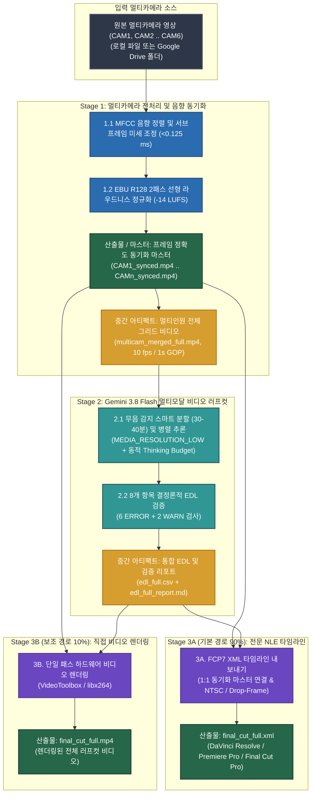

# Multi-Camera Video Pipeline & AI Editing Suite

[English (en)](README.md) | [繁體中文 (zh-TW)](README.zh-TW.md) | [简体中文 (zh-CN)](README.zh-CN.md) | [日本語 (ja)](README.ja.md) | [한국어 (ko)](README.ko.md)

---

> [!IMPORTANT]
> **Google Antigravity 네이티브 플러그인 및 워크플로 스위트**  
> 본 툴킷은 **Google Antigravity**(**Vertex AI Gemini 3.8 Flash** 기반) 및 전문 NLE 소프트웨어(**DaVinci Resolve**, **Adobe Premiere Pro**, **Final Cut Pro**)를 위한 3단계 멀티카메라 전처리 및 AI 러프컷 스위트입니다.

---

**Multi-Camera Video Pipeline & AI Editing Suite**는 2~6대 카메라 음향 동기화, 방송 표준 라우드니스 정규화, AI 러프컷 타임라인 생성 및 멀티카메라 프리뷰 비디오 렌더링을 수행합니다. Antigravity 채팅 창에서 자연어로 지시하면 멀티카메라 동기화부터 러프컷 생성까지 전체 워크플로를 자동으로 수행합니다.

---

## 설치 및 Google Cloud 설정 (`setup.sh`)

본 프로젝트는 [Agent Plugins 1.0](https://agent-plugins.org/) 표준을 준수하며 **Google Cloud Vertex AI (ADC)** 및 **Cloud Storage (GCS)** 기반으로 동작합니다.

```bash
# 1a. 글로벌 Antigravity Plugin으로 클론 (권장)
git clone https://github.com/sylphlin/multicam-video-preprocessing.git ~/.gemini/config/plugins/multicam-video-preprocessing

# 1b. 레거시 단일 Skill 디렉터리 설치 (선택 사항: 내부 skills/multicam-video-preprocessing 심볼릭 링크 연결)
ln -s ~/.gemini/config/plugins/multicam-video-preprocessing/skills/multicam-video-preprocessing ~/.gemini/config/skills/multicam-video-preprocessing

# 2. 의존성 설치 및 ADC 인증
brew install ffmpeg
pip install numpy google-genai google-cloud-storage requests
gcloud auth application-default login

# 3. setup.sh 실행하여 GCS 버킷, 2단계 수명 주기(raw: 2일, 결과물: 15일), IAM 및 .env 설정
chmod +x setup.sh
./setup.sh --project YOUR_GCP_PROJECT_ID
```

### 디렉터리 구조 (Agent Plugins 1.0 표준)
- **SSOT 실제 디렉터리**: `skills/multicam-video-preprocessing/`(`SKILL.md`, `scripts/`, `assets/` 포함)를 단일 진실 공급원(SSOT)으로 사용합니다.
- **2계층 `AGENTS.md` 구성**: 루트 `AGENTS.md`는 워크스페이스 및 개발 표준(Part I & Part II)을 정의하고, 플러그인 내부의 `rules/AGENTS.md`는 AI 클라이언트 실행 규칙(`<PLUGIN_ROOT>` 직접 CLI 호출, 읽기 전용, Fail-Fast)을 정의합니다.

---

## 3단계 엔드투엔드 워크플로 아키텍처


```mermaid
flowchart TD
    classDef inputStyle fill:#2D3748,stroke:#4A5568,stroke-width:2px,color:#fff;
    classDef stage1Style fill:#2B6CB0,stroke:#2C5282,stroke-width:2px,color:#fff;
    classDef stage2Style fill:#319795,stroke:#285E61,stroke-width:2px,color:#fff;
    classDef stage3Style fill:#6B46C1,stroke:#553C9A,stroke-width:2px,color:#fff;
    classDef artifactStyle fill:#D69E2E,stroke:#B7791F,stroke-width:2px,color:#fff;
    classDef outputStyle fill:#276749,stroke:#1C4532,stroke-width:2px,color:#fff;

    subgraph Inputs["입력 멀티카메라 소스"]
        A["원본 멀티카메라 영상 (CAM1, CAM2 .. CAM6)<br/>(로컬 파일 또는 Google Drive 폴더)"]:::inputStyle
    end

    subgraph S1["Stage 1: 멀티카메라 전처리 및 음향 동기화"]
        S1_1["1.1 MFCC 음향 정렬 및 서브프레임 미세 조정 (<0.125 ms)"]:::stage1Style
        S1_2["1.2 EBU R128 2패스 선형 라우드니스 정규화 (-14 LUFS)"]:::stage1Style
        S1_3["산출물 / 마스터: 프레임 정확도 동기화 마스터<br/>(CAM1_synced.mp4 .. CAMn_synced.mp4)"]:::outputStyle
        S1_4["중간 아티팩트: 멀티인원 전체 그리드 비디오<br/>(multicam_merged_full.mp4, 10 fps / 1s GOP)"]:::artifactStyle
        S1_1 --> S1_2
        S1_2 --> S1_3
        S1_3 --> S1_4
    end

    subgraph S2["Stage 2: Gemini 3.8 Flash 멀티모달 비디오 러프컷"]
        S2_1["2.1 무음 감지 스마트 분할 (30-40분) 및 병렬 추론<br/>(MEDIA_RESOLUTION_LOW + 동적 Thinking Budget)"]:::stage2Style
        S2_2["2.2 8개 항목 결정론적 EDL 검증<br/>(6 ERROR + 2 WARN 검사)"]:::stage2Style
        EDL["중간 아티팩트: 통합 EDL 및 검증 리포트<br/>(edl_full.csv + edl_full_report.md)"]:::artifactStyle
        S2_1 --> S2_2
        S2_2 --> EDL
    end

    subgraph S3A["Stage 3A (기본 경로 90%): 전문 NLE 타임라인"]
        S3A_ACT["3A. FCP7 XML 타임라인 내보내기<br/>(1:1 동기화 마스터 연결 & NTSC / Drop-Frame)"]:::stage3Style
        XML["산출물: final_cut_full.xml<br/>(DaVinci Resolve / Premiere Pro / Final Cut Pro)"]:::outputStyle
        S3A_ACT --> XML
    end

    subgraph S3B["Stage 3B (보조 경로 10%): 직접 비디오 렌더링"]
        S3B_ACT["3B. 단일 패스 하드웨어 비디오 렌더링<br/>(VideoToolbox / libx264)"]:::stage3Style
        MP4["산출물: final_cut_full.mp4<br/>(렌더링된 전체 러프컷 비디오)"]:::outputStyle
        S3B_ACT --> MP4
    end

    A --> S1_1
    S1_4 --> S2_1
    S1_3 --> S3A_ACT
    EDL --> S3A_ACT
    S1_3 --> S3B_ACT
    EDL --> S3B_ACT
```

---

## Antigravity 사용 방법 및 시나리오 (Usage & Scenarios)

Antigravity에서는 다음 두 가지 방식으로 실행할 수 있습니다:
1. **간결한 명령어 (`/skill` + `@파일`)**: `/multicam-video-preprocessing`을 선택하고 `@`로 카메라 영상 파일이나 Google Drive 폴더 링크만 지정하면 즉시 실행됩니다.
2. **자연어 프롬프트**: 일상적인 문장으로 요청 사항을 입력하고 `@` 파일이나 클라우드 링크를 첨부하면 자동으로 플러그인이 호출됩니다.

### 시나리오 1: 전문 NLE용 FCP7 XML 타임라인 내보내기 (권장 기본 워크플로)
- **사용 사례**: AI 러프컷 카메라 전환 결정을 DaVinci Resolve, Adobe Premiere Pro 또는 Final Cut Pro로 가져와 정밀 편집 및 색보정을 수행합니다.
- **방식 A (`/ + @` 간결한 명령어)**:
  ```text
  /multicam-video-preprocessing 카메라1: @CAM1.mp4, 카메라2: @CAM2.mp4
  ```
- **방식 B (자연어 프롬프트)**:
  ```text
  @CAM1.mp4와 @CAM2.mp4를 동기화하고 라우드니스를 -14 LUFS로 정규화한 뒤, DaVinci Resolve용 FCP7 XML 러프컷 타임라인을 내보내 줘.
  ```
- **산출물**:
  1. `final_cut_full.xml` (카메라 전환 지점 및 편집 사유 마커가 포함된 타임라인).
  2. `CAM1_synced.mp4`, `CAM2_synced.mp4` (시간 정렬 및 `-14 LUFS` 정규화가 완료된 카메라 마스터).

### 시나리오 2: 멀티카메라 러프컷 비디오 직접 렌더링
- **사용 사례**: NLE 소프트웨어를 열지 않고 카메라 전환이 완료된 MP4 프리뷰 비디오를 직접 렌더링합니다.
- **방식 A (`/ + @` 간결한 명령어)**:
  ```text
  /multicam-video-preprocessing 카메라1: @CAM1.mp4, 카메라2: @CAM2.mp4, 출력: MP4 직접 렌더링
  ```
- **방식 B (자연어 프롬프트)**:
  ```text
  @CAM1.mp4와 @CAM2.mp4를 멀티카메라 AI 러프컷하고 final_cut_full.mp4로 직접 렌더링해 줘.
  ```
- **산출물**:
  1. `final_cut_full.mp4` (단일 패스 하드웨어 가속으로 렌더링된 전체 비디오).
  2. `edl_full.csv` 및 `edl_full_report.md` (카메라 전환 결정표 및 8개 항목 검증 리포트).

### 시나리오 3: Google Drive 폴더에서 멀티카메라 동기화 및 러프컷 수행
- **사용 사례**: 멀티카메라 원본이 저장된 Google Drive 폴더 링크를 전달하여 원격 MD5 캐시 검증과 함께 동기화 및 타임라인 생성을 자동으로 수행합니다.
- **방식 A (`/ + @` 간결한 명령어)**:
  ```text
  /multicam-video-preprocessing 폴더: https://drive.google.com/drive/folders/FOLDER_ID
  ```
- **방식 B (자연어 프롬프트)**:
  ```text
  Google Drive 폴더 https://drive.google.com/drive/folders/FOLDER_ID 의 멀티카메라 영상을 다운로드하여 오디오 동기화 및 -14 LUFS 정규화를 수행하고 FCP7 XML 타임라인을 생성해 줘.
  ```
- **산출물**:
  1. `CAM1_synced.mp4` .. `CAMn_synced.mp4` (동기화 및 라우드니스 정규화 마스터).
  2. `edl_full.csv`, `edl_full_report.md`, `final_cut_full.xml`.

---

## 3단계 핵심 기술 개요

1. **Stage 1 (멀티카메라 동기화 및 전처리)**: MFCC 음향 정렬 및 서브프레임 미세 조정(`<0.125 ms`), EBU R128(`-14 LUFS`) 2패스 선형 라우드니스 정규화, 프레임 정확도 동기화 마스터 출력(`CAM*_synced.mp4`, `20 Mbps`), 경량 전체 그리드 합성(`multicam_merged_full.mp4`, `10 fps`, `1.2 Mbps`, 1초 GOP)을 수행합니다.
2. **Stage 2 (Gemini 3.8 Flash 멀티모달 러프컷 및 무음 감지 스마트 분할)**: 기본으로 **Vertex AI Gemini 3.8 Flash** 표준 멀티모달 모드(`MEDIA_RESOLUTION_LOW` + 동적 `thinking_budget` `1024–4096`)를 사용합니다. 40분을 초과하는 영상은 30~40분 자연 무음 구간에서 `<output_dir>/_edl_chunks/`로 무손실 분할하여 병렬 추론하고 `edl_full.csv`로 병합한 뒤, `finally` 블록에서 로컬 및 GCS 임시 청크를 자동 삭제하며 8개 항목의 결정론적 EDL 검증(`6 ERROR + 2 WARN`)을 수행합니다.
3. **Stage 3A & 3B (FCP7 XML 타임라인 내보내기 / 단일 패스 비디오 렌더링)**: NTSC 소수점 프레임 레이트(`23.976`, `29.97`, `59.94`) 및 드롭 프레임(Drop-Frame)을 지원하는 `final_cut_full.xml`을 내보내거나 `final_cut_full.mp4`를 직접 렌더링합니다.

---

## GCS 2단계 수명 주기 정책 (`gs://multicam-video-${PROJECT_ID}`)

| GCS 경로 접두사 (`matchesPrefix`) | 저장 객체 | 보관 기간 (`age`) | 정리 방식 |
| :--- | :--- | :--- | :--- |
| **`raw/`** | 스테이징된 그리드 비디오 (`multicam_merged_full.mp4`) 및 임시 청크 (`raw/edl_chunks/*`) | **2일 (`age: 2`)** | `raw/edl_chunks/*`는 추론 직후 `finally` 블록에서 즉시 삭제되며, 전체 그리드 비디오는 SHA-256 캐시 재사용을 위해 2일간 보관 후 자동 삭제합니다. |
| **`output/`**, **`deliverables/`**, **`multicam_assets/`** | XML/CSV 타임라인, 렌더링 비디오 및 검증 리포트 | **15일 (`age: 15`)** | 팀 검토를 위해 15일간 보관한 후 자동 삭제합니다. |

---

## 라이선스 (License)

이 프로젝트는 [MIT License](LICENSE)에 따라 라이선스가 부여됩니다.
