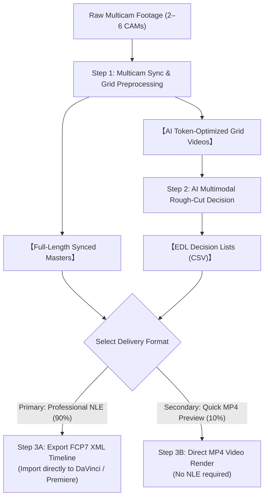

# Multi-Camera Video Pipeline & AI Editing Suite

[English (en)](README.md) | [繁體中文 (zh-TW)](README.zh-TW.md) | [简体中文 (zh-CN)](README.zh-CN.md) | [日本語 (ja)](README.ja.md) | [한국어 (ko)](README.ko.md)

---

> [!NOTE]
> **🚀 Platform Support & Model Compatibility Notice**  
> - **Verified Environment**: This suite was primarily engineered and end-to-end verified using **Google Antigravity 2.0** powered by **Gemini 3.7 Flash (Thinking: Medium)**.  
> - **Cross-Platform & Agent Plugins**: Packaged according to the **[Agent Plugins 1.0 Specification](https://agent-plugins.org/specification)**, allowing conformant clients (such as **OpenAI Codex Desktop**) to discover and install it. As third-party platforms have not been exhaustively tested, community testing and feedback/PRs are warmly welcomed!  
> - **Context Window & Split Duration**: When using alternative multimodal models, ensure you verify their **Context Window capacity** and adjust the Step 1 chapter split duration parameters accordingly (`--split-min-dur` and `--split-max-dur`, default: 30 to 40 minutes).

---

Modular, high-performance multi-camera video processing pipeline and AI rough-cut suite optimized for large multimodal models (Gemini 3.7 Flash with 1M Token Context) and professional NLE editing software (DaVinci Resolve, Adobe Premiere Pro, Final Cut Pro).

---

## 📦 Installation & Setup

This repository adheres strictly to the Antigravity Skill specification and can be cloned directly into your Antigravity skills directory:

```bash
git clone https://github.com/sylphlin/multicam-video-preprocessing.git ~/.gemini/config/skills/multicam-video-preprocessing
```

### 📁 Directory Structure (Agent Plugins 1.0 & Antigravity Dual-Compatible)
```text
multicam-video-preprocessing/
├── plugin.json                    # ⭐ Agent Plugins 1.0 Manifest (for Codex & Agent Plugin clients)
├── SKILL.md                       # Antigravity skill specification & decision rules
├── skills/
│   └── multicam-video-preprocessing/
│       └── SKILL.md               # ⭐ Agent Plugins 1.0 standard skill entrypoint (for Codex)
├── assets/                        # Prompt assets
│   └── edl_interview_template.md  # Dual-camera interview prompt template
├── scripts/                       # Executable CLI scripts & processing modules
│   ├── multicam_pipeline.py       # Step 1: Time sync, EBU R128, auto-split, synced masters, grid merge
│   ├── generate_edl.py            # Step 2: Multimodal AI rough-cut decision generation
│   ├── export_fcp7_xml.py         # Step 3A: FCP7 XML timeline export (⭐ Primary Path)
│   ├── edl_to_video.py            # Step 3B: Hardware-accelerated direct video render (🎬 Secondary)
│   ├── concat_videos.py           # Step 3B: Full episode lossless concat (🎬 Secondary)
│   └── modules/                   # Internal audiovisual algorithms
└── README.md
```

---

## 🌟 Full End-to-End Workflow Diagram



---

## 💬 Usage Scenarios & Conversational Prompts

In the Antigravity chat interface, users simply express their requirements in natural language, and the Agent automatically orchestrates the underlying modules:

### Scenario 1: Export NLE XML Timeline (Professional Workflow ⭐ Recommended)
- **Use Case**: Need to import the rough cut into DaVinci Resolve, Adobe Premiere Pro, or Final Cut Pro for color grading, audio mastering, and fine trimming.
- **Example Prompt**:
  > "*I have two multi-camera interview video files `CAM1.mp4` and `CAM2.mp4`. Please synchronize their timecodes, normalize audio loudness, and apply the interview editing rules to produce an XML timeline ready for DaVinci Resolve.*"
- **Delivered Outputs**:
  1. `final_cut_full.xml` (Unified sequence timeline with 98+ cuts and color-coded rule markers)
  2. `CAM1_synced.mp4`, `CAM2_synced.mp4` (Synchronized master files at -14 LUFS)
- **DaVinci Resolve 3-Step Import**:
  1. Open DaVinci Resolve and create a new project.
  2. Drag `CAM1_synced.mp4` and `CAM2_synced.mp4` into the **Media Pool**.
  3. Click **File $\rightarrow$ Import $\rightarrow$ Timeline...** (`Cmd + Shift + I`), select `final_cut_full.xml`, and the timeline is instantly assembled!

---

### Scenario 2: Direct Video Rendering (Quick Preview Workflow 🎬)
- **Use Case**: Away from the editing workstation, or need a quick MP4 export to review the edit pacing.
- **Example Prompt**:
  > "*Please perform an automated rough cut on these multi-camera video files and render them directly into a merged MP4 preview video for me.*"
- **Delivered Outputs**:
  1. `final_cut_full.mp4` (Full episode assembled preview video)

---

## 🔍 Detailed Pipeline Steps

### Step 1: Multicam Synchronization & Preprocessing (`multicam_pipeline.py`)
1. **Global 8kHz FFT Audio Time Alignment**:
   - Extracts and downsamples audio tracks to 8kHz mono, applying Cross-Correlation to compute millisecond-accurate physical time offsets $\Delta t$ across all cameras.
2. **EBU R128 (-14 LUFS) Broadcast Loudness Normalization**:
   - Two-pass loudness analysis and filtering to normalize all audio tracks to standard broadcast levels (-14.0 LUFS, 11.0 LRA, -1.5 dBTP).
3. **30–40 min Natural Pause Chapter Splitting (Auto-Split)**:
   - Detects speech energy minima and natural breath pauses within 30–40 min windows, perfectly sizing media for 1M Token Context AI models.
4. **Full-Length Synchronized Camera Masters Export (`*_synced.mp4`)**:
   - Produces clean full-length aligned master files for direct reference by the NLE timeline.
5. **2–6 Camera Multi-in-One Grid Composition**:
   - Combines multi-camera angles into a single canvas (<= 1080P, >= 640x480/CAM), reducing AI multimodal **token consumption by 50%–83%**.

---

### Step 2: Gemini Multimodal AI Rough-Cut Decision (`generate_edl.py`)
1. **Prompt Asset Ingestion**:
   - Loads editing rules from `assets/edl_interview_template.md`.
2. **Phase 0: Pre/Post-roll Trimming**:
   - Identifies and excludes invalid pre-roll setup footage (`Global_Start_Time`) and post-roll chatter/chores (`Global_End_Time`).
3. **Phase 1–4: Audio-Visual Semantic Editing**:
   - **Speaker Tracking**: Audio-first tracking to lock active speakers and align cut points with speech boundaries.
   - **Reaction Shots**: Selectively inserts 2–3s listener reaction shots (smiles, nods, chuckles) while filtering short interruptions.
   - **Anti-Glitch Pacing**: Enforces minimum cut length $\ge 2.5\text{s}$ to prevent visual flicker.
4. **Structured Decision Outputs**:
   - Generates standard CSV tables (`edl_part*.csv`) and Markdown calibration reports (`edl_part*_report.md`).

---

### Step 3A (Primary Path): Export FCP7 XML Sequence Timeline (`export_fcp7_xml.py`)
1. **Multi-Part Timeline Offset Accumulation**:
   - Continuously accumulates cut timestamps across all chapter parts onto a single sequence timeline.
2. **1:1 Timecode Mapping (`start == in`)**:
   - Maintains exact source-to-timeline correspondence, enabling seamless slip/slide ripple trimming in NLEs.
3. **Master Audio Track & Decision Markers**:
   - Generates an uninterrupted CAM1 master audio track and injects color-coded decision Markers with AI reasoning notes.

---

### Step 3B (Secondary Path): Direct Video Rendering & Splicing (`edl_to_video.py` & `concat_videos.py`)
1. **Hardware-Accelerated Segment Rendering**:
   - Uses Apple Silicon `h264_videotoolbox` to render individual chapter cuts (`final_cut_part*.mp4`).
2. **Lossless Stream Concatenation**:
   - Uses FFmpeg stream copy (`-c copy`) to merge parts into the final episode `final_cut_full.mp4` at hundreds of frames per second.
