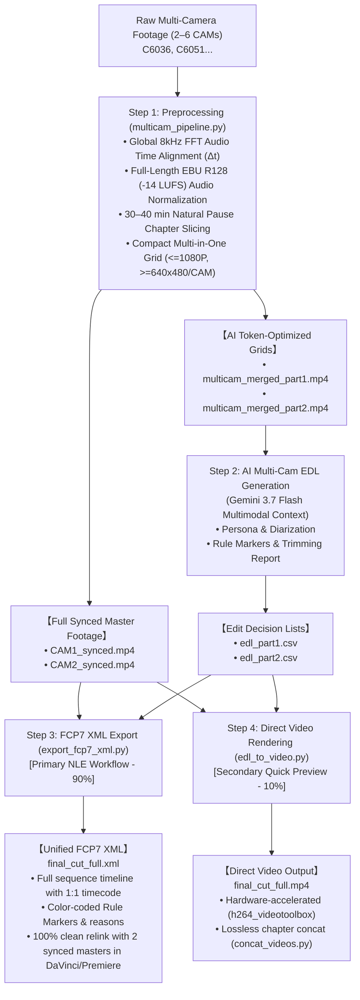

# Multicam Video Preprocessing & AI Editing Suite

[English (en)](README.md) | [繁體中文 (zh-TW)](README.zh-TW.md) | [简体中文 (zh-CN)](README.zh-CN.md) | [日本語 (ja)](README.ja.md) | [한국어 (ko)](README.ko.md)

---

A high-performance, modular multi-camera (2 to 6+ cameras) audio-visual preprocessing and AI editing pipeline designed for Large Multimodal Models (Gemini 3.7 Flash 1M Context Window) and Professional NLEs (DaVinci Resolve, Adobe Premiere Pro, Final Cut Pro).

---

## 🌟 Full End-to-End Workflow



---

## 📁 Clean Output Directory Structure

```text
output/
 ├── multicam_sync.json           # Time sync offsets and chapter segment metadata
 ├── multicam_sync.csv            # Formatted alignment table
 │
 ├── CAM1_synced.mp4              # Full-length synced & EBU R128 (-14 LUFS) master (CAM1)
 ├── CAM2_synced.mp4              # Full-length synced & Δt-aligned master (CAM2)
 │
 ├── multicam_merged_part1.mp4    # Lightweight multi-in-one grid (Part 1, saves 50–83% tokens)
 ├── multicam_merged_part2.mp4    # Lightweight multi-in-one grid (Part 2, saves 50–83% tokens)
 │
 ├── edl_part1.csv                # Gemini AI edit decisions (Part 1)
 ├── edl_part2.csv                # Gemini AI edit decisions (Part 2)
 │
 ├── final_cut_full.xml           # ⭐ [Primary] Unified FCP7 XML timeline for NLE import
 └── final_cut_full.mp4           # 🎬 [Secondary] Direct rendered full video
```

---

## 🛠️ Prerequisites

- **FFmpeg** (with `h264_videotoolbox` and `loudnorm` filter support)
- **Python 3.8+**
- **NumPy** (`pip install numpy`)

---

## 🚀 Step-by-Step CLI Execution Guide

### Step 1: Preprocessing (Sync + Loudness + Split + Multi-in-One)
Runs global time alignment, EBU R128 loudness normalization, chapter segmentation, and exports full synced masters + AI grid videos:

```bash
python3 scripts/multicam_pipeline.py \
  --ref CAM1.mp4 \
  --targets CAM2.mp4 \
  --auto-split \
  --split-min-dur 30 --split-max-dur 40 \
  --normalize \
  --merge \
  --output-dir ./output/
```

### Step 2: Gemini AI Multi-Camera EDL Generation
Directly upload `multicam_merged_part1.mp4` / `multicam_merged_part2.mp4` into Antigravity (Gemini 3.7 Flash context), apply editing prompt rules, and produce `edl_part1.csv` and `edl_part2.csv`.

### Step 3 (Primary): FCP7 XML Timeline Export for DaVinci / Premiere
Generate the unified FCP7 XML timeline file linking seamlessly to `CAM1_synced.mp4` and `CAM2_synced.mp4`:

```bash
python3 scripts/export_fcp7_xml.py \
  -d ./output/ \
  -o ./output/final_cut_full.xml
```

#### 🎬 Importing into DaVinci Resolve:
1. Open DaVinci Resolve and create a new project.
2. Drag `CAM1_synced.mp4` and `CAM2_synced.mp4` into the **Media Pool**.
3. Choose **File $\rightarrow$ Import $\rightarrow$ Timeline...** (`Cmd + Shift + I`) and select `final_cut_full.xml`.
4. The 98+ cuts, synchronized audio, and color-coded rule markers will mount instantly with 0 missing files!

---

### Step 4 (Secondary): Direct CLI Video Rendering & Concatenation
If you prefer an immediate rendered `.mp4` video without opening an NLE:

```bash
# Render part video clips
python3 scripts/edl_to_video.py -e ./output/edl_part1.csv -d ./output/ -o ./output/final_cut_part1.mp4
python3 scripts/edl_to_video.py -e ./output/edl_part2.csv -d ./output/ -o ./output/final_cut_part2.mp4

# Lossless stream-copy concat into full video
python3 scripts/concat_videos.py \
  --inputs ./output/final_cut_part1.mp4 ./output/final_cut_part2.mp4 \
  --output ./output/final_cut_full.mp4
```

---

## ⚙️ CLI Parameter Reference (`multicam_pipeline.py`)

| Parameter | Description | Default |
| :--- | :--- | :--- |
| `--ref` | Reference anchor camera video path (CAM1) | *Required* |
| `--targets` / `--target` | One or more target camera video paths (supports 2 to 6 cameras) | *Required* |
| `--auto-split` | Enable natural pause chapter segmentation (30–40 min) | `False` |
| `--split-min-dur` | Minimum segment duration in minutes | `30.0` |
| `--split-max-dur` | Maximum segment duration in minutes | `40.0` |
| `--merge` / `--multi-in-one` | Render merged multi-in-one grid video (side-by-side/grid) to save tokens for AI models | `False` |
| `--encoder` | Video encoder for rendering (`h264_videotoolbox` / `libx264`) | `h264_videotoolbox` |
| `--normalize` | Enable EBU R128 (-14 LUFS) full-length audio normalization | `False` |
| `--lufs` | Target integrated loudness in LUFS | `-14.0` |
| `--lra` | Target loudness range in LU | `11.0` |
| `--tp` | Maximum true peak limit in dBTP | `-1.5` |
| `--ref-start` | Reference camera manual start time (`HH:MM:SS.mmm` or seconds) | `None` |
| `--ref-end` | Reference camera manual end time (`HH:MM:SS.mmm` or seconds) | `None` |
| `--output-dir` | Output directory for synced masters, sub-clips, and reports | `.` (Current dir) |
| `--suffix` | Filename suffix for synchronized master export | `_synced` |
| `--sr` | Audio sampling rate for FFT alignment in Hz | `8000` |
| `--workers` | Number of parallel worker threads | `2` |
| `--export-json` | Path to export JSON report | `None` |
| `--export-csv` | Path to export CSV report | `None` |
