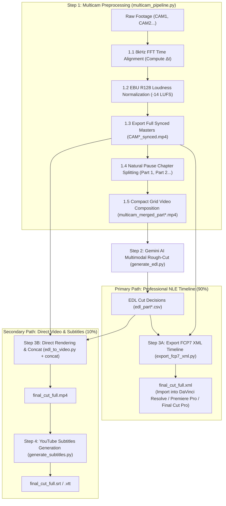

# Multi-Camera Video Pipeline & AI Editing Suite (Antigravity Native)

[English (en)](README.md) | [繁體中文 (zh-TW)](README.zh-TW.md) | [简体中文 (zh-CN)](README.zh-CN.md) | [日本語 (ja)](README.ja.md) | [한국어 (ko)](README.ko.md)

---

> [!IMPORTANT]
> **🚀 Google Antigravity Native Skill & Workflow**  
> This toolkit is an exclusive native skill and workflow suite tailored for the **Google Antigravity Agent Framework (powered by Gemini 3.7 Flash 1M Multimodal Context)** and professional NLE software (DaVinci Resolve, Adobe Premiere Pro, Final Cut Pro).

---

An end-to-end modular multi-camera (2 to 6 cameras) video preprocessing pipeline and AI rough-cut suite packaged with **4-Stage Gated Workflows**. Features 8kHz FFT acoustic time alignment, EBU R128 (-14 LUFS) broadcast loudness normalization, 30-40 min natural pause chapter splitting, token-optimized multi-in-one compact grid composition, Gemini 3.7 Flash multimodal AI rough-cut decisions, FCP7 XML timeline export, and millisecond-accurate YouTube subtitles.

---

## 📦 Antigravity Installation & Structure

Adheres to Antigravity Skill & Workflow standards. Clone directly into your Antigravity skills directory:

```bash
git clone https://github.com/sylphlin/multicam-video-preprocessing.git ~/.gemini/config/skills/multicam-video-preprocessing
```

### 📁 Directory Structure
```text
multicam-video-preprocessing/
├── GEMINI.md                          # Antigravity always-on root workspace rules
├── .agent/
│   ├── rules/
│   │   └── multicam_rules.md          # Always-on execution policies & constraints
│   └── workflows/
│       └── multicam_workflow.md       # Official 4-stage gated execution runbook
├── skills/
│   └── multicam-video-preprocessing/
│       └── SKILL.md                   # Antigravity skill capability manifest
├── assets/                            # Prompt templates
│   ├── edl_interview_template.md      # Gemini multimodal interview rough-cut rules
│   └── subtitle_proofread_template.md # YouTube subtitle proofreading rules
├── scripts/                           # Core execution toolset
│   ├── multicam_pipeline.py           # Step 1: Time sync, loudness norm, pause split, grid merge
│   ├── generate_edl.py                # Step 2: Gemini 3.7 Flash multimodal EDL generation
│   ├── export_fcp7_xml.py             # Step 3A: FCP7 XML timeline export (Primary)
│   ├── edl_to_video.py                # Step 3B: Hardware-accelerated clip cutting (Secondary)
│   ├── concat_videos.py               # Step 3B: Lossless full video concatenation
│   ├── generate_subtitles.py          # Step 4: YouTube subtitles (Whisper + Gemini)
│   └── modules/                       # Core acoustic and video algorithms
└── README.md
```

---

## 🌟 End-to-End Workflow Architecture



---

## 💬 Use Cases & Natural Language Prompts

When interacting with the Antigravity Agent, simply ask in natural language:

### Scenario 1: Export NLE XML Timeline (Professional Workflow ⭐ Recommended)
- **Use Case**: Need to import rough cuts into DaVinci Resolve, Adobe Premiere Pro, or Final Cut Pro for color grading, audio mastering, and fine-tuning.
- **Prompt Example**:
  > *"I have two interview videos `CAM1.mp4` and `CAM2.mp4`. Please synchronize their audio, normalize loudness, and apply the interview rough-cut template to export an XML timeline for DaVinci Resolve."*
- **Deliverables**:
  1. `final_cut_full.xml` (Single unified timeline with all camera cut points and reason markers)
  2. `CAM1_synced.mp4`, `CAM2_synced.mp4` (Time-aligned and -14 LUFS loudness normalized masters)
- **DaVinci Resolve Import Steps**:
  1. Open DaVinci Resolve and create a new project.
  2. Drag `CAM1_synced.mp4` and `CAM2_synced.mp4` into the **Media Pool**.
  3. Go to **File -> Import -> Timeline...** (`Cmd + Shift + I`), and select `final_cut_full.xml`.

---

### Scenario 2: Direct Video Rendering & YouTube Subtitles (Fast Preview 🎬)
- **Use Case**: Quick preview video and YouTube upload-ready subtitles without launching a desktop NLE.
- **Prompt Example**:
  > *"Please rough-cut these multicam videos, render a full MP4 preview video, and generate proofread YouTube subtitles."*
- **Deliverables**:
  1. `final_cut_full.mp4` (Rendered and losslessly concatenated full episode)
  2. `final_cut_full.srt` / `final_cut_full.vtt` (Whisper acoustic timestamps + Gemini proofreading)

---

## 🔍 Detailed Pipeline Steps

### Step 1: Multicam Sync & AI Preprocessing (`multicam_pipeline.py`)

1. **8kHz FFT Audio Time Alignment**:
   - **Why 8kHz Downsampling?**: Human vocal frequencies are concentrated between 300Hz and 3.4kHz. Downsampling to 8kHz retains 100% of vocal acoustic features while reducing memory overhead and accelerating FFT cross-correlation by >10x.
   - **FFT Cross-Correlation**: Converts audio signals from time-domain to frequency-domain to calculate cross-correlation power peaks. Measures exact physical offset $\\Delta t$ (millisecond precision) across all target cameras relative to CAM1 and trims lead/lag offsets.
2. **EBU R128 (-14 LUFS) Loudness Normalization (YouTube Broadcast Standard)**:
   - **YouTube Compliance**: YouTube enforces **-14.0 LUFS** as its target integrated loudness standard. Overly loud audio triggers harsh backend compression, while low audio reduces mobile playback clarity.
   - **Two-Pass Loudnorm Filter**:
     - Pass 1: Measures Integrated Loudness (`I`), Loudness Range (`LRA` = 11.0 LU), and True Peak (`TP` = -1.5 dBTP) via FFmpeg `ebur128`.
     - Pass 2: Applies linear gain normalization via `loudnorm` filter with measured parameters, preventing digital clipping (True Peak Clipping Prevention).
3. **Full Synchronized Masters Export (`*_synced.mp4`)**:
   - Trims and exports full-length aligned, loudness-normalized masters referenced directly by NLE XML timelines.
4. **30–40 min Natural Pause Chapter Splitting (1M Token Context Fit)**:
   - **1M Token Balance**: A 30–40 min multi-in-one grid video consumes ~600k–800k tokens in Gemini 3.7 Flash, reserving ample space for prompt rules, Deep Thinking Chains, and extensive EDL JSON outputs.
   - **Silence & Breathing Pause Detection**: Instead of hard cutting at fixed timestamps, a sliding window scans audio RMS energy to cut at natural pauses, ensuring speaker sentences are never sliced mid-phrase.
5. **2 to 6 Camera Compact Grid Composition**:
   - Automatically arranges angles (Side-by-Side for 2-CAM, $2 \\times 2$ Grid for 3–4 CAM, $3 \\times 2$ Grid for 5–6 CAM) ensuring total canvas $\\le 1920 \\times 1080$ and each CAM $\\ge 640 \\times 480$, saving **50%–83% multimodal tokens**.

---

### Step 2: Gemini AI Multimodal Rough-Cut (`generate_edl.py`)
1. **Prompt Template Assets**:
   - Loads `assets/edl_interview_template.md` containing strict interview cutting rules.
2. **Phase 0: Pre/Post-roll Trimming**:
   - Identifies and trims clapperboards, countdowns, and pre-show mic testing (`Global_Start_Time`).
   - Identifies farewell dialogues and trims post-show casual chatter and environment noise (`Global_End_Time`).
3. **Phase 1–4: Audio-Visual Multimodal Cut Decisions**:
   - **Speaker Tracking**: Follows audio leadership to lock onto the current speaker.
   - **Reaction Shots**: Filters out 1–2s short verbal acknowledgments, switching to 2–3s meaningful listener reaction cuts.
   - **Jump-Cut Prevention**: Enforces minimum single-shot duration $\\ge 2.5\\text{s}$.
4. **Standardized Deliverables**:
   - Generates CSV decision tables (`edl_part*.csv`) and Markdown cutting analysis reports (`edl_part*_report.md`).

---

### Step 3A: Export FCP7 XML Timeline (`export_fcp7_xml.py`)

Outputs industry-standard **Final Cut Pro 7 XML (xmeml version 4)**:
1. **Multi-Part Cross-Chapter Timestamp Accumulation**:
   - Accumulates local part timestamps into a continuous timeline.
2. **1:1 Absolute Timecode Mapping**:
   - Keeps `start == in` and `end == out` on clips, allowing editors full Ripple/Slip/Slide trim freedom in NLEs.
3. **Continuous Master Audio & Decision Markers**:
   - Creates a continuous master audio track.
   - Converts AI cut rules and rationale into red/blue color timeline markers for review.

---

### Step 3B: Direct Video Rendering (`edl_to_video.py` & `concat_videos.py`)
1. **Hardware-Accelerated Clip Cutting**:
   - Uses Apple Silicon `h264_videotoolbox` to render chapter clips (`final_cut_part*.mp4`).
2. **Lossless Concat**:
   - Uses FFmpeg Concat Demuxer (`-c copy`) to merge chapters into full episode `final_cut_full.mp4`.

---

### Step 4: YouTube Subtitles Generation (`generate_subtitles.py`)

Combines **Whisper (Acoustic Alignment)** and **Gemini (Semantic & Glossary Proofreading)**:

#### Why Whisper + Gemini?

| Feature | Pure Whisper | Pure Gemini Audio | Whisper + Gemini |
| :--- | :--- | :--- | :--- |
| **Timestamp Accuracy** | Millisecond precision | Coarse timestamps | Millisecond precision (Whisper timestamps) |
| **Typo/Homophone Fixes** | Prone to phonetic typos | Strong semantic context | Automatic homophone & terminology correction |
| **Subtitle Pacing** | Natural short phrases (1.2–2.5s) | Long paragraphs (6–8s) | YouTube-optimized short phrasing (8–16 words) |
| **Verbatim Fidelity** | High verbatim accuracy | May hallucinate/summarize | Verbatim spoken words preserved with typos fixed |
| **Compute Cost** | Fast local processing | High audio token cost | Fast local audio + minimal text token cost |

#### Execution Flow:
1. **Audio Extraction**: Extracts 16kHz mono WAV audio via FFmpeg.
2. **Phase 1 (Whisper ASR)**: Uses local `faster-whisper` to produce baseline SRT with millisecond timestamps (`00:01:23,450 --> 00:01:26,800`).
3. **Phase 2 (Gemini Semantic Proofreading)**: Uses Gemini 3.7 Flash to fix homophones and terminology while preserving timestamps and line indices.
4. **Outputs**:
   - **`final_cut_full.srt`**: Standard YouTube SubRip subtitles.
   - **`final_cut_full.vtt`**: WebVTT subtitles.
   - **`final_cut_full_raw_whisper.srt`**: Raw Whisper baseline subtitles for reference.

---

## 🛠️ Prerequisites

- **Google Antigravity IDE / Agent Framework**
- **FFmpeg** (with `h264_videotoolbox` hardware encoding and `loudnorm` filter)
- **Python 3.8+**
- **NumPy** (`pip install numpy`)

---

## 🚀 Execution Recipes

### Option A: Professional NLE Editing Workflow (XML Export ⭐ Recommended)

```bash
# 1. Multicam Preprocessing (Sync + EBU R128 + Auto Split + Masters + Grid Merge)
python3 scripts/multicam_pipeline.py \
  --ref CAM1.mp4 --targets CAM2.mp4 \
  --auto-split --split-min-dur 30 --split-max-dur 40 \
  --normalize --merge \
  -o ./output/

# 2. Gemini 3.7 Flash AI Rough-Cut (Run for every part)
python3 scripts/generate_edl.py -v ./output/multicam_merged_part1.mp4
python3 scripts/generate_edl.py -v ./output/multicam_merged_part2.mp4

# 3A. Export FCP7 XML Editing Timeline
python3 scripts/export_fcp7_xml.py -d ./output/ -o ./output/final_cut_full.xml
```

---

### Option B: Direct Video Rendering & YouTube Subtitles (🎬 Fast Preview)

```bash
# 1. Multicam Preprocessing (Same as Option A)
python3 scripts/multicam_pipeline.py \
  --ref CAM1.mp4 --targets CAM2.mp4 \
  --auto-split --normalize --merge -o ./output/

# 2. Gemini AI Rough-Cut (Same as Option A)
python3 scripts/generate_edl.py -v ./output/multicam_merged_part1.mp4
python3 scripts/generate_edl.py -v ./output/multicam_merged_part2.mp4

# 3B. Render Each Chapter Part & Concat
python3 scripts/edl_to_video.py --edl ./output/edl_part1.csv
python3 scripts/edl_to_video.py --edl ./output/edl_part2.csv
python3 scripts/concat_videos.py -d ./output/ -o ./output/final_cut_full.mp4

# 4. Generate YouTube Subtitles (Whisper ASR + Gemini Proofreading)
python3 scripts/generate_subtitles.py -i ./output/final_cut_full.mp4
```

---

## ⚙️ CLI Parameter Reference (`multicam_pipeline.py`)

| Parameter | Description | Default |
| :--- | :--- | :--- |
| `--ref` | Reference anchor camera video path (CAM1) | *Required* |
| `--targets` / `--target` | 1 to 5 target camera paths (supports 2 to 6 cameras) | *Required* |
| `--auto-split` | Enable 30-40 min natural pause chapter segmentation | `False` |
| `--split-min-dur` | Minimum segment duration in minutes | `30.0` |
| `--split-max-dur` | Maximum segment duration in minutes | `40.0` |
| `--merge` / `--multi-in-one` | Render compact multi-in-one grid video (saves 50%-83% tokens) | `False` |
| `--encoder` | Video encoder (`h264_videotoolbox` / `libx264`) | `h264_videotoolbox` |
| `--normalize` | Enable EBU R128 (-14 LUFS) broadcast audio normalization | `False` |
| `-o` / `--output-dir` | Output directory for masters, grid videos, and reports | `.` (current) |
| `--suffix` | Synchronized camera master filename suffix | `_synced` |
