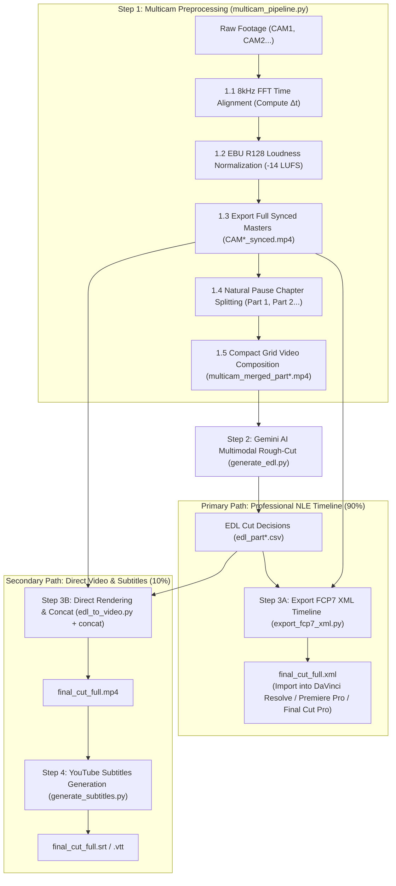

# Multi-Camera Video Pipeline & AI Editing Suite (Antigravity Native)

[English (en)](README.md) | [繁體中文 (zh-TW)](README.zh-TW.md) | [简体中文 (zh-CN)](README.zh-CN.md) | [日本語 (ja)](README.ja.md) | [한국어 (ko)](README.ko.md)

---

> [!IMPORTANT]
> **🚀 Google Antigravity Native Skill & Workflow**  
> This toolkit is an exclusive native skill and workflow suite tailored for the **Google Antigravity Agent Framework (powered by Gemini 3.7 Flash 1M Multimodal Context)** and professional NLE software (DaVinci Resolve, Adobe Premiere Pro, Final Cut Pro).

---

An end-to-end modular multi-camera (2 to 6 cameras) video preprocessing pipeline and AI rough-cut suite packaged with **4-Stage Gated Workflows**. Features 8kHz FFT acoustic time alignment, EBU R128 (-14 LUFS) broadcast loudness normalization, 30-40 min natural pause chapter splitting, token-optimized multi-in-one compact grid composition, Gemini 3.7 Flash multimodal AI rough-cut decisions, FCP7 XML timeline export, and millisecond-accurate YouTube subtitles.

---

## 📦 Antigravity Installation & Structure

Adheres to Antigravity Skill & Workflow standards. Clone directly into your Antigravity skills directory:

```bash
git clone https://github.com/sylphlin/multicam-video-preprocessing.git ~/.gemini/config/skills/multicam-video-preprocessing
```

### 📁 Directory Structure
```text
multicam-video-preprocessing/
├── GEMINI.md                          # Antigravity always-on root workspace rules
├── .agent/
│   ├── rules/
│   │   └── multicam_rules.md          # Always-on execution policies & constraints
│   └── workflows/
│       └── multicam_workflow.md       # Official 4-stage gated execution runbook
├── skills/
│   └── multicam-video-preprocessing/
│       └── SKILL.md                   # Antigravity skill capability manifest
├── assets/                            # Prompt templates
│   ├── edl_interview_template.md      # Gemini multimodal interview rough-cut rules
│   └── subtitle_proofread_template.md # YouTube subtitle proofreading rules
├── scripts/                           # Core execution toolset
│   ├── multicam_pipeline.py           # Step 1: Time sync, loudness norm, pause split, grid merge
│   ├── generate_edl.py                # Step 2: Gemini 3.7 Flash multimodal EDL generation
│   ├── export_fcp7_xml.py             # Step 3A: FCP7 XML timeline export (Primary)
│   ├── edl_to_video.py                # Step 3B: Hardware-accelerated clip cutting (Secondary)
│   ├── concat_videos.py               # Step 3B: Lossless full video concatenation
│   ├── generate_subtitles.py          # Step 4: YouTube subtitles (Whisper + Gemini)
│   └── modules/                       # Core acoustic and video algorithms
└── README.md
```

---

## 🌟 End-to-End Workflow Architecture



---

## 🛠️ Prerequisites

- **Google Antigravity IDE / Agent Framework**
- **FFmpeg** (with `h264_videotoolbox` hardware encoding and `loudnorm` filter)
- **Python 3.8+**
- **NumPy** (`pip install numpy`)

---

## 🚀 Execution Recipes

### Option A: Professional NLE Editing Workflow (XML Export ⭐ Recommended)

```bash
# 1. Multicam Preprocessing (Sync + EBU R128 + Auto Split + Masters + Grid Merge)
python3 scripts/multicam_pipeline.py \
  --ref CAM1.mp4 --targets CAM2.mp4 \
  --auto-split --split-min-dur 30 --split-max-dur 40 \
  --normalize --merge \
  -o ./output/

# 2. Gemini 3.7 Flash AI Rough-Cut (Run for every part)
python3 scripts/generate_edl.py -v ./output/multicam_merged_part1.mp4
python3 scripts/generate_edl.py -v ./output/multicam_merged_part2.mp4

# 3A. Export FCP7 XML Editing Timeline
python3 scripts/export_fcp7_xml.py -d ./output/ -o ./output/final_cut_full.xml
```

#### 🎬 DaVinci Resolve Import Steps:
1. Open DaVinci Resolve and create a new project.
2. Drag `./output/CAM1_synced.mp4` and `./output/CAM2_synced.mp4` into the **Media Pool**.
3. Go to **File -> Import -> Timeline...** (`Ctrl+Shift+I` / `Cmd+Shift+I`), and select `final_cut_full.xml`.
4. All camera cuts, master audio track, and color decision markers will load instantly!

---

### Option B: Direct Video Rendering & YouTube Subtitles (🎬 Fast Preview)

```bash
# 1. Multicam Preprocessing (Same as Option A)
python3 scripts/multicam_pipeline.py \
  --ref CAM1.mp4 --targets CAM2.mp4 \
  --auto-split --normalize --merge -o ./output/

# 2. Gemini AI Rough-Cut (Same as Option A)
python3 scripts/generate_edl.py -v ./output/multicam_merged_part1.mp4
python3 scripts/generate_edl.py -v ./output/multicam_merged_part2.mp4

# 3B. Render Each Chapter Part & Concat
python3 scripts/edl_to_video.py --edl ./output/edl_part1.csv
python3 scripts/edl_to_video.py --edl ./output/edl_part2.csv
python3 scripts/concat_videos.py -d ./output/ -o ./output/final_cut_full.mp4

# 4. Generate YouTube Subtitles (Whisper ASR + Gemini Proofreading)
python3 scripts/generate_subtitles.py -i ./output/final_cut_full.mp4
```

---

## ⚙️ CLI Parameter Reference (`multicam_pipeline.py`)

| Parameter | Description | Default |
| :--- | :--- | :--- |
| `--ref` | Reference anchor camera video path (CAM1) | *Required* |
| `--targets` / `--target` | 1 to 5 target camera paths (supports 2 to 6 cameras) | *Required* |
| `--auto-split` | Enable 30-40 min natural pause chapter segmentation | `False` |
| `--split-min-dur` | Minimum segment duration in minutes | `30.0` |
| `--split-max-dur` | Maximum segment duration in minutes | `40.0` |
| `--merge` / `--multi-in-one` | Render compact multi-in-one grid video (saves 50%-83% tokens) | `False` |
| `--encoder` | Video encoder (`h264_videotoolbox` / `libx264`) | `h264_videotoolbox` |
| `--normalize` | Enable EBU R128 (-14 LUFS) broadcast audio normalization | `False` |
| `-o` / `--output-dir` | Output directory for masters, grid videos, and reports | `.` (current) |
| `--suffix` | Synchronized camera master filename suffix | `_synced` |
