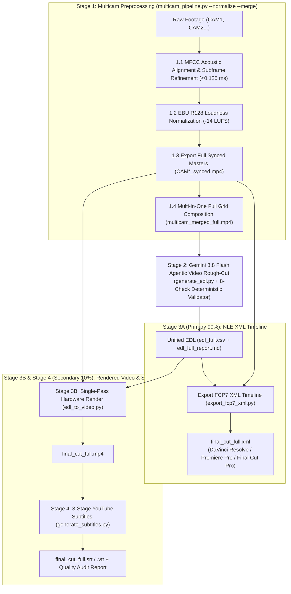

# Multi-Camera Video Pipeline & AI Editing Suite

[English (en)](README.md) | [繁體中文 (zh-TW)](README.zh-TW.md) | [简体中文 (zh-CN)](README.zh-CN.md) | [日本語 (ja)](README.ja.md) | [한국어 (ko)](README.ko.md)

---

> [!IMPORTANT]
> **Google Antigravity Native Plugin & Workflow Suite**  
> This toolkit provides a 4-stage multi-camera preprocessing and AI rough-cut workflow for **Google Antigravity** (powered by **Vertex AI Gemini 3.8 Flash**) and professional NLE systems (**DaVinci Resolve**, **Adobe Premiere Pro**, and **Final Cut Pro**).

---

**Multi-Camera Video Pipeline & AI Editing Suite** synchronizes 2 to 6 camera angles, normalizes broadcast loudness, generates AI rough-cut timelines, and produces YouTube subtitles. Instruct the Antigravity Agent in natural language or run the CLI scripts directly.

---

## Installation & Google Cloud Setup (`setup.sh`)

This project complies with [Agent Plugins 1.0](https://agent-plugins.org/) and runs on **Google Cloud Vertex AI (ADC)** and **Cloud Storage (GCS)** with zero API key files.

### 1. Install as an Antigravity Plugin or Skill

- **Global Plugin (Recommended)**:
  ```bash
  git clone https://github.com/sylphlin/multicam-video-preprocessing.git ~/.gemini/config/plugins/multicam-video-preprocessing
  ```
- **Global Skill**:
  ```bash
  git clone https://github.com/sylphlin/multicam-video-preprocessing.git ~/.gemini/config/skills/multicam-video-preprocessing
  ```

### 2. Install Dependencies and Provision Cloud Resources (`setup.sh`)

```bash
# 1. Install FFmpeg and Python packages
brew install ffmpeg
pip install numpy google-genai google-cloud-storage mlx-whisper requests

# 2. Authenticate Application Default Credentials (ADC)
gcloud auth application-default login

# 3. Provision GCS bucket, two-tier lifecycle rules (raw: 2d, deliverables: 15d), IAM, and .env
chmod +x setup.sh
./setup.sh --project YOUR_GCP_PROJECT_ID
```

### Directory Structure (Agent Plugins 1.0 Specification)
```text
multicam-video-preprocessing/
├── plugin.json                                           # Agent Plugins 1.0 manifest
├── rules/
│   └── AGENTS.md                                         # Packaged client execution invariants (<PLUGIN_ROOT> direct CLI & fail-fast)
├── skills/
│   └── multicam-video-preprocessing/                     # Canonical Skill Bundle (Single Source of Truth)
│       ├── SKILL.md                                      # Antigravity skill manifest and 4-stage gated runbook
│       ├── scripts/                                      # Canonical execution scripts & modules (SSOT)
│       │   ├── multicam_pipeline.py                      # Stage 1: MFCC sync, -14 LUFS norm, synced masters, grid merge
│       │   ├── generate_edl.py                           # Stage 2: Vertex AI Gemini 3.8 Flash Agentic Video EDL generation
│       │   ├── export_fcp7_xml.py                        # Stage 3A: FCP7 XML timeline export (Primary)
│       │   ├── edl_to_video.py                           # Stage 3B: Single-pass hardware video rendering (Secondary)
│       │   ├── generate_subtitles.py                     # Stage 4: 3-stage YouTube subtitle generation
│       │   └── modules/                                  # Acoustic, video, validator, and GCP/Vertex AI modules
│       └── assets/                                       # Canonical prompt templates (SSOT)
│           ├── edl_interview_template.md                 # Gemini multimodal interview rough-cut rules
│           └── subtitle_proofread_template.*.md          # Multi-locale YouTube subtitle proofreading rules
├── scripts -> skills/multicam-video-preprocessing/scripts # Root POSIX symlink for CLI & test compatibility
├── assets -> skills/multicam-video-preprocessing/assets   # Root POSIX symlink for prompt resolution
├── AGENTS.md                                             # Workspace & engineering development rules (Part I & Part II)
├── setup.sh                                              # Native gcloud setup script (GCS, Lifecycle, IAM, .env)
├── .env.example                                          # Vertex AI (ADC) and GCS configuration template
└── tests/                                                # Offline unit test suite (41 tests)
```

---

## End-to-End 4-Stage Workflow Architecture



---

## User Scenarios & Agent Prompts

### Scenario 1: Export NLE XML Timeline (Recommended Primary Workflow)
- **Use Case**: Import AI rough-cut camera decisions into DaVinci Resolve, Adobe Premiere Pro, or Final Cut Pro for fine editing and color grading.
- **Agent Prompt**:
  > *"Synchronize `CAM1.mp4` and `CAM2.mp4`, normalize loudness to -14 LUFS, and export an FCP7 XML rough-cut timeline for DaVinci Resolve."*
- **Deliverables**:
  1. `final_cut_full.xml` (Timeline with camera cut points and reason markers).
  2. `CAM1_synced.mp4`, `CAM2_synced.mp4` (Time-aligned and `-14 LUFS` normalized camera masters).
- **Import into DaVinci Resolve**:
  1. Open DaVinci Resolve and create a new project.
  2. Drag `output/CAM1_synced.mp4` and `output/CAM2_synced.mp4` into the **Media Pool**.
  3. Select **File -> Import -> Timeline...** (`Cmd + Shift + I`) and choose `final_cut_full.xml`.

### Scenario 2: Direct Video Render and YouTube Subtitles
- **Use Case**: Render a finished MP4 preview and proofread YouTube subtitles without opening an NLE.
- **Agent Prompt**:
  > *"Rough-cut these multi-camera videos, render `final_cut_full.mp4`, and generate proofread YouTube subtitles."*
- **Deliverables**:
  1. `final_cut_full.mp4` (Single-pass hardware-rendered full video).
  2. `final_cut_full.srt` and `final_cut_full.vtt` (Whisper word timestamps + Gemini proofreading).

### Scenario 3: Standalone Subtitles for an Existing Video
- **Use Case**: Generate millisecond-accurate, terminology-verified subtitles for an existing video file.
- **Agent Prompt**:
  > *"Generate YouTube subtitles for `output/final_cut_full.mp4` and proofread homophones and technical terms."*
- **Deliverables**:
  1. `final_cut_full.srt` and `final_cut_full.vtt`.
  2. `final_cut_full_subtitle_report.md` and `final_cut_full_subtitle_report.json`.

---

## Detailed Pipeline Stages

### Stage 1: Multicam Synchronization & Preprocessing (`multicam_pipeline.py`)

1. **MFCC Acoustic Alignment & Subframe Refinement (`<0.125 ms`)**:
   - **MFCC Correlation**: Compares Mel-Frequency Cepstral Coefficient envelopes across camera tracks. This reduces FFT memory usage by 97.7% and aligns 1-hour recordings in under 0.3 seconds.
   - **3-Tier Fallback Ladder**:
     1. *Fast MFCC Scan*: Scans the first 120 seconds. Completes immediately if the BBC confidence score $Z \ge 12.0$.
     2. *Full MFCC Scan*: Scans the full duration if $Z < 12.0$ or when `--full-scan` is passed.
     3. *Raw Waveform Fallback*: Runs full-length 1D FFT cross-correlation if $Z < 7.0$.
   - **Subframe Refinement (`0.125 ms`)**: Searches a $\pm 32\text{ ms}$ window around the highest-energy 5-second speech segment to lock alignment to a single audio sample at 8 kHz.
   - **Confidence Gate (`--strict-sync`)**: Emits warnings when $Z < 7.0$ and aborts with exit code 1 when `--strict-sync` is enabled.
2. **EBU R128 (`-14 LUFS`) Two-Pass Linear Loudness Normalization**:
   - **Pass 1**: Measures Integrated Loudness (`I`), Loudness Range (`LRA = 11.0 LU`), and True Peak (`TP = -1.5 dBTP`).
   - **Pass 2**: Applies linear gain (`linear=true`) to lock integrated loudness at `-14.0 LUFS` without dynamic pumping or peak clipping.
3. **Frame-Accurate Synchronized Masters (`CAM*_synced.mp4`)**:
   - Re-encodes camera masters using hardware acceleration (`h264_videotoolbox` on Apple Silicon or `libx264 -crf 18`) to eliminate keyframe drift. Pass `--stream-copy` only when fast keyframe-snapped cutting is desired.
4. **Zero-Split Full-Length Grid Composition (`multicam_merged_full.mp4`)**:
   - Combines 2 to 6 synchronized cameras into one labeled canvas ($\le 1920 \times 1080$, each cell $\ge 640 \times 480$).

```bash
# Standard Stage 1 run (Sync, Normalize, Export Synced Masters, and Merge Grid):
python3 scripts/multicam_pipeline.py \
  --ref CAM1.mp4 --targets CAM2.mp4 CAM3.mp4 \
  --normalize --merge -o output/

# Sync directly from a Google Drive folder URL:
python3 scripts/multicam_pipeline.py \
  --gdrive-folder "https://drive.google.com/drive/folders/FOLDER_ID" \
  --normalize --merge -o output/
```

---

### Stage 2: Gemini 3.8 Flash Agentic Video Rough-Cut (`generate_edl.py`)

1. **Pre-Roll and Countdown Removal**:
   - Removes clapperboards, mic checks, and on-set countdowns (`5, 4, 3, 2, 1`).
   - Verifies `[Global_Start_Time, Global_Start_Time + 2.0s]` to ensure zero countdown residue and trims post-interview chatter at `Global_End_Time`.
2. **Zero-Split Agentic Video Inference**:
   - Sends `multicam_merged_full.mp4` to **Vertex AI Gemini 3.8 Flash** (`processing="agentic"`), reducing input tokens by 99.7% without splitting long videos into chapters.
3. **8-Check Deterministic EDL Semantic Validation**:
   - Validates `E_NO_ROWS`, `E_PARSE_TIME`, `E_NEGATIVE_DURATION`, `E_NON_MONOTONIC`, `E_OVERLAP`, `E_EMPTY_CAMERA`, `W_UNKNOWN_CAMERA`, and `W_GAP`.
   - Always writes `edl_full.csv` and `edl_full_report.md` to disk before exiting when `--strict-edl` is set.

```bash
# Standard EDL generation:
python3 scripts/generate_edl.py -v output/multicam_merged_full.mp4

# Strict validation with Traditional Chinese report:
python3 scripts/generate_edl.py -v output/multicam_merged_full.mp4 --strict-edl --lang zh-TW
```

---

### Stage 3A: Export FCP7 XML Timeline (`export_fcp7_xml.py`)

1. **Direct Synced Master Linking**: References `CAM1_synced.mp4`..`CAMn_synced.mp4` with 1:1 timecode mapping (`start == in`, `end == out`).
2. **NTSC Fractional FPS & Drop-Frame Support**: Supports `23.976`, `24`, `25`, `29.97`, `30`, `50`, `59.94`, and `60` fps, plus `--drop-frame` (`DF`).

```bash
# Standard 30 fps XML export:
python3 scripts/export_fcp7_xml.py -e output/edl_full.csv -o output/final_cut_full.xml

# Broadcast 29.97 fps Drop-Frame XML export:
python3 scripts/export_fcp7_xml.py -e output/edl_full.csv -o output/final_cut_full.xml --fps 29.97 --drop-frame
```

---

### Stage 3B: Single-Pass Video Rendering (`edl_to_video.py`)

Renders `final_cut_full.mp4` directly from the synchronized camera masters in a single hardware-accelerated pass:

```bash
python3 scripts/edl_to_video.py --edl output/edl_full.csv -o output/final_cut_full.mp4 --strict-edl
```

---

### Stage 4: Three-Stage Golden Subtitle Pipeline (`generate_subtitles.py`)

1. **Stage 4.1 (Vertex AI 1M Global Glossary & Initial Prompt)**:
   - Scans the full episode audio with **Gemini 3.8 Flash** to build `final_cut_full_glossary.md` and a `<200`-token Whisper `initial_prompt`.
2. **Stage 4.2 (Whisper Word-Level Acoustic Ground Truth)**:
   - Runs `mlx-whisper` or `faster-whisper` (`word_timestamps=True`) to extract millisecond word boundaries (`final_cut_full_words.json`).
3. **Stage 4.3 (Silence-Aware Chunking & Multimodal Audio Proofreading)**:
   - Splits segments at natural pauses ($\ge 0.4\text{ s}$), proofreads homophones and terms against raw audio slices, snaps sub-clause timestamps to physical word boundaries, and runs an **8-dimension Netflix/YouTube quality audit**.

```bash
# Standard subtitle generation:
python3 scripts/generate_subtitles.py -i output/final_cut_full.mp4 --language zh-TW
```

---

## Google Drive Direct Links & Two-Tier GCS Lifecycle Policy

### 1. Supported Google Drive Scenarios (`drive.readonly` ADC)

| Scenario | Script & Flag | Automated Behavior |
| :--- | :--- | :--- |
| **Scenario A: Multi-Cam Folder Link** | `multicam_pipeline.py --gdrive-folder "FOLDER_URL"` | Lists all camera videos via Drive API v3, sorts `CAM1..CAMn` naturally, verifies `md5Checksum`, and caches in `gdrive_inputs/`. |
| **Scenario B: Individual Camera Links** | `multicam_pipeline.py --ref "CAM1_URL" --targets "CAM2_URL"` | Verifies remote MD5, recovers UTF-8 CJK filenames, and caches locally for subframe alignment. |
| **Scenario C: Grid Video to EDL** | `generate_edl.py -v "GDRIVE_VIDEO_URL"` | Matches remote `gdrive_md5` against GCS blob metadata to skip redundant transfers. |
| **Scenario D: Video to Subtitles** | `generate_subtitles.py -i "GDRIVE_VIDEO_URL"` | Downloads with MD5 caching and runs the 3-stage subtitle pipeline. |

### 2. Two-Tier GCS Bucket Lifecycle Policy (`gs://multicam-video-${PROJECT_ID}`)

| GCS Prefix (`matchesPrefix`) | Stored Objects | Retention (`age`) | Cleanup Mechanism |
| :--- | :--- | :--- | :--- |
| **`raw/audio_chunks/`** | Stage 4.3 audio slices | **Immediate** | Deleted in Python `finally` blocks immediately after each chunk completes. |
| **`raw/`** | Staged grid video and episode audio | **2 Days (`age: 2`)** | Retains SHA-256 cached staging media for 2 days, then deletes automatically. |
| **`output/`**, **`deliverables/`**, **`multicam_assets/`** | XML/CSV timelines, SRT/VTT subtitles, reports | **15 Days (`age: 15`)** | Retains deliverables for 15 days for team review before automatic deletion. |

---

## License

This project is licensed under the [MIT License](LICENSE).
