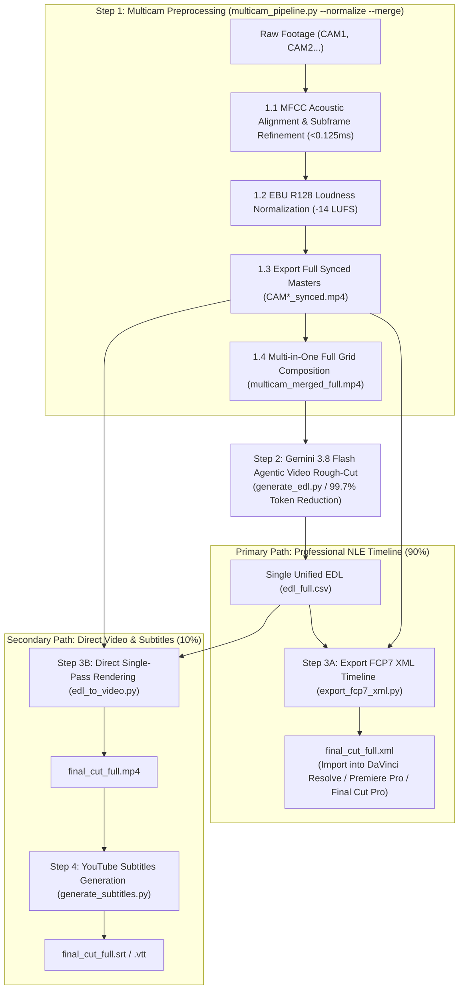

# Multi-Camera Video Pipeline & AI Editing Suite (Antigravity Native)

[English (en)](README.md) | [繁體中文 (zh-TW)](README.zh-TW.md) | [简体中文 (zh-CN)](README.zh-CN.md) | [日本語 (ja)](README.ja.md) | [한국어 (ko)](README.ko.md)

---

> [!IMPORTANT]
> **🚀 Google Antigravity Native Skill & Workflow**  
> This toolkit is an exclusive native skill and workflow suite tailored for the **Google Antigravity Agent Framework (powered by Gemini 3.8 Flash 1M Multimodal Context)** and professional NLE software (DaVinci Resolve, Adobe Premiere Pro, Final Cut Pro).

---

An end-to-end modular multi-camera (2 to 6 cameras) video preprocessing pipeline and AI rough-cut suite packaged with **4-Stage Gated Workflows**. Users do not need to manually enter low-level terminal commands—simply instruct the Antigravity Agent using natural language, and it will automatically execute the standardized pipeline.

---

## 📦 Installation & GCP Setup (`setup.sh`)

Adheres to [Agent Plugins 1.0](https://agent-plugins.org/) and Antigravity Skill standards, operating on a **100% Google Cloud Vertex AI (ADC) + Cloud Storage (GCS)** architecture (zero API key management).

### 1. Install as Antigravity Plugin or Skill

- **Global Plugin (Recommended)**:
  ```bash
  git clone https://github.com/sylphlin/multicam-video-preprocessing.git ~/.gemini/config/plugins/multicam-video-preprocessing
  ```
- **Or Global Skill**:
  ```bash
  git clone https://github.com/sylphlin/multicam-video-preprocessing.git ~/.gemini/config/skills/multicam-video-preprocessing
  ```

### 2. Install Dependencies & One-Click GCP Provisioning (`setup.sh`)

```bash
# 1. Install FFmpeg and Python packages
brew install ffmpeg
pip install numpy google-genai google-cloud-storage mlx-whisper

# 2. Authenticate with Google Cloud ADC
gcloud auth application-default login

# 3. Run setup.sh to auto-provision GCS bucket, tiered Lifecycle rules (raw: 2d, deliverables: 15d), IAM & .env
chmod +x setup.sh
./setup.sh --project YOUR_GCP_PROJECT_ID
```

### 📁 Directory Structure
```text
multicam-video-preprocessing/
├── AGENTS.md                          # Workspace & repository development rules
├── plugin.json                        # Agent Plugins 1.0 manifest
├── setup.sh                           # 100% native gcloud setup script (GCS bucket, Lifecycle, IAM & .env)
├── .env.example                       # Vertex AI (ADC) & GCS configuration template
├── rules/
│   └── AGENTS.md                      # Plugin operational invariants for AI clients
├── skills/
│   └── multicam-video-preprocessing/
│       └── SKILL.md                   # Antigravity skill capability manifest & 4-stage gated runbook
├── assets/                            # Prompt templates
│   ├── edl_interview_template.md      # Gemini multimodal interview rough-cut rules
│   └── subtitle_proofread_template.*.md # Multi-locale YouTube subtitle proofreading rules
├── scripts/                           # Core execution toolset
│   ├── multicam_pipeline.py           # Step 1: Time sync, loudness norm, synced masters, full grid merge
│   ├── generate_edl.py                # Step 2: Vertex AI Gemini 3.8 Flash Agentic Video EDL generation
│   ├── export_fcp7_xml.py             # Step 3A: FCP7 XML timeline export (Primary)
│   ├── edl_to_video.py                # Step 3B: Single-pass hardware-accelerated video rendering (Secondary)
│   ├── generate_subtitles.py          # Step 4: YouTube subtitles (Whisper + Vertex AI Gemini)
│   └── modules/                       # Core acoustic, video, and GCP/Vertex AI modules
└── README.md
```

---

## 🌟 End-to-End Workflow Architecture



---

## 💬 User Scenarios & Prompt Examples

Simply prompt the Antigravity Agent in plain conversational language:

### Scenario 1: Export NLE XML Timeline (Professional Workflow ⭐ Recommended)
- **Use Case**: Need to import AI rough-cut decisions into DaVinci Resolve, Adobe Premiere Pro, or Final Cut Pro for color grading, audio mastering, and fine-tuning.
- **Prompt Example**:
  > *"I have two interview videos `CAM1.mp4` and `CAM2.mp4`. Please synchronize their audio, normalize loudness, and apply the interview rough-cut template to export an XML timeline for DaVinci Resolve."*
- **Deliverables**:
  1. `final_cut_full.xml` (Single unified timeline with all camera cut points and reason markers)
  2. `CAM1_synced.mp4`, `CAM2_synced.mp4` (Time-aligned and -14 LUFS loudness normalized masters)
- **DaVinci Resolve Import Steps**:
  1. Open DaVinci Resolve and create a new project.
  2. Drag `./output/CAM1_synced.mp4` and `./output/CAM2_synced.mp4` into the **Media Pool**.
  3. Go to **File -> Import -> Timeline...** (`Cmd + Shift + I`), and select `final_cut_full.xml`.
  4. All camera cuts, master audio track, and color decision markers will load instantly!

---

### Scenario 2: Direct Video Rendering & YouTube Subtitles (Fast Preview 🎬)
- **Use Case**: Need a quick preview video and YouTube upload-ready subtitles without launching a desktop NLE.
- **Prompt Example**:
  > *"Please rough-cut these multicam videos, render a full MP4 preview video, and generate proofread YouTube subtitles."*
- **Deliverables**:
  1. `final_cut_full.mp4` (Rendered and losslessly concatenated full episode)
  2. `final_cut_full.srt` / `final_cut_full.vtt` (Whisper acoustic timestamps + Gemini proofreading)

---

### Scenario 3: Subtitles for Existing Video (Transcription & Proofreading 📝)
- **Use Case**: You already have a finished video (`final_cut.mp4`) and need millisecond-accurate, terminology-proofread YouTube subtitles.
- **Prompt Example**:
  > *"Please generate YouTube subtitles for `output/final_cut_full.mp4` and fix homophones and technical terms."*
- **Deliverables**:
  1. `final_cut_full.srt` (Standard YouTube SubRip subtitles)
  2. `final_cut_full.vtt` (WebVTT subtitles for web players)
  3. `final_cut_full_raw_whisper.srt` (Raw baseline subtitles for reference)

---

## 🔍 Detailed Pipeline Steps

### Step 1: Multicam Sync & AI Preprocessing (`multicam_pipeline.py`)

1. **MFCC Acoustic Time Alignment & Subframe Refinement (<0.125ms Accuracy)**:
   - **Why MFCC Correlation?**: Human vocal and transient acoustics are represented through Mel-Frequency Cepstral Coefficients (MFCCs). Comparing spectral envelopes rather than raw waveforms slashes FFT memory footprint by **97.7%**, accelerates cross-correlation to <0.3s for 1-hour footage, and is robust against microphone frequency response differences and background noise.
   - **3-Tier Fallback Ladder**:
     1. *Fast MFCC Scan*: Correlates initial 120s of audio. If BBC standard score $Z \ge 12.0$ (High confidence), alignment completes immediately in under 0.4s.
     2. *Full MFCC Scan*: Scans full recording if initial score $< 12.0$ or `--full-scan` is set.
     3. *Raw Waveform Fallback*: Automatically falls back to full-length raw waveform 1D FFT cross-correlation if MFCC confidence is low ($Z < 7.0$).
   - **Sub-Frame Refinement to 0.125ms**: Locates the maximum-energy 5s speech window in the mutual active range and performs localized time-domain acoustic correlation over a $\pm 32\text{ms}$ search radius, refining coarse MFCC hop precision down to a **single audio sample (0.125ms physical precision at 8kHz)**.
   - **BBC Standard Confidence Score & Live Warnings**: Evaluates correlation peak against noise floor:
     - $Z \ge 12.0$ High Confidence: Tagged `✓ Aligned`.
     - $7.0 \le Z < 12.0$ Marginal Confidence: Tagged `ℹ Aligned (marginal)`.
     - $Z < 7.0$ Low Confidence: Tagged `⚠️ LOW CONFIDENCE` and immediately emits stderr warning with diagnostic hints.
   - **Summary Gate Box & `--strict-sync` Safeguard**: Displays an eye-catching warning box at the conclusion of Step 1 if any target has low confidence. Passing `--strict-sync` immediately halts pipeline execution with exit code 1 to prevent misaligned batch renders.
   - **Container Duration Probing**: Uses `ffprobe` to query true media duration, ensuring `--sample-dur` test slices never truncate the final master cut timeline.
2. **EBU R128 (-14 LUFS) Loudness Normalization (YouTube Broadcast Standard)**:
   - **YouTube Compliance**: YouTube enforces **-14.0 LUFS** as its target integrated loudness standard. Overly loud audio triggers harsh backend compression, while low audio reduces mobile playback clarity.
   - **Two-Pass Linear Loudness Normalization**:
     - Pass 1 (Acoustic Measurement): Decodes audio to null sink at ultra-fast speeds to measure Integrated Loudness (`I`), Loudness Range (`LRA` = 11.0 LU), True Peak (`TP` = -1.5 dBTP), and target gain offset (`target_offset`).
     - Pass 2 (Linear Gain Normalization): Feeds measured parameters into `loudnorm` with `linear=true`, applying pure linear gain across the entire file to eliminate dynamic pumping artifacts from single-pass compression, ensuring 100% precise -14.0 LUFS locking without True Peak clipping.
3. **Full Synchronized Masters Frame-Accurate Export (`*_synced.mp4`)**:
   - **Default Frame-Accurate Re-encoding**: Employs hardware-accelerated video encoding (`h264_videotoolbox` on Apple Silicon, fallback to `libx264 -crf 18`), eliminating keyframe snapping drift, leading black frames, and video freeze issues inherent to stream-copy (`-c copy`). Guarantees millisecond-level physical sync across all camera masters.
   - **Fast Mode Support**: Optional `--stream-copy` flag available for fast keyframe-snapped lossy cutting.
4. **Zero-Split Full-Length Grid Composition (`multicam_merged_full.mp4`)**:
   - Automatically merges 2 to 6 camera angles into a single multi-view canvas ($\le 1920 \times 1080$, each CAM $\ge 640 \times 480$), ready for direct full-length AI inspection without slicing.
- **CLI Usage Examples**:
  ```bash
  # Standard 4-in-1 pipeline execution (Sync, Normalize, Re-encode Masters, Grid Merge):
  python3 scripts/multicam_pipeline.py \
    --ref CAM1.mp4 \
    --targets CAM2.mp4 CAM3.mp4 \
    --normalize --merge -o output/

  # Direct Google Drive Folder URL or Folder ID (auto-discovers & sorts CAM1..CAMn via ADC):
  python3 scripts/multicam_pipeline.py \
    --gdrive-folder "https://drive.google.com/drive/folders/YOUR_FOLDER_ID" \
    --normalize --merge -o output/

  # Fast alignment test (first 60s sample, container duration probed via ffprobe):
  python3 scripts/multicam_pipeline.py \
    --ref CAM1.mp4 --targets CAM2.mp4 \
    --sample-dur 60 --normalize --merge -o output/

  # Force full-length MFCC scan (bypassing 120s fast-ladder):
  python3 scripts/multicam_pipeline.py \
    --ref CAM1.mp4 --targets CAM2.mp4 \
    --full-scan --normalize --merge -o output/

  # Strict sync mode (aborts with code 1 if confidence score < 7.0):
  python3 scripts/multicam_pipeline.py \
    --ref CAM1.mp4 --targets CAM2.mp4 \
    --strict-sync --normalize --merge -o output/

  # Fast lossy stream-copy mode (-c copy, keyframe snapped):
  python3 scripts/multicam_pipeline.py \
    --ref CAM1.mp4 --targets CAM2.mp4 \
    --stream-copy --normalize --merge -o output/
  ```

---

### Step 2: Gemini 3.8 Flash Agentic Video Rough-Cut (`generate_edl.py`)
1. **Prompt Template Assets**:
   - Loads `assets/edl_interview_template.md` containing strict broadcast-grade interview cutting rules.
2. **Universal Pre-roll & Countdown Elimination (Zero-Tolerance & Asymmetric Safety Margin)**:
   - **Zero-Tolerance for On-Set Countdown**: Detects and purges clapperboards, equipment checks, and on-set countdown noises ("5, 4, 3, 2, 1", "五四三二", "Ready Action").
   - **Asymmetric Safety Margin (`[Start, Start+2s]` Self-Verification)**: Mandates that `Global_Start_Time` must occur strictly after the final countdown sound has ended. The model executes self-verification over the first 2 seconds of the cut (`[Global_Start_Time, Global_Start_Time + 2.0s]`), automatically pushing the cut point forward until countdown residue is 100% eliminated.
   - **Post-roll Trimming**: Identifies farewell dialogues and trims post-show casual chatter and environment noise (`Global_End_Time`).
3. **Agentic Video Understanding (Zero-Split Full-Length Pipeline)**:
   - Evaluates uncut >1hr multicam grid videos end-to-end via Gemini 3.8 Flash Agentic Video (`processing="agentic"`).
   - Uses goal-directed sparse temporal sampling to reduce input token consumption by **99.7%** (from ~1,000,000 to ~3,000 tokens), completely eliminating chapter boundaries and boundary speech bisection.
4. **Standardized Deliverables**:
   - Generates unified CSV decision table (`edl_full.csv`) and Markdown cutting analysis report (`edl_full_report.md`).
5. **Deterministic EDL Semantic Validation & `--strict-edl` Safeguard**:
   - **8 Structural Checks (6 ERROR + 2 WARN)**:
     - `E_NO_ROWS` (ERROR): EDL contains no data rows.
     - `E_PARSE_TIME` (ERROR): Unparseable timecode format in start or end column.
     - `E_NEGATIVE_DURATION` (ERROR): Shot duration is non-positive (`end <= start`).
     - `E_NON_MONOTONIC` (ERROR): Start time moves backward relative to previous row.
     - `E_OVERLAP` (ERROR): Current shot start time overlaps previous shot end time.
     - `E_EMPTY_CAMERA` (ERROR): Camera angle column is blank or empty.
     - `W_UNKNOWN_CAMERA` (WARN): Camera name not in whitelist (defaults to `^CAM\d+$` regex or explicit list).
     - `W_GAP` (WARN): Inter-shot gap exceeds threshold (`--edl-max-gap-sec`, default `0.05s`), leaving black frame gaps on the timeline.
   - **3 Deterministic Execution Points**:
     1. `generate_edl.py`: Pre-write validation. **Always writes CSV and analysis report to disk before deciding whether to exit**, ensuring malformed data remains available for inspection. Appends the validation report to `edl_full_report.md` under an H2 heading localized by `--lang` (`🔍 EDL Validation Result` for `en`, `🔍 EDL 驗證結果` for `zh-TW`).
     2. `export_fcp7_xml.py`: Post-load validation upon reading EDL. Automatically infers camera whitelist from media directory.
     3. `edl_to_video.py`: Post-load validation before rendering. Auto-infers camera whitelist from media directory / camera map.
   - **Fail-Fast Gate (`--strict-edl`)**: By default, validation issues only emit warnings and continue execution. Passing `--strict-edl` halts execution with exit code 1 if any `ERROR` is found.
   - **Multilingual Validation Report (`--lang`)**: Built-in support for `en` (default) and `zh-TW`. Locale aliases (`zh-Hant`, `zh_TW`, `ZH-TW`) automatically normalize to `zh-TW`; unsupported locales gracefully fall back to `en` without raising exceptions.
   - **Configurable Tolerances**: `--edl-max-gap-sec` (default `0.05`s) controls gap warning sensitivity; `--edl-known-cameras` accepts comma-separated lists (e.g. `CAM1,CAM2`).
6. **100% Pure Vertex AI (ADC) & GCS Smart Caching Architecture**:
   - **Zero API Key Exposure**: Uses Google Cloud Vertex AI (`GOOGLE_CLOUD_LOCATION=global`) with Application Default Credentials (ADC via `gcloud auth application-default login`), eliminating AI Studio (`GEMINI_API_KEY`) and public File API uploads.
   - **GCS Smart Caching & Two-Tier Lifecycle Auto-Cleanup**: Grid videos and audio tracks are staged to Google Cloud Storage (`gs://multicam-video-${PROJECT_ID}/raw/`) with local SHA-256 and file size caching to prevent redundant uploads. Ephemeral staging files (`raw/`) auto-delete after **2 days** (`age: 2`), while deliverables (`output/`, `deliverables/`, `multicam_assets/`) retain for **15 days** (`age: 15`). Pass `--cleanup-gcs` for immediate post-inference deletion.
   - **CLI Examples**:
     ```bash
     # Standard execution (Google Cloud Vertex AI with ADC + GCS Caching):
     python3 scripts/generate_edl.py -v output/multicam_merged_full.mp4

     # Immediately delete the GCS staging blob after EDL generation completes:
     python3 scripts/generate_edl.py -v output/multicam_merged_full.mp4 --cleanup-gcs

     # Strict EDL validation mode (aborts with code 1 on ERROR):
     python3 scripts/generate_edl.py -v output/multicam_merged_full.mp4 --strict-edl

     # Localized validation report in Traditional Chinese:
     python3 scripts/generate_edl.py -v output/multicam_merged_full.mp4 --lang zh-TW

     # Custom gap tolerance and explicit camera whitelist:
     python3 scripts/generate_edl.py -v output/multicam_merged_full.mp4 \
       --strict-edl --lang zh-TW --edl-max-gap-sec 0.05 --edl-known-cameras CAM1,CAM2
     ```

---

### Step 3A: Export FCP7 XML Timeline (`export_fcp7_xml.py`)

Outputs industry-standard **Final Cut Pro 7 XML (xmeml version 4)**:
1. **Direct Synced Master Linking**:
   - Links timeline clips directly to full-length synchronized masters (`CAM1_synced.mp4`, `CAM2_synced.mp4`...) with zero offset errors.
2. **1:1 Absolute Timecode Mapping**:
   - Keeps `start == in` and `end == out` on clips, allowing editors full Ripple/Slip/Slide trim freedom in NLEs.
3. **Continuous Master Audio & Decision Markers**:
   - Creates a continuous master audio track.
   - Converts AI cut rules and rationale into red/blue color timeline markers for review.
4. **NTSC Fractional Frame Rate (29.97 / 23.976 / 59.94) & Drop-Frame (DF) Support**:
   - Accepts float `--fps` values (`29.97`, `23.976`, `59.94`). Automatically maps to integer `<timebase>` (`30`, `24`, `60`) and sets `<ntsc>TRUE</ntsc>` per FCP7 XML specification.
   - All timecode and duration calculations use exact floating-point framerates to eliminate cumulative frame drift.
   - Optional `--drop-frame` flag configures `<displayformat>DF</displayformat>` (NDF default; strictly validated against non-NTSC frame rates).
- **CLI Usage Example**:
  ```bash
  # Standard 30 fps XML export:
  python3 scripts/export_fcp7_xml.py -e output/edl_full.csv -o output/final_cut_full.xml

  # Strict EDL validation with localized report (auto-infers camera whitelist from media dir):
  python3 scripts/export_fcp7_xml.py -e output/edl_full.csv -o output/final_cut_full.xml --strict-edl --lang zh-TW

  # Broadcast 29.97 fps NTSC Drop-Frame XML:
  python3 scripts/export_fcp7_xml.py -e output/edl_full.csv -o output/final_cut_full.xml --fps 29.97 --drop-frame
  ```

---

### Step 3B: Direct Single-Pass Video Rendering (`edl_to_video.py`)
1. **Single-Pass Hardware-Accelerated Rendering**:
   - Renders directly from synchronized camera masters into full episode `final_cut_full.mp4` in a single pass using Apple Silicon `h264_videotoolbox`.
   - Eliminates intermediate chapter files and multi-step concatenation.
- **CLI Usage Example**:
  ```bash
  # Standard single-pass render:
  python3 scripts/edl_to_video.py --edl output/edl_full.csv -o output/final_cut_full.mp4

  # With strict EDL validation and localized report:
  python3 scripts/edl_to_video.py --edl output/edl_full.csv -o output/final_cut_full.mp4 --strict-edl --lang zh-TW
  ```

---

### Step 4: YouTube Subtitles Generation (`generate_subtitles.py`)

Employs the **Three-Stage Golden Subtitle Pipeline**, unifying **Gemini 1M Context Global Audio Understanding**, **Whisper Physical Acoustic Timestamps with Initial Prompt Biasing**, and **Gemini Chunked Multimodal Audio Proofreading**:

#### Why Global Glossary + Whisper Timestamps + Gemini Audio Proofreading?

| Feature | Pure Whisper | Pure Gemini Direct Transcribe | Three-Stage Golden Pipeline ⭐ |
| :--- | :--- | :--- | :--- |
| **Timestamp Accuracy** | Physical acoustic measurement | ⚠️ **Text prediction suffers severe drift (>5s error by 30s)** | **Physical acoustic millisecond alignment (0.000s zero drift)** |
| **Proper Nouns & Acronyms** | Prone to homophone typos and capitalization issues | High semantic accuracy | **100% accurate proper nouns, brand names, and terminology** |
| **Subtitle Pacing** | Natural short phrases (1.2–2.5s) | Inconsistent sentence lengths | **Optimized for fast-paced YouTube reading (8–16 chars, 1.5–3.0s)** |
| **Verbatim Fidelity** | High verbatim accuracy | May hallucinate/paraphrase | **Acoustically verified against raw audio slice (zero hallucinations)** |

#### Three-Stage Execution Flow:
1. **Stage 1 (Global Audio Macro Understanding, Dual-Track Glossary & Whisper Initial Prompt Extraction)**:
   - Gemini 3.8 Flash (1M Context) scans the full-length episode audio, optionally incorporating user interview outline (`--outline`) or recording draft/manuscript (`--script`).
   - **Dual-Track Output**: Generates both an extensive Markdown glossary (`final_cut_full_glossary.md`) for Gemini proofreading and an auto-extracted, high-density keyword list (`> **Whisper Initial Prompt**: ...`) constrained within 200 tokens (~100–140 characters) at the top of the file.
2. **Stage 2 (Whisper Physical Acoustic Baseline & Prompt Biasing)**:
   - Injects the Stage 1 `initial_prompt` into local `mlx-whisper`, `faster-whisper`, or `openai-whisper`, drastically cutting down first-pass ASR errors on specialized proper nouns.
   - Vectorized multi-core hardware acceleration extracts millisecond-accurate physical onset and offset boundaries for every sentence and word (`word_timestamps=True`), outputting 100% drift-free initial subtitles and word-level acoustic cache (`final_cut_full_raw_whisper.srt` and `final_cut_full_words.json`). Future prompt tuning or formatting adjustments load this cache in seconds, bypassing redundant transcription waits.
3. **Stage 3 (Silence-Aware Semantic Chunking, Micro-Acoustic Snapping & Multimodal Audio Proofreading)**:
   - **Silence-Aware Semantic Chunking**: Replaces rigid line-count cuts by sliding a window to locate speaker **natural breathing pauses** (Gap $\ge 0.4\text{s}$) and terminal punctuation/particles (`?`, `!`, `.`, `來說`, `的話`), never bisecting midway through dependent clauses.
   - **Decoupled Text Semantics & Acoustic Time**: Gemini focuses purely on oral syntax re-segmentation, punctuation purification, and homophone error correction.
   - **Micro-Acoustic Sub-clause Snapping**: When long sentences split into sub-clauses, boundaries snap directly to Whisper word-level acoustic physical timestamps (`all_words`), eliminating proportional interpolation errors.
   - **Japanese Pronunciation & Kanji/Kana Sync Rules**: Explicitly pronounced Japanese words format as "Kanji (Hiragana)" (e.g., `改札（かいさつ）`), while unvoiced/passing references remain pure Kanji (e.g., `出改札`), supported by bracket-stripping fallback matching to prevent acoustic detachment.
   - **Gemini API Exponential Backoff & Jitter Auto-Retry**: When hitting rate limits or transient errors (HTTP 429 `RESOURCE_EXHAUSTED`, 503, 500), automatically retries up to 5 times with exponential backoff and random jitter (respecting `Retry-After`), preventing thundering herds and ensuring all subtitle chunks are reliably proofread without falling back to raw unproofread text.
   - **Chunk-Level Persistent Cache**: Generates deterministic hashes combining model, prompt, glossary, and text chunks, writing proofread segments incrementally to `.<basename>_chunk_cache.json`. In case of network interruptions, re-running resumes seamlessly with zero wasted tokens.
   - **Anti-Flicker Bridging & Natural Breathing Buffer**: Speech micro-gaps ($< 0.6\text{s}$) seamlessly bridge to 0s gap to prevent 1-2 frame black flashes, while genuine conversational pauses preserve $+0.4\text{s}$ reading buffer before cleanly clearing the screen without overlapping subsequent speech.

#### 🎯 Streaming Standard Subtitle Quality & Pacing Audit Logic

`generate_subtitles.py` integrates a comprehensive Netflix / YouTube quality audit engine verifying 8 critical dimensions:

| Dimension | Standard Specification | Engineering & Optimization Logic |
| :--- | :--- | :--- |
| **Character Length & Display Width** | CJK $\le 15$ chars / EN $\le 42$ CPL | Enforces strict width limits per language locale (CJK $\le 15$, Korean $\le 16$, English $\le 42$ industry standard). Fully configurable via `--max-chars-cjk`, `--max-chars-korean`, and `--max-chars-latin`. |
| **Reading Speed Monitoring (CPS)** | CJK $\le 6.0$ CPS / EN $\le 20.0$ CPS | Computes full-video Mean CPS and Peak CPS against Netflix thresholds; rushed segments are flagged for review. |
| **Language-Aware Punctuation Policy** | CJK Purged / Latin Preserved | CJK (zh-TW, zh-CN, ja, ko) converts commas to spaces and strips trailing punctuation. Latin (English, French, German, Spanish, etc.) preserves in-line commas, trailing periods, semicolons, colons, interruption dashes `—`, and continuation ellipses `...`. |
| **Multilingual Fallback Mechanism** | Safe Fallback to `en` | Features dedicated initial prompt vocabularies and templates for `zh-TW`, `zh-CN`, `ja`, `ko`, and `en`. Non-dedicated locales safely fall back to English guidelines with a one-time stderr notice (Thai, Arabic, Devanagari supported as approximations). |
| **Typography & Formatting Hygiene** | Paired brackets / Zero residual Markdown | Verifies full-width `（）`, `【】`, `《》`, `「」` and ASCII `()` pairing; purges leaked LLM tags (`**`, `_`, `` ` ``). |
| **Prolonged Silence Audit** | Gap $\ge 10.0\text{s}$ alerts | Scans for gaps $\ge 10\text{s}$, recording timestamps and surrounding text to verify B-roll, music beds, or speech drops. |
| **Zero-Lead Acoustic Alignment** | 0.000s acoustic lock | Timestamps strictly align with physical speech onset (Whisper waveform), eliminating subtitle spoiler artifacts. |
| **Reading Duration Protection** | $1.0\text{s} \le \text{Duration} \le 6.0\text{s}$ | Short clauses expand into trailing silences ($\ge 1.0\text{s}$ for cognitive absorption); maximum duration capped $\le 6.0\text{s}$. |
| **Anti-Flicker Gap Bridging** | Eliminates micro-gaps $< 0.2\text{s}$ | Bridges high-frequency gaps between consecutive speech to 0s; preserves $+0.4\text{s}$ breathing buffers during real pauses. |

#### CLI Usage Examples:

```bash
# Standard execution (Google Cloud Vertex AI with ADC + GCS Staging):
python3 scripts/generate_subtitles.py -i output/final_cut_full.mp4

# Immediately delete full-episode audio from GCS after Stage 1 completes:
python3 scripts/generate_subtitles.py -i output/final_cut_full.mp4 --cleanup-gcs

# Bias proper nouns with interview outline or topic notes (optional):
python3 scripts/generate_subtitles.py -i output/final_cut_full.mp4 --outline "Host: Guest Name, Topic: Key Discussion Concepts, Entity Glossary"

# Provide manuscript or verbatim recording draft for exact vocabulary matching (optional):
python3 scripts/generate_subtitles.py -i output/final_cut_full.mp4 --script manuscript.txt

# Specify language and Whisper model size:
python3 scripts/generate_subtitles.py -i output/final_cut_full.mp4 --language zh-TW --whisper-model small

# Custom subtitle character limits per line (defaults: Latin 42 CPL, CJK 15 chars, Korean 16 chars):
python3 scripts/generate_subtitles.py -i output/final_cut_full.mp4 \
  --language en --max-chars-latin 42 --max-chars-cjk 15 --max-chars-korean 16
```

4. **Outputs**:
   - **`final_cut_full.srt`**: Standard YouTube SubRip subtitles.
   - **`final_cut_full.vtt`**: WebVTT subtitles for web players.
   - **`final_cut_full_subtitle_report.json`**: Netflix & YouTube streaming standard quality audit report (JSON with quantitative metrics and actionable review items).
   - **`final_cut_full_subtitle_report.md`**: Human-readable visual quality audit card (Markdown with compliance grade, silence intervals, and timestamp navigation).
   - **`final_cut_full_glossary.md`**: Episode Global Terminology Glossary (with Whisper Initial Prompt block).
   - **`final_cut_full_raw_whisper.srt`**: Raw Whisper baseline subtitles for reference.
   - **`final_cut_full_words.json`**: Millisecond-accurate word-level physical timestamps cache.

---

## 🛠️ Prerequisites & Cloud Configuration

- **Google Antigravity IDE / Agent Framework**
- **FFmpeg** (with `h264_videotoolbox` hardware encoding and `loudnorm` filter)
- **Python 3.8+** with `numpy`, `google-genai`, `google-cloud-storage`

### One-Click Cloud Setup (`./setup.sh`)

The suite operates exclusively on **Google Cloud Vertex AI and Cloud Storage (GCS)** authenticated via Application Default Credentials (ADC), requiring zero AI Studio API keys:

1. **Authenticate with Google Cloud ADC (including Google Drive Read-Only scope)**:
   ```bash
   gcloud auth application-default login \
     --scopes="https://www.googleapis.com/auth/cloud-platform,https://www.googleapis.com/auth/drive.readonly"
   ```
2. **Run `./setup.sh` for Automated Cloud Provisioning**:
   ```bash
   ./setup.sh --project YOUR_GCP_PROJECT_ID
   ```
   `setup.sh` uses 100% native `gcloud` commands to automatically:
   - Enable `aiplatform.googleapis.com` (Vertex AI), `storage.googleapis.com` (GCS), and `drive.googleapis.com` (Google Drive API).
   - Verify and configure ADC credentials with `drive.readonly` scope so Google Drive file/folder links (`--gdrive-folder` or `https://drive.google.com/...`) can be directly pulled and staged to GCS `raw/` (with remote `gdrive_md5` metadata matching that skips both Drive download and GCS upload on cache hit).
   - Provision `gs://multicam-video-${PROJECT_ID}` (with Uniform Bucket-Level Access & Public Access Prevention).
   - Grant least-privilege `roles/storage.objectUser` to the active user and **Vertex AI Service Agents** (`service-${PROJECT_NUMBER}@gcp-sa-aiplatform.iam.gserviceaccount.com`).
   - Generate the root `.env` configuration:
     ```env
     GOOGLE_CLOUD_PROJECT=your-gcp-project-id
     GOOGLE_CLOUD_LOCATION=global
     GCP_REGION=us-central1
     GCS_BUCKET=multicam-video-your-gcp-project-id
     ```

---

### 2. 🗑️ GCS Bucket Lifecycle Auto-Cleanup Policy

To balance **zero-reupload SHA-256 caching** with **automated cloud storage cost control**, `setup.sh` and `scripts/modules/gcp_client.py` automatically mount the following **two-tier Object Lifecycle Management rules** on `gs://multicam-video-${PROJECT_ID}`:

| GCS Path Prefix (`matchesPrefix`) | Stored Assets | Retention Period (`age`) | Cleanup Mechanism | Rationale |
| :--- | :--- | :--- | :--- | :--- |
| **`raw/audio_chunks/`** | Subtitle Stage 3 audio slices (`.m4a` / `.mp3`) | **Immediate post-inference** | Python `finally` block immediate deletion (backed up by `raw/` 2-day rule) | Ephemeral slices used for multimodal audio proofreading are deleted immediately after each chunk completes. |
| **`raw/`** | Composite grid video (`multicam_merged_full.mp4`), full episode audio (`final_cut_full_audio.m4a`) | **2 Days (`age: 2`)** | GCS Lifecycle `Delete` (or pass `--cleanup-gcs` for immediate deletion) | Retains staging media for 2 days so repeated prompt tuning hits the SHA-256 cache without re-uploading multi-GB files, then auto-purges. |
| **`output/`**<br/>**`deliverables/`**<br/>**`multicam_assets/`** | Cloud-saved timelines (`.xml` / `.csv`), subtitles (`.srt` / `.vtt`), reports, and rendered deliverables | **15 Days (`age: 15`)** | GCS Lifecycle `Delete` | Retains project deliverables and assets for 15 days for team download and review before automatic cleanup. |

#### 📋 Mounted GCS Lifecycle JSON Specification:
```json
{
  "rule": [
    {
      "action": { "type": "Delete" },
      "condition": {
        "age": 2,
        "matchesPrefix": ["raw/"]
      }
    },
    {
      "action": { "type": "Delete" },
      "condition": {
        "age": 15,
        "matchesPrefix": ["output/", "deliverables/", "multicam_assets/"]
      }
    }
  ]
}
```

> 💡 **Inspecting or Customizing Retention Periods**:
> - Inspect active bucket lifecycle rules:
>   ```bash
>   gcloud storage buckets describe gs://multicam-video-YOUR_GCP_PROJECT_ID --format="json(lifecycle_config)"
>   ```
> - Update rules anytime by editing `setup.sh` and re-running `./setup.sh --project YOUR_GCP_PROJECT_ID`, or via `gcloud storage buckets update gs://multicam-video-YOUR_GCP_PROJECT_ID --lifecycle-file=lifecycle.json`.
