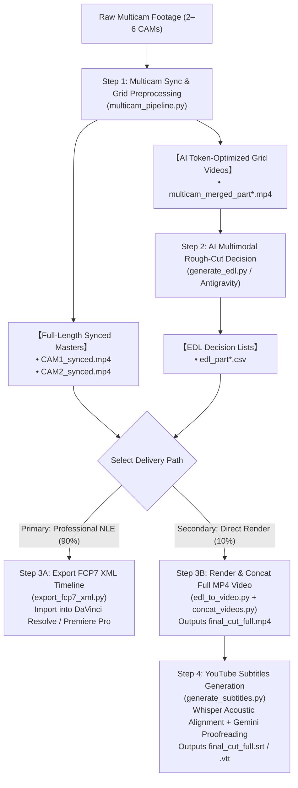

# Multi-Camera Video Pipeline & AI Editing Suite

[English (en)](README.md) | [繁體中文 (zh-TW)](README.zh-TW.md) | [简体中文 (zh-CN)](README.zh-CN.md) | [日本語 (ja)](README.ja.md) | [한국어 (ko)](README.ko.md)

---

> [!NOTE]
> **Platform Support & Environment Notice**  
> - **Verified Environment**: Designed and tested for **Google Antigravity 2.0** with **Gemini 3.7 Flash (Thinking: Medium)**.  
> - **Cross-Platform & Agent Support**: Packaged according to the **[Agent Plugins 1.0 Specification](https://agent-plugins.org/specification)**, supporting conformant Agent clients (such as **OpenAI Codex Desktop**). Testing across all third-party platforms is ongoing; community feedback and pull requests are welcomed.  
> - **Context Window & Chapter Duration**: When using alternative multimodal models, check the model's **Context Window capacity** and adjust the Step 1 chapter split duration parameters accordingly (`--split-min-dur` and `--split-max-dur`, default: 30 to 40 minutes).

---

A modular multi-camera (2 to 6 cameras) video preprocessing pipeline and AI rough-cut suite built for long-context multimodal models (e.g. Gemini 3.7 Flash with 1M Token Context) and professional NLE software (DaVinci Resolve, Adobe Premiere Pro, Final Cut Pro).

---

## 📦 Installation & Setup

Adheres to Antigravity and Agent Plugins 1.0 standard structures. Clone directly into your skills directory:

```bash
git clone https://github.com/sylphlin/multicam-video-preprocessing.git ~/.gemini/config/skills/multicam-video-preprocessing
```

### 📁 Directory Structure
```text
multicam-video-preprocessing/
├── plugin.json                    # Agent Plugins 1.0 Manifest (for Codex & conformant clients)
├── SKILL.md                       # Antigravity skill specification & decision rules
├── skills/
│   └── multicam-video-preprocessing/
│       └── SKILL.md               # Agent Plugins 1.0 standard skill entrypoint
├── assets/                        # Prompt assets
│   ├── edl_interview_template.md  # Dual-camera interview prompt template
│   └── subtitle_proofread_template.md # YouTube subtitle proofreading template
├── scripts/                       # Executable CLI scripts & processing modules
│   ├── multicam_pipeline.py       # Step 1: Time sync, EBU R128, auto-split, synced masters, grid merge
│   ├── generate_edl.py            # Step 2: Multimodal AI rough-cut decision generation
│   ├── export_fcp7_xml.py         # Step 3A: Export FCP7 XML timeline (Primary Path)
│   ├── edl_to_video.py            # Step 3B: Direct video render (Secondary Path)
│   ├── concat_videos.py           # Step 3B: Full episode lossless concat (Secondary Path)
│   ├── generate_subtitles.py      # Step 4: Generate YouTube subtitles (Whisper+Gemini)
│   └── modules/                   # Internal audiovisual algorithms
└── README.md
```

---

## 🌟 Full End-to-End Workflow Diagram



---

## 💬 Usage Scenarios & Conversational Prompts

In the Antigravity chat interface, describe your requirements in natural language and the Agent handles execution:

### Scenario 1: Export NLE Timeline XML (Professional Workflow)
- **Use Case**: Need rough-cut results imported into DaVinci Resolve, Adobe Premiere Pro, or Final Cut Pro for color grading, finishing, and audio mixing.
- **Conversational Prompt Example**:
  > "*I have two multicam interview video files `CAM1.mp4` and `CAM2.mp4`. Please synchronize timecodes, normalize audio loudness, apply the interview editing rules, and generate an XML timeline ready for DaVinci Resolve.*"
- **Deliverables**:
  1. `final_cut_full.xml` (Unified timeline with 98+ cut points and color markers)
  2. `CAM1_synced.mp4`, `CAM2_synced.mp4` (Synchronized and -14 LUFS loudness-normalized masters)
- **DaVinci Resolve Import Steps**:
  1. Open DaVinci Resolve and create a project.
  2. Drag `CAM1_synced.mp4` and `CAM2_synced.mp4` into the **Media Pool**.
  3. Go to **File $\rightarrow$ Import $\rightarrow$ Timeline...** (`Cmd + Shift + I`), select `final_cut_full.xml` to load the full timeline.

---

### Scenario 2: Direct Video Rendering & YouTube Subtitles (Preview & Publishing Workflow)
- **Use Case**: Away from the NLE workstation, or needing to quickly produce an MP4 video along with YouTube subtitles for review or publishing.
- **Conversational Prompt Example**:
  > "*Please rough-cut these two multicam files, render them directly into a full MP4 video, and produce proofread YouTube subtitles for me.*"
- **Deliverables**:
  1. `final_cut_full.mp4` (Hardware-accelerated rendered and concatenated full episode video)
  2. `final_cut_full.srt` / `final_cut_full.vtt` (Whisper acoustic alignment + Gemini proofread YouTube subtitles)

---

## 🔍 Detailed Pipeline Steps

### Step 1: Multicam Sync & Grid Preprocessing (`multicam_pipeline.py`)

1. **8kHz FFT Audio Time Alignment**:
   - **Why downsample to 8kHz?**: Human vocal features are concentrated in the 300Hz to 3.4kHz range. An 8kHz sampling rate fully captures voice acoustics while reducing memory usage and accelerating cross-correlation computation by over 10x.
   - **FFT Cross-Correlation Principle**: The pipeline extracts audio from the reference camera (CAM1) and target cameras (CAM2 to CAMn). Using Fast Fourier Transform (FFT) to convert time-domain signals to the frequency domain, it computes cross-correlation functions. Finding the energy peak yields the exact physical timecode offset $\Delta t$ (millisecond precision), automatically trimming start delays.
2. **EBU R128 (-14 LUFS) Full-Length Audio Normalization (YouTube Recommended Standard)**:
   - **YouTube Playback Compliance**: YouTube enforces **-14.0 LUFS** as its standard loudness target. Overly loud audio (> -14 LUFS) triggers YouTube's server-side volume compression, damaging dynamic range; overly quiet audio harms mobile listening experiences.
   - **Two-Pass Analysis & Filter**:
     - Pass 1: Uses FFmpeg's `ebur128` filter to measure Integrated Loudness (`I`), Loudness Range (`LRA` = 11.0 LU), and True Peak (`TP` = -1.5 dBTP).
     - Pass 2: Feeds measured parameters into the `loudnorm` filter for linear gain adjustment, ensuring uniform loudness across all cameras and parts while preventing digital clipping (True Peak Clipping Prevention).
3. **Synchronized Full-Length Masters (`*_synced.mp4`)**:
   - Trims and exports synchronized, loudness-normalized full-length video masters for NLE timeline linking.
4. **30–40 min Natural Pause Chapter Splitting (1M Context Window Optimization & Model Adaptation)**:
   - **1M Token Context Balance**: For multimodal models supporting 1M tokens (e.g. Gemini 3.7 Flash), a 30 to 40-minute grid video consumes ~600k–800k tokens, leaving ample space for system prompts, deep thinking chains, and lengthy EDL text generation.
   - **Natural Breath & Silence Detection**: Rather than cutting rigidly at fixed intervals, the pipeline scans audio RMS energy within the 30 to 40-minute sliding window to detect sentence pauses, breath gaps, or silence points, preventing truncated sentences.
   - **Adaptable Across Context Sizes**: If using models with smaller context windows (e.g. 128k or 200k), adjust slice durations via `--split-min-dur` and `--split-max-dur` (e.g. 5 to 10 minutes).
5. **2 to 6 Camera Multi-in-One Compact Grid Composition**:
   - Arranges cameras in dynamic grid layouts (Total Canvas $\le 1920 \times 1080$, $\ge 640 \times 480$/CAM), saving **50%–83% multimodal tokens**.

---

### Step 2: Gemini Multimodal AI Rough-Cut Decision (`generate_edl.py`)
1. **Load Prompt Assets**:
   - Loads editing rules from `assets/edl_interview_template.md`.
2. **Phase 0: Pre/Post-roll Trimming**:
   - Identifies and trims pre-roll slate, countdown, and mic checks (`Global_Start_Time`);
   - Trims post-roll wrap-up chat and mic handling noise (`Global_End_Time`).
3. **Phase 1–4: Multimodal Semantic Editing Decisions**:
   - **Speaker Identification & Tracking**: Audio-led speaker switching with cuts on speech boundaries.
   - **Reaction Cutaways**: Filters 1–2s brief interjections; inserts 2–3s listener reaction shots.
   - **Pacing & Anti-Glitch**: Enforces minimum single-shot duration $\ge 2.5\text{s}$.
4. **Standard Output**:
   - Exports CSV decision lists (`edl_part*.csv`) and Markdown analysis reports (`edl_part*_report.md`).

---

### Step 3A (Primary Path): Export FCP7 XML Timeline (`export_fcp7_xml.py`)
1. **Cross-Part Timestamp Accumulation**:
   - Offsets and maps part-level timestamps into a continuous timeline.
2. **1:1 Exact Timecode Matching**:
   - Maintains strict `start == in` and `end == out` for timeline clips, allowing slip/slide trimming in NLEs.
3. **Continuous Audio Track & Rule Markers**:
   - Builds a continuous CAM1 master audio track;
   - Embeds red and blue markers with decision reasons directly into the timeline.

---

### Step 3B (Secondary Path): Direct Video Rendering (`edl_to_video.py` & `concat_videos.py`)
1. **Hardware-Accelerated Chapter Rendering**:
   - Uses Apple Silicon hardware encoder (`h264_videotoolbox`) to render EDL cut segments into chapter clips (`final_cut_part*.mp4`).
2. **Lossless Stream Concatenation**:
   - Merges chapter clips via FFmpeg Concat Demuxer (`-c copy`) into `final_cut_full.mp4`.

---

### Step 4: YouTube Subtitles Generation (`generate_subtitles.py`)

Combines **Whisper (speech recognition and acoustic time alignment)** with **Gemini (contextual proofreading and terminology correction)**:

#### Why Use "Whisper + Gemini"

| Dimension | Whisper Standalone | Gemini Audio ASR Standalone | Whisper + Gemini |
| :--- | :--- | :--- | :--- |
| **Timestamp Accuracy** | Millisecond-level precision | Coarse timestamps (by paragraph) | Millisecond-level precision (Inherited from Whisper) |
| **Homophone Correction** | Frequent phonetic typos | Strong contextual comprehension | Automatically corrects homophones and domain terms |
| **Reading Rhythm** | Suitable short lines (1.2–2.5s) | Paragraphs are too long (6–8s) | Optimal short lines for YouTube (8–16 characters) |
| **Verbatim Faithfulness** | Faithful to spoken words | Prone to summarization/paraphrasing | Preserves verbatim speech, correcting only typos |
| **Compute Cost** | Fast local processing | Consumes audio tokens | Local audio processing, small text token usage |

#### Workflow:
1. **Audio Extraction**: FFmpeg extracts audio into 16kHz mono WAV format.
2. **Stage 1 (Whisper Transcription)**: Local `faster-whisper` produces baseline SRT with millisecond timestamps (`00:01:23,450 --> 00:01:26,800`).
3. **Stage 2 (Gemini Proofreading)**: Applies `assets/subtitle_proofread_template.md` via Gemini 3.7 Flash with timestamps locked, correcting typos, names, and English terminology (`Kelly Tsai`, `YouTube`, `DaVinci Resolve`, `Buffet`).
4. **Outputs**:
   - **`final_cut_full.srt`**: Standard YouTube SubRip subtitle file.
   - **`final_cut_full.vtt`**: WebVTT subtitle file.
   - **`final_cut_full_raw_whisper.srt`**: Raw acoustic baseline backup.
