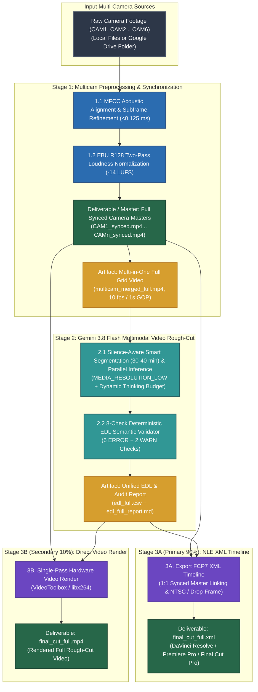

# Multi-Camera Video Pipeline & AI Editing Suite

[English (en)](README.md) | [繁體中文 (zh-TW)](README.zh-TW.md) | [简体中文 (zh-CN)](README.zh-CN.md) | [日本語 (ja)](README.ja.md) | [한국어 (ko)](README.ko.md)

---

> [!IMPORTANT]
> **Google Antigravity Native Plugin & Workflow Suite**  
> This toolkit provides a 3-stage multi-camera preprocessing and AI rough-cut workflow for **Google Antigravity** (powered by **Vertex AI Gemini 3.8 Flash**) and professional NLE systems (**DaVinci Resolve**, **Adobe Premiere Pro**, and **Final Cut Pro**).

---

**Multi-Camera Video Pipeline & AI Editing Suite** synchronizes 2 to 6 camera angles, normalizes broadcast loudness, generates AI rough-cut timelines, and renders multi-camera preview videos. Instruct the Antigravity Agent in natural language to execute the complete multi-camera preprocessing and rough-cut workflow.

---

## Installation & Google Cloud Setup (`setup.sh`)

This project complies with [Agent Plugins 1.0](https://agent-plugins.org/) and runs on **Google Cloud Vertex AI (ADC)** and **Cloud Storage (GCS)** with zero API key files.

### 1. Install as an Antigravity Plugin or Skill

- **Global Plugin (Recommended)**:
  ```bash
  git clone https://github.com/sylphlin/multicam-video-preprocessing.git ~/.gemini/config/plugins/multicam-video-preprocessing
  ```
- **Legacy Single-Skill Installation (`~/.gemini/config/skills/`)**:
  Link the inner `skills/multicam-video-preprocessing` directory into the legacy skills directory:
  ```bash
  git clone https://github.com/sylphlin/multicam-video-preprocessing.git ~/.gemini/config/plugins/multicam-video-preprocessing
  ln -s ~/.gemini/config/plugins/multicam-video-preprocessing/skills/multicam-video-preprocessing ~/.gemini/config/skills/multicam-video-preprocessing
  ```

### 2. Install Dependencies and Provision Cloud Resources (`setup.sh`)

```bash
# 1. Install FFmpeg and Python packages
brew install ffmpeg
pip install numpy google-genai google-cloud-storage requests

# 2. Authenticate Application Default Credentials (ADC)
gcloud auth application-default login

# 3. Provision GCS bucket, two-tier lifecycle rules (raw: 2d, deliverables: 15d), IAM, and .env
chmod +x setup.sh
./setup.sh --project YOUR_GCP_PROJECT_ID
```

### Directory Structure (Agent Plugins 1.0 Specification)
```text
multicam-video-preprocessing/
├── plugin.json                                           # Agent Plugins 1.0 manifest
├── rules/
│   └── AGENTS.md                                         # Packaged client execution invariants (<PLUGIN_ROOT> direct CLI & fail-fast)
├── skills/
│   └── multicam-video-preprocessing/                     # Canonical Skill Bundle (Single Source of Truth)
│       ├── SKILL.md                                      # Antigravity skill manifest and 3-stage gated runbook
│       ├── scripts/                                      # Canonical execution scripts & modules (SSOT)
│       │   ├── multicam_pipeline.py                      # Stage 1: MFCC sync, -14 LUFS norm, synced masters, grid merge
│       │   ├── generate_edl.py                           # Stage 2: Vertex AI Gemini 3.8 Flash EDL generation & smart segmentation
│       │   ├── export_fcp7_xml.py                        # Stage 3A: FCP7 XML timeline export (Primary)
│       │   ├── edl_to_video.py                           # Stage 3B: Single-pass hardware video rendering (Secondary)
│       │   └── modules/                                  # Acoustic, video, segmenter, validator, and GCP/Vertex AI modules
│       └── assets/                                       # Canonical prompt templates (SSOT)
│           └── edl_interview_template.md                 # Gemini multimodal interview rough-cut rules
├── AGENTS.md                                             # Workspace & engineering development rules (Part I & Part II)
├── setup.sh                                              # Native gcloud setup script (GCS, Lifecycle, IAM, .env)
├── .env.example                                          # Vertex AI (ADC) and GCS configuration template
└── tests/                                                # Offline unit test suite (46 tests)
```

---

## End-to-End 3-Stage Workflow Architecture


```mermaid
flowchart TD
    classDef inputStyle fill:#2D3748,stroke:#4A5568,stroke-width:2px,color:#fff;
    classDef stage1Style fill:#2B6CB0,stroke:#2C5282,stroke-width:2px,color:#fff;
    classDef stage2Style fill:#319795,stroke:#285E61,stroke-width:2px,color:#fff;
    classDef stage3Style fill:#6B46C1,stroke:#553C9A,stroke-width:2px,color:#fff;
    classDef artifactStyle fill:#D69E2E,stroke:#B7791F,stroke-width:2px,color:#fff;
    classDef outputStyle fill:#276749,stroke:#1C4532,stroke-width:2px,color:#fff;

    subgraph Inputs["Input Multi-Camera Sources"]
        A["Raw Camera Footage (CAM1, CAM2 .. CAM6)<br/>(Local Files or Google Drive Folder)"]:::inputStyle
    end

    subgraph S1["Stage 1: Multicam Preprocessing & Synchronization"]
        S1_1["1.1 MFCC Acoustic Alignment & Subframe Refinement (<0.125 ms)"]:::stage1Style
        S1_2["1.2 EBU R128 Two-Pass Loudness Normalization (-14 LUFS)"]:::stage1Style
        S1_3["Deliverable / Master: Full Synced Camera Masters<br/>(CAM1_synced.mp4 .. CAMn_synced.mp4)"]:::outputStyle
        S1_4["Artifact: Multi-in-One Full Grid Video<br/>(multicam_merged_full.mp4, 10 fps / 1s GOP)"]:::artifactStyle
        S1_1 --> S1_2
        S1_2 --> S1_3
        S1_3 --> S1_4
    end

    subgraph S2["Stage 2: Gemini 3.8 Flash Multimodal Video Rough-Cut"]
        S2_1["2.1 Silence-Aware Smart Segmentation (30-40 min) & Parallel Inference<br/>(MEDIA_RESOLUTION_LOW + Dynamic Thinking Budget)"]:::stage2Style
        S2_2["2.2 8-Check Deterministic EDL Semantic Validator<br/>(6 ERROR + 2 WARN Checks)"]:::stage2Style
        EDL["Artifact: Unified EDL & Audit Report<br/>(edl_full.csv + edl_full_report.md)"]:::artifactStyle
        S2_1 --> S2_2
        S2_2 --> EDL
    end

    subgraph S3A["Stage 3A (Primary 90%): NLE XML Timeline"]
        S3A_ACT["3A. Export FCP7 XML Timeline<br/>(1:1 Synced Master Linking & NTSC / Drop-Frame)"]:::stage3Style
        XML["Deliverable: final_cut_full.xml<br/>(DaVinci Resolve / Premiere Pro / Final Cut Pro)"]:::outputStyle
        S3A_ACT --> XML
    end

    subgraph S3B["Stage 3B (Secondary 10%): Direct Video Render"]
        S3B_ACT["3B. Single-Pass Hardware Video Render<br/>(VideoToolbox / libx264)"]:::stage3Style
        MP4["Deliverable: final_cut_full.mp4<br/>(Rendered Full Rough-Cut Video)"]:::outputStyle
        S3B_ACT --> MP4
    end

    A --> S1_1
    S1_4 --> S2_1
    S1_3 --> S3A_ACT
    EDL --> S3A_ACT
    S1_3 --> S3B_ACT
    EDL --> S3B_ACT
```

---

## Antigravity Usage & Scenarios

Interact with the Agent in Antigravity using two methods:
1. **Concise Slash + Mention (`/skill` + `@file`)**: Select `/multicam-video-preprocessing` and attach your camera files or Google Drive folder link.
2. **Natural Language Prompt**: Describe your multi-camera synchronization and editing goals in plain language and attach `@` files or cloud links.

### Scenario 1: Export NLE XML Timeline (Recommended Primary Workflow)
- **Use Case**: Import AI rough-cut camera decisions into DaVinci Resolve, Adobe Premiere Pro, or Final Cut Pro for fine editing and color grading.
- **Mode A (`/ + @` Concise Command)**:
  ```text
  /multicam-video-preprocessing CAM1: @CAM1.mp4, CAM2: @CAM2.mp4
  ```
- **Mode B (Natural Language Prompt)**:
  ```text
  Synchronize @CAM1.mp4 and @CAM2.mp4, normalize loudness to -14 LUFS, and export an FCP7 XML rough-cut timeline for DaVinci Resolve.
  ```
- **Deliverables**:
  1. `final_cut_full.xml` (Timeline with camera cut points and reason markers).
  2. `CAM1_synced.mp4`, `CAM2_synced.mp4` (Time-aligned and `-14 LUFS` normalized camera masters).
- **Import into DaVinci Resolve**:
  1. Open DaVinci Resolve and create a new project.
  2. Drag `output/CAM1_synced.mp4` and `output/CAM2_synced.mp4` into the **Media Pool**.
  3. Select **File -> Import -> Timeline...** (`Cmd + Shift + I`) and choose `final_cut_full.xml`.

### Scenario 2: Direct Video Render
- **Use Case**: Render a finished MP4 rough-cut video without opening an NLE.
- **Mode A (`/ + @` Concise Command)**:
  ```text
  /multicam-video-preprocessing CAM1: @CAM1.mp4, CAM2: @CAM2.mp4, Output: Render MP4
  ```
- **Mode B (Natural Language Prompt)**:
  ```text
  Rough-cut @CAM1.mp4 and @CAM2.mp4 and render final_cut_full.mp4 directly.
  ```
- **Deliverables**:
  1. `final_cut_full.mp4` (Single-pass hardware-rendered full video).
  2. `edl_full.csv` and `edl_full_report.md` (Camera switching decisions and semantic validation report).

### Scenario 3: Multi-Camera Rough-Cut from a Google Drive Folder
- **Use Case**: Process all camera angles stored in a shared Google Drive folder with automatic `md5Checksum` cache verification.
- **Mode A (`/ + @` Concise Command)**:
  ```text
  /multicam-video-preprocessing Folder: https://drive.google.com/drive/folders/FOLDER_ID
  ```
- **Mode B (Natural Language Prompt)**:
  ```text
  Download the multi-camera footage from https://drive.google.com/drive/folders/FOLDER_ID, synchronize and normalize the audio, and generate an FCP7 XML timeline.
  ```
- **Deliverables**:
  1. `CAM1_synced.mp4` .. `CAMn_synced.mp4` (Synchronized and loudness-normalized masters).
  2. `edl_full.csv`, `edl_full_report.md`, and `final_cut_full.xml`.

---

## Detailed Pipeline Stages

### Stage 1: Multicam Synchronization & Preprocessing

1. **MFCC Acoustic Alignment & Subframe Refinement (`<0.125 ms`)**:
   - **MFCC Correlation**: Compares Mel-Frequency Cepstral Coefficient envelopes across camera tracks. This reduces FFT memory usage by 97.7% and aligns 1-hour recordings in under 0.3 seconds.
   - **3-Tier Fallback Ladder**:
     1. *Fast MFCC Scan*: Scans the first 120 seconds. Completes immediately if the BBC confidence score $Z \ge 12.0$.
     2. *Full MFCC Scan*: Scans the full duration if $Z < 12.0$.
     3. *Raw Waveform Fallback*: Runs full-length 1D FFT cross-correlation if $Z < 7.0$.
   - **Subframe Refinement (`0.125 ms`)**: Searches a $\pm 32\text{ ms}$ window around the highest-energy 5-second speech segment to lock alignment to a single audio sample at 8 kHz.
2. **EBU R128 (`-14 LUFS`) Two-Pass Linear Loudness Normalization**:
   - **Pass 1**: Measures Integrated Loudness (`I`), Loudness Range (`LRA = 11.0 LU`), and True Peak (`TP = -1.5 dBTP`).
   - **Pass 2**: Applies linear gain (`linear=true`) to lock integrated loudness at `-14.0 LUFS` without dynamic pumping or peak clipping.
3. **Frame-Accurate Synchronized Masters (`CAM*_synced.mp4`)**:
   - Re-encodes camera masters at `20 Mbps` using hardware acceleration (`h264_videotoolbox` on Apple Silicon or `libx264`) to eliminate keyframe drift.
4. **Full-Length Compact Grid Composition (`multicam_merged_full.mp4`)**:
   - Combines 2 to 6 synchronized cameras into one labeled canvas ($\le 1920 \times 1080$, each cell $\ge 640 \times 480$) at `10 fps`, `1.2 Mbps`, and 1-second GOP for fast lossless slicing and cloud scanning.

---

### Stage 2: Gemini 3.8 Flash Multimodal Video Rough-Cut

1. **Pre-Roll and Countdown Removal**:
   - Removes clapperboards, mic checks, and on-set countdowns (`5, 4, 3, 2, 1`).
   - Verifies `[Global_Start_Time, Global_Start_Time + 2.0s]` to ensure zero countdown residue and trims post-interview chatter at `Global_End_Time`.
2. **Standard Multimodal Inference & Silence-Aware Smart Segmentation (`30–40 min` Windows)**:
   - Runs **Vertex AI Gemini 3.8 Flash** in Standard Multimodal mode (`MEDIA_RESOLUTION_LOW` + dynamic `thinking_budget` `1024–4096`) by default.
   - For videos longer than 40 minutes (`2400s`), the pipeline detects natural speech pauses (`ffmpeg silencedetect` + RMS energy minimum fallback), slices lossless temporary chunks into `<output_dir>/_edl_chunks/`, runs parallel inference via `gs://<bucket>/raw/edl_chunks/`, stitches all shifted timestamps into `edl_full.csv`, and deletes all temporary local and GCS chunks in `finally` blocks.
3. **8-Check Deterministic EDL Semantic Validation**:
   - Validates `E_NO_ROWS`, `E_PARSE_TIME`, `E_NEGATIVE_DURATION`, `E_NON_MONOTONIC`, `E_OVERLAP`, `E_EMPTY_CAMERA`, `W_UNKNOWN_CAMERA`, and `W_GAP`.
   - Writes `edl_full.csv` and `edl_full_report.md` to disk for review.

---

### Stage 3A: Export FCP7 XML Timeline

1. **Direct Synced Master Linking**: References `CAM1_synced.mp4`..`CAMn_synced.mp4` with 1:1 timecode mapping (`start == in`, `end == out`).
2. **NTSC Fractional FPS & Drop-Frame Support**: Supports `23.976`, `24`, `25`, `29.97`, `30`, `50`, `59.94`, and `60` fps, plus Drop-Frame (`DF`) timecode.

---

### Stage 3B: Single-Pass Video Rendering

Renders `final_cut_full.mp4` directly from the synchronized camera masters in a single hardware-accelerated pass when requested by the user.

---

## Two-Tier GCS Bucket Lifecycle Policy (`gs://multicam-video-${PROJECT_ID}`)

| GCS Prefix (`matchesPrefix`) | Stored Objects | Retention (`age`) | Cleanup Mechanism |
| :--- | :--- | :--- | :--- |
| **`raw/`** | Staged grid video (`multicam_merged_full.mp4`) & temp chunks (`raw/edl_chunks/*`) | **2 Days (`age: 2`)** | Deletes `raw/edl_chunks/*` immediately in `finally` blocks; retains full staging media for 2 days for SHA-256 cache reuse. |
| **`output/`**, **`deliverables/`**, **`multicam_assets/`** | XML/CSV timelines, rendered videos, and reports | **15 Days (`age: 15`)** | Retains deliverables for 15 days for team review before automatic deletion. |

---

## License

This project is licensed under the [MIT License](LICENSE).
