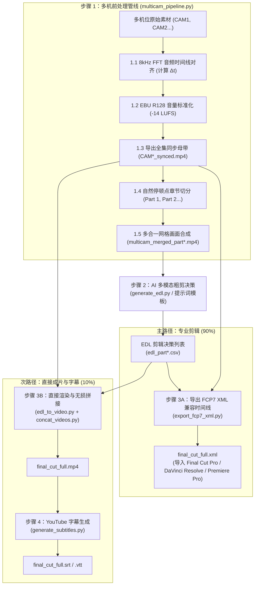

# 多机位视频智能处理与 AI 剪辑套件 (Multicam Video Pipeline & AI Editing Suite)

[English (en)](README.md) | [繁體中文 (zh-TW)](README.zh-TW.md) | [简体中文 (zh-CN)](README.zh-CN.md) | [日本語 (ja)](README.ja.md) | [한국어 (ko)](README.ko.md)

---

> [!IMPORTANT]
> **🚀 Google Antigravity 原生技能与工作流 (Antigravity Native Skill & Workflow)**  
> 本工具套件是专为 **Google Antigravity Agent 架构（基于 Gemini 3.7 Flash 1M 多模态长上下文）** 与专业剪辑软件（DaVinci Resolve、Adobe Premiere Pro、Final Cut Pro）量身打造的原生多机位（2~6 机）智能处理管线与 AI 粗剪套件。

---

本专案为针对长上下文多模态模型（Gemini 3.7 Flash 1M Token Context）与专业剪辑软件（DaVinci Resolve、Adobe Premiere Pro、Final Cut Pro）打造的模块化多机位（2 至 6 机）视频智能处理管线与 AI 粗剪套件。使用者无需手动输入底层终端机指令，只要在 Antigravity 聊天室中使用自然语言发出指示，Agent 就会自动执行完整的标准化处理流程。

---

## 📦 Antigravity 导入与安装 (Installation & Setup)

本专案完全适配 Antigravity Skill 与 Workflow 标准结构，可直接 Clone 至 Antigravity 技能目录下无缝启用：

```bash
git clone https://github.com/sylphlin/multicam-video-preprocessing.git ~/.gemini/config/skills/multicam-video-preprocessing
```

### 📁 套件文件结构
```text
multicam-video-preprocessing/
├── GEMINI.md                          # Antigravity 根目录常驻工作区规则
├── .agent/
│   ├── rules/
│   │   └── multicam_rules.md          # 常驻纪律规则 (Always-On Rules)
│   └── workflows/
│       └── multicam_workflow.md       # 官方 4 阶段执行工作流 (Stage-Gated Runbook)
├── skills/
│   └── multicam-video-preprocessing/
│       └── SKILL.md                   # Antigravity 技能能力定义清单
├── assets/                            # 提示词模板资产 (Prompt Assets)
│   ├── edl_interview_template.md      # Gemini 访谈粗剪提示词模板
│   └── subtitle_proofread_template.md # YouTube 字幕语义校对模板
├── scripts/                           # 核心执行脚本与处理模块
│   ├── multicam_pipeline.py           # 步骤 1: 多机时间同步、音量标准化、分段与网格合成
│   ├── generate_edl.py                # 步骤 2: Gemini 多模态 AI 剪辑决策生成
│   ├── export_fcp7_xml.py             # 步骤 3A: 导出 FCP7 XML 时间线 (主路径)
│   ├── edl_to_video.py                # 步骤 3B: 直接渲染成片 (次路径)
│   ├── concat_videos.py               # 步骤 3B: 全集章节无损拼接 (次路径)
│   ├── generate_subtitles.py          # 步骤 4: 生成 YouTube 字幕 (Whisper+Gemini)
│   └── modules/                       # 核心声学与视频算法库
└── README.zh-CN.md
```

---

## 🌟 端到端全流程图 (Full End-to-End Workflow)



---

## 💬 使用情境与 Prompt 范例 (User Scenarios & Prompt Examples)

使用者在 Antigravity 对话框中，只需以日常口语提出需求，Agent 即会自动理解并调用完整的处理管线：

### 情境一：导出专业剪辑 XML 时间线（DaVinci Resolve / Premiere Pro / Final Cut Pro ⭐ 推荐）
- **适用场景**：需要将 AI 粗剪结果导入剪辑软件，进行后续的精细剪辑、调色、动态图卡与音频混音。
- **对话 Prompt 范例**：
  > 「*我有两支双机位的访谈录像文件 `CAM1.mp4` 与 `CAM2.mp4`，请帮我进行时间同步与音量标准化，并套用访谈剪辑模板产出可直接进 DaVinci Resolve 的 XML 时间线。*」
- **交付成果**：
  1. `final_cut_full.xml`（单一完整时间线，包含全片所有镜头切点与 AI 决策理由 Marker 标记）
  2. `CAM1_synced.mp4`、`CAM2_synced.mp4`（音画同步且已完成 -14 LUFS 响度标准化的全集母带）
- **DaVinci Resolve 导入步骤**：
  1. 打开 DaVinci Resolve 并新建项目。
  2. 将 `./output/CAM1_synced.mp4` 与 `./output/CAM2_synced.mp4` 拖入 **Media Pool（媒体池）**。
  3. 点击 **文件 $\\rightarrow$ 导入 $\\rightarrow$ 时间线...** (`Cmd + Shift + I`)，选取 `final_cut_full.xml`。
  4. 全片所有镜头切点、主音频轨与彩色 Marker 标记瞬间加载就绪！

---

### 情境二：直出成片与 YouTube 字幕（快速预览与发布工作流 🎬）
- **适用场景**：不需要打开专业剪辑软件，希望快速生成一支完整的 MP4 成品视频供审片，并附带 YouTube 上传用的双语/单语字幕。
- **对话 Prompt 范例**：
  > 「*请帮我把这两支多机位素材进行 AI 粗剪，直接渲染合并成一支完整的 MP4 预览视频，并产出校对后的 YouTube 字幕。*」
- **交付成果**：
  1. `final_cut_full.mp4`（全集渲染与无损拼接成品视频）
  2. `final_cut_full.srt` / `final_cut_full.vtt`（Whisper 声学对齐 + Gemini 语义校对之 YouTube 标准字幕）

---

### 情境三：自订章节长度（自订分段时间 ⏱️）
- **适用场景**：原始素材时间较短（如 30 分钟节目），希望将章节缩短为每 10 或 15 分钟左右切一段，或依据特定主题划分。
- **对话 Prompt 范例**：
  > 「*请帮我处理这组多机位素材，但章节请改在 10 分钟附近找自然停顿点切分，最后产出 XML 时间线。*」
- **Agent 自动反应**：
  - Agent 会自动将切分参数调整为 `--split-min-dur 8 --split-max-dur 12`，无需手动修改任何配置或脚本。

---

### 情境四：为既有视频单独制作 YouTube 字幕（语音转录与校对 📝）
- **适用场景**：手边已有剪辑好的视频成品（`final_cut.mp4`），需要制作毫秒级精准且专有名词经过校对的 YouTube 字幕。
- **对话 Prompt 范例**：
  > 「*请帮我为 `output/final_cut_full.mp4` 制作 YouTube 字幕，修复同音错字与英文专有名词。*」
- **交付成果**：
  1. `final_cut_full.srt`（YouTube 标准 SubRip 字幕）
  2. `final_cut_full.vtt`（网页与 HTML5 播放器通用 WebVTT 字幕）
  3. `final_cut_full_raw_whisper.srt`（原始 Whisper 转录初稿）

---

## 🔍 各步骤执行细节说明 (Detailed Pipeline Steps)

### 步骤 1：多机同步与 AI 网格前处理 (`multicam_pipeline.py`)

1. **8kHz FFT 音频时间线全域对齐 (8kHz FFT Audio Time Alignment)**：
   - **为什么降采样至 8kHz？**：人声音频频率特征集中在 300Hz 至 3.4kHz，8kHz 采样已足以完整捕捉语音声学特征，同时大幅降低内存消耗并提升 10 倍以上的计算速度。
   - **FFT 互相关算法原理**：程序自动提取基准机（CAM1）与各目标机（CAM2 至 CAMn）的音频，利用快速傅里叶变换（Fast Fourier Transform）将时域信号转换至频域计算互相关函数（Cross-Correlation），通过寻找互相关能量峰值，精确计算出各机位开始录制的物理时间偏差 $\\Delta t$（精确至毫秒），并自动校正与修剪起跑时间差。
2. **EBU R128 (-14 LUFS) 全集音量标准化 (符合 YouTube 官方建议标准)**：
   - **符合 YouTube 播放规范**：YouTube 平台采用 **-14.0 LUFS** 作为标准响度基准。若视频音量过大（高于 -14 LUFS），YouTube 后台会启动强制压缩衰减导致动态范围受损；若音量过小则影响手机与平板观众的聆听体验。
   - **双遍（Two-Pass）分析与滤镜**：
     - 第一遍：通过 FFmpeg `ebur128` 滤镜精确量测整段音频的整合响度（Integrated Loudness, `I`）、响度范围（Loudness Range, `LRA` = 11.0 LU）与真实峰值（True Peak, `TP` = -1.5 dBTP）。
     - 第二遍：将实际测得参数带入 `loudnorm` 滤镜进行线性增益调整，确保全片各机位与各章节音量完全一致，且绝不发生数字削波破音（True Peak Clipping Prevention）。
3. **全集同步母带导出 (`*_synced.mp4`)**：
   - 依据 $\\Delta t$ 裁切并导出全长对齐、音量标准化的母带视频，专供 Step 3A 剪辑时间线直接引用。
4. **30 至 40 分钟自然停顿点章节智能分段 (应付 1M Context Window 与模型灵活适配)**：
   - **1M Token 上下文最佳平衡**：以 Gemini 3.7 Flash 支持的 1M Token Context 为例，30 至 40 分钟的网格视频约消耗 60 万至 80 万 Token，预留了充足的 Token 空间供系统提示词、深度思考链（Thinking Process）与长文本 EDL 决策输出。
   - **自然呼吸与静音停顿侦测**：程序不会在固定时间点生硬切断，而是在 30 至 40 分钟的滑动窗口内分析音频 RMS 能量，找出语音结束、呼吸停顿或静音点进行无损切分，确保切片交界处不截断讲者的句子。
5. **2 至 6 机多合一紧凑网格画面合成**：
   - 自动依机位数排版（2机左右并排、3 至 4 机田字格、5 至 6 机六宫格），保证总画幅 $\\le 1920 \\times 1080$、每机 $\\ge 640 \\times 480$，为后续 AI 分析节省 **50%–83% Token 消耗**。

---

### 步骤 2：Gemini 多模态 AI 智能粗剪决策 (`generate_edl.py`)
1. **加载专属提示词资产**：
   - 读取 `assets/edl_interview_template.md` 规则模板。
2. **Phase 0：头尾废料裁切 (Pre/Post-roll Trimming)**：
   - 自动辨识并剔除开拍前试音、倒数之废料画面（标记 `Global_Start_Time`）；
   - 自动识别访谈结尾道别语句，切除收尾未关机闲聊与环境杂音（标记 `Global_End_Time`）。
3. **Phase 1–4：多模态声画语义剪辑决策**：
   - **话者识别与追踪**：以声音为主导锁定当前发话者机位，切镜点对齐语音边界。
   - **关键反应镜头穿插**：过滤 1 至 2 秒短插话，适时切换至聆听者 2 至 3 秒之反应镜头。
   - **防跳切限制**：设定单镜头长度 $\\ge 2.5\\text{s}$，维持视觉流畅。
4. **产出标准化结果**：
   - 输出标准 CSV 决策表（`edl_part*.csv`）与 Markdown 裁切分析报告（`edl_part*_report.md`）。

---

### 步骤 3A（主路径）：导出 FCP7 XML 剪辑时间线 (`export_fcp7_xml.py`)

本步骤产出业界通用的 **Final Cut Pro 7 XML（xmeml version 4）** 兼容格式，可无缝导入 **Final Cut Pro**、**DaVinci Resolve**、**Adobe Premiere Pro** 等主流专业剪辑软件（NLE）：
1. **多 Part 跨章节时间戳累加映射**：
   - 将 Part 1、Part 2 的局部时间戳自动累加为全片连续时间轴。
2. **1:1 绝对时间码对应**：
   - 时间线上每一个镜头保持 `start == in` 与 `end == out`，剪辑师在 NLE 中可自由进行波纹修剪（Slip/Slide）。
3. **建立连续主音轨与规则 Marker 注入**：
   - 建立全片连续的 CAM1 主收音轨道；
   - 将 AI 的剪辑规则与决策理由转化为时间线上的红蓝 Marker 标记，方便剪辑师检视。

---

### 步骤 3B（次路径）：直接渲染与无损拼接成片 (`edl_to_video.py` & `concat_videos.py`)
1. **硬件加速分段渲染**：
   - 调用 Apple Silicon 硬件编码器（`h264_videotoolbox`），依据 EDL 快速输出各章节剪辑成片（`final_cut_part*.mp4`）。
2. **无损流拼接**：
   - 使用 FFmpeg Concat Demuxer（`-c copy`）合并为全集 `final_cut_full.mp4`。

---

### 步骤 4：生成 YouTube 字幕 (`generate_subtitles.py`)

本工具采用业界顶级的 **三阶段黄金字幕生产线（Three-Stage Golden Subtitle Pipeline）**，结合 **Gemini 1M 全篇音频宏观理解**、**Whisper 声学物理时间轴** 与 **Gemini 局部音轨多模态精修**：

#### 为什么采用「全篇词汇库 + Whisper 物理时间码 + Gemini 音频多模态审稿」？

| 比较项目 | 纯 Whisper 转录 | 纯 Gemini 直出转录 | 终极三阶段字幕生产线 ⭐ |
| :--- | :--- | :--- | :--- |
| **时间轴精准度** | 物理声学测量，毫秒级精准 | ⚠️ **文本预测易累积漂移（播至30秒漂移 > 5秒）** | **物理声学毫秒级精确对齐（全片 0.000 秒零漂移）** |
| **专有名词与中英夹杂** | 容易出现同音错字（如细部、公职房标、Kelly蔡） | 语义与专有名词精准 | **全篇名词库加持，中英专有名词 100% 精准（如 `Kelly Tsai`、`思想实验室`、`硅谷`）** |
| **字幕阅读节奏** | 符合短句节奏（每句约 1.2–2.5 秒） | 切句粒度不均匀 | **最适合 YouTube 的快节奏短句（每句约 8–16 字、1.5–3 秒）** |
| **逐字忠实度与防脑补** | 忠实记录说话内容 | 容易过度润饰或擅自摘要 | **听局部真实音频进行声学确认，还原真实说话（零幻觉、零过度脑补）** |

#### 三阶段执行流程：
1. **阶段一（全篇音频宏观理解与专有名词库萃取）**：
   - 提取全片音频，由 Gemini 3.7 Flash（1M Context）一次听完整集节目（或结合使用者提供的访纲 `--outline`），自动萃取人物姓名、公司品牌、英文缩写与专有名词对照表（`final_cut_full_glossary.md`）。
2. **阶段二（Whisper 声学物理时间轴骨架）**：
   - 本地 `mlx-whisper` 或 `faster-whisper` 通过滑动窗口能量分析，测量每句话的物理起讫点，产出 100% 零漂移的毫秒时间戳初稿（`final_cut_full_raw_whisper.srt`）。
#### 🎯 影视级字幕质量检验标准与自动优化逻辑

`generate_subtitles.py` 内置完整的 Netflix / YouTube 影视级质量审核引擎，自动执行以下 6 大优化与合规验证：

| 检验项目 | 标准规范 | 优化与工程处理逻辑 |
| :--- | :--- | :--- |
| **讲者语义聚合与隔离** | 严禁跨讲者问答混行 | 同一讲者的完整语义（如提问句）优先聚合为单行；讲者交接处强制开启新字幕块，100% 杜绝语义混淆。 |
| **单行字数宽度限制** | CJK $\le 15$ 字 / EN $\le 37$ CPL | 依各语系设定字宽上限（中文/日文 $\le 15$ 字、韩文 $\le 16$ 字、英文 $\le 37$ 字符）。长句自动在子句边界平滑拆分，防止小屏幕折行。 |
| **行尾标点与版面净化** | 100% 消除行尾 `。`、`，`、`；` | 清除无视觉意义的行尾符号；行内逗号转换为自然空格，中英文/数字间距自动标准化，版面极简清爽。 |
| **声学起点 0 剧透** | 0.000s 物理对齐 | 字幕出现时间严格锁定 Whisper 物理声学起点，绝不比声音先出，避免剧透观影体验。 |
| **阅听时长保护** | $1.0\text{s} \le \text{Duration} \le 6.0\text{s}$ | 短句在后方静音空隙自动补足至 $\ge 1.0\text{s}$（确保读者反应时间）；单句上限 $\le 6.0\text{s}$（杜绝卡顿感）。 |
| **防闪烁微间隙熔接** | 消除 $< 0.2\text{s}$ 视觉黑闪 | 连续说话之间的微小空隙（$< 0.2\text{s}$）自动平滑熔接为 0s Gap；段落自然停顿处自动保留 $+0.4\text{s}$ 阅读呼吸缓冲。 |

4. **输出文件**：
   - **`final_cut_full.srt`**：YouTube 标准 SubRip 字幕文件。
   - **`final_cut_full.vtt`**：网页与 HTML5 播放器通用 WebVTT 字幕文件。
   - **`final_cut_full_subtitle_report.json`**：Netflix / YouTube 影视级字幕质量检验量化报告（JSON）。
   - **`final_cut_full_subtitle_report.md`**：影视级字幕质量检验可视化评分表（Markdown）。
   - **`final_cut_full_glossary.md`**：全集专有名词与词汇对照表。
   - **`final_cut_full_raw_whisper.srt`**：保留原始 Whisper 声学转录初稿供对照。

---

## 🛠️ 环境需求

- **Google Antigravity IDE / Agent Framework**
- **FFmpeg**（支持 `h264_videotoolbox` 硬件编码与 `loudnorm` 滤镜）
- **Python 3.8+**
- **NumPy** (`pip install numpy`)
