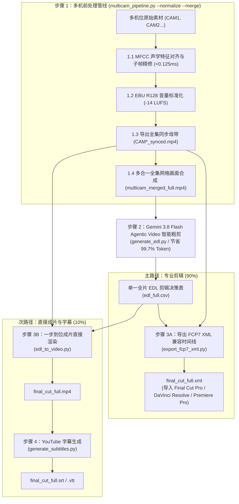

# 多机位视频智能处理与 AI 剪辑套件 (Multicam Video Pipeline & AI Editing Suite)

[English (en)](README.md) | [繁體中文 (zh-TW)](README.zh-TW.md) | [简体中文 (zh-CN)](README.zh-CN.md) | [日本語 (ja)](README.ja.md) | [한국어 (ko)](README.ko.md)

---

> [!IMPORTANT]
> **🚀 Google Antigravity 原生技能与工作流 (Antigravity Native Skill & Workflow)**  
> 本工具套件是专为 **Google Antigravity Agent 架构（基于 Gemini 3.8 Flash 1M 多模态长上下文）** 与专业剪辑软件（DaVinci Resolve、Adobe Premiere Pro、Final Cut Pro）量身打造的原生多机位（2~6 机）智能处理管线与 AI 粗剪套件。

---

本专案为针对长上下文多模态模型（Gemini 3.8 Flash 1M Token Context）与专业剪辑软件（DaVinci Resolve、Adobe Premiere Pro、Final Cut Pro）打造的模块化多机位（2 至 6 机）视频智能处理管线与 AI 粗剪套件。使用者无需手动输入底层终端机指令，只要在 Antigravity 聊天室中使用自然语言发出指示，Agent 就会自动执行完整的标准化处理流程。

---

## 📦 Antigravity 导入与一键安装部署 (`setup.sh`)

本专案完全适配 Antigravity Skill 与 Workflow 标准结构，并提供一键交互式安装与 GCP 环境配置脚本 `setup.sh`：

```bash
git clone https://github.com/sylphlin/multicam-video-preprocessing.git ~/.gemini/config/skills/multicam-video-preprocessing
cd ~/.gemini/config/skills/multicam-video-preprocessing
./setup.sh --project YOUR_GCP_PROJECT_ID
```

### 📁 套件文件结构
```text
multicam-video-preprocessing/
├── AGENTS.md                          # 工作区常驻与专案开发工程规范 (Workspace & Development Rules)
├── plugin.json                        # Agent Plugins 1.0 标准套件定义清单
├── setup.sh                           # 一键本地依赖检查与 GCP (ADC/Vertex AI/GCS) 环境部署脚本
├── rules/
│   └── AGENTS.md                      # Plugin 全局常驻红线 (Operational Invariants for AI Clients)
├── skills/
│   └── multicam-video-preprocessing/
│       └── SKILL.md                   # Antigravity 技能定义与 4 阶段 Gated Runbook
├── assets/                            # 提示词模板资产 (Prompt Assets)
│   ├── edl_interview_template.md      # Gemini 访谈粗剪提示词模板
│   └── subtitle_proofread_template.md # YouTube 字幕语义校对模板
├── scripts/                           # 核心执行脚本与处理模块
│   ├── multicam_pipeline.py           # 步骤 1: 多机时间同步、音量标准化、母带导出与全集网格合成
│   ├── generate_edl.py                # 步骤 2: Gemini 3.8 Flash Agentic Video 零切分 AI 剪辑决策生成
│   ├── export_fcp7_xml.py             # 步骤 3A: 导出 FCP7 XML 时间线 (主路径)
│   ├── edl_to_video.py                # 步骤 3B: 一步到位硬件加速成片直接渲染 (次路径)
│   ├── generate_subtitles.py          # 步骤 4: 生成 YouTube 字幕 (Whisper+Gemini)
│   └── modules/                       # 核心声学与视频算法库
└── README.zh-CN.md
```

---

## 🌟 端到端全流程图 (Full End-to-End Workflow)



---

## 💬 使用情境与 Prompt 范例 (User Scenarios & Prompt Examples)

使用者在 Antigravity 对话框中，只需以日常口语提出需求，Agent 即会自动理解并调用完整的处理管线：

### 情境一：导出专业剪辑 XML 时间线（DaVinci Resolve / Premiere Pro / Final Cut Pro ⭐ 推荐）
- **适用场景**：需要将 AI 粗剪结果导入剪辑软件，进行后续的精细剪辑、调色、动态图卡与音频混音。
- **对话 Prompt 范例**：
  > 「*我有两支双机位的访谈录像文件 `CAM1.mp4` 与 `CAM2.mp4`，请帮我进行时间同步与音量标准化，并套用访谈剪辑模板产出可直接进 DaVinci Resolve 的 XML 时间线。*」
- **交付成果**：
  1. `final_cut_full.xml`（单一完整时间线，包含全片所有镜头切点与 AI 决策理由 Marker 标记）
  2. `CAM1_synced.mp4`、`CAM2_synced.mp4`（音画同步且已完成 -14 LUFS 响度标准化的全集母带）
- **DaVinci Resolve 导入步骤**：
  1. 打开 DaVinci Resolve 并新建项目。
  2. 将 `./output/CAM1_synced.mp4` 与 `./output/CAM2_synced.mp4` 拖入 **Media Pool（媒体池）**。
  3. 点击 **文件 $\\rightarrow$ 导入 $\\rightarrow$ 时间线...** (`Cmd + Shift + I`)，选取 `final_cut_full.xml`。
  4. 全片所有镜头切点、主音频轨与彩色 Marker 标记瞬间加载就绪！

---

### 情境二：直出成片与 YouTube 字幕（快速预览与发布工作流 🎬）
- **适用场景**：不需要打开专业剪辑软件，希望快速生成一支完整的 MP4 成品视频供审片，并附带 YouTube 上传用的双语/单语字幕。
- **对话 Prompt 范例**：
  > 「*请帮我把这两支多机位素材进行 AI 粗剪，直接渲染合并成一支完整的 MP4 预览视频，并产出校对后的 YouTube 字幕。*」
- **交付成果**：
  1. `final_cut_full.mp4`（全集渲染与无损拼接成品视频）
  2. `final_cut_full.srt` / `final_cut_full.vtt`（Whisper 声学对齐 + Gemini 语义校对之 YouTube 标准字幕）

---

### 情境三：为既有视频单独制作 YouTube 字幕（语音转录与校对 📝）
- **适用场景**：手边已有剪辑好的视频成品（`final_cut.mp4`），需要制作毫秒级精准且专有名词经过校对的 YouTube 字幕。
- **对话 Prompt 范例**：
  > 「*请帮我为 `output/final_cut_full.mp4` 制作 YouTube 字幕，修复同音错字与英文专有名词。*」
- **交付成果**：
  1. `final_cut_full.srt`（YouTube 标准 SubRip 字幕）
  2. `final_cut_full.vtt`（网页与 HTML5 播放器通用 WebVTT 字幕）
  3. `final_cut_full_raw_whisper.srt`（原始 Whisper 转录初稿）

---

## 🔍 各步骤执行细节说明 (Detailed Pipeline Steps)

### 步骤 1：多机同步与 AI 网格前处理 (`multicam_pipeline.py`)

1. **MFCC 声学特征对齐与子帧精修 (<0.125ms 精度)**：
   - **为什么采用 MFCC 声学特征互相关？**：人声音频与瞬态声学特征最精准的表征为梅尔倒频谱系数（MFCC）。相比传统原始波形对齐，MFCC 特征包络对齐将 FFT 内存消耗大幅缩减 **97.7%**（1 小时音频运算仅占约 12.5MB），1 小时素材 0.3 秒内即可完成对齐，且对不同相机麦克风频响差异与背景噪音具备极高抗干扰性。
   - **三阶梯退避验证架构 (3-Tier Fallback Ladder)**：
     1. *快速 120s MFCC 探测*：先提取前 120 秒音频进行特征互相关，若 BBC 标准峰值分数 $Z \ge 12.0$（极高置信度），0.4 秒内即刻完成对齐。
     2. *全集 MFCC 扫描*：若初始分数 $< 12.0$ 或使用者指定 `--full-scan`，则启动全片 MFCC 特征扫描。
     3. *原始波形 FFT 降级机制*：若全集 MFCC 分数依旧较低（$Z < 7.0$），系统无缝自动回退至原始高通滤波波形 1D FFT 互相关作为保底。
   - **子帧物理声学微调 (<0.125ms)**：在两机重叠活跃区内动态定位最高能量的 5 秒语音片段，于 $\pm 32\text{ms}$ 搜寻半径内进行时域互相关精修，将 MFCC 步幅精度跃升至**单个音频采样点（8kHz 下精确至 0.125ms 物理声学精度）**。
   - **BBC 广播级置信度统计与低分即时警告**：依据互相关峰值与噪声底限的标准差比值评估：
     - $Z \ge 12.0$ 高置信度：标记 `✓ Aligned`。
     - $7.0 \le Z < 12.0$ 中置信度：标记 `ℹ Aligned (marginal)`。
     - $Z < 7.0$ 低置信度：标记 `⚠️ LOW CONFIDENCE` 并即时输出 stderr 警告与可能原因排查建议。
   - **Summary Gate 警告边框与 `--strict-sync` 防呆中断**：Step 1 结束时若存在低置信度相机，自动在终端输出醒目警告区块；若传入 `--strict-sync` 则直接非零退出中断管线，防止在批处理自动化中生成错位成片。
   - **容器时间自动探测 (修复 `--sample-dur` 截断问题)**：整合 `ffprobe` 提取真实视频容器时长，保证快速测试模式下导出的母带与对齐区间维持全片长度。
2. **EBU R128 (-14 LUFS) 全集音量标准化 (符合 YouTube 官方建议标准)**：
   - **符合 YouTube 播放规范**：YouTube 平台采用 **-14.0 LUFS** 作为标准响度基准。若视频音量过大（高于 -14 LUFS），YouTube 后台会启动强制压缩衰减导致动态范围受损；若音量过小则影响手机与平板观众的聆听体验。
   - **双次通过（Two-Pass）线性标准化**：
     - 第一遍 (Pass 1 - 声学测量)：音频极速解码至空设备（null sink）进行即时声学分析，精确量测整段音频的整合响度（Integrated Loudness, `I`）、响度范围（Loudness Range, `LRA` = 11.0 LU）、真实峰值（True Peak, `TP` = -1.5 dBTP）与目标增益偏移（`target_offset`）。
     - 第二遍 (Pass 2 - 线性增益正则化)：启用 `linear=true` 将实际测得参数带入 `loudnorm` 滤镜进行全片纯线性增益平移，彻底根除单次通过（Single-pass）动态压缩产生的“声音抽吸感 (Volume Pumping Artifacts)”，确保全片各机位音量 100% 精准锁定 -14.0 LUFS，且绝不发生数字削波破音（True Peak Clipping Prevention）。
3. **全集同步母带帧精确并行导出 (`*_synced.mp4`)**：
   - **默认帧精确重新编码 (Frame-Accurate Re-encode)**：采用 Apple Silicon 硬件加速编码器（`h264_videotoolbox`，非 Mac 环境自动回退 `libx264 -crf 18`），彻底解决流复制 (`-c copy`) 只能在关键帧（I-frame）切割所造成的毫秒级声学对齐漂移、片头黑帧与画面卡顿问题，确保各机位母带影格毫秒级物理绝对对齐。
   - **极速模式支持**：可选传入 `--stream-copy` 启用无损流复制，适合极速粗剪。
4. **零切分全集多合一紧凑网格画面合成 (`multicam_merged_full.mp4`)**：
   - 自动依机位数排版（2机左右并排、3 至 4 机田字格、5 至 6 机六宫格），保证总画幅 $\le 1920 \times 1080$、每机 $\ge 640 \times 480$，供 Agentic Video 一次性全文理解，免除章节分割的人工切口。
- **执行指令示例**：
  ```bash
  # 标准 4 合 1 完整前处理（对齐、正则化、母带重编码、网格合成）：
  python3 scripts/multicam_pipeline.py \
    --ref CAM1.mp4 \
    --targets CAM2.mp4 CAM3.mp4 \
    --normalize --merge -o output/

  # 直接粘贴 Google Drive 文件夹链接或 Folder ID（通过 ADC 自动扫描并按 CAM1..CAMn 排序下载与对齐）：
  python3 scripts/multicam_pipeline.py \
    --gdrive-folder "https://drive.google.com/drive/folders/YOUR_FOLDER_ID" \
    --normalize --merge -o output/

  # 快速对齐采样测试（仅截取前 60 秒音频对齐，视频长度自动经由 ffprobe 探测保持全片长）：
  python3 scripts/multicam_pipeline.py \
    --ref CAM1.mp4 --targets CAM2.mp4 \
    --sample-dur 60 --normalize --merge -o output/

  # 强制全集 MFCC 扫描（跳过 120s 快速阶梯）：
  python3 scripts/multicam_pipeline.py \
    --ref CAM1.mp4 --targets CAM2.mp4 \
    --full-scan --normalize --merge -o output/

  # 严格对齐检查模式（对齐信赖度低于 7.0 即刻报错中断）：
  python3 scripts/multicam_pipeline.py \
    --ref CAM1.mp4 --targets CAM2.mp4 \
    --strict-sync --normalize --merge -o output/

  # 极速流复制模式（-c copy，关键帧吸附切割）：
  python3 scripts/multicam_pipeline.py \
    --ref CAM1.mp4 --targets CAM2.mp4 \
    --stream-copy --normalize --merge -o output/
  ```

---

### 步骤 2：Gemini 3.8 Flash Agentic Video 智能粗剪决策 (`generate_edl.py`)
1. **加载专属提示词资产**：
   - 读取 `assets/edl_interview_template.md` 广电级访谈剪辑规则模板。
2. **Phase 0：头尾废料与现场倒数彻底裁切 (零容忍原则与不对称安全边界)**：
   - **现场倒数零容忍**：系统性侦测并剔除开拍前设备确认、闲聊、打板与现场人员倒数声（如「5, 4, 3, 2, 1」、「五四三二」、「Ready Action」）。
   - **不对称安全边界 (`[Start, Start+2s]` 自我校验)**：强制要求 `Global_Start_Time` 必须严格落在最后一个倒数数字完全结束之后。模型在起剪后的首 2 秒区间（`[Global_Start_Time, Global_Start_Time + 2.0s]`）进行思维链自审，若仍有倒数残留则自动后移时间戳，确保成片首帧干净对齐第一句台词首字。
   - **结尾未关机裁切**：自动识别访谈结尾道别语句，切除收尾未关机闲聊、拍摄封面素材与环境杂音（标记 `Global_End_Time`）。
3. **次世代架构：Agentic Video Understanding (零切分全长剪辑)**：
   - 通过 Gemini 3.8 Flash Agentic Video 理解能力（`processing="agentic"`），直接评估 >1 小时未分段之完整多机网格视频。
   - 采用目标导向稀疏时域采样，将输入 Token 消耗巨幅降低 **99.7%**（由约 1,000,000 Token 降至约 3,000 Token），彻底免除章节交界处话语被截断的风险。
4. **产出标准化结果**：
   - 输出单一标准 CSV 决策表（`edl_full.csv`，亦兼容 `edl.csv`）与 Markdown 裁切分析报告（`edl_full_report.md`）。
5. **EDL 语义验证器与 `--strict-edl` 防呆中断**：
   - **8 项语义结构检查 (6 ERROR + 2 WARN)**：
     - `E_NO_ROWS` (ERROR)：EDL 不包含任何镜头数据行。
     - `E_PARSE_TIME` (ERROR)：时间码格式无法解析（start 或 end 字段异常）。
     - `E_NEGATIVE_DURATION` (ERROR)：镜头时长为非正值（`end <= start`）。
     - `E_NON_MONOTONIC` (ERROR)：起始时间倒退（本行 start 小于前一行 start）。
     - `E_OVERLAP` (ERROR)：相邻镜头时间重叠（本行 start 小于前一行 end）。
     - `E_EMPTY_CAMERA` (ERROR)：机位（camera）字段为空。
     - `W_UNKNOWN_CAMERA` (WARN)：机位标识不在已知白名单中（默认使用 `^CAM\d+$` 正则匹配或显式白名单）。
     - `W_GAP` (WARN)：相邻镜头间隔超过容许阈值（`--edl-max-gap-sec`，默认 `0.05` 秒），将在时间线上产生黑屏间隙。
   - **三个严谨执行点**：
     1. `generate_edl.py`：CSV 落盘前验证。**无论验证成功与否，必定先将 CSV 与分析报告完整写入磁盘，再决定是否退出**，确保异常数据留在磁盘以便排查问题。验证报告将追加至 `edl_full_report.md`，其 H2 章节标题依 `--lang` 本地化（`en` 为 `🔍 EDL Validation Result`，`zh-TW` 为 `🔍 EDL 驗證結果`）。
     2. `export_fcp7_xml.py`：读取 EDL 后验证，自动从媒体素材目录推断已知机位白名单。
     3. `edl_to_video.py`：视频渲染前验证，自动从媒体素材目录或机位映射表推断白名单。
   - **防呆门禁 (`--strict-edl`)**：默认仅发出警告并继续执行；传入 `--strict-edl` 则在存在任何 `ERROR` 时立即以 exit code 1 中断管线，防止带病 EDL 流入下游。
   - **报告多语言支持 (`--lang`)**：内置支持 `en`（默认）与 `zh-TW`。语言代码具备容错性，`zh-Hant`、`zh_TW`、`ZH-TW` 等变体自动归一化至 `zh-TW`；未支持的语言代码静默回退至 `en`，不抛出异常。
   - **自定义参数**：`--edl-max-gap-sec`（默认 `0.05` 秒）；`--edl-known-cameras`（逗号分隔白名单如 `CAM1,CAM2`，未指定时默认正则 `^CAM\d+$`）。
6. **100% Google Cloud Vertex AI (ADC) + GCS 智能缓存与双阶自动生命周期架构**：
   - **免管 API Key 安全认证**：全面采用 Google Cloud Vertex AI（`GOOGLE_CLOUD_LOCATION=global`）搭配 Application Default Credentials（ADC），完全排除 AI Studio（`GEMINI_API_KEY`）与外部 File API 上传。
   - **GCS SHA-256 智能缓存与双阶自动清理（2 天 / 15 天）**：网格视频与音频上传至 `gs://multicam-video-${PROJECT_ID}/raw/`，内置本地 SHA-256 与文件大小缓存，跨次执行免重复上传。暂存文件（`raw/`）由 GCS Lifecycle 规则于 **2 天后**自动清除，产出物与资产（`output/`、`deliverables/`、`multicam_assets/`）保留 **15 天**后自动清理（亦可传入 `--cleanup-gcs` 于推论完成后立即删除）。
   - **执行指令示例**：
     ```bash
     # 标准执行：Google Cloud Vertex AI + GCS 智能缓存（默认）：
     python3 scripts/generate_edl.py -v output/multicam_merged_full.mp4

     # 推论完成后立即删除 GCS 暂存网格视频：
     python3 scripts/generate_edl.py -v output/multicam_merged_full.mp4 --cleanup-gcs

     # 启用严格 EDL 验证模式（出现 ERROR 即中断）：
     python3 scripts/generate_edl.py -v output/multicam_merged_full.mp4 --strict-edl

     # 指定中文验证报告：
     python3 scripts/generate_edl.py -v output/multicam_merged_full.mp4 --lang zh-TW

     # 自定义间隔容许阈值与指定机位白名单：
     python3 scripts/generate_edl.py -v output/multicam_merged_full.mp4 \
       --strict-edl --lang zh-TW --edl-max-gap-sec 0.05 --edl-known-cameras CAM1,CAM2
     ```

---

### 步骤 3A（主路径）：导出 FCP7 XML 剪辑时间线 (`export_fcp7_xml.py`)

本步骤产出业界通用的 **Final Cut Pro 7 XML（xmeml version 4）** 兼容格式，可无缝导入 **Final Cut Pro**、**DaVinci Resolve**、**Adobe Premiere Pro** 等主流专业剪辑软件（NLE）：
1. **直连全集同步母带**：
   - 直接关联 `CAM1_synced.mp4`、`CAM2_synced.mp4`...，全片时间码 1:1 绝对对齐。
2. **1:1 绝对时间码对应**：
   - 时间线上每一个镜头保持 `start == in` 与 `end == out`，剪辑师在 NLE 中可自由进行波纹修剪（Slip/Slide）。
3. **建立连续主音轨与规则 Marker 注入**：
   - 建立全片连续的 CAM1 主收音轨道；
   - 将 AI 的剪辑规则与决策理由转化为时间线上的红蓝 Marker 标记，方便剪辑师检视。
4. **NTSC 浮点帧率 (29.97 / 23.976) 与 Drop-Frame (DF) 完整支持**：
   - `--fps` 支持浮点输入（`29.97`, `23.976`, `59.94`），自动合规输出 FCP7 XML 整数 `<timebase>` 与 `<ntsc>TRUE</ntsc>`，所有时间码换算皆以浮点运算，杜绝长序列影格累积漂移。
   - 支持 `--drop-frame` 参数设定 `<displayformat>DF</displayformat>`（非 NTSC 帧率自动防呆拒绝）。
- **执行指令示例**：
  ```bash
  # 标准 30 fps XML 导出：
  python3 scripts/export_fcp7_xml.py -e output/edl_full.csv -o output/final_cut_full.xml

  # 启用严格 EDL 验证与中文报告（自动从素材目录推断机位白名单）：
  python3 scripts/export_fcp7_xml.py -e output/edl_full.csv -o output/final_cut_full.xml --strict-edl --lang zh-TW

  # 广播级 29.97 fps NTSC Drop-Frame 时间线导出：
  python3 scripts/export_fcp7_xml.py -e output/edl_full.csv -o output/final_cut_full.xml --fps 29.97 --drop-frame
  ```

---

### 步骤 3B（次路径）：一步到位成片直接渲染 (`edl_to_video.py`)
1. **一步到位硬件加速成片渲染**：
   - 调用 Apple Silicon 硬件编码器（`h264_videotoolbox`），直接读取全集同步母带与 `edl_full.csv` 渲染出完整成片 `final_cut_full.mp4`，无需产出中间章节分段或二次拼接。
- **执行指令示例**：
  ```bash
  # 一步到位直接渲染成片：
  python3 scripts/edl_to_video.py --edl output/edl_full.csv -o output/final_cut_full.mp4

  # 启用严格 EDL 验证与中文报告：
  python3 scripts/edl_to_video.py --edl output/edl_full.csv -o output/final_cut_full.mp4 --strict-edl --lang zh-TW
  ```

---

### 步骤 4：生成 YouTube 字幕 (`generate_subtitles.py`)

本工具采用业界顶级的 **三阶段黄金字幕生产线（Three-Stage Golden Subtitle Pipeline）**，结合 **Gemini 1M 全篇音频宏观理解**、**Whisper 声学物理时间轴与专有名词偏置** 与 **Gemini 局部音轨多模态精修**：

#### 为什么采用「全篇词汇库 + Whisper 物理时间码 + Gemini 音频多模态审稿」？

| 比较项目 | 纯 Whisper 转录 | 纯 Gemini 直出转录 | 终极三阶段字幕生产线 ⭐ |
| :--- | :--- | :--- | :--- |
| **时间轴精准度** | 物理声学测量，毫秒级精准 | ⚠️ **文本预测易累积漂移（播至30秒漂移 > 5秒）** | **物理声学毫秒级精确对齐（全片 0.000 秒零漂移）** |
| **专有名词与中英夹杂** | 容易出现同音错字或英文大小写混乱 | 语义与专有名词精准 | **全篇名词库加持，中英专有名词、品牌名与行业术语 100% 精准统一** |
| **字幕阅读节奏** | 符合短句节奏（每句约 1.2–2.5 秒） | 切句粒度不均匀 | **最适合 YouTube 的快节奏短句（每句约 8–16 字、1.5–3 秒）** |
| **逐字忠实度与防脑补** | 忠实记录说话内容 | 容易过度润饰或擅自摘要 | **听局部真实音频进行声学确认，还原真实说话（零幻觉、零过度脑补）** |

#### 三阶段执行流程：
1. **阶段一（全篇音频宏观理解、双轨专有名词库与 Whisper Initial Prompt 萃取）**：
   - 提取全片音频，由 Gemini 3.8 Flash（1M Context）一次听完整集节目，可选注入访纲笔记（`--outline`）或录音完整讲稿／逐字稿（`--script`）。
   - **双轨解析产出**：不仅产出供 Gemini 审稿的完整 Markdown 词汇库（`final_cut_full_glossary.md`），更在文件顶部自动产出高密度、控制在 200 token（约 100～140 字符）内的 `> **Whisper Initial Prompt**: ...` 核心关键字列。
2. **阶段二（Whisper 声学物理时间轴与专有名词偏置）**：
   - 自动将 Stage 1 萃取的 `initial_prompt` 注入本地 `mlx-whisper`、`faster-whisper` 或 `openai-whisper`，大幅降低专有名词首度声学识别错误率。
   - 通过硬件加速向量化提取每个段落与每个词的真实物理起讫点（`word_timestamps=True`），产出 100% 零漂移的毫秒时间戳初稿与词级声学缓存（`final_cut_full_raw_whisper.srt` 与 `final_cut_full_words.json`）。日后微调提示词或排版时自动秒级载入缓存，免去重复转录的漫长等待。
3. **阶段三（静音感知语义切块、微声学锚定与多模态音频审稿）**：
   - **静音感知语义分块 (Silence-Aware Semantic Chunking)**：淘汰死板的固定行数硬切，改在目标区间滑动窗口内搜寻讲者**自然呼吸停顿**（Gap $\ge 0.4\text{s}$）与完整句尾语气词／标点（`？`、`！`、`。`、`来说`、`的话`），避开连词前切断，确保送交审稿之上下文语义完整。
   - **文本语义与声学时间彻底解耦**：Gemini 专注于口语语义自然断句、排版标点净化与同音错字修正。
   - **子句微声学锚定 (Micro-Acoustic Sub-clause Snapping)**：长句拆分为分句时，自动结合 Whisper 物理词级时间戳 `all_words`，精确咬合口形发音的物理起讫点，拒绝均分比例导致的口形微偏差。
   - **日语发音与汉字音字同步规范**：讲者口述念出日文读音时呈现「日文汉字（平假名）」（如 `改札（かいさつ）`）；纯快速中文带过未念发音时呈现纯汉字（如 `出改札`），并辅以括号剥离容错比对算法，杜绝声学脱锚。
   - **Gemini API 指数退避与随机抖动重试机制 (Exponential Backoff & Jitter)**：面对并发请求或限流触发 HTTP 429 (`RESOURCE_EXHAUSTED`)、503 / 500 等暂态错误时，自动进行最多 5 次指数退避重试（自动解析 `Retry-After` 并加上随机 Jitter），防止并行 Worker 同时重打引发雷群效应，保证所有切块字幕均能稳健完成审稿，不再轻易降级退回未校对的原始字幕。
   - **区块级持久化缓存 (Chunk-Level Persistent Cache)**：结合模型、提示词、词汇库与切块文本产生唯一哈希，校对区块即时写入 `.<basename>_chunk_cache.json`。若中途遇网络波动中断，重新执行 100% 接续进度，零重复 token 消耗。
   - **防闪烁微间隙熔接与自然呼吸留白**：说话微小空隙（$< 0.6\text{s}$）自动平滑熔接为 0s Gap 消除画面黑闪；讲者真实停顿处保留 $+0.4\text{s}$ 阅读呼吸缓冲后干净清空画面，且单向时间锁定保证字幕绝不遮蔽下一句话的发音。

#### 🎯 影视级字幕质量检验标准与自动优化逻辑

`generate_subtitles.py` 内置完整的 Netflix / YouTube 影视级质量审核引擎，自动执行以下 8 大优化与合规验证：

| 检验项目 | 标准规范 | 优化与工程处理逻辑 |
| :--- | :--- | :--- |
| **单行字数宽度限制** | CJK $\le 15$ 字 / EN $\le 42$ CPL | 依各语系设定字宽上限（中文/日文 $\le 15$ 字、韩文 $\le 16$ 字、英文 $\le 42$ 字符业界标准）。可通过 `--max-chars-cjk`、`--max-chars-korean`、`--max-chars-latin` 自由微调。 |
| **阅听速率监控 (CPS)** | CJK $\le 6.0$ CPS / EN $\le 20.0$ CPS | 计算全片平均 CPS 与峰值 CPS，过促语句（如短促高密度字）自动警示并列入待复查清单。 |
| **多语言专属标点策略** | CJK 净化 / 英文保留语意 | CJK（繁中/简中/日/韩）行内逗号转空格并清除行尾句逗；Latin（英文/法/德/西等）完整保留行内逗号、行尾句号、未完子句逗号、冒号分号、话语中断破折号 `—` 与语气延续省略号 `...`。 |
| **多语言 Fallback 机制** | 默认 Fallback 至 `en` | 内置支持 `zh-TW`, `zh-CN`, `ja`, `ko`, `en` 五种专属词汇前缀与模板。未支持语言默认安全 fallback 至英文排版并发出单次 stderr 警告（泰文、阿语、梵文目前作为近似排版支持）。 |
| **字符排版与语法洁净** | 括号成对闭合 / 严禁残留 Markdown | 检验全角 `（）`、`【】`、`《》`、`「」` 及半角括号成对闭合；自动清洗 `**`粗体、`_`斜体、`` ` ``代码标记等 LLM 泄漏标签。 |
| **长时间无对白/静音检验** | 停顿 Gap $\ge 10.0\text{s}$ 警示 | 检测全片超过 10 秒之空白间隔，记录前后句与时间码，供剪辑师快速确认为 B-roll 空景、转场音乐或 ASR/VAD 语音切除遗漏。 |
| **声学起点 0 剧透** | 0.000s 物理对齐 | 字幕出现时间严格锁定 Whisper 物理声学起点，绝对不比声音先出，避免剧透观影体验。 |
| **阅听时长保护** | $1.0\text{s} \le \text{Duration} \le 6.0\text{s}$ | 短句在后方静音空隙自动补足至 $\ge 1.0\text{s}$（确保读者反应时间）；单句上限 $\le 6.0\text{s}$（杜绝卡顿感）。 |
| **防闪烁微间隙熔接** | 消除 $< 0.2\text{s}$ 视觉黑闪 | 连续说话之间的微小空隙（$< 0.6\text{s}$）自动平滑熔接为 0s Gap；段落自然停顿处自动保留 $+0.4\text{s}$ 阅读呼吸缓冲并清空画面。 |

#### 执行指令范例：

```bash
# 标准执行（Google Cloud Vertex AI 与 ADC 认证 + GCS 暂存）：
python3 scripts/generate_subtitles.py -i output/final_cut_full.mp4

# 阶段一完成后立即删除 GCS 全篇音频暂存：
python3 scripts/generate_subtitles.py -i output/final_cut_full.mp4 --cleanup-gcs

# 提供访纲或重点笔记偏置专有名词（可选）：
python3 scripts/generate_subtitles.py -i output/final_cut_full.mp4 --outline "讲者: 来宾名称, 主题: 核心议题、专有名词列表"

# 提供录音原稿或完整讲稿作为专有名词与词汇标准（可选）：
python3 scripts/generate_subtitles.py -i output/final_cut_full.mp4 --script manuscript.txt

# 指定语言与 Whisper 模型大小：
python3 scripts/generate_subtitles.py -i output/final_cut_full.mp4 --language zh-CN --whisper-model small

# 自定义字幕单行字数上限（默认：英文 42 字符、中文/日文 15 字、韩文 16 字）：
python3 scripts/generate_subtitles.py -i output/final_cut_full.mp4 \
  --language en --max-chars-latin 42 --max-chars-cjk 15 --max-chars-korean 16
```

4. **输出文件**：
   - **`final_cut_full.srt`**：YouTube 标准 SubRip 字幕文件。
   - **`final_cut_full.vtt`**：网页与 HTML5 播放器通用 WebVTT 字幕文件。
   - **`final_cut_full_subtitle_report.json`**：Netflix / YouTube 影视级字幕质量检验量化报告（JSON，含指标数据与待复查清单）。
   - **`final_cut_full_subtitle_report.md`**：影视级字幕质量检验可视化评分报告（Markdown，含合规等第、长时间静音区间表与时间码定位清单）。
   - **`final_cut_full_glossary.md`**：全集专有名词与词汇对照表（含顶部 Whisper Initial Prompt）。
   - **`final_cut_full_raw_whisper.srt`**：保留原始 Whisper 声学转录初稿供对照。
   - **`final_cut_full_words.json`**：Whisper 毫秒级词级物理时间戳缓存。

---

## 🛠️ 环境需求与一键云端部署 (`setup.sh`)

- **Google Antigravity IDE / Agent Framework**
- **FFmpeg**（支持 `h264_videotoolbox` 硬件编码与 `loudnorm` 滤镜）
- **Python 3.8+**（依赖 `numpy`、`google-genai`、`google-cloud-storage`）
- **Google Cloud SDK (`gcloud`)**

### 一键 GCP 环境设置 (`setup.sh`) 与双阶 GCS 自动生命周期管理

本工具套件采用 **100% Google Cloud Vertex AI（Application Default Credentials, ADC）+ Google Cloud Storage (GCS)** 架构，无需手动管理 API Key，亦不调用任何 AI Studio 上传接口。

```bash
# 交互式一键完成本地依赖检查、ADC 认证、Vertex AI API 启用与 GCS 存储桶建立：
./setup.sh

# 非交互模式（供 Antigravity Agent 自动部署使用）：
./setup.sh --project YOUR_GCP_PROJECT_ID --region us-central1 --non-interactive
```

1. **`setup.sh` 自动部署内容**：
   - 自动启用 `aiplatform.googleapis.com`（Vertex AI）、`storage.googleapis.com`（GCS）与 `drive.googleapis.com`（Google Drive API）。
   - 自动验证并配置包含 `drive.readonly` 权限的 ADC 凭证，支持将 Google Drive 文件夹／文件链接（`--gdrive-folder` 或 `https://drive.google.com/...`）直接拉取并转存至 GCS `raw/`（具备远程 `gdrive_md5` 校验缓存，命中时秒级跳过下载与上传）。
   - 自动建立专属 GCS 存储桶（`gs://multicam-video-${PROJECT_ID}`）并配置 IAM 权限（`roles/aiplatform.user`, `roles/storage.objectAdmin`）。
   - 自动生成 `.env` 配置文件（`GOOGLE_CLOUD_LOCATION=global`, `GCP_REGION=us-central1`）。
2. **🗑️ GCS 存储桶双阶生命周期 (Lifecycle) 自动清理规则表**：

为兼顾「同日重复调校免重传大型文件（SHA-256 缓存）」与「避免云端存储费用累积」，`setup.sh` 与 `scripts/modules/gcp_client.py` 会在 GCS 存储桶自动挂载以下分阶自动清理规则：

| GCS 路径前缀 (`matchesPrefix`) | 存储文件类型 | 保留期限 (`age`) | 清理方式 | 规则说明 |
| :--- | :--- | :--- | :--- | :--- |
| **`raw/audio_chunks/`** | 字幕阶段三切块音频切片 (`.m4a` / `.mp3`) | **推论后立即删除** | Python `finally` 块即时删除（并由 `raw/` 2 天规则双重兜底） | 每个字幕切块完成多模态听音校对后立即从 GCS 删除，零空间残留。 |
| **`raw/`** | 多合一全集网格视频 (`multicam_merged_full.mp4`)、全集主音轨 (`final_cut_full_audio.m4a`) | **2 天 (`age: 2`)** | GCS Lifecycle 自动 `Delete`（或传入 `--cleanup-gcs` 立即删除） | 供 Vertex AI 多模态推论暂存。保留 2 天让同专案重跑时可秒级命中 SHA-256 缓存，2 天后自动清除。 |
| **`output/`**<br/>**`deliverables/`**<br/>**`multicam_assets/`** | 云端备份之剪辑时间线 (`.xml` / `.csv`)、字幕文件 (`.srt` / `.vtt`)、报告与成片产出物 | **15 天 (`age: 15`)** | GCS Lifecycle 自动 `Delete` | 产出物与专案资产保留 **15 天** 供团队跨设备下载与审阅，15 天后自动清理。 |

```json
{
  "rule": [
    {
      "action": { "type": "Delete" },
      "condition": { "age": 2, "matchesPrefix": ["raw/"] }
    },
    {
      "action": { "type": "Delete" },
      "condition": { "age": 15, "matchesPrefix": ["output/", "deliverables/", "multicam_assets/"] }
    }
  ]
}
```

---

### 3. ☁️ Google Drive 云端硬盘直通情境与实战范例 (ADC 零密钥直连)

在实际影视制作流程中，摄影师或场记通常会将多机位原始素材直接上传至 **Google Drive（个人云端硬盘或团队共享云端硬盘 Shared Drives）**。本工具套件支持通过 `gcloud` ADC（`drive.readonly` 权限）直接解析并拉取 Google Drive 链接与 Folder ID，免去浏览器手动下载与解压：

#### 📌 四大常见支持情境一览：

| 支持情境 | 适用阶段与脚本 | 输入格式支持 | 智能缓存与自动处理机制 |
| :--- | :--- | :--- | :--- |
| **情境 A：整包多机位文件夹直通**<br/>*(最推荐：摄影师整包上传)* | **Stage 1**<br/>(`multicam_pipeline.py`) | `--gdrive-folder "<文件夹链接或ID>"`<br/>*(支持 `drive/folders/...` 或 `gdrive://...`)* | 自动调用 Drive API v3 扫描文件夹内所有视频文件（`.mp4`, `.mov`, `.mkv` 等），按**自然数字排序**（`CAM1` 自动设为 `--ref` 主机、`CAM2..CAM6` 自动设为 `--targets`），并通过本地 MD5 缓存免重复下载。 |
| **情境 B：指定个别云端硬盘文件链接**<br/>*(不同文件夹或指定主副机)* | **Stage 1**<br/>(`multicam_pipeline.py`) | `--ref "<CAM1文件链接>"`<br/>`--targets "<CAM2链接>" "<CAM3链接>"` | 分别解析各个 Google Drive 文件链接（`file/d/.../view` 或 `open?id=...`），校验远程 `md5Checksum` 后缓存至 `<output_dir>/gdrive_inputs/` 进行毫秒级声学对齐。 |
| **情境 C：云端网格视频直通 GCS 进行 AI 粗剪**<br/>*(零重复传输缓存)* | **Stage 2**<br/>(`generate_edl.py`) | `-v "<网格视频 Google Drive 链接>"`<br/>或 `-v "gs://bucket/raw/..."` | **远程 `gdrive_md5` 秒级缓存**：先比对 Google Drive 文件 MD5 与远程 GCS `gs://multicam-video-${PROJECT_ID}/raw/` Blob 的 `metadata.gdrive_md5`；**若已存在于 GCS，直接返回 `gs://` URI（同时跳过 Drive 下载与 GCS 上传）**！ |
| **情境 D：云端成片直接生成 YouTube 字幕**<br/>*(独立制作字幕)* | **Stage 4**<br/>(`generate_subtitles.py`) | `-i "<成片 Google Drive 链接>"` | 直接从 Google Drive 拉取成片或音轨（MD5 缓存），自动执行 Vertex AI 1M 全域词汇表提取、Whisper 词级对齐与多模态听音审稿。 |

#### 💻 实战命令范例 (CLI)：

```bash
# 【情境 A】直接粘贴 Google Drive 多机位文件夹链接（自动扫描 CAM1..CAMn + 同步归一化 + 输出多合一网格）：
python3 scripts/multicam_pipeline.py \
  --gdrive-folder "https://drive.google.com/drive/folders/1AbCdEfGhIjKlMnOpQrStUvWxYz123456?usp=drive_link" \
  --normalize --merge -o output/

# 【情境 B】分别指定不同 Google Drive 文件链接作为主机 (CAM1) 与副机 (CAM2, CAM3)：
python3 scripts/multicam_pipeline.py \
  --ref "https://drive.google.com/file/d/1Cam1FileIdxxxxxx/view?usp=sharing" \
  --targets "https://drive.google.com/file/d/1Cam2FileIdxxxxxx/view?usp=sharing" \
            "https://drive.google.com/file/d/1Cam3FileIdxxxxxx/view?usp=sharing" \
  --normalize --merge -o output/

# 【情境 C】直接将 Google Drive 上的网格视频转存至 GCS 并执行 Gemini 3.8 Flash Agentic Video 粗剪：
python3 scripts/generate_edl.py \
  -v "https://drive.google.com/file/d/1MergedGridVideoIdxxxxxx/view?usp=sharing" \
  --strict-edl --lang zh-TW -o output/

# 【情境 D】直接针对 Google Drive 上的最终成片生成 YouTube 双格式字幕 (.srt / .vtt) 与质量检验报告：
python3 scripts/generate_subtitles.py \
  -i "https://drive.google.com/file/d/1FinalCutVideoIdxxxxxx/view?usp=sharing" \
  --language zh-CN -o output/
```

#### 💬 Antigravity Agent 自然语言对话范例：

在 Google Antigravity IDE 中，您只需直接在对话框粘贴 Google Drive 链接即可触发全自动流程：

- **整包多机同步 + AI 粗剪 XML**：
  > 「帮我把这个 Google Drive 文件夹里的多机访谈视频对齐时间、统一音量到 -14 LUFS，并用 AI 剪辑出 Final Cut Pro / DaVinci Resolve 可以直接导入的 XML 时间线：`https://drive.google.com/drive/folders/1AbCdEfGhIjKlMnOpQrStUvWxYz123456`」
- **单独针对云端成片制作字幕**：
  > 「帮我给这支放在 Google Drive 上的访谈成片制作 YouTube 字幕 (.srt & .vtt)，并附上质量检验报告：`https://drive.google.com/file/d/1FinalCutVideoIdxxxxxx/view?usp=sharing`」

