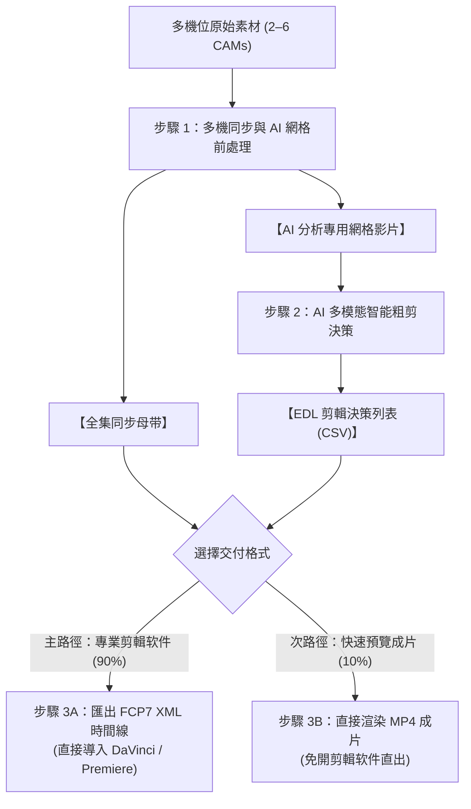

# 多機位影片智慧處理與 AI 剪輯套件 (Multicam Video Pipeline & AI Editing Suite)

[English (en)](README.md) | [简体中文 (zh-CN)](README.zh-TW.md) | [简体中文 (zh-CN)](README.zh-CN.md) | [日本語 (ja)](README.ja.md) | [한국어 (ko)](README.ko.md)

---

> [!NOTE]
> **🚀 原生设计与平台支持说明 (Platform Support & Compatibility)**  
> 本工具套件最初是专为 **Google Antigravity Agent** 原生设计并完成完整端到端验证（深度发挥 1M Context 多模态视频分析与对话剪辑能力）。  
> 为了提升开放性，本项目已采用 **[Agent Plugins 1.0 规范](https://agent-plugins.org/specification)** 进行标准化封装，理论上支持符合该规范的 Agent 客户端（如 **OpenAI Codex 桌面版** 等）直接安装；但目前尚未在所有第三方平台上完成全面测试。

---

本项目為針對大語言模型（Gemini 3.7 Flash 1M Token Context）與專業剪輯软件（DaVinci Resolve、Adobe Premiere Pro、Final Cut Pro）打造的模块化多機位（2 至 6 機）影片智慧處理管线與 AI 粗剪套件。

---

## 📦 Antigravity 导入與安裝結構 (Antigravity Skill Import)

本项目已完全適配 Antigravity Skill 標準結構，可直接 Clone 至 Antigravity 技能目錄下無縫啟用：

```bash
git clone https://github.com/sylphlin/multicam-video-preprocessing.git ~/.gemini/config/skills/multicam-video-preprocessing
```

### 📁 Skill 文件結構
```text
multicam-video-preprocessing/
├── SKILL.md                       # Antigravity 技能規範與分流決策指引
├── assets/                        # Antigravity 提示詞資產 (Prompt Assets)
│   └── edl_interview_template.md  # 雙機訪談提示詞樣板
├── scripts/                       # 核心執行腳本與處理模組
│   ├── multicam_pipeline.py       # Step 1: 多機時間同步、音量標準化、分段與網格合成
│   ├── generate_edl.py          # Step 2: Gemini 3.7 Flash EDL 決策生成
│   ├── export_fcp7_xml.py         # Step 3A: FCP7 XML 時間線匯出 (⭐ 主路徑)
│   ├── edl_to_video.py            # Step 3B: 硬件加速直接渲染成片 (🎬 次路径)
│   ├── concat_videos.py           # Step 3B: 全集章节无损拼接 (🎬 次路径)
│   └── modules/                   # 內部音影核心算法庫
└── README.md
```

---

## 🌟 端到端全流程圖 (Full End-to-End Workflow)



---

## 💬 使用场景與 Prompt 範例

使用者在 Antigravity 对话框中，只需以自然語言提出需求，Agent 即會自動調用底層模組完成全自動處理：

### 场景一：出剪輯 XML（專業剪輯工作流 ⭐ 推薦）
- **適用場景**：需要將粗剪結果導入 DaVinci Resolve、Adobe Premiere Pro 或 Final Cut Pro 進行後續精修、調色與混音。
- **对话 Prompt 範例**：
  > 「*我有兩支雙機位的訪談錄影文件 `CAM1.mp4` 與 `CAM2.mp4`，請幫我進行時間同步與音量標準化，並套用訪談剪輯樣板產出可直接進 DaVinci Resolve 的 XML 時間線。*」
- **交付成果**：
  1. `final_cut_full.xml`（單一完整時間線，含 98+ 鏡頭切點與紅藍理由 Marker 標記）
  2. `CAM1_synced.mp4`、`CAM2_synced.mp4`（100% 音畫同步與 -14 LUFS 響度標準化母带）
- **DaVinci Resolve 導入 3 步驟**：
  1. 打開 DaVinci Resolve 並新建项目。
  2. 將 `CAM1_synced.mp4` 與 `CAM2_synced.mp4` 拖入 **Media Pool（媒體池）**。
  3. 點選 **文件 $\rightarrow$ 導入 $\rightarrow$ 時間線...** (`Cmd + Shift + I`)，選取 `final_cut_full.xml`，全片時間線瞬間載入完畢！

---

### 场景二：直出影片（快速預覽工作流 🎬）
- **適用場景**：臨時不在剪輯工作站前，或需要快速產出 MP4 影片供客戶審查粗剪節奏。
- **对话 Prompt 範例**：
  > 「*請幫我把這兩支多機位素材進行粗剪，並直接渲染合併成一支完整的 MP4 預覽影片給我。*」
- **交付成果**：
  1. `final_cut_full.mp4`（全集無損拼接成品影片）

---

## 🔍 各步驟執行細節說明 (Detailed Pipeline Steps)

### 步驟 1：多機同步與 AI 網格前處理 (`multicam_pipeline.py`)
1. **全域 8kHz FFT 音频時間線對齊**：
   - 提取各機位音频並降採樣至 8kHz 單聲道，透過互相關（Cross-Correlation）算法在數秒內計算出精確的物理時間偏差 $\Delta t$（精確至毫秒），解決開錄時間差與無效起錄段落。
2. **EBU R128 (-14 LUFS) 全集廣播級音量標準化**：
   - 採用雙遍（Two-Pass）音频響度分析與濾鏡處理，將所有機位音频統一標準化至 -14.0 LUFS、11.0 LRA 與 -1.5 dBTP，確保全片各章節音量完全一致且不爆音。
3. **30 至 40 分鐘自然停頓點章節智慧分段 (Auto-Split)**：
   - 自動在 30 至 40 分鐘目標窗口內偵測語音能量極小值與自然呼吸停頓點進行無損切分，完美適配大模型 1M Token 的最佳分析長度。
4. **全集同步母带導出 (`*_synced.mp4`)**：
   - 依據 $\Delta t$ 裁切並導出全長對齊、音量標準化的母带影片，專供 Step 3A 剪輯時間線直接引用。
5. **2 至 6 機多合一緊湊網格畫面合成**：
   - 自動依機位數排版（2機左右並排、3 至 4 機田字格、5 至 6 機六宮格），保證總畫幅 $\le 1920 \times 1080$、每機 $\ge 640 \times 480$，為後續 AI 分析節省 **50%–83% Token 消耗**。

---

### 步驟 2：Gemini 多模態 AI 智能粗剪決策 (`generate_edl.py`)
1. **載入專屬提示詞資產**：
   - 讀取 `assets/edl_interview_template.md` 規則樣板。
2. **Phase 0：頭尾廢料精確裁切 (Pre/Post-roll Trimming)**：
   - 自動辨識並剔除開拍前試音、倒數、確認設備之廢料畫面（標記 `Global_Start_Time`）；
   - 自動識別訪談結尾道別語句，徹底切除收尾未關機閒聊與拔麥雜訊（標記 `Global_End_Time`）。
3. **Phase 1–4：多模態聲畫語義剪輯決策**：
   - **話者識別與追蹤**：以聲音為主導鎖定當前發話者機位，切鏡點精確對齊語音邊界。
   - **關鍵反應鏡頭穿插**：過濾 1 至 2 秒短插話，適時切換至聆聽者 2 至 3 秒之大笑、點頭或驚訝反應鏡頭。
   - **防跳切限制**：強制單鏡頭長度嚴格 $\ge 2.5\text{s}$，確保視覺流暢不閃爍。
4. **產出標準化結果**：
   - 輸出標準 CSV 決策表（`edl_part*.csv`）與 Markdown 裁切分析報告（`edl_part*_report.md`）。

---

### 步驟 3A（主路徑）：匯出 FCP7 XML 剪輯時間線 (`export_fcp7_xml.py`)
1. **多 Part 跨章節時間戳累加映射**：
   - 將 Part 1、Part 2 的局部時間戳自動累加為全片連續時間軸。
2. **1:1 絕對時間碼對應**：
   - 時間線上每一個鏡頭嚴格保持 `start == in` 與 `end == out`，剪輯師在 NLE 中可自由左右波紋微調（Slip/Slide）。
3. **建立連續主音軌與規則 Marker 注入**：
   - 建立全片無斷點的 CAM1 主收音軌道；
   - 將 AI 的剪輯規則與決策理由轉化為時間線上的**紅藍彩色 Marker 標記**，剪輯師可隨時檢閱 AI 的切鏡依據。

---

### 步驟 3B（次路徑）：直接渲染與無損拼接成片 (`edl_to_video.py` & `concat_videos.py`)
1. **硬體加速精確分段渲染**：
   - 調用 Apple Silicon 硬體編碼器（`h264_videotoolbox`），依據 EDL 快速抽取出各章節的剪輯成片（`final_cut_part*.mp4`）。
2. **極速無損流拼接**：
   - 使用 FFmpeg Concat Demuxer（`-c copy`）以每秒數百格速度無損合併為全集 `final_cut_full.mp4`。


---

### 步骤 4：YouTube 高品質字幕生成 (`generate_subtitles.py` ⭐ 新增)
1. **两阶段黃金字幕工作流 (Two-Stage Pipeline)**：
   - **阶段一（Whisper 声学對齊）**：使用本地 `faster-whisper` 高速提取音訊並生成帶有毫秒級時間戳（`00:01:23,450 --> 00:01:26,800`）的基準 SRT 字幕。
   - **阶段二（Gemini 语义校對）**：將基準字幕送入 Gemini 3.7 Flash 進行上下文修訂，**在 100% 嚴格鎖定時間戳不動**的前提下，自動修正同音錯字（如「戲鼓 $\rightarrow$ 矽谷」、「心水 $\rightarrow$ 薪水」、「把費 $\rightarrow$ Buffet」）與中英專業術語。
2. **雙格式無縫交付**：
   - 同時輸出 **`final_cut_full.srt`**（YouTube 標準字幕檔）與 **`final_cut_full.vtt`**（網頁與現代播放器最佳格式），免校對直接上傳！