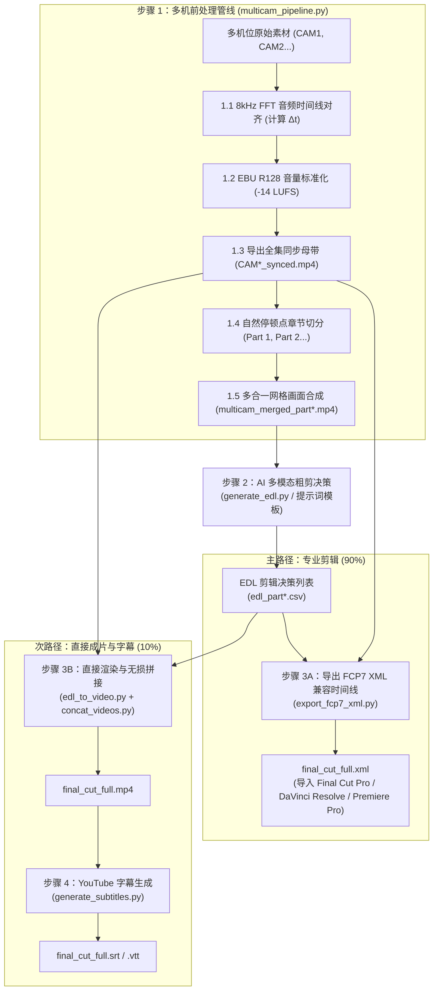

# 多机位视频智能处理与 AI 剪辑套件 (Multicam Video Pipeline & AI Editing Suite)

[English (en)](README.md) | [繁體中文 (zh-TW)](README.zh-TW.md) | [简体中文 (zh-CN)](README.zh-CN.md) | [日本語 (ja)](README.ja.md) | [한국어 (ko)](README.ko.md)

---

> [!IMPORTANT]
> **🚀 Google Antigravity 原生技能与工作流 (Antigravity Native Skill & Workflow)**  
> 本工具套件是专为 **Google Antigravity Agent 架构（基于 Gemini 3.7 Flash 1M 多模态长上下文）** 与专业剪辑软件（DaVinci Resolve、Adobe Premiere Pro、Final Cut Pro）量身打造的原生多机位（2~6 机）智能处理管线与 AI 粗剪套件。

---

本专案为针对长上下文多模态模型（Gemini 3.7 Flash 1M Token Context）与专业剪辑软件（DaVinci Resolve、Adobe Premiere Pro、Final Cut Pro）打造的模块化多机位（2 至 6 机）视频智能处理管线与 AI 粗剪套件。

---

## 📦 Antigravity 导入与安装结构 (Installation & Setup)

本专案完全适配 Antigravity Skill 与 Workflow 标准结构，可直接 Clone 至 Antigravity 技能目录下无缝启用：

```bash
git clone https://github.com/sylphlin/multicam-video-preprocessing.git ~/.gemini/config/skills/multicam-video-preprocessing
```

### 📁 套件文件结构
```text
multicam-video-preprocessing/
├── GEMINI.md                          # Antigravity 根目录常驻工作区规则
├── .agent/
│   ├── rules/
│   │   └── multicam_rules.md          # 常驻纪律规则 (Always-On Rules)
│   └── workflows/
│       └── multicam_workflow.md       # 官方 4 阶段执行工作流 (Stage-Gated Runbook)
├── skills/
│   └── multicam-video-preprocessing/
│       └── SKILL.md                   # Antigravity 技能能力定义清单
├── assets/                            # 提示词模板资产 (Prompt Assets)
│   ├── edl_interview_template.md      # Gemini 访谈粗剪提示词模板
│   └── subtitle_proofread_template.md # YouTube 字幕语义校对模板
├── scripts/                           # 核心执行脚本与处理模块
│   ├── multicam_pipeline.py           # 步骤 1: 多机时间同步、音量标准化、分段与网格合成
│   ├── generate_edl.py                # 步骤 2: Gemini 多模态 AI 剪辑决策生成
│   ├── export_fcp7_xml.py             # 步骤 3A: 导出 FCP7 XML 时间线 (主路径)
│   ├── edl_to_video.py                # 步骤 3B: 直接渲染成片 (次路径)
│   ├── concat_videos.py               # 步骤 3B: 全集章节无损拼接 (次路径)
│   ├── generate_subtitles.py          # 步骤 4: 生成 YouTube 字幕 (Whisper+Gemini)
│   └── modules/                       # 核心声学与视频算法库
└── README.zh-CN.md
```

---

## 🌟 端到端全流程图 (Full End-to-End Workflow)



---

## 💬 使用情境与 Prompt 范例

使用者在 Antigravity 对话框中，只需以自然语言提出需求，Agent 即会自动调用底层模块完成处理：

### 情境一：导出剪辑 XML（专业剪辑工作流 ⭐ 推荐）
- **适用场景**：需要将粗剪结果导入 DaVinci Resolve、Adobe Premiere Pro 或 Final Cut Pro 进行后续精修、调色与混音。
- **对话 Prompt 范例**：
  > 「*我有两支双机位的访谈录像文件 `CAM1.mp4` 与 `CAM2.mp4`，请帮我进行时间同步与音量标准化，并套用访谈剪辑模板产出可直接进 DaVinci Resolve 的 XML 时间线。*」
- **交付成果**：
  1. `final_cut_full.xml`（单一完整时间线，含 98+ 镜头切点与红蓝理由 Marker 标记）
  2. `CAM1_synced.mp4`、`CAM2_synced.mp4`（音画同步与 -14 LUFS 响度标准化母带）
- **DaVinci Resolve 导入步骤**：
  1. 打开 DaVinci Resolve 并新建项目。
  2. 将 `CAM1_synced.mp4` 与 `CAM2_synced.mp4` 拖入 **Media Pool（媒体池）**。
  3. 点击 **文件 $\\rightarrow$ 导入 $\\rightarrow$ 时间线...** (`Cmd + Shift + I`)，选取 `final_cut_full.xml` 加载全片时间线。

---

### 情境二：直出视频与 YouTube 字幕（预览与发布工作流 🎬）
- **适用场景**：不在剪辑工作站前，或需要快速产出 MP4 视频与 YouTube 字幕供审片或直接发布。
- **对话 Prompt 范例**：
  > 「*请帮我把这两支多机位素材进行粗剪，直接渲染合并成一支完整的 MP4 预览视频，并产出校对后的 YouTube 字幕。*」
- **交付成果**：
  1. `final_cut_full.mp4`（全集渲染与无损拼接成品视频）
  2. `final_cut_full.srt` / `final_cut_full.vtt`（Whisper 声学对齐 + Gemini 语义校对之 YouTube 标准字幕）

---

## 🔍 各步骤执行细节说明 (Detailed Pipeline Steps)

### 步骤 1：多机同步与 AI 网格前处理 (`multicam_pipeline.py`)

1. **8kHz FFT 音频时间线全域对齐 (8kHz FFT Audio Time Alignment)**：
   - **为什么降采样至 8kHz？**：人声音频频率特征集中在 300Hz 至 3.4kHz，8kHz 采样已足以完整捕捉语音声学特征，同时大幅降低内存消耗并提升 10 倍以上的计算速度。
   - **FFT 互相关算法原理**：程序自动提取基准机（CAM1）与各目标机（CAM2 至 CAMn）的音频，利用快速傅里叶变换（Fast Fourier Transform）将时域信号转换至频域计算互相关函数（Cross-Correlation），通过寻找互相关能量峰值，精确计算出各机位开始录制的物理时间偏差 $\\Delta t$（精确至毫秒），并自动校正与修剪起跑时间差。
2. **EBU R128 (-14 LUFS) 全集音量标准化 (符合 YouTube 官方建议标准)**：
   - **符合 YouTube 播放规范**：YouTube 平台采用 **-14.0 LUFS** 作为标准响度基准。若视频音量过大（高于 -14 LUFS），YouTube 后台会启动强制压缩衰减导致动态范围受损；若音量过小则影响手机与平板观众的聆听体验。
   - **双遍（Two-Pass）分析与滤镜**：
     - 第一遍：通过 FFmpeg `ebur128` 滤镜精确量测整段音频的整合响度（Integrated Loudness, `I`）、响度范围（Loudness Range, `LRA` = 11.0 LU）与真实峰值（True Peak, `TP` = -1.5 dBTP）。
     - 第二遍：将实际测得参数带入 `loudnorm` 滤镜进行线性增益调整，确保全片各机位与各章节音量完全一致，且绝不发生数字削波破音（True Peak Clipping Prevention）。
3. **全集同步母带导出 (`*_synced.mp4`)**：
   - 依据 $\\Delta t$ 裁切并导出全长对齐、音量标准化的母带视频，专供 Step 3A 剪辑时间线直接引用。
4. **30 至 40 分钟自然停顿点章节智能分段 (应付 1M Context Window 与模型灵活适配)**：
   - **1M Token 上下文最佳平衡**：以 Gemini 3.7 Flash 支持的 1M Token Context 为例，30 至 40 分钟的网格视频约消耗 60 万至 80 万 Token，预留了充足的 Token 空间供系统提示词、深度思考链（Thinking Process）与长文本 EDL 决策输出。
   - **自然呼吸与静音停顿侦测**：程序不会在固定时间点生硬切断，而是在 30 至 40 分钟的滑动窗口内分析音频 RMS 能量，找出语音结束、呼吸停顿或静音点进行无损切分，确保切片交界处不截断讲者的句子。
5. **2 至 6 机多合一紧凑网格画面合成**：
   - 自动依机位数排版（2机左右并排、3 至 4 机田字格、5 至 6 机六宫格），保证总画幅 $\\le 1920 \\times 1080$、每机 $\\ge 640 \\times 480$，为后续 AI 分析节省 **50%–83% Token 消耗**。

---

### 步骤 2：Gemini 多模态 AI 智能粗剪决策 (`generate_edl.py`)
1. **加载专属提示词资产**：
   - 读取 `assets/edl_interview_template.md` 规则模板。
2. **Phase 0：头尾废料裁切 (Pre/Post-roll Trimming)**：
   - 自动辨识并剔除开拍前试音、倒数之废料画面（标记 `Global_Start_Time`）；
   - 自动识别访谈结尾道别语句，切除收尾未关机闲聊与环境杂音（标记 `Global_End_Time`）。
3. **Phase 1–4：多模态声画语义剪辑决策**：
   - **话者识别与追踪**：以声音为主导锁定当前发话者机位，切镜点对齐语音边界。
   - **关键反应镜头穿插**：过滤 1 至 2 秒短插话，适时切换至聆听者 2 至 3 秒之反应镜头。
   - **防跳切限制**：设定单镜头长度 $\\ge 2.5\\text{s}$，维持视觉流畅。
4. **产出标准化结果**：
   - 输出标准 CSV 决策表（`edl_part*.csv`）与 Markdown 裁切分析报告（`edl_part*_report.md`）。

---

### 步骤 3A（主路径）：导出 FCP7 XML 剪辑时间线 (`export_fcp7_xml.py`)

本步骤产出业界通用的 **Final Cut Pro 7 XML（xmeml version 4）** 兼容格式，可无缝导入 **Final Cut Pro**、**DaVinci Resolve**、**Adobe Premiere Pro** 等主流专业剪辑软件（NLE）：
1. **多 Part 跨章节时间戳累加映射**：
   - 将 Part 1、Part 2 的局部时间戳自动累加为全片连续时间轴。
2. **1:1 绝对时间码对应**：
   - 时间线上每一个镜头保持 `start == in` 与 `end == out`，剪辑师在 NLE 中可自由进行波纹修剪（Slip/Slide）。
3. **建立连续主音轨与规则 Marker 注入**：
   - 建立全片连续的 CAM1 主收音轨道；
   - 将 AI 的剪辑规则与决策理由转化为时间线上的红蓝 Marker 标记，方便剪辑师检视。

---

### 步骤 3B（次路径）：直接渲染与无损拼接成片 (`edl_to_video.py` & `concat_videos.py`)
1. **硬件加速分段渲染**：
   - 调用 Apple Silicon 硬件编码器（`h264_videotoolbox`），依据 EDL 快速输出各章节剪辑成片（`final_cut_part*.mp4`）。
2. **无损流拼接**：
   - 使用 FFmpeg Concat Demuxer（`-c copy`）合并为全集 `final_cut_full.mp4`。

---

### 步骤 4：生成 YouTube 字幕 (`generate_subtitles.py`)

本工具结合 **Whisper（语音识别与时间轴对齐）** 与 **Gemini（语义与专有名词校对）** 两阶段流程来制作字幕：

#### 为什么使用「Whisper + Gemini」

| 比较项目 | 纯 Whisper 转录 | 纯 Gemini 语音转录 | Whisper + Gemini |
| :--- | :--- | :--- | :--- |
| **时间轴精确度** | 毫秒级精确对齐 | 时间戳粒度较粗（以语义段落为主） | 毫秒级精确对齐（继承 Whisper 时间码） |
| **同音错别字校正** | 容易出现同音错字（如戏鼓、心水、把费） | 文脉理解能力佳 | 自动校正同音字与专有名词 |
| **字幕阅读节奏** | 符合短句节奏（每句约 1.2–2.5 秒） | 单句篇幅较长（单句约 6–8 秒） | 适合 YouTube 的短句长度（每句约 8–16 字） |
| **逐字忠实度** | 忠实记录说话内容 | 容易出现语义润饰或摘要 | 保留原始说话内容，仅修正错别字 |
| **计算成本** | 本地计算，速度快 | 需消耗音频 Token | 本地处理音频，仅需少量文本 Token 进行校对 |

#### 执行流程：
1. **音频提取**：通过 FFmpeg 提取视频音频，转为 16kHz 单声道 WAV 格式。
2. **阶段一（Whisper 语音转录）**：使用本地 `faster-whisper` 生成带有毫秒级时间戳（`00:01:23,450 --> 00:01:26,800`）的基准 SRT 字幕。
3. **阶段二（Gemini 语义校对）**：加载 `assets/subtitle_proofread_template.md`，调用 Gemini 3.7 Flash 在保持时间戳与序号不变的前提下，修复同音错字（如“硅谷”、“薪水”、“Buffet”）与英文专有名词（如 `Kelly Tsai`、`YouTube`、`DaVinci Resolve`）。
4. **输出文件**：
   - **`final_cut_full.srt`**：YouTube 标准 SubRip 字幕文件。
   - **`final_cut_full.vtt`**：WebVTT 字幕文件。
   - **`final_cut_full_raw_whisper.srt`**：保留原始 Whisper 转录初稿供对照。

---

## 🛠️ 环境需求

- **Google Antigravity IDE / Agent Framework**
- **FFmpeg**（支持 `h264_videotoolbox` 硬件编码与 `loudnorm` 滤镜）
- **Python 3.8+**
- **NumPy** (`pip install numpy`)

---

## 🚀 完整执行指令指南

### 方案 A：专业剪辑工作流（导出 XML 导入 DaVinci / Premiere ⭐ 推荐）

```bash
# 1. 多机位前处理（同步对齐 + 音量标准化 + 停顿切分 + 导出同步母带 + 网格合成）
python3 scripts/multicam_pipeline.py \
  --ref CAM1.mp4 --targets CAM2.mp4 \
  --auto-split --split-min-dur 30 --split-max-dur 40 \
  --normalize --merge \
  -o ./output/

# 2. Gemini 3.7 Flash AI 多模态粗剪决策（针对每个 Part 执行）
python3 scripts/generate_edl.py -v ./output/multicam_merged_part1.mp4
python3 scripts/generate_edl.py -v ./output/multicam_merged_part2.mp4

# 3A. 导出 FCP7 XML 剪辑时间线
python3 scripts/export_fcp7_xml.py -d ./output/ -o ./output/final_cut_full.xml
```

---

### 方案 B：命令行直接成片渲染（快速预览 🎬）

```bash
# 1. 多机位前处理（同方案 A）
python3 scripts/multicam_pipeline.py \
  --ref CAM1.mp4 --targets CAM2.mp4 \
  --auto-split --normalize --merge -o ./output/

# 2. Gemini AI 粗剪决策（同方案 A）
python3 scripts/generate_edl.py -v ./output/multicam_merged_part1.mp4
python3 scripts/generate_edl.py -v ./output/multicam_merged_part2.mp4

# 3B. 渲染各分段成片并无损合并
python3 scripts/edl_to_video.py --edl ./output/edl_part1.csv
python3 scripts/edl_to_video.py --edl ./output/edl_part2.csv
python3 scripts/concat_videos.py -d ./output/ -o ./output/final_cut_full.mp4

# 4. 生成 YouTube 字幕（Whisper 转录 + Gemini 语义校对）
python3 scripts/generate_subtitles.py -i ./output/final_cut_full.mp4
```

---

## ⚙️ CLI 参数速查表 (`multicam_pipeline.py`)

| 参数 | 说明 | 默认值 |
| :--- | :--- | :--- |
| `--ref` | 基准摄像机视频路径 (CAM1) | *必填* |
| `--targets` / `--target` | 1~5 支目标摄像机视频路径（支持 2~6 机） | *必填* |
| `--auto-split` | 启用 30~40 分钟自然停顿章节切分 | `False` |
| `--split-min-dur` | 切分片段最小时长 (分钟) | `30.0` |
| `--split-max-dur` | 切分片段最大时长 (分钟) | `40.0` |
| `--merge` / `--multi-in-one` | 渲染多合一网格视频（节省 50%~83% Token） | `False` |
| `--encoder` | 视频编码器 (`h264_videotoolbox` / `libx264`) | `h264_videotoolbox` |
| `--normalize` | 启用 EBU R128 (-14 LUFS) 广播级音量标准化 | `False` |
| `-o` / `--output-dir` | 同步母带、网格视频与报告输出目录 | `.` (当前目录) |
| `--suffix` | 同步母带文件名后缀 | `_synced` |
