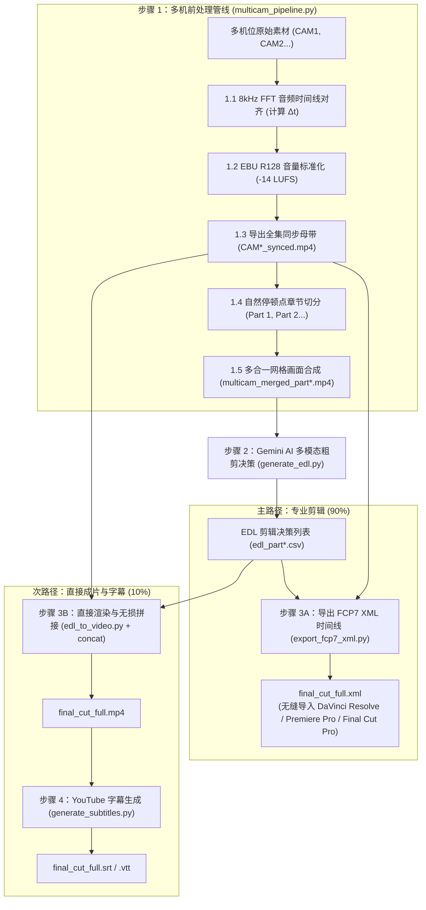

# 多机位视频智能处理与 AI 剪辑套件 (Multicam Video Pipeline & AI Editing Suite)

[English (en)](README.md) | [繁體中文 (zh-TW)](README.zh-TW.md) | [简体中文 (zh-CN)](README.zh-CN.md) | [日本語 (ja)](README.ja.md) | [한국어 (ko)](README.ko.md)

---

> [!IMPORTANT]
> **🚀 Google Antigravity 原生技能与工作流 (Antigravity Native Skill & Workflow)**  
> 本工具套件是专为 **Google Antigravity Agent 架构（基于 Gemini 3.7 Flash 1M 多模态长上下文）** 与专业剪辑软件（DaVinci Resolve、Adobe Premiere Pro、Final Cut Pro）量身打造的原生多机位（2~6 机）智能处理管线。

---

本专案将复杂的多机位音视频工程封装为 **4 阶段严格门禁工作流 (4-Stage Gated Workflow)**，涵盖 FFT 物理声学时间对齐、EBU R128 广播级音量标准化、30~40 分钟自然停顿切分、多合一紧凑网格画面合成、Gemini 3.7 Flash 多模态粗剪决策、FCP7 XML 时间线导出，以及高精度 YouTube 字幕制作。

---

## 📦 Antigravity 导入与结构 (Installation & Setup)

本专案完全适配 Antigravity Skill 与 Workflow 标准结构，可直接 Clone 至 Antigravity 技能目录下无缝启用：

```bash
git clone https://github.com/sylphlin/multicam-video-preprocessing.git ~/.gemini/config/skills/multicam-video-preprocessing
```

### 📁 套件文件结构
```text
multicam-video-preprocessing/
├── GEMINI.md                          # Antigravity 根目录常驻工作区规则
├── .agent/
│   ├── rules/
│   │   └── multicam_rules.md          # 常驻纪律规则 (Always-On Rules)
│   └── workflows/
│       └── multicam_workflow.md       # 官方 4 阶段执行工作流 (Stage-Gated Runbook)
├── skills/
│   └── multicam-video-preprocessing/
│       └── SKILL.md                   # Antigravity 技能能力定义清单
├── assets/                            # 提示词模板资产
│   ├── edl_interview_template.md      # Gemini 访谈粗剪提示词模板
│   └── subtitle_proofread_template.md # YouTube 字幕语义校对模板
├── scripts/                           # 核心执行工具库
│   ├── multicam_pipeline.py           # 步骤 1: 多机时间同步、音量标准化、分段与网格合成
│   ├── generate_edl.py                # 步骤 2: Gemini 3.7 Flash 多模态剪辑决策
│   ├── export_fcp7_xml.py             # 步骤 3A: 导出 FCP7 XML 剪辑时间线 (主路径)
│   ├── edl_to_video.py                # 步骤 3B: 直接渲染分段成片 (次路径)
│   ├── concat_videos.py               # 步骤 3B: 全集章节无损拼接 (次路径)
│   ├── generate_subtitles.py          # 步骤 4: YouTube 字幕生成 (Whisper+Gemini)
│   └── modules/                       # 核心声学与视频算法模块
└── README.zh-CN.md
```

---

## 🌟 端到端全流程架构 (Full End-to-End Workflow)



---

## 🛠️ 环境需求

- **Google Antigravity IDE / Agent Framework**
- **FFmpeg**（支持 `h264_videotoolbox` 硬件编码与 `loudnorm` 滤镜）
- **Python 3.8+**
- **NumPy** (`pip install numpy`)

---

## 🚀 完整执行指令指南

### 方案 A：专业剪辑工作流（导出 XML 导入 DaVinci / Premiere ⭐ 推荐）

```bash
# 1. 多机位前处理（同步对齐 + 音量标准化 + 停顿切分 + 导出同步母带 + 网格合成）
python3 scripts/multicam_pipeline.py \
  --ref CAM1.mp4 --targets CAM2.mp4 \
  --auto-split --split-min-dur 30 --split-max-dur 40 \
  --normalize --merge \
  -o ./output/

# 2. Gemini 3.7 Flash AI 多模态粗剪决策（针对每个 Part 执行）
python3 scripts/generate_edl.py -v ./output/multicam_merged_part1.mp4
python3 scripts/generate_edl.py -v ./output/multicam_merged_part2.mp4

# 3A. 导出 FCP7 XML 剪辑时间线
python3 scripts/export_fcp7_xml.py -d ./output/ -o ./output/final_cut_full.xml
```

#### 🎬 DaVinci Resolve 导入步骤：
1. 打开 DaVinci Resolve 并新建项目。
2. 将 `./output/CAM1_synced.mp4` 与 `./output/CAM2_synced.mp4` 拖入**媒体池 (Media Pool)**。
3. 点击 **文件 $\\rightarrow$ 导入 $\\rightarrow$ 时间线...** (`Ctrl+Shift+I` / `Cmd+Shift+I`)，选择 `final_cut_full.xml`。
4. 全片所有镜头切点、主音频轨与彩色 Marker 标记瞬间加载就绪！

---

### 方案 B：命令行直接成片渲染（快速预览 🎬）

```bash
# 1. 多机位前处理（同方案 A）
python3 scripts/multicam_pipeline.py \
  --ref CAM1.mp4 --targets CAM2.mp4 \
  --auto-split --normalize --merge -o ./output/

# 2. Gemini AI 粗剪决策（同方案 A）
python3 scripts/generate_edl.py -v ./output/multicam_merged_part1.mp4
python3 scripts/generate_edl.py -v ./output/multicam_merged_part2.mp4

# 3B. 渲染各分段成片并无损合并
python3 scripts/edl_to_video.py --edl ./output/edl_part1.csv
python3 scripts/edl_to_video.py --edl ./output/edl_part2.csv
python3 scripts/concat_videos.py -d ./output/ -o ./output/final_cut_full.mp4

# 4. 生成 YouTube 字幕（Whisper 转录 + Gemini 语义校对）
python3 scripts/generate_subtitles.py -i ./output/final_cut_full.mp4
```

---

## ⚙️ CLI 参数速查表 (`multicam_pipeline.py`)

| 参数 | 说明 | 默认值 |
| :--- | :--- | :--- |
| `--ref` | 基准摄像机视频路径 (CAM1) | *必填* |
| `--targets` / `--target` | 1~5 支目标摄像机视频路径（支持 2~6 机） | *必填* |
| `--auto-split` | 启用 30~40 分钟自然停顿章节切分 | `False` |
| `--split-min-dur` | 切分片段最小时长 (分钟) | `30.0` |
| `--split-max-dur` | 切分片段最大时长 (分钟) | `40.0` |
| `--merge` / `--multi-in-one` | 渲染多合一网格视频（节省 50%~83% Token） | `False` |
| `--encoder` | 视频编码器 (`h264_videotoolbox` / `libx264`) | `h264_videotoolbox` |
| `--normalize` | 启用 EBU R128 (-14 LUFS) 广播级音量标准化 | `False` |
| `-o` / `--output-dir` | 同步母带、网格视频与报告输出目录 | `.` (当前目录) |
| `--suffix` | 同步母带文件名后缀 | `_synced` |
