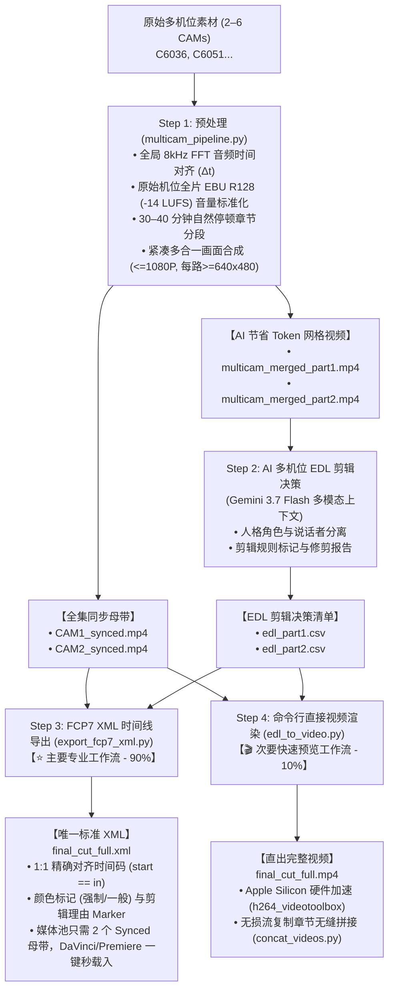

# 多机位视频预处理与 AI 剪辑套件 (Multicam Video Preprocessing & AI Editing Suite)

[English (en)](README.md) | [繁體中文 (zh-TW)](README.zh-TW.md) | [简体中文 (zh-CN)](README.zh-CN.md) | [日本語 (ja)](README.ja.md) | [한국어 (ko)](README.ko.md)

---

高性能、模块化的多机位（2、4、6 乃至 N 机位）音视频预处理与 AI 剪辑工具库，专为大语言/多模态模型（Gemini 3.7 Flash 1M Context Window）与专业剪辑软件（DaVinci Resolve, Adobe Premiere Pro, Final Cut Pro）设计。

---

## 🌟 端到端全流程图 (Full End-to-End Workflow)



---

## 📁 简洁产出目录结构 (Clean Directory Structure)

```text
output/
 ├── multicam_sync.json           # 时间对齐偏移量与章节时间戳元数据
 ├── multicam_sync.csv            # 格式化表格
 │
 ├── CAM1_synced.mp4              # 全集完整长度同步母带 (CAM1，EBU R128 -14 LUFS)
 ├── CAM2_synced.mp4              # 全集完整长度同步母带 (CAM2，Δt 已校准对齐)
 │
 ├── multicam_merged_part1.mp4    # 轻量多合一网格 (Part 1，节省 50–83% AI Token)
 ├── multicam_merged_part2.mp4    # 轻量多合一网格 (Part 2，节省 50–83% AI Token)
 │
 ├── edl_part1.csv                # Gemini AI 剪辑决策 (Part 1)
 ├── edl_part2.csv                # Gemini AI 剪辑决策 (Part 2)
 │
 ├── final_cut_full.xml           # ⭐【主要】唯一标准 FCP7 XML 时间线 (供剪辑软件导入)
 └── final_cut_full.mp4           # 🎬【次要】命令行直出剪辑完成视频
```

---

## 🛠️ 前置需求

- **FFmpeg**（支持 `h264_videotoolbox` 与 `loudnorm` 滤镜）
- **Python 3.8+**
- **NumPy** (`pip install numpy`)

---

## 🚀 完整逐步执行指南

### Step 1：多机位预处理（时间对齐 + 音量标准化 + 分段 + 多合一合成）
一键执行全局音频对齐、-14 LUFS 音量标准化、自然停顿章节分段，并同时产出完整同步母带与 AI 专用网格视频：

```bash
python3 scripts/multicam_pipeline.py \
  --ref CAM1.mp4 \
  --targets CAM2.mp4 \
  --auto-split \
  --split-min-dur 30 --split-max-dur 40 \
  --normalize \
  --merge \
  --output-dir ./output/
```

### Step 2：Gemini AI 多机位 EDL 生成
直接将 `multicam_merged_part1.mp4` / `multicam_merged_part2.mp4` 上传至 Antigravity（Gemini 3.7 Flash 上下文），应用剪辑规则提示词，产出标准决策文件 `edl_part1.csv` 与 `edl_part2.csv`。

### Step 3（主要路径）：导出 FCP7 XML 至 DaVinci / Premiere
将 EDL 决策转换为专业 NLE 可直接读取的 Final Cut Pro 7 XML，并无缝关联 `CAM1_synced.mp4` 与 `CAM2_synced.mp4`：

```bash
python3 scripts/export_fcp7_xml.py \
  -d ./output/ \
  -o ./output/final_cut_full.xml
```

#### 🎬 DaVinci Resolve 导入步骤：
1. 打开 DaVinci Resolve 并创建新项目。
2. 将 `CAM1_synced.mp4` 与 `CAM2_synced.mp4` 拖入**媒体池 (Media Pool)**。
3. 点击 **文件 $\rightarrow$ 导入 $\rightarrow$ 时间线...** (`Cmd + Shift + I`)，选取 `final_cut_full.xml`。
4. 全片 98+ 个镜头、立体声音轨与彩色剪辑规则标记（红色强制 / 蓝色一般）瞬间完整载入！剪辑师可自由滑动微调每个镜头边界。

---

### Step 4（次要路径）：命令行直接渲染与章节合并
如果您无需在剪辑软件中微调，想直接输出最终剪辑视频：

```bash
# 渲染各 Part 子视频
python3 scripts/edl_to_video.py -e ./output/edl_part1.csv -d ./output/ -o ./output/final_cut_part1.mp4
python3 scripts/edl_to_video.py -e ./output/edl_part2.csv -d ./output/ -o ./output/final_cut_part2.mp4

# 无损流复制拼接为全集视频
python3 scripts/concat_videos.py \
  --inputs ./output/final_cut_part1.mp4 ./output/final_cut_part2.mp4 \
  --output ./output/final_cut_full.mp4
```

---

## ⚙️ CLI 参数详细对照表 (`multicam_pipeline.py`)

| 参数 | 说明 | 默认值 |
| :--- | :--- | :--- |
| `--ref` | 基准锚点机位视频路径 (CAM1) | *必填* |
| `--targets` / `--target` | 一至多个目标机位视频路径（支持 2 至 6 机位） | *必填* |
| `--auto-split` | 启用 30~40 分钟自然停顿点章节分段切片 | `False` |
| `--split-min-dur` | 分段最小时长（分钟） | `30.0` |
| `--split-max-dur` | 分段最大时长（分钟） | `40.0` |
| `--merge` / `--multi-in-one` | 渲染多合一合并画面（并排/网格）以节省 AI Token | `False` |
| `--encoder` | 视频编码器 (`h264_videotoolbox` / `libx264`) | `h264_videotoolbox` |
| `--normalize` | 启用 EBU R128 (-14 LUFS) 全片音量标准化 | `False` |
| `--lufs` | 目标整合响度 (LUFS) | `-14.0` |
| `--lra` | 响度范围 (LU) | `11.0` |
| `--tp` | 真峰值上限 (dBTP) | `-1.5` |
| `--ref-start` | 基准机位手动剪辑起点 (`HH:MM:SS.mmm` 或秒数) | `None` |
| `--ref-end` | 基准机位手动剪辑终点 (`HH:MM:SS.mmm` 或秒数) | `None` |
| `--output-dir` | 输出同步母带、子片段与报表之目录路径 | `.` (当前目录) |
| `--suffix` | 同步导出之文件名后缀 | `_synced` |
| `--sr` | 音频 FFT 对齐采样率 (Hz) | `8000` |
| `--workers` | 并行计算线程数 | `2` |
| `--export-json` | 指定导出 JSON 报表路径 | `None` |
| `--export-csv` | 指定导出 CSV 报表路径 | `None` |
