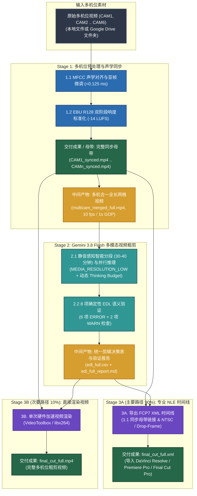

# Multi-Camera Video Pipeline & AI Editing Suite

[English (en)](README.md) | [繁體中文 (zh-TW)](README.zh-TW.md) | [简体中文 (zh-CN)](README.zh-CN.md) | [日本語 (ja)](README.ja.md) | [한국어 (ko)](README.ko.md)

---

> [!IMPORTANT]
> **Google Antigravity 原生技能与工作流套件**  
> 本工具集为 **Google Antigravity**（由 **Vertex AI Gemini 3.8 Flash** 驱动）与专业非线性剪辑软件（**DaVinci Resolve**、**Adobe Premiere Pro**、**Final Cut Pro**）打造三阶段多机位预处理与 AI 粗剪工作流。

---

**Multi-Camera Video Pipeline & AI Editing Suite** 支持 2 至 6 机位音频对齐、广播级响度标准化、AI 粗剪时间线生成与多机位预览视频渲染。直接在 Antigravity 对话窗口使用自然语言下达指令，即可由 Agent 自动执行多机位同步与粗剪工作流。

---

## 安装与 Google Cloud 环境配置 (`setup.sh`)

本项目遵循 [Agent Plugins 1.0](https://agent-plugins.org/) 规范，完全基于 **Google Cloud Vertex AI (ADC)** 与 **Cloud Storage (GCS)** 运行，无需 API Key。

```bash
# 1a. 安装为全局 Antigravity Plugin（推荐）
git clone https://github.com/sylphlin/multicam-video-preprocessing.git ~/.gemini/config/plugins/multicam-video-preprocessing

# 1b. 旧版单一 Skill 安装（可选：将内部 skills/multicam-video-preprocessing 链接至 ~/.gemini/config/skills/）
ln -s ~/.gemini/config/plugins/multicam-video-preprocessing/skills/multicam-video-preprocessing ~/.gemini/config/skills/multicam-video-preprocessing

# 2. 安装依赖与授权 ADC
brew install ffmpeg
pip install numpy google-genai google-cloud-storage requests
gcloud auth application-default login

# 3. 运行 setup.sh 配置 GCS 存储桶、双层生命周期规则（raw: 2 天，交付物: 15 天）、IAM 与 .env
chmod +x setup.sh
./setup.sh --project YOUR_GCP_PROJECT_ID
```

### 项目目录结构（Agent Plugins 1.0 标准规范）
- **SSOT 实体目录**：`skills/multicam-video-preprocessing/`（内含 `SKILL.md`、`scripts/` 与 `assets/`）作为唯一真实来源（Single Source of Truth）。
- **双层 `AGENTS.md` 规范**：根目录 `AGENTS.md` 定义工作区与工程开发规范（Part I & Part II），`rules/AGENTS.md` 随 Plugin 打包注入 AI 客户端执行期守则（定位 `<PLUGIN_ROOT>` 直接调用 CLI、只读与 Fail-Fast）。

---

## 三阶段端到端工作流架构


```mermaid
flowchart TD
    classDef inputStyle fill:#2D3748,stroke:#4A5568,stroke-width:2px,color:#fff;
    classDef stage1Style fill:#2B6CB0,stroke:#2C5282,stroke-width:2px,color:#fff;
    classDef stage2Style fill:#319795,stroke:#285E61,stroke-width:2px,color:#fff;
    classDef stage3Style fill:#6B46C1,stroke:#553C9A,stroke-width:2px,color:#fff;
    classDef artifactStyle fill:#D69E2E,stroke:#B7791F,stroke-width:2px,color:#fff;
    classDef outputStyle fill:#276749,stroke:#1C4532,stroke-width:2px,color:#fff;

    subgraph Inputs["输入多机位素材"]
        A["原始多机位视频 (CAM1, CAM2 .. CAM6)<br/>(本地文件或 Google Drive 文件夹)"]:::inputStyle
    end

    subgraph S1["Stage 1: 多机位预处理与声学同步"]
        S1_1["1.1 MFCC 声学对齐与亚帧微调 (<0.125 ms)"]:::stage1Style
        S1_2["1.2 EBU R128 双阶段响度标准化 (-14 LUFS)"]:::stage1Style
        S1_3["交付成果 / 母带: 完整同步母带<br/>(CAM1_synced.mp4 .. CAMn_synced.mp4)"]:::outputStyle
        S1_4["中间产物: 多机合一全长网格视频<br/>(multicam_merged_full.mp4, 10 fps / 1s GOP)"]:::artifactStyle
        S1_1 --> S1_2
        S1_2 --> S1_3
        S1_3 --> S1_4
    end

    subgraph S2["Stage 2: Gemini 3.8 Flash 多模态视频粗剪"]
        S2_1["2.1 静音感知智能分段 (30-40 分钟) 与并行推理<br/>(MEDIA_RESOLUTION_LOW + 动态 Thinking Budget)"]:::stage2Style
        S2_2["2.2 8 项确定性 EDL 语义验证<br/>(6 项 ERROR + 2 项 WARN 检查)"]:::stage2Style
        EDL["中间产物: 统一剪辑决策表与验证报告<br/>(edl_full.csv + edl_full_report.md)"]:::artifactStyle
        S2_1 --> S2_2
        S2_2 --> EDL
    end

    subgraph S3A["Stage 3A (主要路径 90%): 专业 NLE 时间线"]
        S3A_ACT["3A. 导出 FCP7 XML 时间线<br/>(1:1 同步母带链接 & NTSC / Drop-Frame)"]:::stage3Style
        XML["交付成果: final_cut_full.xml<br/>(导入 DaVinci Resolve / Premiere Pro / Final Cut Pro)"]:::outputStyle
        S3A_ACT --> XML
    end

    subgraph S3B["Stage 3B (次要路径 10%): 直接渲染视频"]
        S3B_ACT["3B. 单次硬件加速视频渲染<br/>(VideoToolbox / libx264)"]:::stage3Style
        MP4["交付成果: final_cut_full.mp4<br/>(完整多机位粗剪视频)"]:::outputStyle
        S3B_ACT --> MP4
    end

    A --> S1_1
    S1_4 --> S2_1
    S1_3 --> S3A_ACT
    EDL --> S3A_ACT
    S1_3 --> S3B_ACT
    EDL --> S3B_ACT
```

---

## Antigravity 操作方式与使用场景 (Usage & Scenarios)

在 Antigravity 中有两种调用方式：
1. **极简指令（`/skill` + `@文件`）**：输入 `/multicam-video-preprocessing` 绑定技能，并用 `@` 指定多机位视频文件或云端文件夹链接，无需额外解释。
2. **自然语言口语描述**：直接用口语描述需求并附上 `@` 文件或云端链接，Agent 会自动加载对应插件。

### 场景 1：导出专业 NLE XML 时间线（推荐主要工作流）
- **适用场景**：将 AI 多机位粗剪决策导入 DaVinci Resolve、Adobe Premiere Pro 或 Final Cut Pro 进行精剪与调色。
- **方式 A（`/ + @` 极简指令）**：
  ```text
  /multicam-video-preprocessing 机位1: @CAM1.mp4, 机位2: @CAM2.mp4
  ```
- **方式 B（口语描述）**：
  ```text
  帮我同步 @CAM1.mp4 和 @CAM2.mp4，将响度标准化到 -14 LUFS，并导出可导入 DaVinci Resolve 的 FCP7 XML 粗剪时间线。
  ```
- **交付成果**：
  1. `final_cut_full.xml`（包含机位切换切点与剪辑理由标记的时间线）。
  2. `CAM1_synced.mp4`、`CAM2_synced.mp4`（已完成毫秒级对齐与 `-14 LUFS` 响度标准化的同步母带）。

### 场景 2：直接渲染多机位粗剪成品视频
- **适用场景**：无需打开剪辑软件，直接输出完成机位切换的 MP4 预览或成品视频。
- **方式 A（`/ + @` 极简指令）**：
  ```text
  /multicam-video-preprocessing 机位1: @CAM1.mp4, 机位2: @CAM2.mp4, 输出: 直接渲染 MP4
  ```
- **方式 B（口语描述）**：
  ```text
  帮我把 @CAM1.mp4 和 @CAM2.mp4 做多机位 AI 粗剪，并直接渲染生成 final_cut_full.mp4。
  ```
- **交付成果**：
  1. `final_cut_full.mp4`（单次硬件加速渲染的完整视频）。
  2. `edl_full.csv` 与 `edl_full_report.md`（机位切换决策表与 8 项语义验证报告）。

### 场景 3：从 Google Drive 文件夹执行多机位同步与粗剪
- **适用场景**：直接提供存放多机位素材的 Google Drive 文件夹链接，由 Agent 自动下载（含远程 MD5 缓存校验）、同步并导出粗剪时间线。
- **方式 A（`/ + @` 极简指令）**：
  ```text
  /multicam-video-preprocessing 文件夹: https://drive.google.com/drive/folders/FOLDER_ID
  ```
- **方式 B（口语描述）**：
  ```text
  从这个 Google Drive 文件夹 https://drive.google.com/drive/folders/FOLDER_ID 下载多机位视频，完成音频同步与 -14 LUFS 标准化，并导出 FCP7 XML 时间线。
  ```
- **交付成果**：
  1. `CAM1_synced.mp4` .. `CAMn_synced.mp4`（同步与响度标准化母带）。
  2. `edl_full.csv`、`edl_full_report.md` 与 `final_cut_full.xml`。

---

## 三阶段核心技术说明

1. **Stage 1（多机位同步与预处理）**：执行 MFCC 声学时间对齐与亚帧微调（`<0.125 ms`）、EBU R128（`-14 LUFS`）双阶段线性响度标准化、逐帧精准同步母带导出（`CAM*_synced.mp4`，`20 Mbps`）与全长轻量网格合成（`multicam_merged_full.mp4`，`10 fps`、`1.2 Mbps`、1 秒短 GOP）。
2. **Stage 2（Gemini 3.8 Flash 多模态粗剪与静音感知智能分段）**：默认采用 **Vertex AI Gemini 3.8 Flash** 标准多模态模式（`MEDIA_RESOLUTION_LOW` + 动态 `thinking_budget` `1024–4096`）。当视频超过 40 分钟时，自动在 30–40 分钟自然静音点无损切分至 `<output_dir>/_edl_chunks/` 并行推理，自动平移缝合为 `edl_full.csv` 并在 `finally` 块清理本地与云端临时分段，同时执行 8 项确定性语义检查（`6 ERROR + 2 WARN`）。
3. **Stage 3A & 3B（导出 FCP7 XML 时间线 / 硬件加速视频渲染）**：支持 NTSC 分数帧率（`23.976`, `29.97`, `59.94`）与丢帧时间码（Drop-Frame）导出 `final_cut_full.xml`，或直接单次硬件渲染 `final_cut_full.mp4`。

---

## GCS 双层生命周期规则 (`gs://multicam-video-${PROJECT_ID}`)

| GCS 路径前缀 (`matchesPrefix`) | 存储对象 | 保留天数 (`age`) | 清理机制 |
| :--- | :--- | :--- | :--- |
| **`raw/`** | 暂存网格视频 (`multicam_merged_full.mp4`) 与分段档 (`raw/edl_chunks/*`) | **2 天 (`age: 2`)** | `raw/edl_chunks/*` 在推理结束后立即由 `finally` 删除；全长文件保留 2 天供 SHA-256 缓存复用，期满自动删除。 |
| **`output/`**、**`deliverables/`**、**`multicam_assets/`** | XML/CSV 时间线、渲染视频与验证报告 | **15 天 (`age: 15`)** | 保留 15 天供团队审阅，期满自动清理。 |

---

## 许可证 (License)

本项目采用 [MIT License](LICENSE) 授权。
