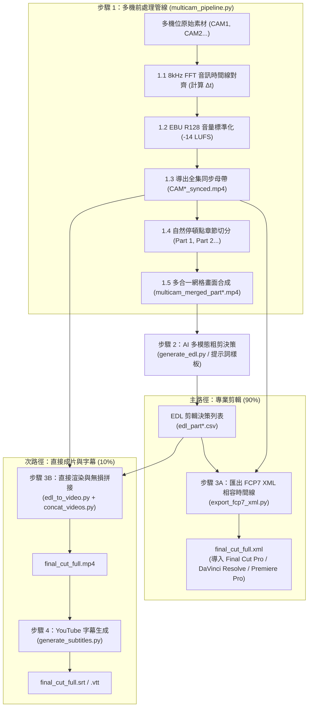

# 多機位影片智慧處理與 AI 剪輯套件 (Multicam Video Pipeline & AI Editing Suite)

[English (en)](README.md) | [繁體中文 (zh-TW)](README.zh-TW.md) | [简体中文 (zh-CN)](README.zh-CN.md) | [日本語 (ja)](README.ja.md) | [한국어 (ko)](README.ko.md)

---

> [!IMPORTANT]
> **🚀 Google Antigravity 原生技能與工作流 (Antigravity Native Skill & Workflow)**  
> 本工具套件是專為 **Google Antigravity Agent 架構（基於 Gemini 3.7 Flash 1M 多模態長上下文）** 與專業剪輯軟體（DaVinci Resolve、Adobe Premiere Pro、Final Cut Pro）量身打造的原生多機位（2~6 機）智慧處理管線與 AI 粗剪套件。

---

本專案為針對長上下文多模態模型（Gemini 3.7 Flash 1M Token Context）與專業剪輯軟體（DaVinci Resolve、Adobe Premiere Pro、Final Cut Pro）打造的模組化多機位（2 至 6 機）影片智慧處理管線與 AI 粗剪套件。

---

## 📦 Antigravity 匯入與安裝結構 (Installation & Setup)

本專案完全適配 Antigravity Skill 與 Workflow 標準結構，可直接 Clone 至 Antigravity 技能目錄下無縫啟用：

```bash
git clone https://github.com/sylphlin/multicam-video-preprocessing.git ~/.gemini/config/skills/multicam-video-preprocessing
```

### 📁 套件檔案結構
```text
multicam-video-preprocessing/
├── GEMINI.md                          # Antigravity 根目錄常駐工作區規則
├── .agent/
│   ├── rules/
│   │   └── multicam_rules.md          # 常駐紀律規則 (Always-On Rules)
│   └── workflows/
│       └── multicam_workflow.md       # 官方 4 階段執行工作流 (Stage-Gated Runbook)
├── skills/
│   └── multicam-video-preprocessing/
│       └── SKILL.md                   # Antigravity 技能能力定義清單
├── assets/                            # 提示詞樣板資產 (Prompt Assets)
│   ├── edl_interview_template.md      # Gemini 訪談粗剪提示詞樣板
│   └── subtitle_proofread_template.md # YouTube 字幕語意校對樣板
├── scripts/                           # 核心執行腳本與處理模組
│   ├── multicam_pipeline.py           # 步驟 1: 多機時間同步、音量標準化、分段與網格合成
│   ├── generate_edl.py                # 步驟 2: Gemini 多模態 AI 剪輯決策生成
│   ├── export_fcp7_xml.py             # 步驟 3A: 匯出 FCP7 XML 時間線 (主路徑)
│   ├── edl_to_video.py                # 步驟 3B: 直接渲染成片 (次路徑)
│   ├── concat_videos.py               # 步驟 3B: 全集章節無損拼接 (次路徑)
│   ├── generate_subtitles.py          # 步驟 4: 生成 YouTube 字幕 (Whisper+Gemini)
│   └── modules/                       # 核心聲學與視訊演算法庫
└── README.zh-TW.md
```

---

## 🌟 端到端全流程圖 (Full End-to-End Workflow)



---

## 💬 使用情境與 Prompt 範例

使用者在 Antigravity 對話框中，只需以自然語言提出需求，Agent 即會自動調用底層模組完成處理：

### 情境一：匯出剪輯 XML（專業剪輯工作流 ⭐ 推薦）
- **適用場景**：需要將粗剪結果導入 DaVinci Resolve、Adobe Premiere Pro 或 Final Cut Pro 進行後續精修、調色與混音。
- **對話 Prompt 範例**：
  > 「*我有兩支雙機位的訪談錄影檔案 `CAM1.mp4` 與 `CAM2.mp4`，請幫我進行時間同步與音量標準化，並套用訪談剪輯樣板產出可直接進 DaVinci Resolve 的 XML 時間線。*」
- **交付成果**：
  1. `final_cut_full.xml`（單一完整時間線，含 98+ 鏡頭切點與紅藍理由 Marker 標記）
  2. `CAM1_synced.mp4`、`CAM2_synced.mp4`（音畫同步與 -14 LUFS 響度標準化母帶）
- **DaVinci Resolve 導入步驟**：
  1. 打開 DaVinci Resolve 並新建專案。
  2. 將 `CAM1_synced.mp4` 與 `CAM2_synced.mp4` 拖入 **Media Pool（媒體池）**。
  3. 點選 **檔案 $\\rightarrow$ 導入 $\\rightarrow$ 時間線...** (`Cmd + Shift + I`)，選取 `final_cut_full.xml` 載入全片時間線。

---

### 情境二：直出影片與 YouTube 字幕（預覽與發布工作流 🎬）
- **適用場景**：不在剪輯工作站前，或需要快速產出 MP4 影片與 YouTube 字幕供審片或直接發布。
- **對話 Prompt 範例**：
  > 「*請幫我把這兩支多機位素材進行粗剪，直接渲染合併成一支完整的 MP4 預覽影片，並產出校對後的 YouTube 字幕。*」
- **交付成果**：
  1. `final_cut_full.mp4`（全集渲染與無損拼接成品影片）
  2. `final_cut_full.srt` / `final_cut_full.vtt`（Whisper 聲學對齊 + Gemini 語意校對之 YouTube 標準字幕）

---

## 🔍 各步驟執行細節說明 (Detailed Pipeline Steps)

### 步驟 1：多機同步與 AI 網格前處理 (`multicam_pipeline.py`)

1. **8kHz FFT 音訊時間線全域對齊 (8kHz FFT Audio Time Alignment)**：
   - **為什麼降採樣至 8kHz？**：人聲語音頻率特徵集中在 300Hz 至 3.4kHz，8kHz 取樣已足以完整捕捉語音聲學特徵，同時大幅降低記憶體消耗並提升 10 倍以上的運算速度。
   - **FFT 互相關演算法原理**：程式自動提取基準機（CAM1）與各目標機（CAM2 至 CAMn）的音訊，利用快速傅立葉變換（Fast Fourier Transform）將時域訊號轉換至頻域計算互相關函數（Cross-Correlation），透過尋找互相關能量峰值，精確計算出各機位開始錄製的物理時間偏差 $\\Delta t$（精確至毫秒），並自動校正與修剪起跑時間差。
2. **EBU R128 (-14 LUFS) 全集音量標準化 (符合 YouTube 官方建議標準)**：
   - **符合 YouTube 播放規範**：YouTube 平台採用 **-14.0 LUFS** 作為標準響度基準。若影片音量過大（高於 -14 LUFS），YouTube 後台會啟動強制壓縮衰減導致動態範圍受損；若音量過小則影響手機與平板觀眾的聆聽體驗。
   - **雙遍（Two-Pass）分析與濾鏡**：
     - 第一遍：透過 FFmpeg `ebur128` 濾鏡精確量測整段音訊的整合響度（Integrated Loudness, `I`）、響度範圍（Loudness Range, `LRA` = 11.0 LU）與真實峰值（True Peak, `TP` = -1.5 dBTP）。
     - 第二遍：將實際測得參數帶入 `loudnorm` 濾鏡進行線性增益調整，確保全片各機位與各章節音量完全一致，且絕不發生數位削波破音（True Peak Clipping Prevention）。
3. **全集同步母帶導出 (`*_synced.mp4`)**：
   - 依據 $\\Delta t$ 裁切並導出全長對齊、音量標準化的母帶影片，專供 Step 3A 剪輯時間線直接引用。
4. **30 至 40 分鐘自然停頓點章節智慧分段 (應付 1M Context Window 與模型靈活適配)**：
   - **1M Token 上下文最佳平衡**：以 Gemini 3.7 Flash 支援的 1M Token Context 為例，30 至 40 分鐘的網格視訊約消耗 60 萬至 80 萬 Token，預留了充足的 Token 空間供系統提示詞、深度思考鏈（Thinking Process）與長文本 EDL 決策輸出。
   - **自然呼吸與靜音停頓偵測**：程式不會在固定時間點生硬切斷，而是在 30 至 40 分鐘的滑動窗口內分析音訊 RMS 能量，找出語音結束、呼吸停頓或靜音點進行無損切分，確保切片交界處不截斷講者的句子。
   - **依模型窗口靈活調整**：若使用者採用上下文窗口較小的模型，可透過 CLI 參數 `--split-min-dur` 與 `--split-max-dur`（例如設為 5 至 10 分鐘）靈活調整切片長度。
5. **2 至 6 機多合一緊湊網格畫面合成**：
   - 自動依機位數排版（2機左右並排、3 至 4 機田字格、5 至 6 機六宮格），保證總畫幅 $\\le 1920 \\times 1080$、每機 $\\ge 640 \\times 480$，為後續 AI 分析節省 **50%–83% Token 消耗**。

---

### 步驟 2：Gemini 多模態 AI 智能粗剪決策 (`generate_edl.py`)
1. **載入專屬提示詞資產**：
   - 讀取 `assets/edl_interview_template.md` 規則樣板。
2. **Phase 0：頭尾廢料裁切 (Pre/Post-roll Trimming)**：
   - 自動辨識並剔除開拍前試音、倒數之廢料畫面（標記 `Global_Start_Time`）；
   - 自動識別訪談結尾道別語句，切除收尾未關機閒聊與環境雜音（標記 `Global_End_Time`）。
3. **Phase 1–4：多模態聲畫語義剪輯決策**：
   - **話者識別與追蹤**：以聲音為主導鎖定當前發話者機位，切鏡點對齊語音邊界。
   - **關鍵反應鏡頭穿插**：過濾 1 至 2 秒短插話，適時切換至聆聽者 2 至 3 秒之反應鏡頭。
   - **防跳切限制**：設定單鏡頭長度 $\\ge 2.5\\text{s}$，維持視覺流暢。
4. **產出標準化結果**：
   - 輸出標準 CSV 決策表（`edl_part*.csv`）與 Markdown 裁切分析報告（`edl_part*_report.md`）。

---

### 步驟 3A（主路徑）：匯出 FCP7 XML 剪輯時間線 (`export_fcp7_xml.py`)

本步驟產出業界通用的 **Final Cut Pro 7 XML（xmeml version 4）** 相容格式，可無縫導入 **Final Cut Pro**、**DaVinci Resolve**、**Adobe Premiere Pro** 等主流專業剪輯軟體（NLE）：
1. **多 Part 跨章節時間戳累加映射**：
   - 將 Part 1、Part 2 的局部時間戳自動累加為全片連續時間軸。
2. **1:1 絕對時間碼對應**：
   - 時間線上每一個鏡頭保持 `start == in` 與 `end == out`，剪輯師在 NLE 中可自由進行波紋修剪（Slip/Slide）。
3. **建立連續主音軌與規則 Marker 注入**：
   - 建立全片連續的 CAM1 主收音軌道；
   - 將 AI 的剪輯規則與決策理由轉化為時間線上的紅藍 Marker 標記，方便剪輯師檢視。

---

### 步驟 3B（次路徑）：直接渲染與無損拼接成片 (`edl_to_video.py` & `concat_videos.py`)
1. **硬體加速分段渲染**：
   - 調用 Apple Silicon 硬體編碼器（`h264_videotoolbox`），依據 EDL 快速輸出各章節剪輯成片（`final_cut_part*.mp4`）。
2. **無損流拼接**：
   - 使用 FFmpeg Concat Demuxer（`-c copy`）合併為全集 `final_cut_full.mp4`。

---

### 步驟 4：生成 YouTube 字幕 (`generate_subtitles.py`)

本工具結合 **Whisper（語音辨識與時間軸對齊）** 與 **Gemini（語意與專有名詞校對）** 兩階段流程來製作字幕：

#### 為什麼使用「Whisper + Gemini」

| 比較項目 | 純 Whisper 轉錄 | 純 Gemini 語音轉錄 | Whisper + Gemini |
| :--- | :--- | :--- | :--- |
| **時間軸精確度** | 毫秒級精確對齊 | 時間戳粒度較粗（以語意段落為主） | 毫秒級精確對齊（繼承 Whisper 時間碼） |
| **同音錯別字校正** | 容易出現同音錯字（如戲鼓、心水、把費） | 文脈理解能力佳 | 自動校正同音字與專有名詞 |
| **字幕閱讀節奏** | 符合短句節奏（每句約 1.2–2.5 秒） | 單句篇幅較長（單句約 6–8 秒） | 適合 YouTube 的短句長度（每句約 8–16 字） |
| **逐字忠實度** | 忠實記錄說話內容 | 容易出現語意潤飾或摘要 | 保留原始說話內容，僅修正錯別字 |
| **運算成本** | 本地運算，速度快 | 需消耗音訊 Token | 本地處理音訊，僅需少量文字 Token 進行校對 |

#### 執行流程：
1. **音訊提取**：透過 FFmpeg 提取影片音訊，轉為 16kHz 單聲道 WAV 格式。
2. **階段一（Whisper 語音轉錄）**：使用本地 `faster-whisper` 或 `mlx-whisper` 生成帶有毫秒級時間戳（`00:01:23,450 --> 00:01:26,800`）的基準 SRT 字幕。
3. **階段二（Gemini 語意校對）**：載入 `assets/subtitle_proofread_template.md`，調用 Gemini 3.7 Flash 在保持時間戳與序號不變的前提下，修復同音錯字（如「矽谷」、「薪水」、「Buffet」）與英文專有名詞（如 `Kelly Tsai`、`YouTube`、`DaVinci Resolve`）。
4. **輸出檔案**：
   - **`final_cut_full.srt`**：YouTube 標準 SubRip 字幕檔。
   - **`final_cut_full.vtt`**：WebVTT 字幕檔。
   - **`final_cut_full_raw_whisper.srt`**：保留原始 Whisper 轉錄初稿供對照。

---

## 🛠️ 環境需求

- **Google Antigravity IDE / Agent Framework**
- **FFmpeg**（支援 `h264_videotoolbox` 硬體編碼與 `loudnorm` 濾鏡）
- **Python 3.8+**
- **NumPy** (`pip install numpy`)

---

## 🚀 完整執行指令指南

### 方案 A：專業剪輯工作流（匯出 XML 導入 DaVinci / Premiere ⭐ 推薦）

```bash
# 1. 多機位前處理（同步對齊 + 音量標準化 + 停頓切分 + 導出同步母帶 + 網格合成）
python3 scripts/multicam_pipeline.py \
  --ref CAM1.mp4 --targets CAM2.mp4 \
  --auto-split --split-min-dur 30 --split-max-dur 40 \
  --normalize --merge \
  -o ./output/

# 2. Gemini 3.7 Flash AI 多模態粗剪決策（針對每個 Part 執行）
python3 scripts/generate_edl.py -v ./output/multicam_merged_part1.mp4
python3 scripts/generate_edl.py -v ./output/multicam_merged_part2.mp4

# 3A. 匯出 FCP7 XML 剪輯時間線
python3 scripts/export_fcp7_xml.py -d ./output/ -o ./output/final_cut_full.xml
```

---

### 方案 B：命令列直接成片渲染（快速預覽 🎬）

```bash
# 1. 多機位前處理（同方案 A）
python3 scripts/multicam_pipeline.py \
  --ref CAM1.mp4 --targets CAM2.mp4 \
  --auto-split --normalize --merge -o ./output/

# 2. Gemini AI 粗剪決策（同方案 A）
python3 scripts/generate_edl.py -v ./output/multicam_merged_part1.mp4
python3 scripts/generate_edl.py -v ./output/multicam_merged_part2.mp4

# 3B. 渲染各分段成片並無損合併
python3 scripts/edl_to_video.py --edl ./output/edl_part1.csv
python3 scripts/edl_to_video.py --edl ./output/edl_part2.csv
python3 scripts/concat_videos.py -d ./output/ -o ./output/final_cut_full.mp4

# 4. 生成 YouTube 字幕（Whisper 轉錄 + Gemini 語意校對）
python3 scripts/generate_subtitles.py -i ./output/final_cut_full.mp4
```

---

## ⚙️ CLI 參數速查表 (`multicam_pipeline.py`)

| 參數 | 說明 | 預設值 |
| :--- | :--- | :--- |
| `--ref` | 基準攝影機影片路徑 (CAM1) | *必填* |
| `--targets` / `--target` | 1~5 支目標攝影機影片路徑（支援 2~6 機） | *必填* |
| `--auto-split` | 啟用 30~40 分鐘自然停頓章節切分 | `False` |
| `--split-min-dur` | 切分片段最小時長 (分鐘) | `30.0` |
| `--split-max-dur` | 切分片段最大時長 (分鐘) | `40.0` |
| `--merge` / `--multi-in-one` | 渲染多合一網格影片（節省 50%~83% Token） | `False` |
| `--encoder` | 視訊編碼器 (`h264_videotoolbox` / `libx264`) | `h264_videotoolbox` |
| `--normalize` | 啟用 EBU R128 (-14 LUFS) 廣播級音量標準化 | `False` |
| `-o` / `--output-dir` | 同步母帶、網格影片與報告輸出目錄 | `.` (當前目錄) |
| `--suffix` | 同步母帶檔名後綴 | `_synced` |
