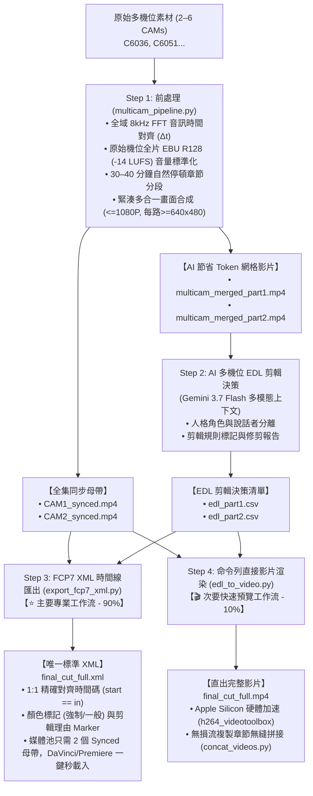

# 多機位影片智慧處理與 AI 剪輯套件 (Multicam Video Pipeline & AI Editing Suite)

[English (en)](README.md) | [繁體中文 (zh-TW)](README.zh-TW.md) | [简体中文 (zh-CN)](README.zh-CN.md) | [日本語 (ja)](README.ja.md) | [한국어 (ko)](README.ko.md)

---

> [!IMPORTANT]
> **🚀 Google Antigravity 專用技能 (Antigravity Exclusive Skill)**  
> 本工具套件是專為 **Google Antigravity Agent 架構（基於 Gemini 3.7 Flash 1M 多模態長上下文）** 量身打造的原生技能。目前**不相容於其他 Agent 框架**（如 LangChain、CrewAI、AutoGen 等）。

---

本專案為針對大語言模型（Gemini 3.7 Flash 1M Token Context）與專業剪輯軟體（DaVinci Resolve、Adobe Premiere Pro、Final Cut Pro）打造的模組化多機位（2~6 機）影片智慧處理管線與 AI 粗剪套件。

---

## 📦 Antigravity 匯入與安裝結構 (Antigravity Skill Import)

本專案已完全適配 Antigravity Skill 標準結構，可直接 Clone 至 Antigravity 技能目錄下無縫啟用：

```bash
# 直接複製至 Antigravity Skills 目錄
git clone https://github.com/sylphlin/multicam-video-preprocessing.git ~/.gemini/config/skills/multicam-video-preprocessing
```

### 📁 Skill 檔案結構
```text
multicam-video-preprocessing/
├── SKILL.md                  # Antigravity 技能規範與分流決策指引
├── assets/                   # Antigravity 提示詞資產 (Prompt Assets)
│   └── edl_interview_template.md  # 雙機訪談提示詞樣板
├── scripts/                  # 核心執行腳本與處理模組
│   ├── multicam_pipeline.py  # Step 1: 多機時間同步、音量標準化、分段與網格合成
│   ├── generate_edl_with_gemini.py # Step 2: Gemini 3.7 Flash EDL 決策生成
│   ├── export_fcp7_xml.py    # Step 3A: FCP7 XML 時間線匯出 (⭐ 主路徑)
│   ├── edl_to_video.py       # Step 3B: 硬體加速直接渲染成片 (🎬 次路徑)
│   ├── concat_videos.py      # Step 4B: 全集無損拼接成片 (🎬 次路徑)
│   └── modules/              # 內部音影核心演算法庫
└── README.md
```

---

## 🌟 端到端全流程圖 (Full End-to-End Workflow)



---

## 📁 簡潔產出目錄結構 (Clean Directory Structure)

```text
output/
 ├── multicam_sync.json           # 時間對齊偏移量與章節時間戳元數據
 ├── multicam_sync.csv            # 格式化表格
 │
 ├── CAM1_synced.mp4              # 全集完整長度同步母帶 (CAM1，EBU R128 -14 LUFS)
 ├── CAM2_synced.mp4              # 全集完整長度同步母帶 (CAM2，Δt 已校準對齊)
 │
 ├── multicam_merged_part1.mp4    # 輕量多合一網格 (Part 1，節省 50–83% AI Token)
 ├── multicam_merged_part2.mp4    # 輕量多合一網格 (Part 2，節省 50–83% AI Token)
 │
 ├── edl_part1.csv                # Gemini AI 剪輯決策 (Part 1)
 ├── edl_part2.csv                # Gemini AI 剪輯決策 (Part 2)
 │
 ├── final_cut_full.xml           # ⭐【主要】唯一標準 FCP7 XML 時間線 (供剪輯軟體匯入)
 └── final_cut_full.mp4           # 🎬【次要】命令列直出剪輯完成影片
```

---

## 🛠️ 前置需求

- **FFmpeg**（支援 `h264_videotoolbox` 與 `loudnorm` 濾鏡）
- **Python 3.8+**
- **NumPy** (`pip install numpy`)

---

## 🚀 完整逐步執行指南

### Step 1：多機位前處理（時間對齊 + 音量標準化 + 分段 + 多合一合成）
一鍵執行全域音訊對齊、-14 LUFS 音量標準化、自然停頓章節分段，並同時產出完整同步母帶與 AI 專用網格影片：

```bash
python3 scripts/multicam_pipeline.py \
  --ref CAM1.mp4 \
  --targets CAM2.mp4 \
  --auto-split \
  --split-min-dur 30 --split-max-dur 40 \
  --normalize \
  --merge \
  --output-dir ./output/
```

### Step 2：Gemini AI 多機位 EDL 生成
直接將 `multicam_merged_part1.mp4` / `multicam_merged_part2.mp4` 上傳至 Antigravity（Gemini 3.7 Flash 上下文），套用剪輯規則提示詞，產出標準決策檔案 `edl_part1.csv` 與 `edl_part2.csv`。

### Step 3（主要路徑）：匯出 FCP7 XML 至 DaVinci / Premiere
將 EDL 決策轉換為專業 NLE 可直接讀取的 Final Cut Pro 7 XML，並無縫關聯 `CAM1_synced.mp4` 與 `CAM2_synced.mp4`：

```bash
python3 scripts/export_fcp7_xml.py \
  -d ./output/ \
  -o ./output/final_cut_full.xml
```

#### 🎬 DaVinci Resolve 匯入步驟：
1. 開啟 DaVinci Resolve 並建立新專案。
2. 將 `CAM1_synced.mp4` 與 `CAM2_synced.mp4` 拖入**媒體池 (Media Pool)**。
3. 點擊 **檔案 $\rightarrow$ 匯入 $\rightarrow$ 時間線...** (`Cmd + Shift + I`)，選取 `final_cut_full.xml`。
4. 全片 98+ 個鏡頭、立體聲音軌與彩色剪輯規則標記（紅色強制 / 藍色一般）瞬間完整載入！剪輯師可自由滑動微調每個鏡頭邊界。

---

### Step 4（次要路徑）：命令列直接渲染與章節合併
如果您無需在剪輯軟體中微調，想直接輸出最終剪輯影片：

```bash
# 渲染各 Part 子影片
python3 scripts/edl_to_video.py -e ./output/edl_part1.csv -d ./output/ -o ./output/final_cut_part1.mp4
python3 scripts/edl_to_video.py -e ./output/edl_part2.csv -d ./output/ -o ./output/final_cut_part2.mp4

# 無損流複製拼接為全集影片
python3 scripts/concat_videos.py \
  --inputs ./output/final_cut_part1.mp4 ./output/final_cut_part2.mp4 \
  --output ./output/final_cut_full.mp4
```

---

## ⚙️ CLI 參數詳細對照表 (`multicam_pipeline.py`)

| 參數 | 說明 | 預設值 |
| :--- | :--- | :--- |
| `--ref` | 基準錨點機位影片路徑 (CAM1) | *必填* |
| `--targets` / `--target` | 一至多個目標機位影片路徑（支援 2 至 6 機位） | *必填* |
| `--auto-split` | 啟用 30~40 分鐘自然停頓點章節分段切片 | `False` |
| `--split-min-dur` | 分段最小時長（分鐘） | `30.0` |
| `--split-max-dur` | 分段最大時長（分鐘） | `40.0` |
| `--merge` / `--multi-in-one` | 渲染多合一合併畫面（並排/網格）以節省 AI Token | `False` |
| `--encoder` | 視訊編碼器 (`h264_videotoolbox` / `libx264`) | `h264_videotoolbox` |
| `--normalize` | 啟用 EBU R128 (-14 LUFS) 全片音量標準化 | `False` |
| `--lufs` | 目標整合響度 (LUFS) | `-14.0` |
| `--lra` | 響度範圍 (LU) | `11.0` |
| `--tp` | 真峰值上限 (dBTP) | `-1.5` |
| `--ref-start` | 基準機位手動剪輯起點 (`HH:MM:SS.mmm` 或秒數) | `None` |
| `--ref-end` | 基準機位手動剪輯終點 (`HH:MM:SS.mmm` 或秒數) | `None` |
| `--output-dir` | 輸出同步母帶、子片段與報表之目錄路徑 | `.` (當前目錄) |
| `--suffix` | 同步匯出之檔名後綴 | `_synced` |
| `--sr` | 音訊 FFT 對齊採樣率 (Hz) | `8000` |
| `--workers` | 並行處理線程數 | `2` |
| `--export-json` | JSON 報表匯出路徑 | `None` |
| `--export-csv` | CSV 對照表匯出路徑 | `None` |
