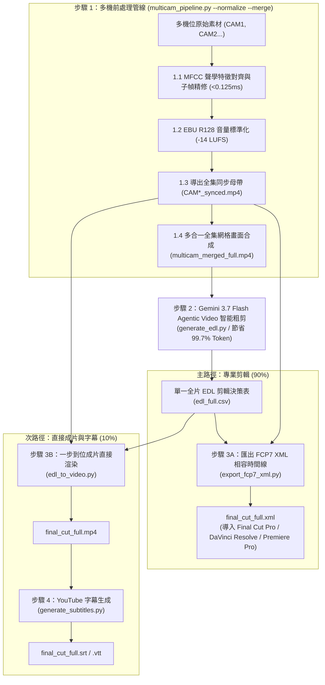

# 多機位影片智慧處理與 AI 剪輯套件 (Multicam Video Pipeline & AI Editing Suite)

[English (en)](README.md) | [繁體中文 (zh-TW)](README.zh-TW.md) | [简体中文 (zh-CN)](README.zh-CN.md) | [日本語 (ja)](README.ja.md) | [한국어 (ko)](README.ko.md)

---

> [!IMPORTANT]
> **🚀 Google Antigravity 原生技能與工作流 (Antigravity Native Skill & Workflow)**  
> 本工具套件是專為 **Google Antigravity Agent 架構（基於 Gemini 3.7 Flash 1M 多模態長上下文）** 與專業剪輯軟體（DaVinci Resolve、Adobe Premiere Pro、Final Cut Pro）量身打造的原生多機位（2~6 機）智慧處理管線與 AI 粗剪套件。

---

本專案為針對長上下文多模態模型（Gemini 3.7 Flash 1M Token Context）與專業剪輯軟體（DaVinci Resolve、Adobe Premiere Pro、Final Cut Pro）打造的模組化多機位（2 至 6 機）影片智慧處理管線與 AI 粗剪套件。使用者無需手動輸入底層終端機指令，只要在 Antigravity 聊天室中使用自然語言發出指示，Agent 就會自動執行完整的標準化處理流程。

---

## 📦 Antigravity 匯入與安裝 (Installation & Setup)

本專案完全適配 Antigravity Skill 與 Workflow 標準結構，可直接 Clone 至 Antigravity 技能目錄下無縫啟用：

```bash
git clone https://github.com/sylphlin/multicam-video-preprocessing.git ~/.gemini/config/skills/multicam-video-preprocessing
```

### 📁 套件檔案結構
```text
multicam-video-preprocessing/
├── GEMINI.md                          # Antigravity 根目錄常駐工作區規則
├── .agent/
│   ├── rules/
│   │   └── multicam_rules.md          # 常駐紀律規則 (Always-On Rules)
│   └── workflows/
│       └── multicam_workflow.md       # 官方 4 階段執行工作流 (Stage-Gated Runbook)
├── skills/
│   └── multicam-video-preprocessing/
│       └── SKILL.md                   # Antigravity 技能能力定義清單
├── assets/                            # 提示詞樣板資產 (Prompt Assets)
│   ├── edl_interview_template.md      # Gemini 訪談粗剪提示詞樣板
│   └── subtitle_proofread_template.md # YouTube 字幕語意校對樣板
├── scripts/                           # 核心執行腳本與處理模組
│   ├── multicam_pipeline.py           # 步驟 1: 多機時間同步、音量標準化、母帶導出與全集網格合成
│   ├── generate_edl.py                # 步驟 2: Gemini 3.7 Flash Agentic Video 零切分 AI 剪輯決策生成
│   ├── export_fcp7_xml.py             # 步驟 3A: 匯出 FCP7 XML 時間線 (主路徑)
│   ├── edl_to_video.py                # 步驟 3B: 一步到位硬體加速成片直接渲染 (次路徑)
│   ├── generate_subtitles.py          # 步驟 4: 生成 YouTube 字幕 (Whisper+Gemini)
│   └── modules/                       # 核心聲學與視訊演算法庫
└── README.zh-TW.md
```

---

## 🌟 端到端全流程圖 (Full End-to-End Workflow)



---

## 💬 使用情境與 Prompt 範例 (User Scenarios & Prompt Examples)

使用者在 Antigravity 對話框中，只需以日常口語提出需求，Agent 即會自動理解並調用完整的處理管線：

### 情境一：匯出專業剪輯 XML 時間線（DaVinci Resolve / Premiere Pro / Final Cut Pro ⭐ 推薦）
- **適用場景**：需要將 AI 粗剪結果導入剪輯軟體，進行後續的精細剪輯、調色、動態圖卡與音訊混音。
- **對話 Prompt 範例**：
  > 「*我有兩支雙機位的訪談錄影檔案 `CAM1.mp4` 與 `CAM2.mp4`，請幫我進行時間同步與音量標準化，並套用訪談剪輯樣板產出可直接進 DaVinci Resolve 的 XML 時間線。*」
- **交付成果**：
  1. `final_cut_full.xml`（單一完整時間線，包含全片所有鏡頭切點與 AI 決策理由 Marker 標記）
  2. `CAM1_synced.mp4`、`CAM2_synced.mp4`（音畫同步且已完成 -14 LUFS 響度標準化的全集母帶）
- **DaVinci Resolve 導入步驟**：
  1. 打開 DaVinci Resolve 並新建專案。
  2. 將 `./output/CAM1_synced.mp4` 與 `./output/CAM2_synced.mp4` 拖入 **Media Pool（媒體池）**。
  3. 點選 **檔案 $\\rightarrow$ 導入 $\\rightarrow$ 時間線...** (`Cmd + Shift + I`)，選取 `final_cut_full.xml`。
  4. 全片所有鏡頭切點、主音訊軌與彩色 Marker 標記瞬間載入就緒！

---

### 情境二：直出成片與 YouTube 字幕（快速預覽與發布工作流 🎬）
- **適用場景**：不需要打開專業剪輯軟體，希望快速生成一支完整的 MP4 成品影片供審片，並附帶 YouTube 上傳用的雙語/單語字幕。
- **對話 Prompt 範例**：
  > 「*請幫我把這兩支多機位素材進行 AI 粗剪，直接渲染合併成一支完整的 MP4 預覽影片，並產出校對後的 YouTube 字幕。*」
- **交付成果**：
  1. `final_cut_full.mp4`（全集渲染與無損拼接成品影片）
  2. `final_cut_full.srt` / `final_cut_full.vtt`（Whisper 聲學對齊 + Gemini 語意校對之 YouTube 標準字幕）

---

### 情境三：為既有影片單獨製作 YouTube 字幕（語音轉錄與校對 📝）
- **適用場景**：手邊已有剪輯好的影片成品（`final_cut.mp4`），需要製作毫秒級精準且專有名詞經過校對的 YouTube 字幕。
- **對話 Prompt 範例**：
  > 「*請幫我為 `output/final_cut_full.mp4` 製作 YouTube 字幕，修復同音錯字與英文專有名詞。*」
- **交付成果**：
  1. `final_cut_full.srt`（YouTube 標準 SubRip 字幕）
  2. `final_cut_full.vtt`（網頁與 HTML5 播放器通用 WebVTT 字幕）
  3. `final_cut_full_raw_whisper.srt`（原始 Whisper 轉錄初稿）

---

## 🔍 各步驟執行細節說明 (Detailed Pipeline Steps)

### 步驟 1：多機同步與 AI 網格前處理 (`multicam_pipeline.py`)

1. **MFCC 聲學特徵對齊與子幀精修 (<0.125ms 精度)**：
   - **為什麼採用 MFCC 聲學特徵互相關？**：人聲語音與瞬態聲學特徵最精準的表徵為梅爾倒頻譜係數（MFCC）。相比傳統原始波形對齊，MFCC 特徵包絡對齊將 FFT 記憶體消耗大幅縮減 **97.7%**（1 小時音訊運算僅佔約 12.5MB），1 小時素材 0.3 秒內即可完成對齊，且對不同相機麥克風頻響差異與背景噪音具備極高抗干擾性。
   - **三階梯退避驗證架構 (3-Tier Fallback Ladder)**：
     1. *快速 120s MFCC 探測*：先提取前 120 秒音訊進行特徵互相關，若 BBC 標準峰值分數 $Z \ge 12.0$（極高置信度），0.4 秒內即刻完成對齊。
     2. *全集 MFCC 掃描*：若初始分數 $< 12.0$ 或使用者指定 `--full-scan`，則啟動全片 MFCC 特徵掃描。
     3. *原始波形 FFT 降級機制*：若全集 MFCC 分數依舊較低（$Z < 7.0$），系統無縫自動回退至原始高通濾波波形 1D FFT 互相關作為保底。
   - **子幀物理聲學微調 (<0.125ms)**：在兩機重疊活躍區內動態定位最高能量的 5 秒語音片段，於 $\pm 32\text{ms}$ 搜尋半徑內進行時域互相關精修，將 MFCC 步幅精度躍升至**單個音訊取樣點（8kHz 下精確至 0.125ms 物理聲學精度）**。
   - **BBC 廣播級置信度統計**：依據互相關峰值與噪聲底限的標準差比值評估（$Z \ge 12.0$ 高置信度、$7.0 \le Z < 12.0$ 中置信度、$Z < 7.0$ 低置信度）。
   - **容器時間自動探測 (修復 `--sample-dur` 截斷問題)**：整合 `ffprobe` 提取真實影片容器時長，保證快速測試模式下導出的母帶與對齊區間維持全片長度。
2. **EBU R128 (-14 LUFS) 全集音量標準化 (符合 YouTube 官方建議標準)**：
   - **符合 YouTube 播放規範**：YouTube 平台採用 **-14.0 LUFS** 作為標準響度基準。若影片音量過大（高於 -14 LUFS），YouTube 後台會啟動強制壓縮衰減導致動態範圍受損；若音量過小則影響手機與平板觀眾的聆聽體驗。
   - **雙次通過（Two-Pass）線性標準化**：
     - 第一遍 (Pass 1 - 聲學測量)：音訊極速解碼至空裝置（null sink）進行即時聲學分析，精確量測整段音訊的整合響度（Integrated Loudness, `I`）、響度範圍（Loudness Range, `LRA` = 11.0 LU）、真實峰值（True Peak, `TP` = -1.5 dBTP）與目標增益偏移（`target_offset`）。
     - 第二遍 (Pass 2 - 線性增益正規化)：啟用 `linear=true` 將實際測得參數帶入 `loudnorm` 濾鏡進行全片純線性增益平移，徹底根除單次通過（Single-pass）動態壓縮產生的「聲音抽吸感 (Volume Pumping Artifacts)」，確保全片各機位音量 100% 精準鎖定 -14.0 LUFS，且絕不發生數位削波破音（True Peak Clipping Prevention）。
3. **全集同步母帶幀精確並行導出 (`*_synced.mp4`)**：
   - **預設幀精確重新編碼 (Frame-Accurate Re-encode)**：採用 Apple Silicon 硬體加速編碼器（`h264_videotoolbox`，非 Mac 環境自動回退 `libx264 -crf 18`），徹底解決串流複製 (`-c copy`) 只能在關鍵幀（I-frame）切割所造成的毫秒級聲學對齊漂移、片頭黑幀與畫面卡頓問題，確保各機位母帶影格毫秒級物理絕對對齊。
   - **極速模式支援**：可選傳入 `--stream-copy` 啟用無損串流複製，適合極速粗剪。
4. **零切分全集多合一緊湊網格畫面合成 (`multicam_merged_full.mp4`)**：
   - 自動依機位數排版（2機左右並排、3 至 4 機田字格、5 至 6 機六宮格），保證總畫幅 $\le 1920 \times 1080$、每機 $\ge 640 \times 480$，供 Agentic Video 一次性全文理解，免除章節分割的人工切口。
- **執行指令範例**：
  ```bash
  # 標準 4 合 1 完整前處理（對齊、正規化、母帶重編碼、網格合成）：
  python3 scripts/multicam_pipeline.py \
    --ref CAM1.mp4 \
    --targets CAM2.mp4 CAM3.mp4 \
    --normalize --merge -o output/

  # 快速對齊取樣測試（僅截取前 60 秒音訊對齊，影片長度自動經由 ffprobe 探測保持全片長）：
  python3 scripts/multicam_pipeline.py \
    --ref CAM1.mp4 --targets CAM2.mp4 \
    --sample-dur 60 --normalize --merge -o output/

  # 強制全集 MFCC 掃描（跳過 120s 快速階梯）：
  python3 scripts/multicam_pipeline.py \
    --ref CAM1.mp4 --targets CAM2.mp4 \
    --full-scan --normalize --merge -o output/

  # 極速串流複製模式（-c copy，關鍵幀吸附切割）：
  python3 scripts/multicam_pipeline.py \
    --ref CAM1.mp4 --targets CAM2.mp4 \
    --stream-copy --normalize --merge -o output/
  ```

---

### 步驟 2：Gemini 3.7 Flash Agentic Video 智能粗剪決策 (`generate_edl.py`)
1. **載入專屬提示詞資產**：
   - 讀取 `assets/edl_interview_template.md` 廣電級訪談剪輯規則樣板。
2. **Phase 0：頭尾廢料與現場倒數徹底裁切 (零容忍原則與不對稱安全邊界)**：
   - **現場倒數零容忍**：系統性偵測並剔除開拍前設備確認、閒聊、打板與現場人員倒數聲（如「5, 4, 3, 2, 1」、「五四三二」、「Ready Action」）。
   - **不對稱安全邊界 (`[Start, Start+2s]` 自我校驗)**：強制要求 `Global_Start_Time` 必須嚴格落在最後一個倒數數字完全結束之後。模型在起剪後的首 2 秒區間（`[Global_Start_Time, Global_Start_Time + 2.0s]`）進行思維鏈自審，若仍有倒數殘留則自動後移時間戳，確保成片首幀乾淨對齊第一句台詞首字。
   - **結尾未關機裁切**：自動識別訪談結尾道別語句，切除收尾未關機閒聊、拍攝封面素材與環境雜音（標記 `Global_End_Time`）。
3. **次世代架構：Agentic Video Understanding (零切分全長剪輯)**：
   - 透過 Gemini 3.7 Flash Agentic Video 理解能力（`processing="agentic"`），直接評估 >1 小時未分段之完整多機網格影片。
   - 採用目標導向稀疏時域取樣，將輸入 Token 消耗巨幅降低 **99.7%**（由約 1,000,000 Token 降至約 3,000 Token），徹底免除章節交界處話語被截斷的風險。
4. **產出標準化結果**：
   - 輸出單一標準 CSV 決策表（`edl_full.csv`，亦相容 `edl.csv`）與 Markdown 裁切分析報告（`edl_full_report.md`）。
5. **雙後端雲端架構 (Vertex AI + GCS 主要後端，AI Studio 備用)**：
   - **主要後端**：Google Cloud Vertex AI 搭配 Application Default Credentials（ADC，免管 API Key）。網格影片上傳至 Google Cloud Storage（GCS），並內建 SHA-256 與檔案大小快取，跨次執行免重複上傳。
   - **備用容錯**：加上 `--fallback-studio` 參數，若 Vertex AI / GCS 出現權限或配額錯誤時，自動無縫容錯切換至 Google AI Studio（`GEMINI_API_KEY`），確保流程不中斷。
   - **執行指令範例**：
     ```bash
     # 主要 Vertex AI + GCS 執行（預設，讀取 .env / ADC）：
     python3 scripts/generate_edl.py -v output/multicam_merged_full.mp4

     # 啟用 AI Studio 自動容錯降級：
     python3 scripts/generate_edl.py -v output/multicam_merged_full.mp4 --fallback-studio

     # 直接指定 Google AI Studio 執行：
     python3 scripts/generate_edl.py -v output/multicam_merged_full.mp4 --backend studio
     ```

---

### 步驟 3A（主路徑）：匯出 FCP7 XML 剪輯時間線 (`export_fcp7_xml.py`)

本步驟產出業界通用的 **Final Cut Pro 7 XML（xmeml version 4）** 相容格式，可無縫導入 **Final Cut Pro**、**DaVinci Resolve**、**Adobe Premiere Pro** 等主流專業剪輯軟體（NLE）：
1. **直連全集同步母帶**：
   - 直接關聯 `CAM1_synced.mp4`、`CAM2_synced.mp4`...，全片時間碼 1:1 絕對對齊。
2. **1:1 絕對時間碼對應**：
   - 時間線上每一個鏡頭保持 `start == in` 與 `end == out`，剪輯師在 NLE 中可自由進行波紋修剪（Slip/Slide）。
3. **建立連續主音軌與規則 Marker 注入**：
   - 建立全片連續的 CAM1 主收音軌道；
   - 將 AI 的剪輯規則與決策理由轉化為時間線上的紅藍 Marker 標記，方便剪輯師檢視。
- **執行指令範例**：
  ```bash
  python3 scripts/export_fcp7_xml.py -i output/edl_full.csv -o output/final_cut_full.xml
  ```

---

### 步驟 3B（次路徑）：一步到位成片直接渲染 (`edl_to_video.py`)
1. **一步到位硬體加速成片渲染**：
   - 調用 Apple Silicon 硬體編碼器（`h264_videotoolbox`），直接讀取全集同步母帶與 `edl_full.csv` 渲染出完整成片 `final_cut_full.mp4`，無需產出中間章節分段或二次拼接。
- **執行指令範例**：
  ```bash
  python3 scripts/edl_to_video.py -i output/edl_full.csv -o output/final_cut_full.mp4
  ```

---

### 步驟 4：生成 YouTube 字幕 (`generate_subtitles.py`)

本工具採用業界頂級的 **三階段黃金字幕生產線（Three-Stage Golden Subtitle Pipeline）**，結合 **Gemini 1M 全篇音訊宏觀理解**、**Whisper 聲學物理時間軸與專有名詞偏置** 與 **Gemini 局部音軌多模態精修**：

#### 為什麼採用「全篇詞彙庫 + Whisper 物理時間碼 + Gemini 音訊多模態審稿」？

| 比較項目 | 純 Whisper 轉錄 | 純 Gemini 直出轉錄 | 終極三階段字幕生產線 ⭐ |
| :--- | :--- | :--- | :--- |
| **時間軸精準度** | 物理聲學量測，毫秒級精準 | ⚠️ **文字預測易累積漂移（播至30秒漂移 > 5秒）** | **物理聲學毫秒級精確對齊（全片 0.000 秒零漂移）** |
| **專有名詞與中英夾雜** | 容易出現同音錯字或英文大小寫混亂 | 語意與專有名詞精準 | **全篇名詞庫加持，中英專有名詞、品牌名與行業術語 100% 精準統一** |
| **字幕閱讀節奏** | 符合短句節奏（每句約 1.2–2.5 秒） | 切句粒度不均勻 | **最適合 YouTube 的快節奏短句（每句約 8–16 字、1.5–3 秒）** |
| **逐字忠實度與防腦補** | 忠實記錄說話內容 | 容易過度潤飾或擅自摘要 | **聽局部真實音訊進行聲學確認，還原真實說話（零幻覺、零過度腦補）** |

#### 三階段執行流程：
1. **階段一（全篇音訊宏觀理解、雙軌專有名詞庫與 Whisper Initial Prompt 萃取）**：
   - 提取全片音訊，由 Gemini 3.7 Flash（1M Context）一次聽完整集節目，可選注入訪綱筆記（`--outline`）或錄音完整講稿／逐字稿（`--script`）。
   - **雙軌解析產出**：不僅產出供 Gemini 審稿的完整 Markdown 詞彙庫（`final_cut_full_glossary.md`），更在文件頂部自動產出高密度、控制在 200 token（約 100～140 字元）內的 `> **Whisper Initial Prompt**: ...` 核心關鍵字列。
2. **階段二（Whisper 聲學物理時間軸與專有名詞偏置）**：
   - 自動將 Stage 1 萃取的 `initial_prompt` 注入本地 `mlx-whisper`、`faster-whisper` 或 `openai-whisper`，大幅降低專有名詞首度聲學辨識錯誤率。
   - 透過硬體加速向量化提取每個段落與每個詞的真實物理起迄點（`word_timestamps=True`），產出 100% 零漂移的毫秒時間戳初稿與詞級聲學快取（`final_cut_full_raw_whisper.srt` 與 `final_cut_full_words.json`）。日後微調提示詞或排版時自動秒級載入快取，免去重複轉錄的漫長等待。
3. **階段三（靜音感知語意切塊、微聲學錨定與多模態音訊審稿）**：
   - **靜音感知語意分塊 (Silence-Aware Semantic Chunking)**：淘汰死板的固定行數硬切，改在目標區間滑動窗口內搜尋講者**自然呼吸停頓**（Gap $\ge 0.4\text{s}$）與完整句尾語氣詞／標點（`？`、`！`、`。`、`來說`、`的話`），避開連詞前切斷，確保送交審稿之上下文語意完整。
   - **文字語意與聲學時間徹底解耦**：Gemini 專注於口語語意自然斷句、排版標點淨化與同音錯字修正。
   - **子句微聲學錨定 (Micro-Acoustic Sub-clause Snapping)**：長句拆分為分句時，自動結合 Whisper 物理詞級時間戳 `all_words`，精確咬合口形發音的物理起迄點，拒絕均分比例導致的口形微偏差。
   - **日語發音與漢字音字同步規範**：講者口述唸出日文讀音時呈現「日文漢字（平假名）」（如 `改札（かいさつ）`）；純快速中文帶過未唸發音時呈現純漢字（如 `出改札`），並輔以括號剝離容錯比對演算法，杜絕聲學脫錨。
   - **Gemini API 指數退避與隨機抖動重試機制 (Exponential Backoff & Jitter)**：面對併發請求或限流觸發 HTTP 429 (`RESOURCE_EXHAUSTED`)、503 / 500 等暫態錯誤時，自動進行最多 5 次指數退避重試（自動解析 `Retry-After` 並加上隨機 Jitter），防止並行 Worker 同時重打引發雷群效應，保證所有切塊字幕均能穩健完成審稿，不再輕易降級退回未校對的原始字幕。
   - **區塊級持久化快取 (Chunk-Level Persistent Cache)**：結合模型、提示詞、詞彙庫與切塊文本產生唯一雜湊，校對區塊即時寫入 `.<basename>_chunk_cache.json`。若中途遇網路波動中斷，重新執行 100% 接續進度，零重複 token 消耗。
   - **防閃爍微間隙熔接與自然呼吸留白**：說話微小空隙（$< 0.6\text{s}$）自動平滑熔接為 0s Gap 消除畫面黑閃；講者真實停頓處保留 $+0.4\text{s}$ 閱讀呼吸緩衝後乾淨清空畫面，且單向時間鎖定保證字幕絕不遮蔽下一句話的發音。

#### 🎯 影視級字幕品質檢驗標準與自動優化邏輯

`generate_subtitles.py` 內建完整的 Netflix / YouTube 影視級品質稽核引擎，自動執行以下 8 大優化與合規驗證：

| 檢驗項目 | 標準規範 | 優化與工程處理邏輯 |
| :--- | :--- | :--- |
| **單行字數寬度限制** | CJK $\le 15$ 字 / EN $\le 37$ CPL | 依各語系設定字寬上限（中文/日文 $\le 15$ 字、韓文 $\le 16$ 字、英文 $\le 37$ 字元）。長句自動在子句邊界平滑拆分，防止小螢幕折行。 |
| **閱聽速率監控 (CPS)** | CJK $\le 6.0$ CPS / EN $\le 20.0$ CPS | 計算全片平均 CPS 與峰值 CPS，過促語句（如短促高密度字）自動警示並列入待複查清單。 |
| **行尾標點與版面淨化** | 100% 消除行尾 `。`、`，`、`；` | 清除無視覺意義的行尾符號；行內逗號轉換為自然空格，中英文/數字間距自動標準化，版面極致清爽。 |
| **字元排版與語法潔淨** | 括號成對閉合 / 嚴禁殘留 Markdown | 檢驗全形 `（）`、`【】`、`《》`、`「」` 及半形括號成對閉合；自動清洗 `**`粗體、`_`斜體、`` ` ``代碼標記等 LLM 洩漏標籤。 |
| **長時間無對白/靜音檢驗** | 停頓 Gap $\ge 10.0\text{s}$ 警示 | 檢測全片超過 10 秒之空白間隔，記錄前後句與時間碼，供剪輯師快速確認為 B-roll 空景、轉場音樂或 ASR/VAD 語音切除遺漏。 |
| **聲學起點 0 劇透** | 0.000s 物理對齊 | 字幕出現時間嚴格鎖定 Whisper 物理聲學起點，絕對不比聲音先出，避免劇透觀影體驗。 |
| **閱聽時長保護** | $1.0\text{s} \le \text{Duration} \le 6.0\text{s}$ | 短句在後方靜音空隙自動補足至 $\ge 1.0\text{s}$（確保讀者反應時間）；單句上限 $\le 6.0\text{s}$（杜絕卡死感）。 |
| **防閃爍微間隙熔接** | 消除 $< 0.2\text{s}$ 視覺黑閃 | 連續說話之間的微小空隙（$< 0.6\text{s}$）自動平滑熔接為 0s Gap；段落自然停頓處自動保留 $+0.4\text{s}$ 閱讀呼吸緩衝並清空畫面。 |

#### 執行指令範例：

```bash
# 基本執行（Google Cloud Vertex AI 與 ADC 認證，預設）：
python3 scripts/generate_subtitles.py -i output/final_cut_full.mp4

# 啟用 AI Studio 自動容錯降級：
python3 scripts/generate_subtitles.py -i output/final_cut_full.mp4 --fallback-studio

# 直接指定 Google AI Studio 執行：
python3 scripts/generate_subtitles.py -i output/final_cut_full.mp4 --backend studio

# 提供訪綱或重點筆記偏置專有名詞（可選）：
python3 scripts/generate_subtitles.py -i output/final_cut_full.mp4 --outline "講者: 來賓名稱, 主題: 核心議題、專有名詞列表"

# 提供錄音原稿或完整講稿作為專有名詞與詞彙標準（可選）：
python3 scripts/generate_subtitles.py -i output/final_cut_full.mp4 --script manuscript.txt

# 指定語言與 Whisper 模型大小：
python3 scripts/generate_subtitles.py -i output/final_cut_full.mp4 --language zh-TW --whisper-model small
```

4. **輸出檔案**：
   - **`final_cut_full.srt`**：YouTube 標準 SubRip 字幕檔。
   - **`final_cut_full.vtt`**：網頁與 HTML5 播放器通用 WebVTT 字幕檔。
   - **`final_cut_full_subtitle_report.json`**：Netflix / YouTube 影視級字幕品質檢驗量化報告（JSON，含指標數據與待複查清單）。
   - **`final_cut_full_subtitle_report.md`**：影視級字幕品質檢驗視覺化評分報告（Markdown，含合規等第、長時間靜音區間表與時間碼定位清單）。
   - **`final_cut_full_glossary.md`**：全集專有名詞與詞彙對照表（含頂部 Whisper Initial Prompt）。
   - **`final_cut_full_raw_whisper.srt`**：保留原始 Whisper 聲學轉錄初稿供對照。
   - **`final_cut_full_words.json`**：Whisper 毫秒級詞級物理時間戳快取。

---

## 🛠️ 環境需求與雲端配置

- **Google Antigravity IDE / Agent Framework**
- **FFmpeg**（支援 `h264_videotoolbox` 硬體編碼與 `loudnorm` 濾鏡）
- **Python 3.8+**（依賴 `numpy`、`google-genai`、`google-cloud-storage`）

### 雲端認證與雙後端設定

本工具套件採用**雙後端雲端架構**：

1. **Google Cloud Vertex AI（主要後端，推薦）**：
   - 透過 Google Cloud ADC 登入認證（免管 API Key）：
     ```bash
     gcloud auth application-default login
     ```
   - 複製 `.env.example` 為 `.env` 並填寫專案與儲存桶名稱：
     ```bash
     cp .env.example .env
     ```
     ```env
     GOOGLE_CLOUD_PROJECT=sylph-demo-505906
     GCS_BUCKET=video-preprocessing-sylph-demo-505906
     GOOGLE_CLOUD_LOCATION=us-central1
     GEMINI_API_KEY=your_gemini_api_key_here
     ```
   - 具備智慧型 SHA-256 本機雜湊快取，大型影片上傳一次即可重複引用。
2. **Google AI Studio（備用後端 / 輕量模式）**：
   - 指定 `--backend studio` 或加上 `--fallback-studio`，系統在 Vertex AI / GCS 權限不足時自動切換至 Google AI Studio（使用 `GEMINI_API_KEY`）。
