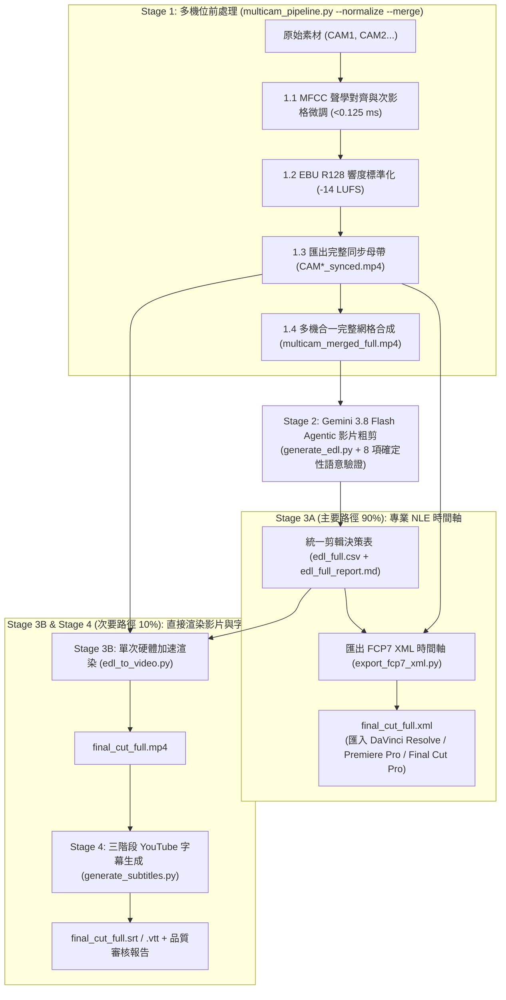

# Multi-Camera Video Pipeline & AI Editing Suite

[English (en)](README.md) | [繁體中文 (zh-TW)](README.zh-TW.md) | [简体中文 (zh-CN)](README.zh-CN.md) | [日本語 (ja)](README.ja.md) | [한국어 (ko)](README.ko.md)

---

> [!IMPORTANT]
> **Google Antigravity 原生技能與工作流套件**  
> 本工具組為 **Google Antigravity**（由 **Vertex AI Gemini 3.8 Flash** 驅動）與專業非線性剪輯軟體（**DaVinci Resolve**、**Adobe Premiere Pro**、**Final Cut Pro**）量身打造的四階段多機位前處理與 AI 粗剪套件。

---

**Multi-Camera Video Pipeline & AI Editing Suite** 支援 2 至 6 機位音訊同步、廣播級響度標準化、AI 智慧粗剪時間軸生成與 YouTube 字幕校對。可直接於 Antigravity 對話視窗以自然語言下達指令，或透過終端機 CLI 執行。

---

## 安裝與 Google Cloud 環境設定 (`setup.sh`)

本專案符合 [Agent Plugins 1.0](https://agent-plugins.org/) 規範，全程基於 **Google Cloud Vertex AI (ADC)** 與 **Cloud Storage (GCS)** 運作，免除管理 API Key。

### 1. 安裝為 Antigravity Plugin 或 Skill

- **全域 Plugin（建議）**：
  ```bash
  git clone https://github.com/sylphlin/multicam-video-preprocessing.git ~/.gemini/config/plugins/multicam-video-preprocessing
  ```
- **全域 Skill**：
  ```bash
  git clone https://github.com/sylphlin/multicam-video-preprocessing.git ~/.gemini/config/skills/multicam-video-preprocessing
  ```

### 2. 安裝相依套件與一鍵配置雲端環境 (`setup.sh`)

```bash
# 1. 安裝 FFmpeg 與 Python 套件
brew install ffmpeg
pip install numpy google-genai google-cloud-storage mlx-whisper requests

# 2. 授權 Google Cloud ADC 憑證
gcloud auth application-default login

# 3. 執行 setup.sh 自動配置 GCS 儲存桶、雙層生命週期規則（raw: 2 天、產出物: 15 天）、IAM 與 .env
chmod +x setup.sh
./setup.sh --project YOUR_GCP_PROJECT_ID
```

---

## 四階段端到端工作流架構



---

## 四階段核心功能與 CLI 指令

### Stage 1：多機位同步與前處理 (`multicam_pipeline.py`)
1. **MFCC 聲學時間對齊與次影格微調（`<0.125 ms`）**：採用三階掃描（120 秒快速掃描 $\rightarrow$ 全長 MFCC $\rightarrow$ 原始波形 1D FFT）並將精準度鎖定至單一音訊取樣點。支援 `--strict-sync` 低信心度自動攔截。
2. **EBU R128 (`-14 LUFS`) 雙階段線性響度標準化**：第一階段測量 `I`、`LRA` 與 `TP`，第二階段套用純線性增益（`linear=true`），消除動態壓縮呼吸感。
3. **逐幀精準同步母帶匯出 (`CAM*_synced.mp4`)**：預設採用硬體加速重編碼（`h264_videotoolbox` 或 `libx264 -crf 18`），杜絕關鍵影格偏移。
4. **零切分全長網格合成 (`multicam_merged_full.mp4`)**：將 2 至 6 機位合成為單一多視角畫布（$\le 1920 \times 1080$，每機位 $\ge 640 \times 480$）。

```bash
python3 scripts/multicam_pipeline.py \
  --ref CAM1.mp4 --targets CAM2.mp4 CAM3.mp4 \
  --normalize --merge -o output/
```

### Stage 2：Gemini 3.8 Flash Agentic 粗剪決策 (`generate_edl.py`)
1. **片頭倒數與場記板零容忍剔除**：自動切除開拍倒數並驗證 `[Global_Start_Time, Global_Start_Time + 2.0s]` 區間。
2. **零切分 Agentic 影片推論**：直接將全長網格影片送入 **Vertex AI Gemini 3.8 Flash**（`processing="agentic"`），減少 99.7% Token 消耗。
3. **8 項確定性 EDL 語意驗證**：檢查 `E_NO_ROWS`、`E_PARSE_TIME`、`E_NEGATIVE_DURATION`、`E_NON_MONOTONIC`、`E_OVERLAP`、`E_EMPTY_CAMERA`、`W_UNKNOWN_CAMERA` 與 `W_GAP`，並在 `--strict-edl` 結束前確保先寫入 CSV 與報告。

```bash
python3 scripts/generate_edl.py -v output/multicam_merged_full.mp4 --strict-edl --lang zh-TW
```

### Stage 3A：匯出 FCP7 XML 時間軸 (`export_fcp7_xml.py`)
支援直接連結同步母帶、1:1 絕對時間碼對應，以及 NTSC 分數影格率（`23.976`, `29.97`, `59.94`）與掉格時間碼（`--drop-frame`）：

```bash
python3 scripts/export_fcp7_xml.py -e output/edl_full.csv -o output/final_cut_full.xml --fps 29.97 --drop-frame
```

### Stage 3B：單次硬體加速影片渲染 (`edl_to_video.py`)
```bash
python3 scripts/edl_to_video.py --edl output/edl_full.csv -o output/final_cut_full.mp4 --strict-edl --lang zh-TW
```

### Stage 4：三階段黃金字幕管線 (`generate_subtitles.py`)
結合 **Stage 4.1（Vertex AI 1M 全域詞彙表與 Whisper 初始提示詞）**、**Stage 4.2（Whisper 毫秒級逐字時間戳）** 與 **Stage 4.3（靜音感知分塊、多模態音訊校對與 8 維度串流品質審核）**：

```bash
python3 scripts/generate_subtitles.py -i output/final_cut_full.mp4 --language zh-TW
```

---

## Google Drive 分享連結與 GCS 雙層生命週期規則

| GCS 路徑前綴 (`matchesPrefix`) | 儲存內容 | 保留天數 (`age`) | 清理機制 |
| :--- | :--- | :--- | :--- |
| **`raw/audio_chunks/`** | Stage 4.3 音訊切片 | **推論後立即刪除** | 每個區塊完成後於 Python `finally` 立即刪除。 |
| **`raw/`** | 暫存網格影片與完整音軌 | **2 天 (`age: 2`)** | 保留 2 天供 SHA-256 快取重用，期滿自動刪除。 |
| **`output/`**、**`deliverables/`**、**`multicam_assets/`** | XML/CSV 時間軸、SRT/VTT 字幕與報告 | **15 天 (`age: 15`)** | 保留 15 天供團隊下載與審閱，期滿自動清理。 |

---

## 授權條款 (License)

本專案採用 [MIT License](LICENSE) 授權。
