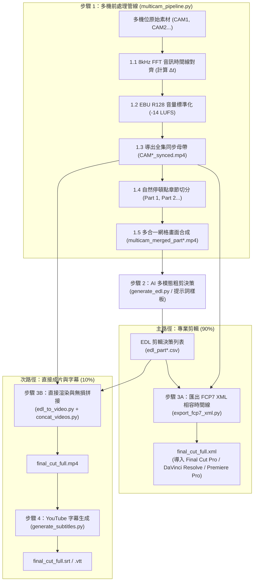

# 多機位影片智慧處理與 AI 剪輯套件 (Multicam Video Pipeline & AI Editing Suite)

[English (en)](README.md) | [繁體中文 (zh-TW)](README.zh-TW.md) | [简体中文 (zh-CN)](README.zh-CN.md) | [日本語 (ja)](README.ja.md) | [한국어 (ko)](README.ko.md)

---

> [!IMPORTANT]
> **🚀 Google Antigravity 原生技能與工作流 (Antigravity Native Skill & Workflow)**  
> 本工具套件是專為 **Google Antigravity Agent 架構（基於 Gemini 3.7 Flash 1M 多模態長上下文）** 與專業剪輯軟體（DaVinci Resolve、Adobe Premiere Pro、Final Cut Pro）量身打造的原生多機位（2~6 機）智慧處理管線與 AI 粗剪套件。

---

本專案為針對長上下文多模態模型（Gemini 3.7 Flash 1M Token Context）與專業剪輯軟體（DaVinci Resolve、Adobe Premiere Pro、Final Cut Pro）打造的模組化多機位（2 至 6 機）影片智慧處理管線與 AI 粗剪套件。使用者無需手動輸入底層終端機指令，只要在 Antigravity 聊天室中使用自然語言發出指示，Agent 就會自動執行完整的標準化處理流程。

---

## 📦 Antigravity 匯入與安裝 (Installation & Setup)

本專案完全適配 Antigravity Skill 與 Workflow 標準結構，可直接 Clone 至 Antigravity 技能目錄下無縫啟用：

```bash
git clone https://github.com/sylphlin/multicam-video-preprocessing.git ~/.gemini/config/skills/multicam-video-preprocessing
```

### 📁 套件檔案結構
```text
multicam-video-preprocessing/
├── GEMINI.md                          # Antigravity 根目錄常駐工作區規則
├── .agent/
│   ├── rules/
│   │   └── multicam_rules.md          # 常駐紀律規則 (Always-On Rules)
│   └── workflows/
│       └── multicam_workflow.md       # 官方 4 階段執行工作流 (Stage-Gated Runbook)
├── skills/
│   └── multicam-video-preprocessing/
│       └── SKILL.md                   # Antigravity 技能能力定義清單
├── assets/                            # 提示詞樣板資產 (Prompt Assets)
│   ├── edl_interview_template.md      # Gemini 訪談粗剪提示詞樣板
│   └── subtitle_proofread_template.md # YouTube 字幕語意校對樣板
├── scripts/                           # 核心執行腳本與處理模組
│   ├── multicam_pipeline.py           # 步驟 1: 多機時間同步、音量標準化、分段與網格合成
│   ├── generate_edl.py                # 步驟 2: Gemini 多模態 AI 剪輯決策生成
│   ├── export_fcp7_xml.py             # 步驟 3A: 匯出 FCP7 XML 時間線 (主路徑)
│   ├── edl_to_video.py                # 步驟 3B: 直接渲染成片 (次路徑)
│   ├── concat_videos.py               # 步驟 3B: 全集章節無損拼接 (次路徑)
│   ├── generate_subtitles.py          # 步驟 4: 生成 YouTube 字幕 (Whisper+Gemini)
│   └── modules/                       # 核心聲學與視訊演算法庫
└── README.zh-TW.md
```

---

## 🌟 端到端全流程圖 (Full End-to-End Workflow)



---

## 💬 使用情境與 Prompt 範例 (User Scenarios & Prompt Examples)

使用者在 Antigravity 對話框中，只需以日常口語提出需求，Agent 即會自動理解並調用完整的處理管線：

### 情境一：匯出專業剪輯 XML 時間線（DaVinci Resolve / Premiere Pro / Final Cut Pro ⭐ 推薦）
- **適用場景**：需要將 AI 粗剪結果導入剪輯軟體，進行後續的精細剪輯、調色、動態圖卡與音訊混音。
- **對話 Prompt 範例**：
  > 「*我有兩支雙機位的訪談錄影檔案 `CAM1.mp4` 與 `CAM2.mp4`，請幫我進行時間同步與音量標準化，並套用訪談剪輯樣板產出可直接進 DaVinci Resolve 的 XML 時間線。*」
- **交付成果**：
  1. `final_cut_full.xml`（單一完整時間線，包含全片所有鏡頭切點與 AI 決策理由 Marker 標記）
  2. `CAM1_synced.mp4`、`CAM2_synced.mp4`（音畫同步且已完成 -14 LUFS 響度標準化的全集母帶）
- **DaVinci Resolve 導入步驟**：
  1. 打開 DaVinci Resolve 並新建專案。
  2. 將 `./output/CAM1_synced.mp4` 與 `./output/CAM2_synced.mp4` 拖入 **Media Pool（媒體池）**。
  3. 點選 **檔案 $\\rightarrow$ 導入 $\\rightarrow$ 時間線...** (`Cmd + Shift + I`)，選取 `final_cut_full.xml`。
  4. 全片所有鏡頭切點、主音訊軌與彩色 Marker 標記瞬間載入就緒！

---

### 情境二：直出成片與 YouTube 字幕（快速預覽與發布工作流 🎬）
- **適用場景**：不需要打開專業剪輯軟體，希望快速生成一支完整的 MP4 成品影片供審片，並附帶 YouTube 上傳用的雙語/單語字幕。
- **對話 Prompt 範例**：
  > 「*請幫我把這兩支多機位素材進行 AI 粗剪，直接渲染合併成一支完整的 MP4 預覽影片，並產出校對後的 YouTube 字幕。*」
- **交付成果**：
  1. `final_cut_full.mp4`（全集渲染與無損拼接成品影片）
  2. `final_cut_full.srt` / `final_cut_full.vtt`（Whisper 聲學對齊 + Gemini 語意校對之 YouTube 標準字幕）

---

### 情境三：自訂章節長度（自訂分段時間 ⏱️）
- **適用場景**：原始素材時間較短（如 30 分鐘節目），希望將章節縮短為每 10 或 15 分鐘左右切一段，或依據特定主題劃分。
- **對話 Prompt 範例**：
  > 「*請幫我處理這組多機位素材，但章節請改在 10 分鐘附近找自然停頓點切分，最後產出 XML 時間線。*」
- **Agent 自動反應**：
  - Agent 會自動將切分參數調整為 `--split-min-dur 8 --split-max-dur 12`，無需手動修改任何配置或腳本。

---

### 情境四：為既有影片單獨製作 YouTube 字幕（語音轉錄與校對 📝）
- **適用場景**：手邊已有剪輯好的影片成品（`final_cut.mp4`），需要製作毫秒級精準且專有名詞經過校對的 YouTube 字幕。
- **對話 Prompt 範例**：
  > 「*請幫我為 `output/final_cut_full.mp4` 製作 YouTube 字幕，修復同音錯字與英文專有名詞。*」
- **交付成果**：
  1. `final_cut_full.srt`（YouTube 標準 SubRip 字幕）
  2. `final_cut_full.vtt`（網頁與 HTML5 播放器通用 WebVTT 字幕）
  3. `final_cut_full_raw_whisper.srt`（原始 Whisper 轉錄初稿）

---

## 🔍 各步驟執行細節說明 (Detailed Pipeline Steps)

### 步驟 1：多機同步與 AI 網格前處理 (`multicam_pipeline.py`)

1. **8kHz FFT 音訊時間線全域對齊 (8kHz FFT Audio Time Alignment)**：
   - **為什麼降採樣至 8kHz？**：人聲語音頻率特徵集中在 300Hz 至 3.4kHz，8kHz 取樣已足以完整捕捉語音聲學特徵，同時大幅降低記憶體消耗並提升 10 倍以上的運算速度。
   - **FFT 互相關演算法原理**：程式自動提取基準機（CAM1）與各目標機（CAM2 至 CAMn）的音訊，利用快速傅立葉變換（Fast Fourier Transform）將時域訊號轉換至頻域計算互相關函數（Cross-Correlation），透過尋找互相關能量峰值，精確計算出各機位開始錄製的物理時間偏差 $\\Delta t$（精確至毫秒），並自動校正與修剪起跑時間差。
2. **EBU R128 (-14 LUFS) 全集音量標準化 (符合 YouTube 官方建議標準)**：
   - **符合 YouTube 播放規範**：YouTube 平台採用 **-14.0 LUFS** 作為標準響度基準。若影片音量過大（高於 -14 LUFS），YouTube 後台會啟動強制壓縮衰減導致動態範圍受損；若音量過小則影響手機與平板觀眾的聆聽體驗。
   - **雙遍（Two-Pass）分析與濾鏡**：
     - 第一遍：透過 FFmpeg `ebur128` 濾鏡精確量測整段音訊的整合響度（Integrated Loudness, `I`）、響度範圍（Loudness Range, `LRA` = 11.0 LU）與真實峰值（True Peak, `TP` = -1.5 dBTP）。
     - 第二遍：將實際測得參數帶入 `loudnorm` 濾鏡進行線性增益調整，確保全片各機位與各章節音量完全一致，且絕不發生數位削波破音（True Peak Clipping Prevention）。
3. **全集同步母帶導出 (`*_synced.mp4`)**：
   - 依據 $\\Delta t$ 裁切並導出全長對齊、音量標準化的母帶影片，專供 Step 3A 剪輯時間線直接引用。
4. **30 至 40 分鐘自然停頓點章節智慧分段 (應付 1M Context Window 與模型靈活適配)**：
   - **1M Token 上下文最佳平衡**：以 Gemini 3.7 Flash 支援的 1M Token Context 為例，30 至 40 分鐘的網格視訊約消耗 60 萬至 80 萬 Token，預留了充足的 Token 空間供系統提示詞、深度思考鏈（Thinking Process）與長文本 EDL 決策輸出。
   - **自然呼吸與靜音停頓偵測**：程式不會在固定時間點生硬切斷，而是在 30 至 40 分鐘的滑動窗口內分析音訊 RMS 能量，找出語音結束、呼吸停頓或靜音點進行無損切分，確保切片交界處不截斷講者的句子。
5. **2 至 6 機多合一緊湊網格畫面合成**：
   - 自動依機位數排版（2機左右並排、3 至 4 機田字格、5 至 6 機六宮格），保證總畫幅 $\\le 1920 \\times 1080$、每機 $\\ge 640 \\times 480$，為後續 AI 分析節省 **50%–83% Token 消耗**。

---

### 步驟 2：Gemini 多模態 AI 智能粗剪決策 (`generate_edl.py`)
1. **載入專屬提示詞資產**：
   - 讀取 `assets/edl_interview_template.md` 規則樣板。
2. **Phase 0：頭尾廢料裁切 (Pre/Post-roll Trimming)**：
   - 自動辨識並剔除開拍前試音、倒數之廢料畫面（標記 `Global_Start_Time`）；
   - 自動識別訪談結尾道別語句，切除收尾未關機閒聊與環境雜音（標記 `Global_End_Time`）。
3. **Phase 1–4：多模態聲畫語義剪輯決策**：
   - **話者識別與追蹤**：以聲音為主導鎖定當前發話者機位，切鏡點對齊語音邊界。
   - **關鍵反應鏡頭穿插**：過濾 1 至 2 秒短插話，適時切換至聆聽者 2 至 3 秒之反應鏡頭。
   - **防跳切限制**：設定單鏡頭長度 $\\ge 2.5\\text{s}$，維持視覺流暢。
4. **產出標準化結果**：
   - 輸出標準 CSV 決策表（`edl_part*.csv`）與 Markdown 裁切分析報告（`edl_part*_report.md`）。

---

### 步驟 3A（主路徑）：匯出 FCP7 XML 剪輯時間線 (`export_fcp7_xml.py`)

本步驟產出業界通用的 **Final Cut Pro 7 XML（xmeml version 4）** 相容格式，可無縫導入 **Final Cut Pro**、**DaVinci Resolve**、**Adobe Premiere Pro** 等主流專業剪輯軟體（NLE）：
1. **多 Part 跨章節時間戳累加映射**：
   - 將 Part 1、Part 2 的局部時間戳自動累加為全片連續時間軸。
2. **1:1 絕對時間碼對應**：
   - 時間線上每一個鏡頭保持 `start == in` 與 `end == out`，剪輯師在 NLE 中可自由進行波紋修剪（Slip/Slide）。
3. **建立連續主音軌與規則 Marker 注入**：
   - 建立全片連續的 CAM1 主收音軌道；
   - 將 AI 的剪輯規則與決策理由轉化為時間線上的紅藍 Marker 標記，方便剪輯師檢視。

---

### 步驟 3B（次路徑）：直接渲染與無損拼接成片 (`edl_to_video.py` & `concat_videos.py`)
1. **硬體加速分段渲染**：
   - 調用 Apple Silicon 硬體編碼器（`h264_videotoolbox`），依據 EDL 快速輸出各章節剪輯成片（`final_cut_part*.mp4`）。
2. **無損流拼接**：
   - 使用 FFmpeg Concat Demuxer（`-c copy`）合併為全集 `final_cut_full.mp4`。

---

### 步驟 4：生成 YouTube 字幕 (`generate_subtitles.py`)

本工具採用業界頂級的 **三階段黃金字幕生產線（Three-Stage Golden Subtitle Pipeline）**，結合 **Gemini 1M 全篇音訊宏觀理解**、**Whisper 聲學物理時間軸** 與 **Gemini 局部音軌多模態精修**：

#### 為什麼採用「全篇詞彙庫 + Whisper 物理時間碼 + Gemini 音訊多模態審稿」？

| 比較項目 | 純 Whisper 轉錄 | 純 Gemini 直出轉錄 | 終極三階段字幕生產線 ⭐ |
| :--- | :--- | :--- | :--- |
| **時間軸精準度** | 物理聲學量測，毫秒級精準 | ⚠️ **文字預測易累積漂移（播至30秒漂移 > 5秒）** | **物理聲學毫秒級精確對齊（全片 0.000 秒零漂移）** |
| **專有名詞與中英夾雜** | 容易出現同音錯字（如細部、公職房標、Kelly蔡） | 語意與專有名詞精準 | **全篇名詞庫加持，中英專有名詞 100% 精準（如 `Kelly Tsai`、`思想實驗室`、`矽谷`）** |
| **字幕閱讀節奏** | 符合短句節奏（每句約 1.2–2.5 秒） | 切句粒度不均勻 | **最適合 YouTube 的快節奏短句（每句約 8–16 字、1.5–3 秒）** |
| **逐字忠實度與防腦補** | 忠實記錄說話內容 | 容易過度潤飾或擅自摘要 | **聽局部真實音訊進行聲學確認，還原真實說話（零幻覺、零過度腦補）** |

#### 三階段執行流程：
1. **階段一（全篇音訊宏觀理解與專有名詞庫萃取）**：
   - 提取全片音訊，由 Gemini 3.7 Flash（1M Context）一次聽完整集節目（或結合使用者提供的訪綱 `--outline`），自動萃取人物姓名、公司品牌、英文縮寫與專有名詞對照表（`final_cut_full_glossary.md`）。
2. **階段二（Whisper 聲學物理時間軸骨架）**：
   - 本地 `mlx-whisper` 或 `faster-whisper` 透過滑動窗口能量分析，量測每句話的物理起迄點，產出 100% 零漂移的毫秒時間戳初稿（`final_cut_full_raw_whisper.srt`）。
#### 🎯 影視級字幕品質檢驗標準與自動優化邏輯

`generate_subtitles.py` 內建完整的 Netflix / YouTube 影視級品質稽核引擎，自動執行以下 6 大優化與合規驗證：

| 檢驗項目 | 標準規範 | 優化與工程處理邏輯 |
| :--- | :--- | :--- |
| **講者語意聚合與隔離** | 嚴禁跨講者問答混行 | 同一講者的完整語意（如提問句）優先聚合為單行；講者交棒處強制開啟新字幕塊，100% 杜絕語意混淆。 |
| **單行字數寬度限制** | CJK $\le 15$ 字 / EN $\le 37$ CPL | 依各語系設定字寬上限（中文/日文 $\le 15$ 字、韓文 $\le 16$ 字、英文 $\le 37$ 字元）。長句自動在子句邊界平滑拆分，防止小螢幕折行。 |
| **行尾標點與版面淨化** | 100% 消除行尾 `。`、`，`、`；` | 清除無視覺意義的行尾符號；行內逗號轉換為自然空格，中英文/數字間距自動標準化，版面極致清爽。 |
| **聲學起點 0 劇透** | 0.000s 物理對齊 | 字幕出現時間嚴格鎖定 Whisper 物理聲學起點，絕對不比聲音先出，避免劇透觀影體驗。 |
| **閱聽時長保護** | $1.0\text{s} \le \text{Duration} \le 6.0\text{s}$ | 短句在後方靜音空隙自動補足至 $\ge 1.0\text{s}$（確保讀者反應時間）；單句上限 $\le 6.0\text{s}$（杜絕卡死感）。 |
| **防閃爍微間隙熔接** | 消除 $< 0.2\text{s}$ 視覺黑閃 | 連續說話之間的微小空隙（$< 0.2\text{s}$）自動平滑熔接為 0s Gap；段落自然停頓處自動保留 $+0.4\text{s}$ 閱讀呼吸緩衝。 |

4. **輸出檔案**：
   - **`final_cut_full.srt`**：YouTube 標準 SubRip 字幕檔。
   - **`final_cut_full.vtt`**：網頁與 HTML5 播放器通用 WebVTT 字幕檔。
   - **`final_cut_full_subtitle_report.json`**：Netflix / YouTube 影視級字幕品質檢驗量化報告（JSON）。
   - **`final_cut_full_subtitle_report.md`**：影視級字幕品質檢驗視覺化評分表（Markdown）。
   - **`final_cut_full_glossary.md`**：全集專有名詞與詞彙對照表。
   - **`final_cut_full_raw_whisper.srt`**：保留原始 Whisper 聲學轉錄初稿供對照。

---

## 🛠️ 環境需求

- **Google Antigravity IDE / Agent Framework**
- **FFmpeg**（支援 `h264_videotoolbox` 硬體編碼與 `loudnorm` 濾鏡）
- **Python 3.8+**
- **NumPy** (`pip install numpy`)
