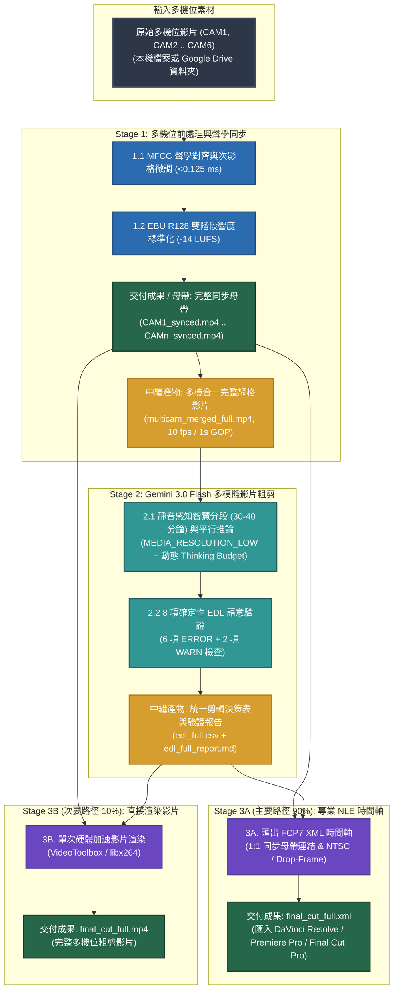

# Multi-Camera Video Pipeline & AI Editing Suite

[English (en)](README.md) | [繁體中文 (zh-TW)](README.zh-TW.md) | [简体中文 (zh-CN)](README.zh-CN.md) | [日本語 (ja)](README.ja.md) | [한국어 (ko)](README.ko.md)

---

> [!IMPORTANT]
> **Google Antigravity 原生技能與工作流套件**  
> 本工具組為 **Google Antigravity**（由 **Vertex AI Gemini 3.8 Flash** 驅動）與專業非線性剪輯軟體（**DaVinci Resolve**、**Adobe Premiere Pro**、**Final Cut Pro**）量身打造的三階段多機位前處理與 AI 粗剪套件。

---

**Multi-Camera Video Pipeline & AI Editing Suite** 支援 2 至 6 機位音訊同步、廣播級響度標準化、AI 智慧粗剪時間軸生成與多機位預覽影片渲染。直接於 Antigravity 對話視窗以自然語言下達指令，即可由 Agent 自動完成多機位同步與粗剪工作流。

---

## 安裝與 Google Cloud 環境設定 (`setup.sh`)

本專案符合 [Agent Plugins 1.0](https://agent-plugins.org/) 規範，全程基於 **Google Cloud Vertex AI (ADC)** 與 **Cloud Storage (GCS)** 運作，免除管理 API Key。

### 1. 安裝為 Antigravity Plugin 或 Skill

- **全域 Plugin（建議）**：
  ```bash
  git clone https://github.com/sylphlin/multicam-video-preprocessing.git ~/.gemini/config/plugins/multicam-video-preprocessing
  ```
- **舊式單一 Skill 安裝（`~/.gemini/config/skills/`）**：
  將儲存庫內的 `skills/multicam-video-preprocessing` 子目錄連結至舊版 Skills 目錄：
  ```bash
  git clone https://github.com/sylphlin/multicam-video-preprocessing.git ~/.gemini/config/plugins/multicam-video-preprocessing
  ln -s ~/.gemini/config/plugins/multicam-video-preprocessing/skills/multicam-video-preprocessing ~/.gemini/config/skills/multicam-video-preprocessing
  ```

### 2. 安裝相依套件與一鍵配置雲端環境 (`setup.sh`)

```bash
# 1. 安裝 FFmpeg 與 Python 套件
brew install ffmpeg
pip install numpy google-genai google-cloud-storage requests

# 2. 授權 Google Cloud ADC 憑證
gcloud auth application-default login

# 3. 執行 setup.sh 自動配置 GCS 儲存桶、雙層生命週期規則（raw: 2 天、產出物: 15 天）、IAM 與 .env
chmod +x setup.sh
./setup.sh --project YOUR_GCP_PROJECT_ID
```

### 專案目錄結構（Agent Plugins 1.0 標準規範）
```text
multicam-video-preprocessing/
├── plugin.json                                           # Agent Plugins 1.0 宣告清單
├── rules/
│   └── AGENTS.md                                         # 打包於 Plugin 內的客戶端執行期守則（唯讀、直接呼叫 CLI 與 Fail-Fast）
├── skills/
│   └── multicam-video-preprocessing/                     # 標準技能套件主幹（Single Source of Truth）
│       ├── SKILL.md                                      # 技能規範與三階段自動化執行手冊
│       ├── scripts/                                      # 核心執行腳本與模組實體目錄 (SSOT)
│       │   ├── multicam_pipeline.py                      # Stage 1: MFCC 同步、-14 LUFS 響度標準化、同步母帶、網格合成
│       │   ├── generate_edl.py                           # Stage 2: Vertex AI Gemini 3.8 Flash 多模態粗剪與智慧靜音分段
│       │   ├── export_fcp7_xml.py                        # Stage 3A: FCP7 XML 時間軸匯出（主要路徑）
│       │   ├── edl_to_video.py                           # Stage 3B: 單次硬體加速影片渲染（次要路徑）
│       │   └── modules/                                  # 聲學、視訊、靜音分段、驗證器與 GCP/Vertex AI 模組
│       └── assets/                                       # 提示詞規範實體目錄 (SSOT)
│           └── edl_interview_template.md                 # Gemini 多模態訪談粗剪規則
├── AGENTS.md                                             # 工作區與開發工程規範（Part I 執行守則 & Part II 開發規範）
├── setup.sh                                              # 原生 gcloud 雲端環境一鍵配置腳本
├── .env.example                                          # Vertex AI (ADC) 與 GCS 環境變數範本
└── tests/                                                # 離線單元測試套件 (46 項測試)
```

---

## 三階段端到端工作流架構


```mermaid
flowchart TD
    classDef inputStyle fill:#2D3748,stroke:#4A5568,stroke-width:2px,color:#fff;
    classDef stage1Style fill:#2B6CB0,stroke:#2C5282,stroke-width:2px,color:#fff;
    classDef stage2Style fill:#319795,stroke:#285E61,stroke-width:2px,color:#fff;
    classDef stage3Style fill:#6B46C1,stroke:#553C9A,stroke-width:2px,color:#fff;
    classDef artifactStyle fill:#D69E2E,stroke:#B7791F,stroke-width:2px,color:#fff;
    classDef outputStyle fill:#276749,stroke:#1C4532,stroke-width:2px,color:#fff;

    subgraph Inputs["輸入多機位素材"]
        A["原始多機位影片 (CAM1, CAM2 .. CAM6)<br/>(本機檔案或 Google Drive 資料夾)"]:::inputStyle
    end

    subgraph S1["Stage 1: 多機位前處理與聲學同步"]
        S1_1["1.1 MFCC 聲學對齊與次影格微調 (<0.125 ms)"]:::stage1Style
        S1_2["1.2 EBU R128 雙階段響度標準化 (-14 LUFS)"]:::stage1Style
        S1_3["交付成果 / 母帶: 完整同步母帶<br/>(CAM1_synced.mp4 .. CAMn_synced.mp4)"]:::outputStyle
        S1_4["中繼產物: 多機合一完整網格影片<br/>(multicam_merged_full.mp4, 10 fps / 1s GOP)"]:::artifactStyle
        S1_1 --> S1_2
        S1_2 --> S1_3
        S1_3 --> S1_4
    end

    subgraph S2["Stage 2: Gemini 3.8 Flash 多模態影片粗剪"]
        S2_1["2.1 靜音感知智慧分段 (30-40 分鐘) 與平行推論<br/>(MEDIA_RESOLUTION_LOW + 動態 Thinking Budget)"]:::stage2Style
        S2_2["2.2 8 項確定性 EDL 語意驗證<br/>(6 項 ERROR + 2 項 WARN 檢查)"]:::stage2Style
        EDL["中繼產物: 統一剪輯決策表與驗證報告<br/>(edl_full.csv + edl_full_report.md)"]:::artifactStyle
        S2_1 --> S2_2
        S2_2 --> EDL
    end

    subgraph S3A["Stage 3A (主要路徑 90%): 專業 NLE 時間軸"]
        S3A_ACT["3A. 匯出 FCP7 XML 時間軸<br/>(1:1 同步母帶連結 & NTSC / Drop-Frame)"]:::stage3Style
        XML["交付成果: final_cut_full.xml<br/>(匯入 DaVinci Resolve / Premiere Pro / Final Cut Pro)"]:::outputStyle
        S3A_ACT --> XML
    end

    subgraph S3B["Stage 3B (次要路徑 10%): 直接渲染影片"]
        S3B_ACT["3B. 單次硬體加速影片渲染<br/>(VideoToolbox / libx264)"]:::stage3Style
        MP4["交付成果: final_cut_full.mp4<br/>(完整多機位粗剪影片)"]:::outputStyle
        S3B_ACT --> MP4
    end

    A --> S1_1
    S1_4 --> S2_1
    S1_3 --> S3A_ACT
    EDL --> S3A_ACT
    S1_3 --> S3B_ACT
    EDL --> S3B_ACT
```

---

## Antigravity 操作方式與使用情境 (Usage & Scenarios)

在 Antigravity 中有兩種呼叫方式：
1. **極簡指令（`/skill` + `@檔案`）**：輸入 `/multicam-video-preprocessing` 綁定技能，並用 `@` 指定多機位影片檔案或雲端資料夾連結，無需額外贅述。
2. **自然語言口語描述**：直接用口語描述需求並附上 `@` 檔案或雲端連結，Agent 會自動載入對應插件。

### 情境 1：匯出專業 NLE XML 時間軸（建議主要工作流）
- **適用場景**：將 AI 多機位粗剪決策匯入 DaVinci Resolve、Adobe Premiere Pro 或 Final Cut Pro 進行精剪與調色。
- **方式 A（`/ + @` 極簡指令）**：
  ```text
  /multicam-video-preprocessing 機位1: @CAM1.mp4, 機位2: @CAM2.mp4
  ```
- **方式 B（口語描述）**：
  ```text
  幫我同步 @CAM1.mp4 與 @CAM2.mp4，將響度標準化至 -14 LUFS，並產生可匯入 DaVinci Resolve 的 FCP7 XML 粗剪時間軸。
  ```
- **交付成果**：
  1. `final_cut_full.xml`（包含機位切換切點與剪輯理由標記的時間軸）。
  2. `CAM1_synced.mp4`、`CAM2_synced.mp4`（已完成毫秒級對齊與 `-14 LUFS` 響度標準化之同步母帶）。
- **匯入 DaVinci Resolve 步驟**：
  1. 開啟 DaVinci Resolve 並建立新專案。
  2. 將 `output/CAM1_synced.mp4` 與 `output/CAM2_synced.mp4` 拖入 **Media Pool**。
  3. 點選 **File -> Import -> Timeline...**（`Cmd + Shift + I`）並選擇 `final_cut_full.xml`。

### 情境 2：直接渲染多機位粗剪成品影片
- **適用場景**：不進入剪輯軟體，直接輸出完成機位切換的 MP4 預覽或成品影片。
- **方式 A（`/ + @` 極簡指令）**：
  ```text
  /multicam-video-preprocessing 機位1: @CAM1.mp4, 機位2: @CAM2.mp4, 輸出: 直接渲染 MP4
  ```
- **方式 B（口語描述）**：
  ```text
  幫我把 @CAM1.mp4 和 @CAM2.mp4 做多機位 AI 粗剪，並直接渲染出 final_cut_full.mp4。
  ```
- **交付成果**：
  1. `final_cut_full.mp4`（單次硬體加速渲染之完整影片）。
  2. `edl_full.csv` 與 `edl_full_report.md`（機位切換決策表與 8 項語意驗證報告）。

### 情境 3：直接從 Google Drive 資料夾進行多機位同步與粗剪
- **適用場景**：直接提供存放多機位素材的 Google Drive 資料夾連結，由 Agent 自動下載（具備 `md5Checksum` 快取驗證）、同步並產生粗剪時間軸。
- **方式 A（`/ + @` 極簡指令）**：
  ```text
  /multicam-video-preprocessing 資料夾: https://drive.google.com/drive/folders/FOLDER_ID
  ```
- **方式 B（口語描述）**：
  ```text
  從這個 Google Drive 資料夾 https://drive.google.com/drive/folders/FOLDER_ID 下載多機位素材，完成音訊同步與 -14 LUFS 標準化，並匯出 FCP7 XML 時間軸。
  ```
- **交付成果**：
  1. `CAM1_synced.mp4` .. `CAMn_synced.mp4`（同步與響度標準化母帶）。
  2. `edl_full.csv`、`edl_full_report.md` 與 `final_cut_full.xml`。

---

## 三階段核心技術說明

### Stage 1：多機位同步與前處理
1. **MFCC 聲學時間對齊與次影格微調（`<0.125 ms`）**：採用三階掃描（120 秒快速掃描 $\rightarrow$ 全長 MFCC $\rightarrow$ 原始波形 1D FFT）並將精準度鎖定至單一音訊取樣點。
2. **EBU R128 (`-14 LUFS`) 雙階段線性響度標準化**：第一階段測量 `I`、`LRA` 與 `TP`，第二階段套用純線性增益（`linear=true`），消除動態壓縮呼吸感。
3. **逐幀精準同步母帶匯出 (`CAM*_synced.mp4`)**：預設採用硬體加速重編碼（`h264_videotoolbox` 或 `libx264`，`20 Mbps`），杜絕關鍵影格偏移。
4. **全長輕量網格合成 (`multicam_merged_full.mp4`)**：將 2 至 6 機位合成為單一多視角畫布（$\le 1920 \times 1080$，每機位 $\ge 640 \times 480$），採用 `10 fps`、`1.2 Mbps` 與 1 秒短 GOP 編碼，支援秒級無損切分與高速雲端讀取。

### Stage 2：Gemini 3.8 Flash 多模態粗剪決策與靜音感知智慧分段
1. **片頭倒數與場記板零容忍剔除**：自動切除開拍倒數並驗證 `[Global_Start_Time, Global_Start_Time + 2.0s]` 區間，同時於 `Global_End_Time` 切除收工閒聊。
2. **標準多模態推論與靜音感知智慧分段（30–40 分鐘視窗）**：
   - 預設採用 **Vertex AI Gemini 3.8 Flash** 標準多模態模式（`MEDIA_RESOLUTION_LOW` + 動態 `thinking_budget` `1024–4096`）。
   - 當影片長度超過 40 分鐘（`2400s`）時，系統內部自動透過 `ffmpeg silencedetect` 與 RMS 能量波谷偵測自然語音停頓點，無損切分至暫存目錄 `<output_dir>/_edl_chunks/` 並平行上傳至 `gs://<bucket>/raw/edl_chunks/` 推論，完成後自動平移時間碼並縫合為單一 `edl_full.csv`，最後於 `finally` 區塊自動清除本機與雲端暫存分段檔。
3. **8 項確定性 EDL 語意驗證**：檢查 `E_NO_ROWS`、`E_PARSE_TIME`、`E_NEGATIVE_DURATION`、`E_NON_MONOTONIC`、`E_OVERLAP`、`E_EMPTY_CAMERA`、`W_UNKNOWN_CAMERA` 與 `W_GAP`，並產出 `edl_full.csv` 與 `edl_full_report.md`。

### Stage 3A & 3B：匯出 FCP7 XML 時間軸與硬體加速渲染
- **Stage 3A（主要路徑）**：直接連結同步母帶、1:1 絕對時間碼對應，支援 NTSC 分數影格率（`23.976`, `29.97`, `59.94`）與掉格時間碼（Drop-Frame）。
- **Stage 3B（次要路徑）**：直接由同步母帶進行單次硬體加速渲染輸出 `final_cut_full.mp4`。

---

## GCS 雙層生命週期規則 (`gs://multicam-video-${PROJECT_ID}`)

| GCS 路徑前綴 (`matchesPrefix`) | 儲存內容 | 保留天數 (`age`) | 清理機制 |
| :--- | :--- | :--- | :--- |
| **`raw/`** | 暫存網格影片 (`multicam_merged_full.mp4`) 與分段檔 (`raw/edl_chunks/*`) | **2 天 (`age: 2`)** | `raw/edl_chunks/*` 於推論結束後立即由 `finally` 刪除；全長檔案保留 2 天供 SHA-256 快取重用，期滿自動刪除。 |
| **`output/`**、**`deliverables/`**、**`multicam_assets/`** | XML/CSV 時間軸、渲染成品與驗證報告 | **15 天 (`age: 15`)** | 保留 15 天供團隊下載與審閱，期滿自動清理。 |

---

## 授權條款 (License)

本專案採用 [MIT License](LICENSE) 授權。
