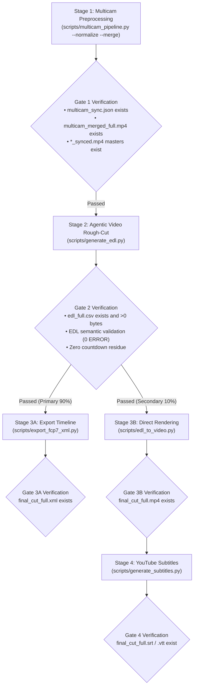

# Multi-Camera Video Pipeline & AI Editing Suite (Antigravity Native Skill)

Universal end-to-end toolkit for multi-camera video production (2 to 6 Cameras), AI-assisted long-form video editing (Gemini 3.8 Flash 1M Token Context via Vertex AI), and professional NLE timeline export (DaVinci Resolve / Adobe Premiere Pro / Final Cut Pro).

---

## 🛠️ Prerequisites & Environment

- **Google Antigravity IDE / Agent Framework**
- **FFmpeg** (with `h264_videotoolbox` hardware encoding and `loudnorm` filter support)
- **Python 3.8+** with `numpy`, `google-genai`, `google-cloud-storage`
- **Cloud Credentials (100% ADC + Vertex AI & GCS)**:
  - Authenticate via `gcloud auth application-default login`
  - Run `./setup.sh` once to automatically provision the GCS bucket (`gs://multicam-video-${GOOGLE_CLOUD_PROJECT}`), tiered Lifecycle auto-cleanup rules (`raw/` staging: 2 days; `output/`, `deliverables/`, `multicam_assets/` deliverables: 15 days), Vertex AI Service Agent IAM (`roles/storage.objectUser`), and `.env` configuration.

---

## 📁 Modular Toolset Architecture

| Step | Script | Core Module (`scripts/modules/`) | Function |
| :--- | :--- | :--- | :--- |
| **Step 1** | `scripts/multicam_pipeline.py` | `audio_sync.py`, `audio_normalizer.py`, `video_composer.py` | MFCC Acoustic Sync + Subframe Refinement (0.125ms), EBU R128 (-14 LUFS), Synced Masters, Multi-in-One Full Grid (`multicam_merged_full.mp4`) |
| **Step 2** | `scripts/generate_edl.py` | `llm_client.py`, `gcp_client.py`, `progress.py`, `edl_validator.py`, `assets/edl_interview_template.md` | Vertex AI Gemini 3.8 Flash Agentic Video Understanding (ADC + GCS `gs://` URI) + EDL Validation -> `edl_full.csv` + Report |
| **Step 3A** | `scripts/export_fcp7_xml.py` | `reporter.py`, `time_utils.py`, `edl_validator.py` | Full-length EDL CSV -> FCP7 XML (`final_cut_full.xml`) for DaVinci / Premiere (EDL validation, NTSC float fps & drop-frame support) |
| **Step 3B** | `scripts/edl_to_video.py` | `video_composer.py`, `edl_validator.py` | Hardware-accelerated clip cutting directly from synced masters -> `final_cut_full.mp4` (with EDL validation) |
| **Step 4** | `scripts/generate_subtitles.py` | `llm_client.py`, `gcp_client.py`, `progress.py`, `assets/subtitle_proofread_template.*.md` | Whisper Word Timestamps + Chunk-Scoped Acoustic Reprojection + Vertex AI Gemini 1M Proofreading (ADC + GCS) -> `.srt` / `.vtt` |

---

## 🔬 Core Technical Principles

1. **MFCC Acoustic Time Alignment & Subframe Refinement (<0.125ms Accuracy)**:
   - Multi-camera synchronization is computed via pure numpy MFCC cross-correlation with a 3-tier fallback ladder (Fast 120s scan -> Full-length MFCC -> Raw waveform fallback) and localized time-domain subframe acoustic refinement, achieving sub-millisecond physical accuracy (<0.125ms, single audio sample at 8kHz) with 97.7% lower memory consumption. Evaluated against BBC standard score thresholds ($Z \ge 12.0$ High `✓ Aligned`, $7.0 \le Z < 12.0$ Medium `ℹ Aligned (marginal)`, $Z < 7.0$ Low `⚠️ LOW CONFIDENCE` + stderr warnings & Summary Gate). Passing `--strict-sync` exits non-zero on low confidence. Synchronized camera masters (`CAM*_synced.mp4`) default to hardware-accelerated frame-accurate re-encoding (`h264_videotoolbox` / `libx264 -crf 18`), eliminating stream-copy keyframe snapping drift and black-frame stutter.
2. **EBU R128 Two-Pass Linear Loudness Normalization**:
   - Audio tracks are normalized to $-14.0\text{ LUFS}$ ($LRA=11.0\text{ LU}$, $TP=-1.5\text{ dBTP}$) compliant with YouTube broadcast standards. Uses two-pass analysis: Pass 1 null-sink acoustic measurement, Pass 2 linear gain offset (`linear=true`) to eliminate dynamic pumping artifacts.
3. **Zero-Split Agentic Video Architecture (No Chapter Slicing Required)**:
   - Evaluates full-length multicam footage (>1 hour) end-to-end via Vertex AI Gemini 3.8 Flash Agentic Video Understanding (`processing="agentic"`). Goal-directed sparse sampling reduces token usage by **99.7%** (from ~1,000,000 to ~3,000 tokens), completely eliminating sentence bisection and multi-part complexity.
4. **Token-Optimized Compact Grid Composition**:
   - Merges 2 to 6 camera angles into a single multi-view canvas ($\le 1920 \times 1080$, each CAM $\ge 640 \times 480$), reducing AI multimodal token consumption by **50% to 83%**.
5. **Universal Pre-roll & Countdown Elimination (Zero-Tolerance & Asymmetric Safety Margin)**:
   - Systematically purges all on-set countdown noises ("5, 4, 3, 2, 1", "五四三二", "Ready Action") and pre-roll clutter. Enforces asymmetric safety margins where the start point is self-verified on the `[Start, Start+2s]` window to guarantee the opening frame aligns cleanly with the speaker's true opening word.
6. **Three-Stage Golden Standard Subtitles (Whisper Word Timestamps + Vertex AI Gemini Multimodal + 429 Retry)**:
   - Stage 1 extracts 1M context global domain glossary from GCS-staged audio. Stage 2 extracts Whisper physical word timestamps cached to `_words.json` for instant re-runs. Stage 3 performs chunk-scoped acoustic reprojection via Vertex AI + GCS with automatic exponential backoff & jitter retry handling HTTP 429 and transient rate limits, followed by rhythm sanitization (anti-flicker gap bridging $< 0.6\text{s}$, breathing buffer $+0.4\text{s}$, monotonic forward continuity, 0 micro-flickers/overlaps).
7. **100% Pure Vertex AI (ADC) & GCS Cloud Architecture (Zero AI Studio Keys)**:
   - All model calls and multimodal media ingestion run exclusively on **Google Cloud Vertex AI** (`GOOGLE_CLOUD_LOCATION=global`) authenticated via Application Default Credentials (`gcloud auth application-default login`). Media assets are staged to **Google Cloud Storage** (`gs://multicam-video-${PROJECT_ID}/raw/`) with SHA-256 hash caching (avoiding redundant large video uploads on same-day re-runs), a 2-day GCS Bucket Lifecycle auto-deletion policy, and optional `--cleanup-gcs` immediate cleanup.
8. **Deterministic EDL Semantic Validation & `--strict-edl` Safeguard**:
   - Pre-flight semantic validation covering 8 structural dimensions across 3 execution points (before disk write in `generate_edl.py`, and on EDL loading in `export_fcp7_xml.py` and `edl_to_video.py`). Evaluates 6 critical ERRORs (`E_NO_ROWS`, `E_PARSE_TIME`, `E_NEGATIVE_DURATION`, `E_NON_MONOTONIC`, `E_OVERLAP`, `E_EMPTY_CAMERA`) and 2 WARNs (`W_UNKNOWN_CAMERA`, `W_GAP`). Passing `--strict-edl` halts execution with exit code 1 on ERROR (default warns and continues; `generate_edl.py` always writes bad data to disk before exit for post-mortem inspection). Supports report localization via `--lang` (built-in `en` and `zh-TW`, with silent fallback to `en`), customizable gap threshold via `--edl-max-gap-sec` (default: `0.05`), and camera whitelist via `--edl-known-cameras` (defaults to `^CAM\d+$` regex in generator, auto-inferred from media directory in exporter/renderer).

---

## 🚦 4-Stage Gated Execution Runbook

When executing a multi-camera task, follow this sequential 4-stage gated workflow. Resolve `${SKILL_DIR}` to the directory containing this `SKILL.md` (or the repository root).



### Stage 1: Physical Preprocessing (Sync, Normalization, Master Export, Grid Merge)
- **User Status Update**: `"🎬 正在進行多機位時間對齊與音量標準化..."` (localized to user's language)
- **Execution Command**:
  ```bash
  python3 "${SKILL_DIR}/scripts/multicam_pipeline.py" \
    --ref <CAM1.mp4> --targets <CAM2.mp4...> \
    --normalize --merge -o <OUTPUT_DIR>
  ```
- **Exit Gate 1 Verification (Mandatory before Stage 2)**:
  - `<OUTPUT_DIR>/multicam_sync.json` exists with valid offset data.
  - `<OUTPUT_DIR>/<CAM>_synced.mp4` full-length synchronized masters exist for all cameras.
  - `<OUTPUT_DIR>/multicam_merged_full.mp4` grid video exists and is non-empty.

### Stage 2: Gemini AI Multimodal Rough-Cut (Agentic Video EDL Generation)
- **User Status Update**: `"🤖 正在進行 Agentic Video AI 鏡頭剪輯分析..."` (localized to user's language)
- **Execution Command**:
  ```bash
  python3 "${SKILL_DIR}/scripts/generate_edl.py" \
    -v <OUTPUT_DIR>/multicam_merged_full.mp4 \
    --strict-edl --lang <zh-TW|en>
  ```
- **Exit Gate 2 Verification (Mandatory before Stage 3)**:
  - `<OUTPUT_DIR>/edl_full.csv` exists and size $> 0\text{ bytes}$.
  - Deterministic EDL semantic validation passed with zero `ERROR` issues (`E_NO_ROWS`, `E_PARSE_TIME`, `E_NEGATIVE_DURATION`, `E_NON_MONOTONIC`, `E_OVERLAP`, `E_EMPTY_CAMERA`).
  - `<OUTPUT_DIR>/edl_full_report.md` exists with cutting rationale and validation report table.

### Stage 3A: Export NLE Timeline (⭐ Primary Path / 90% Use Case)
- **User Status Update**: `"📁 正在匯出剪輯時間線 (XML)..."` (localized to user's language)
- **Execution Command**:
  ```bash
  python3 "${SKILL_DIR}/scripts/export_fcp7_xml.py" \
    -d <OUTPUT_DIR> -o <OUTPUT_DIR>/final_cut_full.xml \
    --strict-edl --lang <zh-TW|en>
  ```
- **Exit Gate 3A Verification**:
  - `<OUTPUT_DIR>/final_cut_full.xml` exists and size $> 0\text{ bytes}$.

### Stage 3B: Direct Video Rendering (🎬 Secondary Fast Preview Path / 10% Use Case)
- **User Status Update**: `"🎬 正在渲染影片成片..."` (localized to user's language)
- **Execution Command**:
  ```bash
  python3 "${SKILL_DIR}/scripts/edl_to_video.py" \
    --edl <OUTPUT_DIR>/edl_full.csv --media-dir <OUTPUT_DIR> \
    -o <OUTPUT_DIR>/final_cut_full.mp4 --strict-edl --lang <zh-TW|en>
  ```
- **Exit Gate 3B Verification**:
  - `<OUTPUT_DIR>/final_cut_full.mp4` exists with duration $> 0$.

### Stage 4: YouTube Subtitles Generation (📝 On-Demand / Subtitle Requests)
- **User Status Update**: `"📝 正在製作字幕..."` (localized to user's language)
- **Execution Command**:
  ```bash
  # Standard Execution (Vertex AI 1M Glossary + Local Whisper + Vertex AI Multimodal Proofreading):
  python3 "${SKILL_DIR}/scripts/generate_subtitles.py" -i <OUTPUT_DIR>/final_cut_full.mp4

  # Optional outline or recording script injection:
  python3 "${SKILL_DIR}/scripts/generate_subtitles.py" -i <OUTPUT_DIR>/final_cut_full.mp4 \
    --outline "<OUTLINE_TEXT_OR_FILE>" --script "<SCRIPT_TEXT_OR_FILE>"
  ```
- **Exit Gate 4 Verification**:
  - `<OUTPUT_DIR>/final_cut_full.srt` and `<OUTPUT_DIR>/final_cut_full.vtt` exist and are non-empty.
  - `<OUTPUT_DIR>/final_cut_full_glossary.md` and `<OUTPUT_DIR>/final_cut_full_subtitle_report.md` exist.
