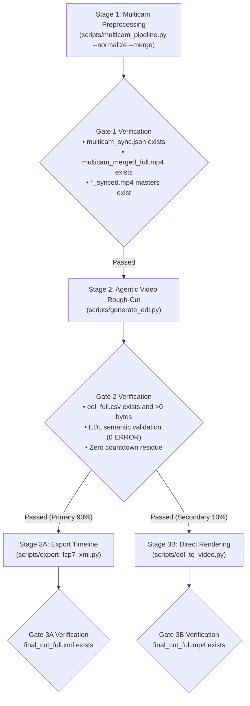

# Multi-Camera Video Pipeline & AI Editing Suite (Antigravity Native Skill)

Universal end-to-end toolkit for multi-camera video production (2 to 6 Cameras), AI-assisted long-form video editing (Gemini 3.8 Flash 1M Token Context via Vertex AI), and professional NLE timeline export (DaVinci Resolve / Adobe Premiere Pro / Final Cut Pro).

---

## Prerequisites & Environment

- **Google Antigravity IDE / Agent Framework**
- **FFmpeg** (with `h264_videotoolbox` hardware encoding and `loudnorm` filter support)
- **Python 3.8+** with `numpy`, `google-genai`, `google-cloud-storage`, `requests`
- **Cloud Credentials (100% ADC + Vertex AI & GCS)**:
  - Authenticate via `gcloud auth application-default login`
  - Run `./setup.sh` once to automatically provision the GCS bucket (`gs://multicam-video-${GOOGLE_CLOUD_PROJECT}`), two-tier Lifecycle auto-cleanup rules (`raw/` staging: 2 days; `output/`, `deliverables/`, `multicam_assets/` deliverables: 15 days), Vertex AI Service Agent IAM (`roles/storage.objectUser`), and `.env` configuration.

---

## Modular Toolset Architecture

| Step | Script | Core Module (`scripts/modules/`) | Function |
| :--- | :--- | :--- | :--- |
| **Step 1** | `scripts/multicam_pipeline.py` | `audio_sync.py`, `audio_normalizer.py`, `video_composer.py` | MFCC Acoustic Sync + Subframe Refinement (0.125ms), EBU R128 (-14 LUFS), Synced Masters, Multi-in-One Full Grid (`multicam_merged_full.mp4`) |
| **Step 2** | `scripts/generate_edl.py` | `llm_client.py`, `gcp_client.py`, `video_segmenter.py`, `progress.py`, `edl_validator.py`, `assets/edl_interview_template.md` | Vertex AI Gemini 3.8 Flash Multimodal (Silence-Aware 30-40m Segmentation + Parallel Low-Res Inference) + EDL Validation -> `edl_full.csv` + Report |
| **Step 3A** | `scripts/export_fcp7_xml.py` | `reporter.py`, `time_utils.py`, `edl_validator.py` | Full-length EDL CSV -> FCP7 XML (`final_cut_full.xml`) for DaVinci / Premiere (EDL validation, NTSC float fps & drop-frame support) |
| **Step 3B** | `scripts/edl_to_video.py` | `video_composer.py`, `edl_validator.py` | Hardware-accelerated clip cutting directly from synced masters -> `final_cut_full.mp4` (with EDL validation) |

---

## Core Technical Principles

1. **MFCC Acoustic Time Alignment & Subframe Refinement (<0.125ms Accuracy)**:
   - Multi-camera synchronization is computed via pure numpy MFCC cross-correlation with a 3-tier fallback ladder (Fast 120s scan -> Full-length MFCC -> Raw waveform fallback) and localized time-domain subframe acoustic refinement, achieving sub-millisecond physical accuracy (<0.125ms, single audio sample at 8kHz) with 97.7% lower memory consumption. Evaluated against BBC standard score thresholds ($Z \ge 12.0$ High `✓ Aligned`, $7.0 \le Z < 12.0$ Medium `ℹ Aligned (marginal)`, $Z < 7.0$ Low `⚠️ LOW CONFIDENCE` + stderr warnings & Summary Gate). Passing `--strict-sync` exits non-zero on low confidence. Synchronized camera masters (`CAM*_synced.mp4`) default to hardware-accelerated frame-accurate re-encoding (`h264_videotoolbox` / `libx264 -crf 18`), eliminating stream-copy keyframe snapping drift and black-frame stutter.
2. **EBU R128 Two-Pass Linear Loudness Normalization**:
   - Audio tracks are normalized to $-14.0\text{ LUFS}$ ($LRA=11.0\text{ LU}$, $TP=-1.5\text{ dBTP}$) compliant with YouTube broadcast standards. Uses two-pass analysis: Pass 1 null-sink acoustic measurement, Pass 2 linear gain offset (`linear=true`) to eliminate dynamic pumping artifacts.
3. **Silence-Aware Smart Segmentation & Parallel Non-Agentic Inference**:
   - Evaluates videos up to 40 minutes in a single pass via Vertex AI Gemini 3.8 Flash (`MEDIA_RESOLUTION_LOW` + dynamic `thinking_budget`). For long recordings (>40 minutes), `generate_edl.py` automatically detects natural speech pauses in 30-to-40-minute windows (`silencedetect` + RMS energy minimum), slices temporary chunks into `<output_dir>/_edl_chunks/`, runs parallel Vertex AI inference, shifts and stitches timestamps into a single `edl_full.csv`, and deletes all temporary local and GCS chunks in `finally`.
4. **Token- & Seek-Optimized Compact Grid Composition**:
   - Merges 2 to 6 camera angles into a single multi-view canvas ($\le 1920 \times 1080$, each CAM $\ge 640 \times 480$) encoded at `1200k` video bitrate, `10 fps`, short GOP (`-g 10`, one keyframe per second), `16 kHz` mono audio (`64k`), and `-movflags +faststart` for fast stream-copy slicing and cloud ingestion.
5. **Universal Pre-roll & Countdown Elimination (Zero-Tolerance & Asymmetric Safety Margin)**:
   - Systematically purges all on-set countdown noises ("5, 4, 3, 2, 1", "五四三二", "Ready Action") and pre-roll clutter. Enforces asymmetric safety margins where the start point is self-verified on the `[Start, Start+2s]` window to guarantee the opening frame aligns cleanly with the speaker's true opening word.
6. **100% Pure Vertex AI (ADC) & GCS Cloud Architecture (Zero AI Studio Keys)**:
   - All model calls and multimodal media ingestion run exclusively on **Google Cloud Vertex AI** (`GOOGLE_CLOUD_LOCATION=global`) authenticated via Application Default Credentials (`gcloud auth application-default login`). Media assets are staged to **Google Cloud Storage** (`gs://multicam-video-${PROJECT_ID}/raw/`) with SHA-256 hash caching (avoiding redundant large video uploads on same-day re-runs), a 2-day GCS Bucket Lifecycle auto-deletion policy, and optional `--cleanup-gcs` immediate cleanup.
7. **Deterministic EDL Semantic Validation & `--strict-edl` Safeguard**:
   - Pre-flight semantic validation covering 8 structural dimensions across 3 execution points (before disk write in `generate_edl.py`, and on EDL loading in `export_fcp7_xml.py` and `edl_to_video.py`). Evaluates 6 critical ERRORs (`E_NO_ROWS`, `E_PARSE_TIME`, `E_NEGATIVE_DURATION`, `E_NON_MONOTONIC`, `E_OVERLAP`, `E_EMPTY_CAMERA`) and 2 WARNs (`W_UNKNOWN_CAMERA`, `W_GAP`). Passing `--strict-edl` halts execution with exit code 1 on ERROR (default warns and continues; `generate_edl.py` always writes bad data to disk before exit for post-mortem inspection). Supports report localization via `--lang` (built-in `en` and `zh-TW`, with silent fallback to `en`), customizable gap threshold via `--edl-max-gap-sec` (default: `0.05`), and camera whitelist via `--edl-known-cameras` (defaults to `^CAM\d+$` regex in generator, auto-inferred from media directory in exporter/renderer).

---

## 3-Stage Gated Execution Runbook

When executing a multi-camera task, follow this sequential 3-stage gated workflow. Resolve `${SKILL_DIR}` to the directory containing this `SKILL.md` (`skills/multicam-video-preprocessing`).


```mermaid
flowchart TD
    S1["Stage 1: Multicam Preprocessing<br/>(scripts/multicam_pipeline.py --normalize --merge)"] --> G1{"Gate 1 Verification<br/>• multicam_sync.json exists<br/>• multicam_merged_full.mp4 exists<br/>• *_synced.mp4 masters exist"}
    G1 -->|"Passed"| S2["Stage 2: Agentic Video Rough-Cut<br/>(scripts/generate_edl.py)"]
    S2 --> G2{"Gate 2 Verification<br/>• edl_full.csv exists and >0 bytes<br/>• EDL semantic validation (0 ERROR)<br/>• Zero countdown residue"}
    G2 -->|"Passed (Primary 90%)"| S3A["Stage 3A: Export Timeline<br/>(scripts/export_fcp7_xml.py)"]
    G2 -->|"Passed (Secondary 10%)"| S3B["Stage 3B: Direct Rendering<br/>(scripts/edl_to_video.py)"]
    S3A --> G3A{"Gate 3A Verification<br/>final_cut_full.xml exists"}
    S3B --> G3B{"Gate 3B Verification<br/>final_cut_full.mp4 exists"}
```

### Live Progress Reporting & User Feedback Protocol
- **Before Each Stage**: Output a concise status update to the user announcing the active stage and its sub-steps (`Stage 1: Step 1/4 Audio Sync -> Step 2/4 -14 LUFS Norm -> Step 3/4 Synced Masters -> Step 4/4 Grid Merge`, `Stage 2: Step 1/3 Silence Segmentation -> Step 2/3 Gemini 3.8 Flash Inference -> Step 3/3 8-Check EDL Validation`, `Stage 3A: FCP7 XML Export`, `Stage 3B: Direct Video Render`).
- **During Long-Running Commands (`NotificationTimeoutSeconds=60`)**:
  - Always set `NotificationTimeoutSeconds=60` when running `multicam_pipeline.py`, `generate_edl.py`, or `edl_to_video.py` via `run_command`.
  - Whenever a command is still running after 60 seconds, inspect the latest `[Stage N - Step X/Y]` and `⏳ [In Progress]` lines in the task output, send a 1-line progress update to the user in the chat window (e.g., which step/part is currently running and elapsed time), and schedule a 60-second follow-up check (`schedule` with `DurationSeconds="60"` and `TimerCondition="<task-id>"`) until the command completes.

### Stage 1: Physical Preprocessing (Sync, Normalization, Master Export, Grid Merge)
- **User Status Update**: `"正在執行 Stage 1：多機位聲學對齊、-14 LUFS 響度標準化、同步母帶匯出與多分割網格合成..."` (localized to user's language)
- **Execution Command** (run with `NotificationTimeoutSeconds=60`):
  ```bash
  # Local Camera Files or Google Drive File Links:
  python3 "${SKILL_DIR}/scripts/multicam_pipeline.py" \
    --ref <CAM1.mp4_OR_GDRIVE_LINK> --targets <CAM2.mp4_OR_GDRIVE_LINK...> \
    --normalize --merge -o <OUTPUT_DIR>

  # Or Direct Google Drive Folder URL / Folder ID (Auto-discovers & sorts CAM1..CAMn via ADC):
  python3 "${SKILL_DIR}/scripts/multicam_pipeline.py" \
    --gdrive-folder "<GDRIVE_FOLDER_URL_OR_ID>" \
    --normalize --merge -o <OUTPUT_DIR>
  ```
- **Exit Gate 1 Verification (Mandatory before Stage 2)**:
  - `<OUTPUT_DIR>/multicam_sync.json` exists with valid offset data.
  - `<OUTPUT_DIR>/<CAM>_synced.mp4` full-length synchronized masters exist for all cameras.
  - `<OUTPUT_DIR>/multicam_merged_full.mp4` grid video exists and is non-empty.

### Stage 2: Gemini AI Multimodal Rough-Cut (Silence-Aware Smart Segmentation + Parallel Low-Res Inference)
- **User Status Update**: `"正在執行 Stage 2：靜音感知智慧分段與 Gemini 3.8 Flash 多模態鏡頭粗剪分析..."` (localized to user's language)
- **Execution Command** (run with `NotificationTimeoutSeconds=60`):
  ```bash
  python3 "${SKILL_DIR}/scripts/generate_edl.py" \
    -v <OUTPUT_DIR>/multicam_merged_full.mp4 \
    --strict-edl --lang <zh-TW|en>
  ```
- **Exit Gate 2 Verification (Mandatory before Stage 3)**:
  - `<OUTPUT_DIR>/edl_full.csv` exists and size $> 0\text{ bytes}$.
  - Deterministic EDL semantic validation passed with zero `ERROR` issues (`E_NO_ROWS`, `E_PARSE_TIME`, `E_NEGATIVE_DURATION`, `E_NON_MONOTONIC`, `E_OVERLAP`, `E_EMPTY_CAMERA`).
  - `<OUTPUT_DIR>/edl_full_report.md` exists with cutting rationale and validation report table.

### Stage 3A: Export NLE Timeline (Primary Path / 90% Use Case)
- **User Status Update**: `"正在執行 Stage 3A：匯出剪輯時間線 (FCP7 XML)..."` (localized to user's language)
- **Execution Command**:
  ```bash
  python3 "${SKILL_DIR}/scripts/export_fcp7_xml.py" \
    -d <OUTPUT_DIR> -o <OUTPUT_DIR>/final_cut_full.xml \
    --strict-edl --lang <zh-TW|en>
  ```
- **Exit Gate 3A Verification & Proactive Stage 3B Offer**:
  - Verify `<OUTPUT_DIR>/final_cut_full.xml` exists and size $> 0\text{ bytes}$.
  - **Mandatory User Prompt**: When finishing at Stage 3A (without running Stage 3B), ALWAYS inform the user in your final summary that if they also want a directly playable multi-camera rough-cut MP4 video (`<OUTPUT_DIR>/final_cut_full.mp4`) assembled according to `edl_full.csv`, you can immediately run **Stage 3B (`edl_to_video.py`)** to render it for them.

### Stage 3B: Direct Video Rendering (Secondary Fast Preview Path / 10% Use Case)
- **User Status Update**: `"正在執行 Stage 3B：依照 EDL 切換機位渲染成品影片 (final_cut_full.mp4)..."` (localized to user's language)
- **Execution Command** (run with `NotificationTimeoutSeconds=60`):
  ```bash
  python3 "${SKILL_DIR}/scripts/edl_to_video.py" \
    --edl <OUTPUT_DIR>/edl_full.csv --media-dir <OUTPUT_DIR> \
    -o <OUTPUT_DIR>/final_cut_full.mp4 --strict-edl --lang <zh-TW|en>
  ```
- **Exit Gate 3B Verification**:
  - `<OUTPUT_DIR>/final_cut_full.mp4` exists with duration $> 0$.

---

## CLI Options Reference

### 1. Stage 1 — `multicam_pipeline.py`
| Option | Default | Description |
| :--- | :--- | :--- |
| `--ref` | `None` | Reference anchor camera video path or Google Drive link (`CAM1`) |
| `--targets`, `--target` | `None` | Target camera video paths or Google Drive links (`CAM2..CAM6`) |
| `--gdrive-folder` | `None` | Google Drive Folder URL or ID containing 2–6 camera videos |
| `-o`, `--output-dir` | `output` | Output directory for synced camera masters, grid video, and reports |
| `--normalize` | `False` | Enable EBU R128 (`-14.0 LUFS`) two-pass linear audio normalization |
| `--merge`, `--multi-in-one` | `False` | Render merged multi-in-one grid video (`multicam_merged_full.mp4`) |
| `--lufs` / `--lra` / `--tp` | `-14.0` / `11.0` / `-1.5` | EBU R128 integrated loudness, loudness range, and true peak targets |
| `--encoder` | `h264_videotoolbox` | Hardware video encoder (fallback: `libx264`) |
| `--stream-copy` | `False` | Export synced masters using `-c copy` instead of frame-accurate re-encoding |
| `--strict-sync` | `False` | Exit non-zero if any camera alignment confidence score is low (`Z < 7.0`) |

### 2. Stage 2 — `generate_edl.py`
| Option | Default | Description |
| :--- | :--- | :--- |
| `-v`, `--video`, `-i`, `--input` | *(Required)* | Path to composite grid video (`multicam_merged_full.mp4`) |
| `-o`, `--output-dir` | `<video_dir>` | Output directory for `edl_full.csv` and `edl_full_report.md` |
| `-t`, `--template` | `assets/edl_interview_template.md` | Custom prompt template file path |
| `--model` | `gemini-3.8-flash` | Vertex AI Gemini model name |
| `--processing` | `standard` | Video processing mode: `standard` (Low-Res + silence segmentation) or `agentic` |
| `--chunk-min-dur` / `--chunk-max-dur` | `1800.0` / `2400.0` | Min/Max chapter duration in seconds (`30–40 min`) for silence splitting |
| `--strict-edl` | `False` | Exit with code `1` when EDL validation finds `ERROR` issues |
| `--lang` | `en` | Language for the EDL validation report (`en`, `zh-TW`) |
| `--edl-max-gap-sec` | `0.05` | Maximum allowed gap in seconds between consecutive EDL cuts |
| `--edl-known-cameras` | `^CAM\d+$` | Comma-separated expected camera names (`CAM1,CAM2,...`) |
| `--cleanup-gcs` | `False` | Immediately delete staged grid video from GCS after completion |

### 3. Stage 3A — `export_fcp7_xml.py`
| Option | Default | Description |
| :--- | :--- | :--- |
| `-d`, `--dir` | `None` | Directory containing `edl_full.csv` and synced camera masters |
| `-e`, `--edl` | `None` | Explicit path(s) to EDL CSV file(s) |
| `-o`, `--output` | `final_cut_full.xml` | Output FCP7 XML timeline path |
| `-m`, `--media-dir` | `<edl_dir>` | Directory containing camera media files |
| `--fps` | `30.0` | Sequence frame rate (`23.976`, `24`, `25`, `29.97`, `30`, `50`, `59.94`, `60`) |
| `--drop-frame` | `False` | Enable drop-frame timecode (`DF`) for NTSC sequences |
| `--use-raw-media` | `False` | Link to original raw camera files using `multicam_sync.json` offsets |
| `--strict-edl` / `--lang` | `False` / `en` | Enforce strict EDL validation and set report language |

### 4. Stage 3B — `edl_to_video.py`
| Option | Default | Description |
| :--- | :--- | :--- |
| `--edl` | *(Required)* | Path to input EDL CSV file (`edl_full.csv`) |
| `--media-dir` | `<edl_dir>` | Directory containing synchronized camera masters (`CAM*_synced.mp4`) |
| `-o`, `--output` | `final_cut_full.mp4` | Output rendered MP4 path |
| `--encoder` | `h264_videotoolbox` | Hardware video encoder for single-pass rendering |
| `--strict-edl` / `--lang` | `False` / `en` | Enforce strict EDL validation and set report language |

